# Custom Islands: the guide

A picture-by-picture guide to **Custom Islands** (DynamicIslands), a [Raft](https://raft-game.com/) mod for the
[Raft Mod Loader](https://www.raftmodding.com/). It is for players who want new islands in their worlds, and for
builders who want to make islands and whole adventures of their own. You don't need to know anything about modding:
everything is done with buttons in the game. The [README](../README.md) has the full reference (every setting, file
and command); this guide shows you around.

The guide follows the heart of the mod first: **meeting custom islands** while you sail (sections 2-3), **building your
own** in the editor (4-5), giving them **stories** - quests, doors and keys, story items, islands in Raft's story (6) -
and **world plans** that decide which islands a world gets, when and where (7). Section 8 is about playing together. The
**optional systems** that change a whole world - world rules, the world randomizer, the extra options, the island list
and the level up system - are gathered in section 9, followed by the files, the console commands, help, and how to
report a problem (section 15). **Before playing a shared world over several days, or building an adventure, read chapter 12**: the known issues of this alpha and how to avoid them (chapter 13 lists what can't be changed).


*A custom island met while sailing: made by the mod's island generator, with Raft's own palms, rocks and reef.*

## Quick start

Pick what you want to do; each line leads to the part of the guide you need.

| I want to... | Do this | Read |
|---|---|---|
| **Just play with new islands** | Install the mod, click **NEW WORLD**, leave everything as it is, **Create**, and sail | [1](#1-installing), [2](#2-starting-a-new-world), [3](#3-sailing-custom-islands-in-your-world) |
| **Play an adventure someone made** | **ISLAND LIBRARY** in the main menu → **World plans** → **Download**; then **NEW WORLD** → choose it as the Custom Islands plan | [4.7](#47-saving-and-sharing), [7.6](#76-playing-changing-and-sharing-a-plan) |
| **Build my own island** | **EDITOR** → **Generate** an island → shape it, add objects → **Save** | [4.8](#48-your-first-island-step-by-step) |
| **Give my island a quest or a secret** | Island tab → **Edit quest...**; an object → **Behaviour & events...** | [5](#5-making-islands-come-alive), [6](#6-stories-quests-behaviours-story-items) |
| **Make my own adventure across several islands** | **EDITOR** → **World plans** → **New...** → one rule per island → **Save**; choose it in NEW WORLD | [7.2](#72-your-first-world-plan-step-by-step) |
| **Play with friends** | Everyone installs the mod; the host creates the world; friends join through Steam | [8](#8-playing-together), [12.1](#121-playing-together-over-several-days) |
| **Change how a world plays** (tougher monsters, levels, a randomized world) | **NEW WORLD** → **WORLD SETTINGS...** | [9](#9-world-settings-rules-and-extra-systems) |
| **Report a bug or ask a question** | Main menu alpha box → **Report a problem** (or **Discord**) | [15](#15-reporting-a-problem) |

### Words used in this guide

| Word | Meaning |
|---|---|
| **Custom island** | An island of this mod, as opposed to Raft's own islands. You meet them while sailing, like Raft's |
| **Island file** | A saved island, `<name>.island` in `Mods\DynamicIslands\`. Made in the editor, downloaded, or sent by a host |
| **Map type** | A kind of island the mod makes new for each world: a camp, a volcano, a wreck, a sky island... ([4.6](#46-ready-made-islands-map-types)). No file needed |
| **Generated island** | An island made by the island generator from a style and a size ([4.5](#45-the-island-generator)) |
| **Spawn pool** | The islands that may turn up by chance while you sail (`spawnpool.txt`, [10](#10-settings-files)) |
| **Quest** | An island's list of steps (go there, read that, open this...) with a reward at the end ([6.1](#61-quests)) |
| **Story item** | A key, a map, a log... that the crew carries and the journal (J) shows ([6.3](#63-story-items-and-story-sets)) |
| **Journal** | The crew's book of the custom islands (J): their story items and every note read, shared by everyone in the world. Not Raft's notebook (T) ([3](#the-journal-j)) |
| **World plan** | A list of rules for a world: which islands it gets, when and where ([7](#7-world-plans-which-islands-a-world-gets)) |
| **Rule** | One line of a plan: *when* something happens, bring *this island*, *there*, and tell the players *this* |
| **Raft's story / the Receiver chain** | Raft's own story islands (Radio Tower ... Utopia), found by tuning the Receiver. A plan can change it ([6.5](#65-your-islands-in-rafts-story-the-receiver)) |
| **World settings** | Optional switches for one world: monster difficulty, build cost, randomizer, extra options, levels ([9](#9-world-settings-rules-and-extra-systems)) |
| **Pack** | A `.zip` made with **Export...**: a plan or island with every island it needs, to share ([4.7](#47-saving-and-sharing)) |
| **Island library** | The public collection of plans and islands others made, downloaded in the game ([4.7](#47-saving-and-sharing)) |
| **Host** | The player whose PC runs the world in multiplayer. The host's islands, plan and settings count ([8](#8-playing-together)) |

## Contents

1. [Installing](#1-installing)
2. [Starting a new world](#2-starting-a-new-world)
3. [Sailing: custom islands in your world](#3-sailing-custom-islands-in-your-world)
4. [Building your own island: the editor](#4-building-your-own-island-the-editor)
   - [4.1 The screen](#41-the-screen) · [4.2 Shaping the land](#42-shaping-the-land-terrain-tab) ·
     [4.3 Placing objects](#43-placing-objects-objects-tab) · [4.4 The Island tab](#44-the-island-tab)
   - [4.5 The island generator](#45-the-island-generator) · [4.6 Ready-made islands (map types)](#46-ready-made-islands-map-types)
   - [4.7 Saving and sharing: autosave, export, import, the island library](#47-saving-and-sharing)
   - [4.8 Your first island, step by step](#48-your-first-island-step-by-step) · [4.9 Trying the island in a world (Test)](#49-trying-the-island-in-a-world-test)
5. [Making islands come alive](#5-making-islands-come-alive): [creatures](#51-creatures), [notes](#52-notes-and-signs),
   [chests](#53-chests-and-loot), [zones and ambushes](#54-trigger-zones-and-ambushes), [atmosphere and sound](#55-atmosphere-and-sound)
6. [Stories: quests, behaviours, story items](#6-stories-quests-behaviours-story-items)
   - [6.1 Quests](#61-quests) · [6.2 Behaviour and events](#62-behaviour-and-events) · [6.3 Story items](#63-story-items-and-story-sets)
   - [6.4 Islands that bring islands](#64-islands-that-bring-islands) · [6.5 Your islands in Raft's story (the Receiver)](#65-your-islands-in-rafts-story-the-receiver) ·
     [The main story in Raft's notebook](#the-main-story-in-rafts-notebook-side-quests-in-the-journal) · [Making a main story](#making-a-main-story-the-helper-and-preview-notebook)
7. [World plans: which islands a world gets](#7-world-plans-which-islands-a-world-gets)
   - [7.1 The plans that come with the mod](#71-the-plans-that-come-with-the-mod)
   - [7.2 Your first world plan, step by step](#72-your-first-world-plan-step-by-step)
   - [7.3 A rule card, part by part](#73-a-rule-card-part-by-part) · [7.4 Everything a rule can do](#74-everything-a-rule-can-do)
   - [7.5 Check: finding and fixing problems](#75-check-finding-and-fixing-problems)
   - [7.6 Playing, changing and sharing a plan](#76-playing-changing-and-sharing-a-plan) · [7.7 The plan file](#77-the-plan-file)
8. [Playing together](#8-playing-together)
   - [Who needs what: every case](#who-needs-what-every-case)
9. [World settings: rules and extra systems](#9-world-settings-rules-and-extra-systems)
   - [9.1 The World settings window](#91-the-world-settings-window)
   - [9.2 World rules: monster difficulty and build cost](#92-world-rules-monster-difficulty-and-build-cost)
   - [9.3 The world randomizer](#93-the-world-randomizer)
   - [9.4 Extra options](#94-extra-options)
   - [9.5 Islands while sailing](#95-islands-while-sailing)
   - [9.6 The level up system](#96-the-level-up-system)
10. [Settings files](#10-settings-files)
11. [Console commands](#11-console-commands)
12. [Known issues: what to avoid until they are fixed](#12-known-issues-what-to-avoid-until-they-are-fixed)
   - [12.1 Playing together over several days](#121-playing-together-over-several-days) · [12.2 Saving and quitting](#122-saving-and-quitting) · [12.3 During a session](#123-during-a-session)
   - [12.4 Making quests and plans that work](#124-making-quests-and-plans-that-work) · [12.5 Names, files and your PC](#125-names-files-and-your-pc)
13. [Limitations: what can't be changed](#13-limitations-what-cant-be-changed)
14. [Questions and problems](#14-questions-and-problems)
15. [Reporting a problem](#15-reporting-a-problem)
16. [Learn from the library: example islands and plans](#16-learn-from-the-library-example-islands-and-plans)
   - [16.2 The small and medium islands](#162-the-small-and-medium-islands) · [16.3 The very large islands](#163-the-very-large-islands) ·
     [16.4 The world plans](#164-the-world-plans) · [16.5 Where to look for...](#165-where-to-look-for) ·
     [16.6 The themed islands](#166-the-themed-islands) · [16.7 The new islands](#167-the-new-islands) ·
     [16.8 Raft's story islands, piece by piece](#168-rafts-story-islands-piece-by-piece)

---

## 1. Installing

> **Experimental Alpha Release:** this is the mod's first release, an early alpha. Things are likely to change, some systems might be
> unstable, and progress is not guaranteed to be saved - back up the worlds you care about (Raft keeps them in
> `%USERPROFILE%\AppData\LocalLow\Redbeet Interactive\Raft\User`). The main menu shows this in the **EXPERIMENTAL ALPHA
> RELEASE** box right of the middle, with the mod's version and three buttons: **Discord** (the Custom Islands Discord
> server), **Guide (PDF)** (this guide, which comes with the mod) and **Report a problem** ([section 15](#15-reporting-a-problem)).
> Drag the box anywhere you like; it stays where you put it. It steps aside while another window of the main menu is
> open (New Game, Load World, Settings, the island library...) and comes back when you close it. **Got it** folds it into a slim bar with the same buttons (its
> **Show** opens it again); the mod remembers that for this version only (in `notice.txt`), so a new version shows the
> whole box again.

1. Install the **Raft Mod Loader** (RML) from [raftmodding.com](https://www.raftmodding.com/) and start Raft through it.
2. Put `DynamicIslands.rmod` into Raft's `mods` folder (for example
   `...\steamapps\common\Raft\mods\`), or install the mod from its raftmodding.com page.
3. Start Raft with RML's **Play** button. The first start takes a little longer: RML compiles the mod. When a newer version is out, the main menu tells you once per start ([14](#14-questions-and-problems)).

The mod keeps its files in `<Raft>\Mods\DynamicIslands\`: your islands (`*.island`), the settings files
(`spawnpool.txt` and others, see [section 10](#10-settings-files)) and the world plans (`plans\`).

**Playing together?** Every player needs the mod. The host's islands, files and settings are sent to everyone who
joins (see [section 8](#8-playing-together)).

## 2. Starting a new world

Click **NEW WORLD** in Raft's main menu. Raft's box looks as it always does, with two things of the mod at the bottom
right: the **Custom Islands plan** and the **WORLD SETTINGS...** button, which says how many settings differ from
plain Raft.


*Raft's New Game box with the Custom Islands plan (Random islands) and the World settings button.*

| Part | What it does |
|---|---|
| **Custom Islands plan** | The chosen plan's name and **Choose plan...**, which opens the plan picker (below). Which custom islands the world gets: **Random islands** (they appear by chance while you sail), **No custom islands**, or a plan such as **Adventure** (a story from island to island; see [section 7](#7-world-plans-which-islands-a-world-gets)). A plan can mix random islands, side trips and main quest islands: [the three kinds](#the-three-kinds-of-islands-you-meet-at-sea). The box shows the chosen plan's description under it (hover it for the whole text); under that, **Get more plans...** opens the island library to download plans others made; a plan you download there is chosen here ([4.7](#47-saving-and-sharing)) **View the plan...** shows what the chosen plan does: its islands, when and where each comes, and Raft's story. |
| **World settings...** | Opens the World settings window: the world's rules, the world randomizer, the extra options, the level up system and which islands turn up while sailing ([section 9](#9-world-settings-rules-and-extra-systems)). The button reads `Raft's own` while nothing differs from plain Raft, otherwise how many settings you changed (`3 changed`) |

**Choose plan...** opens the **plan picker**: every plan on the left - its name, its kind (built in, sample, library plan,
your plan; *big plan* when it brings ten islands or more) and how many islands it brings - and the selected one on the
right: a picture (the library's picture, or a map of its first island), whether random islands come while sailing,
whether Raft's story is on, its whole description and the islands it brings. Click a plan to look at it; **Select**,
a double-click or Enter chooses it, **Cancel** or Esc keeps the one before. **Up/Down** move through the list, and the
search box at the top shows only the plans whose name, description or islands hold what you type. **View rules...**
lists every rule of the plan in words.

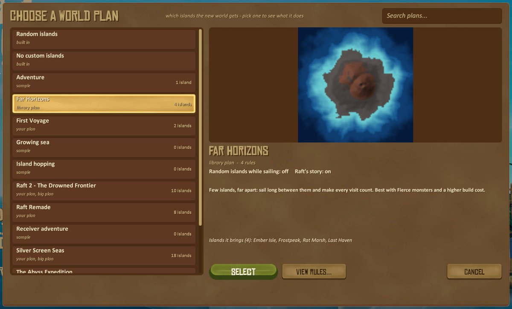
*The plan picker: Far Horizons selected, with a map of its first island and the four islands it brings.*

Then click Raft's **Create** as usual. Your World settings are remembered for the next new world; the plan goes back to
**Random islands** (or the `defaultPlan` of `spawnpool.txt`). Both belong to the world:
saved with it, the same for every player, and every new world gets its own.

**Just want new islands?** Leave the plan on **Random islands**, leave World settings as they are (`Raft's own`) and
create the world: islands turn up while you sail ([section 3](#3-sailing-custom-islands-in-your-world)), and the rest of
Raft plays as it always does. The World settings are optional extras for players who know Raft well; they are described
together near the end of this guide.


*The whole main menu. The EDITOR button opens the island editor ([section 4](#4-building-your-own-island-the-editor)), ISLAND LIBRARY the island library; the EXPERIMENTAL ALPHA RELEASE box (drag it anywhere), here folded with Got it, keeps its Discord, Guide and Report a problem buttons (Show opens it again). It steps aside while New World or any other window is open.*

## 3. Sailing: custom islands in your world

### Islands appear while you sail

*Random islands, side trips and main quest islands - the three kinds of islands you meet, and how each is set up - are
explained side by side in [section 7](#the-three-kinds-of-islands-you-meet-at-sea).*

With the **Random islands** plan, now and then an island appears **250-350 m ahead of the raft**: one after every
**3-6 of Raft's own islands** you meet (a number in that span each time; the world's creator can choose another span,
[9.5](#95-islands-while-sailing)), and **none in a new world's first 10 minutes of play**. However many islands take
part, they never crowd the sea. It can be:

- one of **your own islands** (every saved island takes part unless `spawnpool.txt` says otherwise; islands your world plan brings, and islands generated while sailing, don't come by chance),
- a **brand-new generated island**: a random size and style (tropical, snowy, desert, forest or volcanic), sometimes
  flying; it is saved as `gen-<style>-<seed>.island`, so it stays in that world,
- a **map type**: a sandbar, a wreck of raft blocks, an atoll or a sunken island (more in [4.6](#46-ready-made-islands-map-types)).

Which of these a world may meet can be chosen when it is created ([9.5](#95-islands-while-sailing)). The optional world
settings add more things to meet at sea: the randomizer's odd islands, large islands and boss lairs
([9.3](#93-the-world-randomizer)) and ghost rafts ([9.4](#94-extra-options)).

Islands keep clear of Raft's own islands and of each other, and Raft won't put its islands on top of them later.
Islands far behind the raft are unloaded (after 800 m) and come back when you return.

**Islands you still need come back.** Raft's current carries the raft one way, so an island can drift out of reach -
and without a Receiver nothing shows the way back. An island the players still need comes back on its own: about
**12 minutes** after the raft left it behind (800 m and more), it turns up ahead of the raft again just as you left
it - its quest where it was, opened chests still open - and a banner says "Back in sight". That is:

- an island whose quest you began and didn't finish: it comes back up to **three times** (an island you left on purpose
  stops coming back);
- an island a world plan still waits for - one that leads to the next island, like The Abyss Expedition's sunken
  island: it comes back every time, until you've done there what the plan waits for.

An island found with a Receiver frequency stays where it is (the Receiver shows the way), and so do islands nobody
needs. With several players the host decides, and the island moves for everyone. (`returnMinutes` in
`spawnpool.txt`, [10](#10-settings-files); 0 = never.)

**A finished island never comes again by chance.** When the spawn pool picks an island this world already has:

- **finished** - its quest done, or, for an island without a quest, reached by a player - it isn't picked; another
  island comes instead;
- **not finished** - its quest begun and not done, or never reached - it comes back ahead of the raft **as you left
  it** (quest steps, opened chests, harvest), with a banner "Back in sight", instead of a second, fresh copy;
- already near the players (loaded) - not picked.

**On the Receiver:** once you have built Raft's Receiver, custom islands show as **green dots** with their distance,
if they are within 2 km - an island the players still need shows however far it is (`receiverDistance` in `spawnpool.txt`). An island a rule brought (a quest reward, a plan) carries its name on its dot.

### Arriving

An island with a name shows it as a **banner** when you come near (once per island per session), with its author and
a short welcome if the builder wrote them. Banners and messages (an island's, a zone's, a lever's) come **one after
another**: one that arrives while another is on screen waits until that one has shown for at least 3 seconds.


*Arriving at "Van Island", one of the world randomizer's oddity islands.*

### What you can do on an island

Custom islands work like Raft's own: you can **walk** on them, the **raft runs aground** on them, and you can
**chop** palms, pines, birches and mango trees and **pick up** rocks, ores, clay, sand, berries, pineapples,
flowers and more. What you took **stays taken** (also after saving, loading and sailing away), and it **grows
back** after 3 in-game days (the island's builder or `spawnpool.txt` can change that).


*On a generated tropical island: Raft's bamboo, palms and plants, placed where Raft's own islands have them.*


*A generated island with the Nature setting on "Jungle": you have to squeeze between the trees.*

**Diving:** generated islands rise from a deep sea floor like Raft's own: a sandy shelf about 10 m deep with corals
and sea plants, then a drop-off. Giant clams, silver algae, stones, ores, scrap and the seaweed on sea vines can be
picked up.


*Under water around a generated island: the shelf, the reef, the drop-off and the slope further down.*

**Flying and sunken islands:** some islands float high in the sky (build stairs or pillars up from the raft), others
lie under the surface for divers.

### Notes, chests, zones and creatures

The builder of an island can give it much more than land (see [section 5](#5-making-islands-come-alive)). In a world:

- **Notes:** look at a readable object (a sign, a paper, a bottle...) and press the interact key (**E**) to read it.
  Close it with E, Tab, Esc or the button.
- **Chests:** look at one and press **E**: the items go into your inventory. The chest is then empty for everyone
  until it fills up again (after the regrow days, or never). Some chests are **locked** until you have their key.
- **Trigger zones:** invisible areas that fire when a player walks in: a message, items, or an **ambush** (animals
  that appear the moment you step in). Under water, a zone can be an **air pocket**: inside it your breath fills up
  again, as in Raft's air pockets under Caravan Town.
- **Creatures:** Raft's own animals at the island's creature spots, with the builder's toughness, size and colour.
  Warthogs and bears fight you; chickens, goats and llamas can be caught with Raft's net launcher and kept on the raft.
  Killed and caught animals come back after the regrow days unless the builder said never.


*A note found on an island ("Warthogs live here. Bring a spear."), its title in Raft's lettering and its text on Raft's light tan, as the journal shows its pages. Press E, Tab or Esc to close it.*

### Quests

An island with a quest shows a **quest panel** on the right when you come within about 70 m of its shore (it stays up
until you are 150 m away, so islands still need looking for), with its steps: go somewhere, read a
note, open a chest, defeat or catch animals, collect story items, find journal pages. Each step done shows what's
next; the last one gives the reward to every player near the island - and a crew member who was elsewhere (or joins
later) gets their share when they come to the island, once. The panel shows **five steps at a time**: the one
just done, the one you're on and what comes after. A longer quest scrolls - to your step by itself whenever it changes,
and with the mouse wheel over the panel while the cursor is free (the inventory, the journal, the Esc menu).
Once every quest of the island is done, the panel goes by itself **30 seconds** later; its **×** (top right, while the
cursor is free) closes it at any time - it comes back with the next step, or when you come to the island again.


*The quest panel of "The lost camp" on the right: the first step is "Go to camp".*


*Quest complete: the banner, every step ticked in the panel, and the reward (planks and rope) in the inventory.*

### New islands from quests and rules

A finished quest (or a plan's rule) can **bring a new island**: every player sees a banner with a message and how far
and which way it is, and the island's dot on the Receiver carries its name.


*A rule brought a new island: "About 970 m to the south-east (on your Receiver)". The quest panel shows the
finished step.*

### The journal (J)

The **journal** is the crew's book of the custom islands' story: what you found on them and what you carry for them.
Press **J** in a world to open it; **J**, **Esc** or **Close** closes it. (Esc closes only the window: Raft's pause menu doesn't open on the same press. The same goes for a note, the code lock, the stats page, a choice and the info windows.) (J and the stats page's K can be changed in **Defaults... > Keys (this PC)**: click one, press the new key.) (J does nothing while you type in the chat
or console, while a note is open, or in the editor.) Its key is also shown at the hotbar: after Raft's notebook tab
(**T**) come the journal's tab (**J**, an open book) and, while the level up system is on in the world, the stats
page's (**K**, a star).


*The journal: the custom quests done at the top, the Progress panel (quests, islands reached, notes, story items, journal pages, overall - hover a line for what it counts), the story items at the top left, the pages under Quest Pages by island with its quest and its notes found ("(1/1 notes)"), and the page "The vault" open, signed with the island, its quest and the day.*

**What's in it**

- **Story items** (top left): keys, map pieces, logs... that the islands' builders made. Each shows its picture and
  name, with **×2**, **×3**... when the crew has more than one. Past eight, the list scrolls (the mouse wheel or its bar). Click one to see its picture and description on the
  paper. They come from chests, trigger zones, quest rewards and island events; a message tells you ("Story item: Old
  key (J: journal)"). An item that is **used up** (say a key a locked door takes) leaves the journal.
- **Quest Pages** (bottom left), **by island** - each island's quest line: each island's pages under its name and its quest's title (**√ done** once the
  quest is done, the whole line in light green) and how many of its notes you have found, **(5/7 notes)** - so you know if some are still left on it - the island you were at last first, its newest page first - so notes of several islands don't get
  mixed up. They are every note you read on a custom island - the first time anyone reads it, once, with its title -
  pages an island writes when something happens (an island event "write a journal page"), and, under **Other pages**,
  the frequencies a world plan gives out ("Tune the Receiver to #4821"). Click a page to read it on the paper, signed
  with the island, its quest and the day it was found.
- **QUESTS 7 / 20 · 35%** (top, next to the title): how many of this world's **custom islands' quests** are done,
  with a green bar that fills as you go. Raft's own story (Radio Tower ... Utopia) isn't counted - the journal is the
  custom islands' book. It counts:
  - **a world plan's own islands in the story** (the main quest islands, such as Wreckers' Cove after the Radio Tower
    in The Long Voyage): done as the story counts them - by default when their quest is done;
  - **the plan's other islands that have a quest** (side trips, a quest chain...): counted **from the start of the
    world**, even before they come, so the total shows how much there is to do. One that comes as a new island of a
    map type or from a list counts once it has come (until then nobody knows what it is);
  - **every other island with a quest** that has come to the world: by chance while sailing, brought by another
    island's rule, the world randomizer's treasure hunts. These add to the total as you meet them.
  - **the islands ticked for this world that have a quest and haven't come yet** (while random islands are on - the
    "Islands while sailing" list, [9.5](#95-islands-while-sailing)): counted **from the start**, so 47 ticked islands
    with 44 quests make the total at least 44. One that comes moves to the line above; one that is unticked or an
    island without a quest isn't counted.

  An island's quest counts once, however many rules name it; an island with several quests counts each of them. **Click the count** for the whole list on the paper, by kind:
  √ done, – still to do. The count is the same for every player and is worked out again every 2 seconds while the
  journal is open, so a quest another player finishes shows at once.

  **The end in sight.** When **90%** of the world's quests are done, every player gets a banner: *"Nearing the end -
  You are nearing the end: 18 of 20 quests done (90%). The journal (J) lists what is left."* At **100%** it says *"The
  whole quest line is done - You have completed the whole quest line: all 20 quests of this world are done!"*, and the
  count reads **ALL DONE**. Each banner comes once per world (it is remembered with the world, for every host), and a
  world that gets to 100% in one go shows only the second. A world with fewer than 5 quests has no banners: there, one
  island's quest isn't a quest line. Islands with quests that come later (by chance while sailing) add to the count
  again, but the banners don't come twice.

  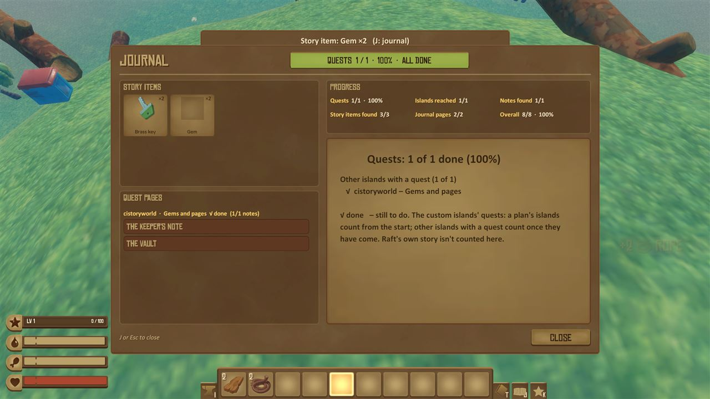
  *A click on the count: the custom quests by kind, done and still to do.*
- **Progress** (top right, over the page): how far the crew has come in this world, each as found / total - hover a
  line to see what it counts:
  - **Quests** - quests done, and the per cent (the same as the bar at the top);
  - **Islands reached** - custom islands someone has set foot on, of those in the world, those its plan will bring and the saved islands ticked for the world (World settings, Islands while sailing) that can still come;
  - **Notes found** - notes read of the notes with a text on those islands (each island's line under Quest Pages has
    its own, "(5/7 notes)");
  - **Story items found** - of those the islands have; one used up since (a key a door took) still counts;
  - **Journal pages** - the pages all the islands can give: their notes and the pages their events write (a side
    quest's are in the journal, a main story island's in Raft's notebook);
  - **Overall** - all of it together, with the per cent.

  What counts is what this world has: the custom islands in it and the saved islands its plan brings, counted from the
  start of the world (also those still to come). An island made new from a map type counts once it has come, and an
  island that comes by chance adds to every line when it comes. Raft's own islands aren't counted (their notes
  are in Raft's notebook, T). An empty journal says where to look.

**One journal for the whole crew.** Everyone in the world shares it: a note one player reads is in everyone's
journal, and a key one player finds opens the door for all. The host keeps it, a player who joins gets it, it is
saved with the world, and it goes back with an older save ([8](#8-playing-together)).

**The journal and quests.** Besides the count and its list (above), the journal doesn't show a quest's steps: an island's quest is shown in the **quest panel** on the
right while you are **at that island** ([Quests](#quests)), and it leaves when you sail away. But the journal is what
some steps count:

- **Find (a number of) a story item** counts that story item in the journal - so an item found before the quest
  counts too, and so does one used up since (a key a door took).
- **Find pages on this island** counts the journal's pages from that island's notes and events; **on any island**
  counts every page.

So when a quest step waits for items or pages, press J to see what the crew has.

**The journal and Raft's notebook: side quests and the main story.** A world plan's **main story** islands are in
**Raft's own notebook (T)**; everything else - the **side quests** - is in the journal:

| | Raft's notebook (T) | The journal (J) |
|---|---|---|
| **Islands** | Raft's story islands, and the plan's **main story** islands (a tab each, in story order) | **Side quests**: every custom island outside the plan's main story |
| **Pages** | Raft's notes; for a main story island its intro, its quest's steps and the notes read on it | The notes of side quest islands, pages their events write, and their frequencies |
| **Items** | Raft's quest items, and the main story's story items (Found items) | The side quests' story items |
| **The Receiver** | Raft's frequencies, and each main story island's #frequency on its tab | A page with each side quest island's frequency |
| **Quests** | The main story islands' steps (crossed out as they are done) | How far the main story is, and the side quests' list; a side quest's steps show in the quest panel at its island |
| **Without the mod** | Raft's own notebook: the mod's tabs and pages aren't in Raft's save, they are made again when the world loads | Kept in the mod's file of the world: it comes back with the mod |

More: [The main story in Raft's notebook, side quests in the journal](#the-main-story-in-rafts-notebook-side-quests-in-the-journal).

Story items aren't in your inventory: the crew holds them (in the journal, or in Raft's Found items for the main
story), like Raft holds its quest items outside the inventory.

---

## 4. Building your own island: the editor

Click **EDITOR** in the main menu. A loading box shows what it is doing ("Opening the editor", then "Loading Raft's
objects from its islands" with a bar) until the editor is ready: a few seconds the first time after starting Raft,
less after that. The editor opens on the sea with an empty build area.


*The box that covers the screen while the editor opens.*

### 4.1 The screen


*The editor on the Terrain tab.*

- **Top bar:** New, Open, Save, Save as · Undo, Redo · the three tabs **Terrain**, **Objects**, **Island** (F1, F2, F3)
  · **Generate** (the island generator), **Light** (the time of day, below), **Test** (try the island in a world,
  [4.9](#49-trying-the-island-in-a-world-test)), **World plans**, **Main menu**. The island's name is at the top left.
- **Tool panel** (left): the tab's tools in bordered groups. The lit button is the one in use.
- **Status bar** (bottom): explains the tool, or the button under the mouse. On the right: where the camera is.
- **The blue plane is the sea.** Everything below it is under water in the game.

**Moving the camera** (like Unity's scene view):

| Do this | To |
|---|---|
| **Right-drag** | look around (dragging up tilts the view down, as if you dragged the scene); while held, **WASD** flies where you look, **Q/E** go down and up, the **wheel** sets the speed |
| **WASD** or arrows | move over the island at the same height |
| **Space** / **C** | go straight up / straight down, whichever way the camera looks (the Terrain and Objects tabs' tips say so too) |
| **Middle-drag** | pan (the ground follows the cursor) |
| **Alt + left-drag** | orbit around the selection, or the middle of the view |
| **Wheel** | zoom towards what is under the cursor |
| **F** | frame the selection, or the whole island |
| **Shift** | three times faster |

Undo and redo everything with **Ctrl+Z** / **Ctrl+Y** (or Ctrl+Shift+Z); save with **Ctrl+S**, open with **Ctrl+O**.

**Light: the time of day.** The top bar's **Light** list has **Morning, Noon, Evening, Night** and
**Overcast** (click it and pick one): the sun's height, colour and shadows, the sky's light on everything and a haze far out change, so you
can see how the island will look at that time in Raft (a dark cave mouth at night, a beach in the evening sun). It is
only how the editor shows the island - nothing is saved in the island. Your choice is kept for the next time you open
the editor (Noon the first time).

**Raft's sky and sea.** On the Island tab, **View: Raft's sky and sea** shows the island under Raft's own sky and on its
real ocean (with waves) instead of the editor's plain sky and blue plane - the Light list then sets the hour of Raft's
sky. It takes effect the next time you open the editor from the main menu; off again works at once.

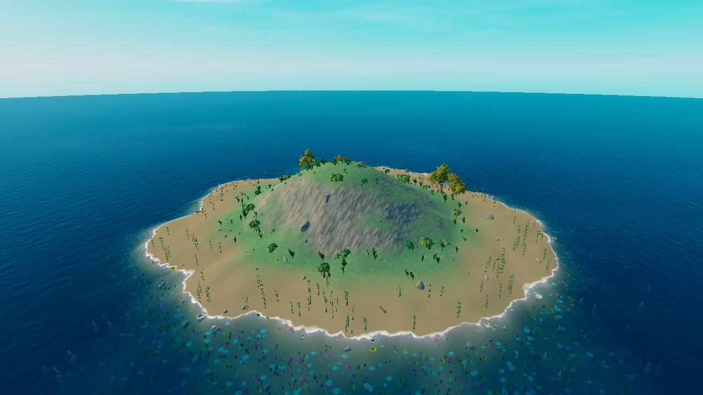
*An island in the editor under Raft's own sky, on Raft's ocean (Noon).*


*The same island at Morning, Noon, Evening and Night.*

### 4.2 Shaping the land (Terrain tab)

- **Sculpt:** **Raise**, **Lower**, **Flatten**, **Smooth**. Hold the left mouse button on the ground; the white ring
  shows the brush. Objects standing on the ground you sculpt **go up and down with it** (trees, rocks, huts: lowering
  the ground no longer leaves them in the air, raising it no longer buries them); what stands higher, on a deck or a
  roof, stays. **Ctrl+Z** undoes the stroke and the objects' moves together.
  **Noise** roughens the ground under the brush (**Noise size**: small bumps or big swells; hold **Shift** at the start
  of a stroke to take the same noise off again). **Erode** lets steep ground slide down until no slope is steeper than
  **Talus** - cliffs crumble into screes, spikes into hills; the ground is moved, not lost.
- **Paint ground:** the style's four textures (for a tropical island Sand, Grass, Rock, Seabed). **Auto** textures an
  area by its height and slope again. **Mix** adds a second style's four textures (eight in all): a tropical island
  with a snowy peak, a desert with forest ground. Older versions of the mod show the first style's textures there.
- **Brush:** size, strength and **Edge**: **Smooth** (soft all the way out, as before), **Linear** or **Hard** (full
  strength up to a thin rim - for terraces and sharp paint borders).
- **Stamps:** click the ground to put down a **Hill**, **Peak**, **Crater**, **Mesa**, **Lagoon** or **Ridge**, as big
  as the brush (Q/E turn it). **Save stamp...** keeps the land under the brush as a stamp of your own; **Manage...** beside it renames or
  deletes your stamps.

**Sea floor.** On the Island tab, **Sea floor: Deep / Shallow** switches the sea around the island without making it
again: the land keeps its height above the sea, the untouched sea floor goes down (a slope falls away from the shore)
or up, and objects on the ground move with it. One Ctrl+Z undoes it.

**Island styles.** On the Island tab, **Style** ◄ ► steps through Tropical, Snowy, Desert, Forest and Volcanic (or click the name for the list): the
ground takes the style's textures, the paint buttons get its names, and the generator uses its plants and animals.


*The same kind of island in four styles, as the generator makes them: tropical palms, snowy pines, desert red rock,
forest birches.*

### 4.3 Placing objects (Objects tab)


*The Objects tab: the tools on the left, the object browser on the right (713 of 1,947 objects loaded).*

The **object browser** on the right has **every object of Raft**, about 1,900, each with a picture: nature, harvestable
trees and rocks, Raft's 88 building blocks (to build huts or your own abandoned rafts), everything else you can build
on a raft, and the objects of Raft's story islands (they load the first time you open their category). **Search**
finds objects in every category.

**Things to gather** (in groups by the style of island they suit: tropical, snowy, desert, forest, volcanic, sea finds,
finds on land - a thing that suits several styles is under each) is the category of what a player can pick, cut or
dig: palms (also the small islands' palms), mangoes, banana trees, Tangaroa's trees, pines and birches to cut, a
**snowy pine** to cut (Raft's pine wearing Temperance's snow), Caravan Town's acacias, pineapples, melons, strawberries,
berry bushes, Balboa's mushrooms, flowers, Raft's finds on the sea floor - sand, clay, stone, iron and copper ore,
scrap, giant clams, silver algae, **seaweed** - the finds lying on the story islands' land (stone, scrap, titanium ore,
planks, plastic) and Raft's **dirt spots** (the mounds its big islands have; players dig them with the shovel for dirt).
They work for the player as on Raft's own islands: picked, or cut with the axe, they give Raft's items and come back
after the island's regrow days, the same for every player and after a reload. Raft has no date palm: desert islands
get Raft's palms and acacias. Those from Raft's story islands (banana and Tangaroa trees, acacias, strawberries,
mushrooms, the finds on land) load with their island's scene the first time they are wanted. **Honey**: Raft has no wild hives
(its honey comes from the beehives players build), so "Loot & chests" has a **Wild beehive** - Raft's beehive holding
three honeycombs, refilling after the island's regrow days like any chest.

**Raft's story pieces that use the player's quest tools.** Balboa's **ChoppableVines** come ready to cut: a player
with Raft's **machete** cuts them away (without one they are told they need it), and keeps the machete for the next
vines on any later island - the vines stay cut. Raft's **zipline lines** (**ZiplinePath** from Tangaroa,
**ZiplinePath_Landmark** from Caravan Town) keep Raft's own zipline: a player with the **zipline tool** rides them as
on Raft's islands. Search the browser for them. Select a line to set its **far end**: **Far end: where I look**
puts the far end's floor on the ground the camera looks at (keep it lower - a zipline runs downhill); in a world Raft
makes the line from the object to there (the editor still shows Raft's own line). **Raft's own** puts it back. In
recipes: the setting `zip.to=x y z` in the island's coordinates.

**Buried treasure** (in "Loot & chests"; a red cross on a mound in the editor) is Raft's own treasure for the
**metal detector** and the **shovel**: in a world the detector beeps as players come near it, three digs bring up the
chest, and the chest gives Raft's treasure loot. Once dug up it stays gone (also for the other players, and after
saving and loading) and is buried again after the island's regrow days. Nothing shows above the ground - players
need the detector, so a note or a quest step can hint where to search.

**Scatter** (the row under the browser) spreads many of the **last object you picked** round the point you are
looking at: **how many** (1-200, 8 at first), within a **radius** in metres (1-300, 15), and **keep** (0-30, 3) - not within that many metres of anything
already on the island (its buildings, its quest's objects, its plants). **On land / Under water** says where they
go (under water: 0.6 to 40 m down; Raft's sea finds always go under water). Each is set down on the ground as the placer does; when the area has no
room for all of them it says how many it placed, and **Ctrl+Z** takes the whole scatter back.
Objects from Raft's islands are placed **standing straight**: one that leant a little where Raft has it (a ladder
against a wall) stands up straight; a bigger lean - more than 25°, a boulder lying on its side - is its look and stays.

- **Place:** click an object in the browser, then click the ground. **Q/E** turn it, **[** and **]** resize it,
  **Shift+click** keeps placing, **Esc** stops. Hold **Ctrl** to nudge it with the mouse. On a slope an object goes down to the **lowest ground under its base**,
  so a house on legs or a van stands on all of its legs and wheels instead of its high side (with **Slope** on, it leans
  with the ground instead).
- **Select:** click a placed object; **Shift+click** adds more, **Ctrl+click** takes one out again.
- **Transform** (keys 1-4): Move, Turn, Scale or All, with the coloured handles. **X** switches the arrows between the
  world's directions and the object's own turn; **P** turns and scales around each object's own point or the middle of
  the selection; hold **Ctrl** while dragging to snap (0.25 m, 15°). An island holds at most 100 000 objects (the editor
  says so past 12 000: big islands take longer to appear in a world).
- **Selection:** **Ground** puts the selection down on the terrain - by its base: on a slope down to the lowest ground
  under it, so nothing of it stands in the air - **Duplicate** (Ctrl+D), **Deselect**, **Delete** (the Delete key). **Copy** (Ctrl+C)
  and **Paste** (Ctrl+V) move objects between islands: copy, open another island (or New), paste - they come with
  their spacing and settings, where the mouse points (Ctrl+V) or the middle of the screen (the button).
- **Selecting many:** drag on empty ground to select everything in a box (Shift adds to the selection); **All**
  (Ctrl+A) selects every object, **Same kind** every object like the selected ones. **List...** shows the island's
  objects by kind with how many: **Select** a kind, **Hide** it (not drawn, can't be picked) or **Lock** it (drawn, but
  clicks, boxes and All pass it by) while you edit around it - hidden and locked objects are still saved and in the
  game, and opening another island shows and unlocks everything. A search narrows the list; **Show all** and **Unlock all** undo every Hide and Lock.

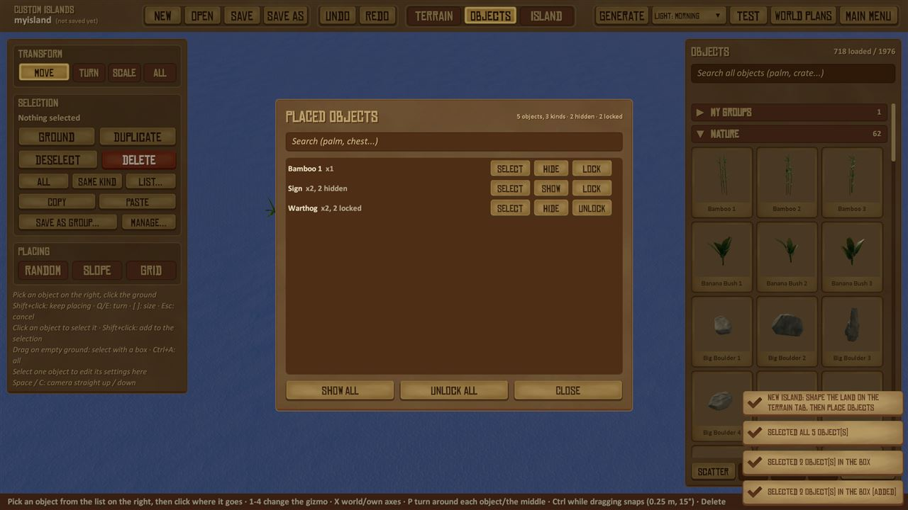
*The Placed objects list: the signs hidden, the warthog herds locked.*
- **Place exactly** (the last group when one object is selected): its **Position** (X and Z in metres across the build
  area, Y in metres above the sea), **Turn** in degrees and **Size** (1 = as made), typed. Enter moves it; Ctrl+Z
  undoes. The fields follow the object when you move it with the gizmo.

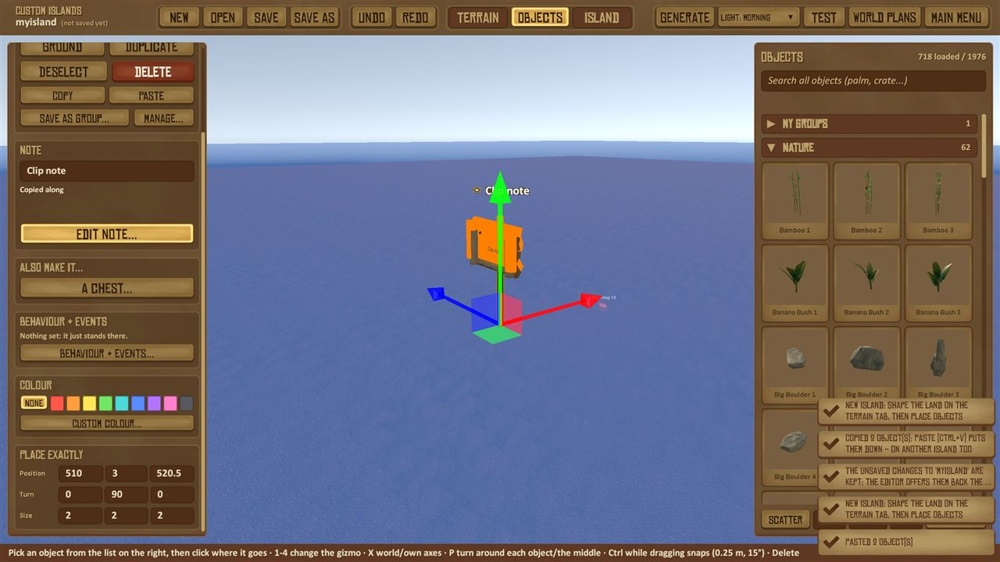
*A pasted sign placed exactly: X 510, 3 m above the sea, Z 520.5, turned 90 degrees, twice the size.*
- **Placing:** **Random** gives each placed object a random turn and size, **Slope** leans it with the ground, **Grid**
  snaps to Raft's 1.5 m building grid (Q/E then turn in 90° steps).
- **Groups:** select several objects and click **Save as group...**. The group appears under **My groups** at the top
  of the browser, to place on any island. **Manage...** beside it opens **My groups and stamps**: pick a group (or, on
  the Stamps tab, a stamp), type a new name and press **Rename**, or press **Delete** twice - it is moved to
  `Mods\DynamicIslands\deleted\groups` (or `...\stamps`), where you can get it back. Islands keep what was placed
  from a group: a placed group is separate objects.

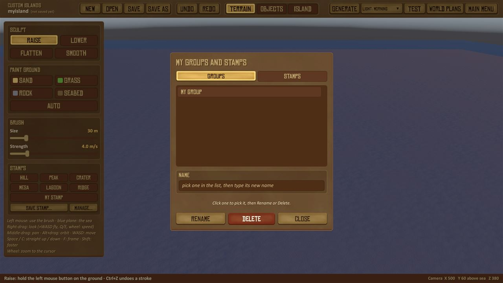
*My groups and stamps: the saved groups (or stamps), the name to rename to, Rename and Delete.*


*A herd of two warthogs (the pink marker) and a sign. "My groups" in the browser holds two saved groups.*

Selecting a single object shows its **inspector** in the tool panel: creature settings, a note, loot, a zone, a colour,
behaviours (see [section 5](#5-making-islands-come-alive)).

### 4.4 The Island tab


*The Island tab: style, height in the world, the generator, the name players see, the island's rules and its quest.*

- **Style** and **Height** in the world: **At sea** (0), **Flying** (60 m up) or **Sunken** (30 m under water), or any
  number from -100 to 250. The island stays where it is in the editor; the **blue plane moves to where the sea will be** in a world -
  60 m below a flying island's water line, 30 m above a sunken one's (it can be seen from below too), and back at the
  water line at 0.

| Sunken (-30 m) | Flying (60 m) |
|---|---|
| 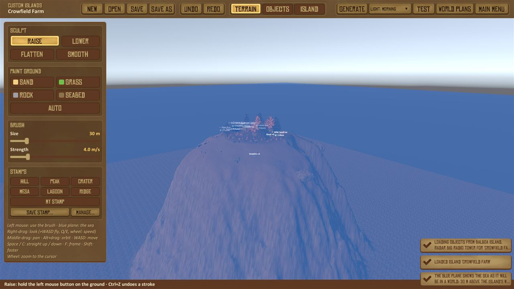 | 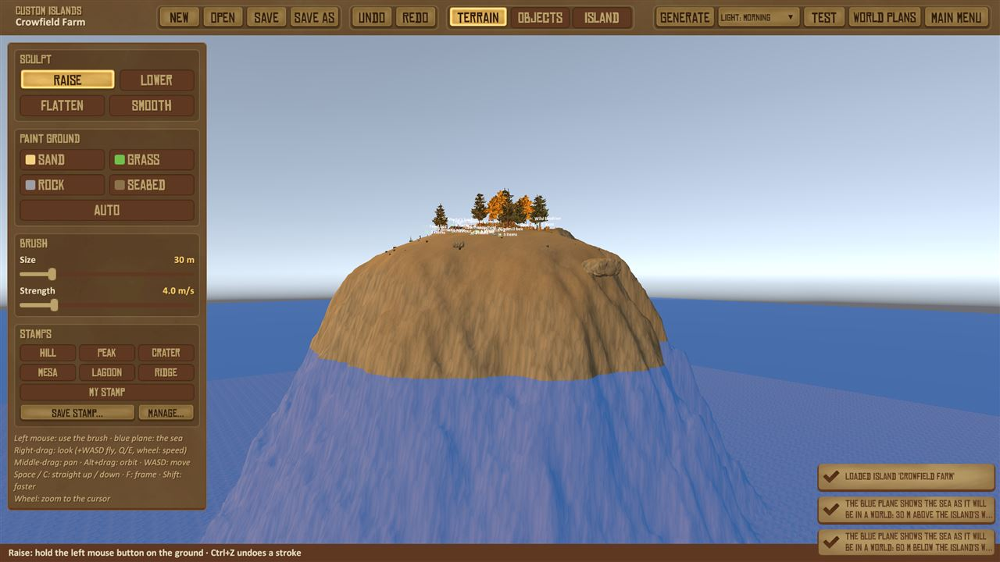 |

*The same island at two heights: the blue plane is the sea it will meet in a world.*
- **Shown to players:** the island's **name**, your name and a short welcome. Players see them as a banner.
- **Rules:** how many in-game days until chopped trees, picked items, killed animals, looted chests and fired zones
  come back on this island (empty = the world's setting, 0 = never, at most 999).
  **Level up system** Off / On: see [section 9.6](#96-the-level-up-system).
- **Quest**, **Islands it brings**, **Island events**, **Story items**: see [section 6](#6-stories-quests-behaviours-story-items).

### 4.5 The island generator

**Generate** (top bar) makes a whole island for you to start from. The **preview** map on the right follows every
change; the line under it says how big the island is and how many objects it will get. The **seed** picks one island
of all possible ones: the same seed and settings always give the same island. Every setting has a **?** to hover.
Generating replaces the island you have; **Ctrl+Z** brings it back. After **Generate** the window steps aside so you
see the new island at once (a message says what it made); **Generate** in the top bar opens it again, with your settings.


*The Normal tab: your presets, the style and layout, the size and height (with buttons for the size and height of
Raft's own small island, large island and Balboa), peaks, hills and the coast.*

- **Island:** the **style** and the **layout**: round, atoll, archipelago, sea stacks, plateau, marsh, crescent, twin
  peaks.
- **Size and height, coast and outline, land features:** peaks and their shape, hills, coast, bays, beach, cliffs,
  stretch and its direction, valleys, lakes, terraces, erosion.
- **Under water:** a **deep sea floor like Raft's** (a shelf about 10 m deep, then a drop-off) or a **shallow** one
  (a flat seabed 20 m down), the width of the shallow water, how steep the drop-off is, and the seabed (sand, rocky,
  or a reef ring).
- **Nature:** trees, bushes, rocks, beach things and harvestables, with quick buttons **None**, **Sparse**,
  **Like Raft**, **Dense** and **Jungle**. "Like Raft" places everything where Raft's own islands have it: a nearly
  bare beach, palms inland on grass, boulders on steep ground - and as thick on the land as there, kind by kind,
  measured on Raft's islands of the style: a big island like Raft's big ones (sparse, few things to pick up on the
  land), a small one like its small ones (bamboo, bushes and flowers close together, green nearly down to the water).
  Each slider's word says how it stands against Raft ("less than Raft", "like Raft", "dense"...). Thicker than Like
  Raft (**Dense**, **Jungle**) thickens the island's higher ground: its low beach and flats - under 4 m above the sea,
  where Raft's islands grow bamboo - stay as thick as Raft's, so a jungle island's beaches don't become fields of
  bamboo. And at Like Raft no kind is ever thicker on the land than on Raft's own islands of the style and size: a
  cluster of little islets, all shore, would otherwise get twice the bushes of Raft's small islands.
  Everything stands with **all of its base on the ground**:
  on a slope a rock, a bush or a log goes down to the lowest ground under it (its high side a little in the slope, as
  Raft's own are), and flat things such as snow drifts lie along gentle slopes and are left off steep ones. They are
  set down on the terrain's own surface (its triangles), so nothing hangs in the air over a steep, uneven slope.
- **Things to gather** (in Nature) and **Finds in the shallows** (in Life under water), from none to much, both off
  unless you move them: more of what players gather on the land, chosen by the style - palms, mango trees, pineapples,
  watermelons, bananas and flowers (tropical), pines, berry bushes and flowers (snowy), palms, pineapples, watermelons
  and flowers (desert), birches, pines, berry bushes and flowers (forest), palms, mango trees, pineapples and black
  flowers (volcanic), with dirt spots and up to three wild beehives on tropical, forest and volcanic islands - on fairly flat land, kept off the island's other objects; and Raft's sea finds where players
  reach them easily, 0.6-6 m down just off the shore: sand, clay, stones, metal and copper ore, scrap, giant clams and
  seaweed. At the top about 10 things per 1000 m² of land and 30 per 1000 m² of shallows. In recipes: `gen Gather=1
  Shallows=0.5`.
  **Which kinds:** under each slider the style's kinds can be switched off one by one (**All kinds** puts them back);
  **How far out** (2-20 m deep, 6 by default) sets how deep the shallow finds may lie. The world randomizer's islands
  get both by its level, and **Defaults...** sets them for islands generated while sailing (off unless you turn them up). In recipes: `GatherOff=pine,clam ShallowsDepth=12`.
- **Life under water:** corals, sea vines, kelp, rocks, stones, ores, giant clams and sunken barrels, placed like
  around Raft's own islands: each kind as close to the shore as there (boulders by the shore, rock formations on the
  drop-off) and as thick. The corals grow in **reefs** as Raft's do: a few tight patches some 15 m across (one per
  250 corals or so), 2-20 m down and 6-45 m out from the land, more on the slopes than on flat sand, with bare sand
  and rock between them - sea vines and kelp round them - never a carpet of coral over the whole sea floor. At Like
  Raft there are never more corals and plants per m² of sea floor than around Raft's own islands, nor more rocks than
  half as many again - an island with a wide shallow shelf gets more sea floor, not more rocks crowded along its
  beaches. Raft's resources stay where Raft has them: metal and copper ore, scrap, giant clams and
  silver algae only under water, never on the land - and every island with sea floor around it gets at least one of
  each that Raft's islands of its style have, so even a small island has its ore. The quick buttons **None**, **Sparse**, **Like Raft**, **Rich** and **Teeming** set all of these sliders at once. **Like Raft** is as dense as Raft's own reefs (about 160 corals and plants per 1000 m²
  2-10 m down, with sand between the reef patches); **Teeming**, the top of the sliders, is twice that. More than
  that carpets a shallow lagoon's floor - nothing like Raft. **Groups** (under Nature) makes the reefs tighter (or
  looser).
- **Animals:** hostile creatures (the style's own, or the kinds you click), how tough (Easy, Normal, Hard, Boss), **Level up** Off / On (the Island tab's rule),
  friendly animals to catch, sea creatures.
- **Loot:** how many loot boxes, their lowest and highest **tier** (1: planks and plastic ... 5: titanium, explosive
  goo, batteries), in the open or hidden.
- **Buildings and caves** (the last group):
  - **Buildings: Off / On** - buildings on the island's open, level land, each with a chest (most with a note too, which
    counts in the journal's notes).
  - **Kind** (a ▼ list, or the arrows):
    - **Mixed** - a bit of everything that suits the island's style;
    - **Castaway huts** - Raft's thatch walls and roof on Raft's foundations, a hammock and a chest inside;
    - **Wooden cabins** - the same in Raft's wooden walls and roof, with a bed, a chest and a cabin log;
    - **Wrecks and landmarks** - Raft's own set pieces, on the land and in the water: a boat run aground on the beach
      or sunk 5-14 m down off the coast, a plane crashed on the land or lying on the sea floor, a small boat pulled up
      the beach, a van, a caravan, a shack, a statue on high ground, a rocket's debris, and structures of Raft's radio
      tower pieces: a **lighthouse** near the coast and a **lookout mast** on high ground (two decks on four legs, ladders
      up, a chest on top), a **jetty** of Raft's foundations out over the water with a boat at its end, and a **ruin**
      (a room with half its walls broken or gone, a crate inside), and a **skyscraper** (12 x 9 m, 6 to 10 storeys of
      the tower's windowed walls, a ladder up its front to a railed roof with a lamp, the dish and a locker) - with a
      chest by the ones on land (Mixed includes them too);
    - the quest islands' **scenes**, made of their own props, each with a chest and a note: **Castaways' camp**,
      **Caravan outpost**, **Radio outpost**, **Scrapyard**, **Old market**, **Bear country** (with a bear nearby),
      **Frozen camp** and **Hotel garden**.

    A hut or cabin is 3 x 2 or 2 x 2 cells of Raft's building grid, open on one side. It stands level on the highest
    ground under it, with the ground built up under it (blended over 3 m, so nothing hangs in the air on a slope), and
    its roof rests on its walls and corner pillars as Raft's own building puts one.
  - **How many** - 0 to 25, at least 22 m apart (0: none). A small or steep island has room for fewer: the message after
    **Generate** says how many found a spot ("2 building(s) found no level spot").
  - **Caves: Off / On** - one of Raft's own cave pieces (Balboa's) set into the land, its mouth towards open, level
    ground, with a guard inside (a polar bear on a snowy island, a bear in a forest, a hyena in the desert, else a
    warthog or a rat) and a hoard. It needs a hill next to open, level land; if none fits, the message after **Generate** says so.

  The scenes and the cave use objects of Raft's own islands: the first **Generate** with them loads those islands
  (a few seconds; the line says "Loading Raft's islands for the buildings and caves...") and then generates. The same
  settings and seed always give the same buildings in the same places. A preset keeps these settings too.

  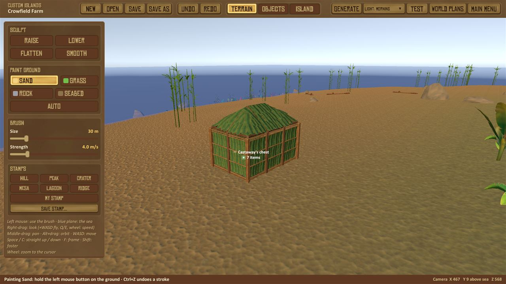
  *Castaway huts: Raft's foundations, thatch walls and pillars, the roof resting on them, a hammock and a chest inside.*

  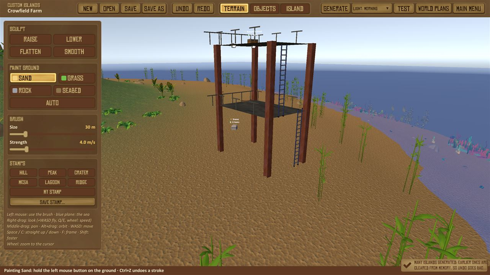
  *Wrecks and landmarks: a lighthouse of Raft's radio tower pieces near the coast, two decks, ladders, a chest on top.*

  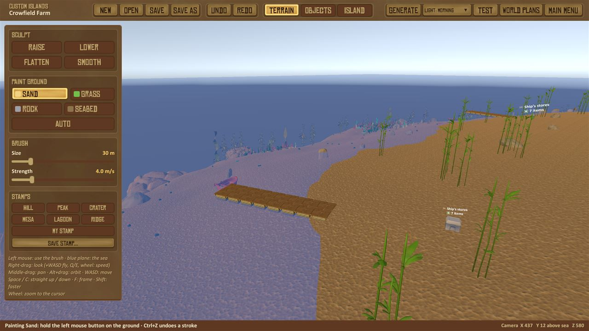
  *A jetty of Raft's foundations out over the water from the beach, a small boat floating at its end.*

  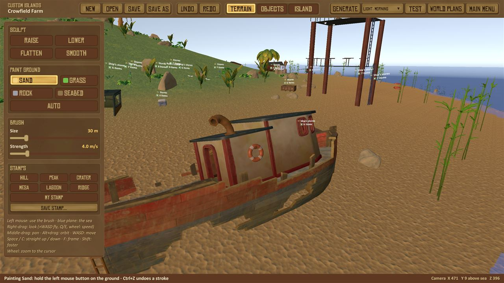
  *A plane wreck lying on the sea floor off the coast (the editor shows the sea floor without water).*
- **Quest** (the very last group): **Quest steps**, 0 to 8 - a quest made together with the island, and everything it
  needs put on the island:
  - first a **castaway's note** to read where players come ashore;
  - then, chosen by the seed: a **lookout** to climb to (a trigger zone up high), **monsters** to defeat (the style's own:
    warthogs or rats, a bear in a forest, a polar bear on snow, hyenas in the desert), **map pieces** to collect from
    three small chests (a story item, in the journal), a **torn page** to read, a **supply crate** to open, **animals**
    to catch with Raft's net launcher;
  - last the **castaway's hoard** to open at the top of the island. With 1 step there is only a hidden hoard.
  - with **Buildings** (huts or cabins) a step is the **key in the castaway's hut**, and the hoard won't open without
    it; with a **Cave** the hoard is the one in the cave. The quest's title fits the steps it got.

  It replaces the island's quest (Ctrl+Z brings the old one back): the Island tab's **Quest** shows it, and you can
  change it there like any quest. On a small island a step whose place doesn't fit is left out; the message says how
  many steps it got. 0 leaves the island's quest as it is.

  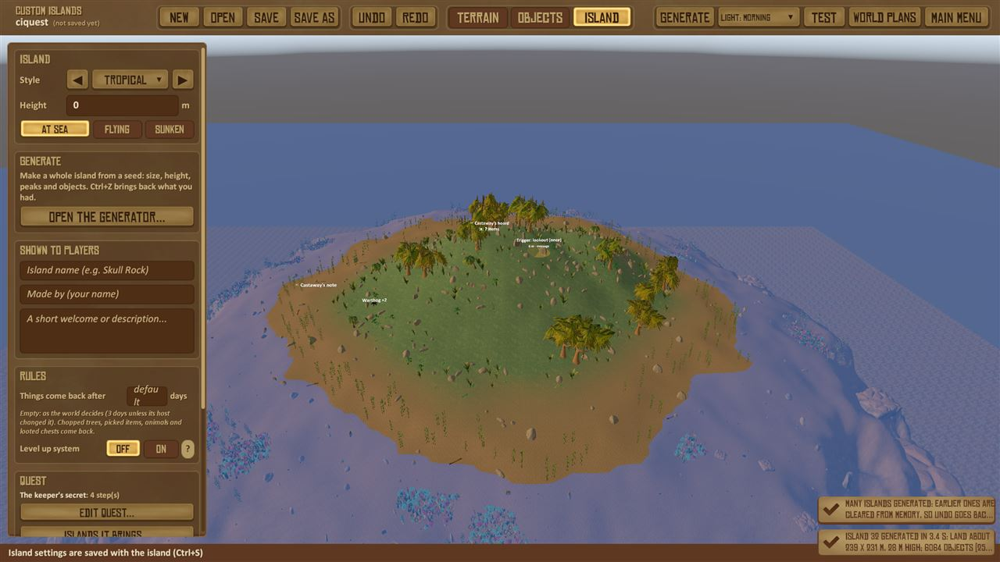
  *A generated island with its quest: the castaway's note by the landing, a lookout, map pieces, the hoard at the top.*

  **Raft's features**, 0 to 10 (same group): things Raft's story islands have the player do, different ones first - a
  **cache behind vines** (it shows once the vines are cut with the machete), **buried treasure** for the metal detector
  and the shovel, a **zipline** from the island's top down to its beach, a **strongbox behind a code panel** (the code is
  on a note elsewhere on the island), a **grove of wild beehives**, **dirt** for the shovel. Past six, Raft's story
  machinery (ready pieces, chapter 16.8): a **generator** to start with Raft's generator part (in a mechanic's toolbox
  elsewhere) and a **radio** beside it that then works and shows a supply drop, an **engine** to start with Raft's gas
  tank (in a fuel crate) that shows a locker, a **chest in a cage** cut open with Raft's bolt cutters, a **lift** at the
  foot of a cliff that carries players up. An **explorer's chest** near the shore holds the tools they need (machete,
  metal detector, shovel, zipline tool, bolt cutters). Six or fewer give the same islands as before.
- **My presets:** **Save these settings...** keeps them under a name; **Defaults** puts every setting back (the seed and style stay).


*Further down the Normal tab: the land features, the Under water group (Deep, like Raft) and the Nature quick buttons.
Hovering a ? shows its help (here Stretch).*


*The bottom of the Normal tab: things to collect, sunken barrels, animals (the kinds to click, the toughness) and loot.*

**Can players reach it?** Above the seed, a coloured line says whether a player arriving by raft can get onto the
island: **Easy** (beaches, walk to the top), **Reachable**, **Possible but tricky** (a jump onto a low ledge),
**Possible but unlikely**, or **Not from the raft without building** (cliffs all around: players need stairs, a
ladder or foundations). It is worked out with Raft's own player: how steep it can walk, how high it jumps.


*A cliff island: "Not from the raft without building: cliffs all around (the lowest ledge is 17 m above the water)."*

**Randomize existing:** click one of Raft's 33 islands (each has a picture). **Something new like it** makes a new
island with its size, height and look; **A variation of it** starts from the island's own ground and reshapes it
(stretch, mirror, roughen, coast, valleys...). This tab shows only what remakes the chosen island - and a **Quest**
group - not the Normal tab's other groups (its buildings and caves aren't used here). It remakes the island's
**ground and nature**, and for a story island with designs also **what is built on it**:

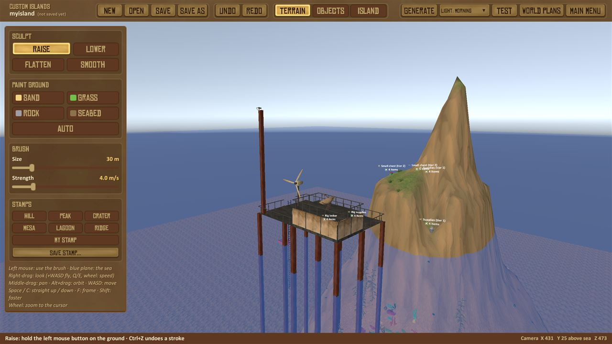
*Rebuild it: the Radio Tower rebuilt as an oil rig off the island - the tower's floors on legs, the dish, the windmill.*

- **Rebuild it** (shown for Raft's story islands): **Design** - something like the
  island built anew from **its own pieces** on the new ground, different with every seed (how high, how many storeys
  and decks, which walls have windows, which way it faces):
  - **A radio tower** - a station on the ground (its door, a power box, a locker), legs 6 to 18 m up to the radio room
    (the radio on its table, a chair, the radar screen, a locker), a roof with the dish, the windmill, a floodlight and
    a mast with a lamp; a ladder all the way up;
  - **An oil rig** - over the open sea off the island (water at least 4 m deep under all of it): four of the tower's
    floors on legs down to the sea floor, railings, a control room with the dish on its roof, a lit flare stack, the
    windmill, supplies, and ladders down to a moored boat;
  - **A lighthouse under construction** - on a headland (high ground with the sea close by): 4 to 6 storeys of the
    tower's walls and floors with a ladder up the outside, the top ones still being built - poles round it, the
    lamp's parts waiting by the door - or finished, with a lantern room of windows, lamps facing out and a lit mast;
  - **Random design** (picked by the seed), or **None** (only ground and nature).

  The other story islands have two designs each, built from their own pieces on a levelled pad of the new land (made,
  raised out of the sea, where the island has no flat land), turned by the seed, each with a container of loot:

  | Island | Designs |
  |---|---|
  | Balboa | **A logging camp** (the shack, a plank fence, tents, a table with a lantern, the generator and barrels, bear signs) · **A relay station** (a hut of the relay walls, decks and roof, the radio racks and desk inside, a porch with a railing and an antenna mast) |
  | Caravan Town | **A caravan circle** (caravans round the well and the raft monument, benches, the workbench, the mayor's chest) · **A market on scaffold decks** (caravans on the scaffold decks with steps, a workshop deck, crates and tyres) |
  | Tangaroa | **A seaside café** (sunshades over outdoor tables, a kitchen counter, the burger sign, a vending machine, plants) · **The founder's garden** (the statue among benches and plants, the grand piano under a sunshade, the board room's table set for a sales pitch) |
  | Varuna Point | **A building site** (the break room on its stilts, the excavator and forklift, dumpsters, rubble, beams, pipes, the skylift) · **A half-built tower** (a 22 m lift shaft, garage door frames, beams, the skylift) |
  | Temperance | **An igloo village** (a big dome and two small, the snowmobile shed, snow vehicles, tarp crates, ice pillars) · **A weather outpost** (the electrical building under the telephone antenna, the telescope, mirror housings) |
  | Utopia | **A water station** (water tanks on bamboo stands, pumps, the crane, covered crates) · **A market yard** (baskets and crates round silver tables, a dog cage, the harpoon platform) |
  | Vasagatan | **The lounge on the beach** (the stage, bars, sofas, carpets, lamps, the DJ's table) · **The engine yard** (the engines and control board, lockers, bunk beds) |

  Its furniture stands on the floors and its legs reach the ground or the sea floor: nothing of it floats. The pieces
  come from Raft's own island: the first Generate loads it (a few seconds).

  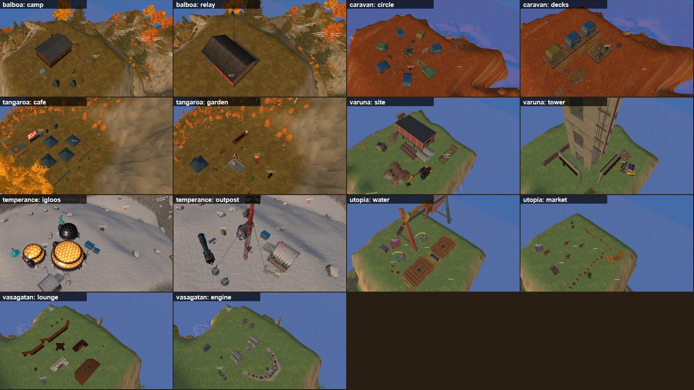
  *Rebuild it for the other story islands: two designs each, from their own pieces.*


*Randomize existing: Raft's islands, measured, with a picture each. Here a variation of "Big Island OG".*


*A variation made from one of Raft's big islands, opened in the editor.*


*A generated island in the editor, ready to change: its trees and bushes are ordinary objects you can move or delete.*

The editor's view under water shows what a deep sea floor looks like:


*A generated island on the deep sea floor: the shelf and drop-off from above, the slope, the reef, the drop-off.*

### 4.6 Ready-made islands (map types)

The generator's **Ready-made (with content)** tab makes whole islands with a story: chests, notes, creatures, zones
and a quest, from a seed. Click a card, then **Make** (click twice): the island is saved as `gen-<type>-<seed>` and
opened for you to change. If that name is taken it gets -2, -3... (rename it with **Save as**: `gen-...` islands are left out of plans and random islands). **Level up** Off / On on the tab turns the level up system on for the island. A chest or note that would stand where players can't get without building (on a sea stack's
top, a cliff ledge) is moved to the nearest place they can reach.


*The Ready-made tab: plain islands of each style, and the map types with their content.*


*Some map types: an archipelago (a castaway's caches), an atoll, sea stacks (a chest on the tallest), a boss island,
an old camp, and a treasure island in a world, its quest panel saying "Find the map on the beach".*

| Map type | What it is |
|---|---|
| Random island; Tropical, Snowy, Desert, Forest, Volcanic island | Any style and size (now and then a flying one); a plain island of that style |
| Sandbar | A tiny island with a few palms and a small chest: a rest stop |
| Atoll | A ring of land around a shallow lagoon |
| Archipelago | Several islets; a castaway's note and three caches |
| Sea stacks | Steep rock pillars; a chest on top of the tallest (build your way up) |
| Boss island | A plateau with cliffs and a ramp; the arena wakes a boss bear (a polar bear on a snowy one) |
| Volcano, swamp, frozen spire | A tall volcano with embers; low land with pools and mist; a snowy peak with a cache on top |
| Treasure island | A map in a bottle on the beach leads to the X and a treasure chest |
| Old camp | An abandoned camp with a notice board and supplies: a good first island of a story |
| Sunken island, sky island | Under water, with corals, sunken barrels and puffer fish; floating 45-90 m up with a cache |
| Wreck, ghost raft | No land: an abandoned raft of Raft's own blocks, floating like a real raft (the deck just above the water). A wreck has barrels to loot; a ghost raft is small, medium or large with a note, and the large ones are guarded by rats and screechers ([9.4](#94-extra-options)) |
| Oddities, boss lair, large island | The world randomizer's islands ([section 9.3](#93-the-world-randomizer)) |

**Your own map types.** A map type can also be a text file: `Mods\DynamicIslands\maptypes\<name>.maptype`, read at
start (F10 `ReloadMapTypes` reads them again). Its help header explains every line: the land (styles, shape, radius,
height... or `settings = <built-in type>`), the height (flying, sunken), and the content - `content = <built-in type>`
reuses a built-in type's content, then your own lines add chests, notes, creatures, zones, atmosphere, objects and a quest
at spots like `top`, `beach`, `near:20`. F10 `ExportMapType <type>` writes a built-in type as a file to start from.
Your types show in the Ready-made tab and can be named in `spawnpool.txt` (`type:<name>`) and in plans like the built-in
ones, and an island pack can carry them. **`ReRollMapType <type> [seed]`** (F10, in the editor) puts a type's content
onto the island you are editing, without touching the land: one Ctrl+Z takes it off again.

### 4.7 Saving and sharing

**Save** (Ctrl+S) saves straight away once the island has its own name (a new island asks for one first: until then it
is only "myisland"); **Save as** and **Open** show the **Islands** window: a name, the height in the world, and your
saved islands (click = pick, double-click = open, Delete asks first and says which saved worlds, plans and other
islands' rules use the island). **Rename** gives the picked island a new name: press Rename, type the new name, press
Rename again. Everything that names it follows: the saved worlds that have it (every copy of their state, their kept
plans and quest rewards), the plans and other islands whose rules bring it, wait for its quest or stand near it, its
`spawnpool.txt` line and the copies kept for saved worlds. A deleted island isn't erased: it is moved to `Mods\DynamicIslands\deleted` -
move the file back into `Mods\DynamicIslands` to get it back. Copies kept for saved worlds (`<name>_<hash>`) aren't
in the list: **Tidy up** (in **My islands** or the Import window) clears the ones nothing uses.

**Give my worlds this version.** A saved world keeps playing the version of an island it was saved with. When you save
an island that worlds play in an older version, the editor offers **Give my worlds this version** (also in **My islands**
for the picked island): those worlds then play the island as you saved it now, and the old copies go to
`deleted\kept versions`. **Keep their version** leaves them as they are.

**My islands...** (in the Islands window) lists every island file at once: where it came from (**Mine**, the island
**Library**, **Generated** while sailing, copies **From hosts**), how many saved worlds use it (hover for their names)
and its **weight** in the random pool - type a number to give it a line of its own in `spawnpool.txt` (2 = twice as
likely, 0 = never by chance; grey = the weight every island not listed gets). Pick one to **Open**, **Rename** or
**Delete** it (Delete names who uses it first). **Tidy up** removes copies (from hosts, or kept for saved worlds) no saved world uses and moves
generated islands nothing uses to the `deleted` folder. The tabs and a search narrow the list.

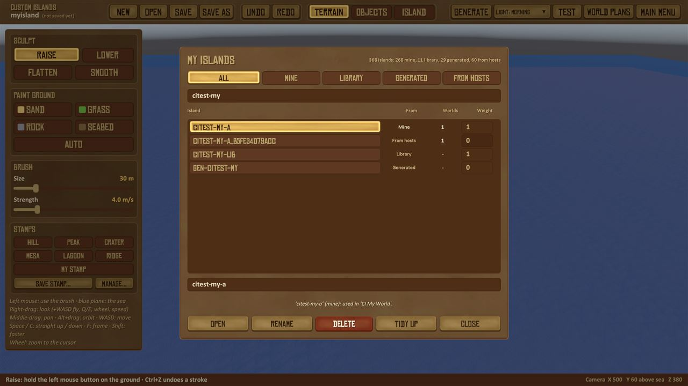
*My islands: four test islands - one of mine used by a world, a copy from a host, one from the library, a generated one.*

**Nothing unsaved is lost:** opening another island, **New**, or a map type's **Make** while the island has unsaved
changes keeps them as its autosave first (the editor says so, and offers them back the next time it opens).


*The Islands window: the name and height, the saved islands with their date and size, and Save, Open, Rename, Delete.*

Islands are files in `<Raft>\Mods\DynamicIslands\` (`<name>.island`). In multiplayer the host's island files are sent
to players who don't have them, so nobody needs to share files just to play together ([section 8](#8-playing-together)).

**Autosave.** While the island has changes you haven't saved, the editor keeps a copy every 3 minutes, and when you
leave to the main menu or quit Raft (`Mods\DynamicIslands\autosave\<name>.island` - not an island of yours, it never
turns up anywhere). If Raft closes before you saved (a crash, the power going), the next time the editor opens it
offers the unsaved work: **Open** it (then **Save** to keep it), **Throw them away**, or **Not now** (asked again next
time; **Throw them away** moves them to `Mods\DynamicIslands\deleted\autosave`, so they can still be got back). Saving the island removes its autosave. Every change counts - the land, objects, their settings, and the
island's own settings on the Island tab (name, texts, style, height, rules, quest, events, story items), which Undo and
Redo also take back and forth; save before you close Raft all the same. Selecting objects isn't a change.

**Objects this Raft version doesn't have.** After a Raft update an object an island uses may be gone or renamed. In the
editor it shows as a **red box** in its place (the island says how many when it opens): it keeps its name, place, size
and settings, and saving writes it back unchanged, so a later version of Raft or the mod can show it again. Delete the
box if you don't want it. In a world such an object is left out, and the player is told once.

**Saving an island your saved worlds have.** A saved world remembers what was used on the island - trees chopped,
things picked up, chests looted, zones fired, doors opened - by the order of the island's objects. So:
- changes that keep that order reach those worlds the next time they load: moving objects, changing their settings,
  the ground, the island's settings, and **new objects** (they come after the others). The first time you save over
  such an island, the editor says which worlds have it. If you moved its ground, anything built on it there may no
  longer fit;
- changes that would mix it up - **deleting objects**, changing their order, or making an object a chest - don't reach
  them: those worlds keep playing the version they started with (the editor says so; a copy `<name>_<code>.island` is
  kept for them), and new worlds get your new version. To give a world the new version anyway, save your changes under a
  new name (**Save as**) and bring that island into the world.

**Sharing an island or a plan: Export.** In the Islands window, pick an island and click **Export...**; in the World
plan window (a plan open) click **Export...**. The **Share** window says what goes along:
- an island takes the islands its rules bring with it ("Palm Cove + 1 island it brings: Treasure Cove"), and theirs, so
  its quest chain still works for whoever gets it;
- a plan takes every island it needs. Rules of the kind "a new island of a map type" need no file (every player's mod
  makes those; your own map types' `.maptype` files go along), and islands from the spawn pool come from each player's own islands;
- if one of those islands isn't saved, the export stops and names it.
- an island taken from someone else's entry that says no to changed versions can't be exported; the title and author must be filled in.

Fill in the **title**, **author** (your Steam name to start with), a one-line **summary**, a **description** (what
players find, how long it takes, what you had in mind, e.g. "best with Fierce monsters" - a pack never sets difficulty
or other World settings; the player's own choices always apply), **tags**, **players** and **length**, and whether
**others may change it and share their version** (they must credit you either way). The **picture** is what the
editor's camera shows: close the window, move the view, open it again, or click **Take picture**; its middle becomes the
icon. **Export** writes a pack, `Mods\DynamicIslands\exports\<title>.zip` (the title in small letters with dashes, e.g. `palm-cove.zip`); **Open folder** shows it; **Share...** opens the
island library's page to send it in. Export the same island or plan again later and the pack is the next version of
the same entry (so whoever has it can update it).


*The Share window: what goes along, the entry's info on the left, the picture of the editor's view on the right.*

**Getting islands from a pack: Import.** Put a pack (`.zip`) you got into `Mods\DynamicIslands\import` (**Open import
folder**), click **Import...** in the Islands window or the World plan window, and pick it: the window says what it
holds, who made it and its version. **Install** puts it in place:
- **Your own files are never overwritten.** If you have a different island with the same name, the pack's is installed
  as `Name (Pack title)` and the pack's plan and islands are changed to use that name. The same island (the very same
  file) is shared, not copied. A plan whose name you already use gets the author added: `First Voyage (Author)` - and
  your very own plan (the same file) stays yours: removing the pack later leaves it.
- A plan may bring only new islands of map types: such a pack holds no island files at all, and that's fine.
- **Story items with the same id:** a world's crew holds one of each story item id for all its islands. If the pack's
  islands use an id another installed pack uses too (two packs' `key`), Install says so - in a world with both, the
  key found for one would open the other's door. Fine if the packs are never played in one world.
- An **island** from a pack only turns up by chance while sailing if you tick **Also let it turn up while sailing** -
  then also in worlds you've already started with random islands (you can untick it for a new world in World
  settings, [9.5](#95-islands-while-sailing)). A **plan's** islands never turn up at random: they come when the plan
  brings them.
- A pack made with a **newer version** of the mod says so: "Install anyway" may leave out things this version doesn't
  know, and a quest that needs them may not be finishable. An island file of a newer *format* can't be read at all and
  is refused ("update the mod").
- A broken or harmful pack (too big, too many files, a file that would land outside the mod's folder, a program, not an
  island file) is refused with the reason, and nothing is written.
- Installing a newer version of something you installed **updates** it. Worlds you've already started get the new
  version when its objects keep their order (a fixed quest, new ground, objects added), as with your own saves (4.7);
  when objects were removed or reordered they keep the version they started with (the old file stays for them, and
  the install says which). If you changed one of its islands in the editor, yours is
  kept unless you tick **Replace files I changed**.

**Installed from packs** lists everything you installed, with **Remove** (click twice). Remove deletes what the entry
installed but keeps anything a saved world still uses (it says which world), and never touches your own islands and
plans. Under it, **Tidy up** (click twice) says what has piled up and clears it:
- copies of islands (`<name>_<code>`: from multiplayer hosts, or kept for saved worlds) that no saved world on this PC uses - also none of
  Raft's older saves of a world (a host sends them again if needed);
- generated islands (`gen-...`: made while sailing, or with **Make** and never given a name) that no saved world, plan,
  island rule or library entry uses - moved to `Mods\DynamicIslands\deleted`, so they can be got back;
- the mod's files of worlds you deleted in Raft (only worlds you hosted: the copies of worlds you joined are kept, so
  you can host them later) - moved to `Mods\DynamicIslands\worlds\removed`.

An entry whose files you deleted since (in the editor, or by hand) shows as not installed again, so it can be
downloaded again.


*The Import window: packs in the import folder, what the picked one holds, and what's installed.*

Import is offered in the island editor (the Islands and World plan windows), never inside a running world.

**The island library: download plans and islands others made.** **ISLAND LIBRARY** in Raft's main menu (also **Get
more...** in the New Game box and **Library...** in the Islands window) opens the library: a public collection on
a shared Google Drive folder, where every
entry is looked at before it goes in.
- **World plans** and **Islands** tabs, a **search** (titles, authors, summaries, tags), featured entries first. Each
  row has the entry's icon, title, author and summary, and says **INSTALLED** or **UPDATE** when that applies.
- The picked entry shows its pictures (**<** **>**), description, author, version, date, size, how many islands, players
  and length, and one button:
  - **Download** - downloads it and installs it the same way as Import (your own files are never overwritten, a plan's
    islands never turn up at random, an island only if you tick **Also turn up while sailing**);
  - **Update** - the library has a newer version than the one you have: installs it (worlds you've already started
    get it when its objects keep their order, else keep the version they started with). It replaces the entry's files, also ones you changed in the editor or World
    plans since: then the first click names them and **Sure? Update** goes ahead. To keep your changes, open the
    island (or plan) and **Save as** a new name first;
  - **Installed** - you have the newest version. **Remove** (click twice) takes it away again, keeping what a saved
    world uses.
  - An entry made with a newer version of the mod says **Download anyway**, with the warning.


*The island library: the islands tab with three installed and Palm Cove picked; its picture, description and Download.*

- Every downloaded file is checked against the library's list (its size and a fingerprint); if one doesn't match,
  nothing is installed. A plan downloaded from the New Game box's **Get more plans...** is chosen there right away.
- The library goes online only while this window is open, and sends nothing but the downloads - no account, no Steam id.
  Without internet it says it can't read or reach the island library; packs someone sent you still install with **Import...**.
  `Mods\DynamicIslands\library.txt` can switch it off (`online = off` - this also stops the main menu's check for a newer Custom Islands).

**The guide:** **Guide** at the top of the island library opens this guide (its PDF) - chapter 16 is about the
library's example islands and plans.

**Sharing yours in the library:** click **Submit yours...** at the top of the island library. It explains the three steps:
1. **Export** your island or plan in the editor (above), with a title, summary, description and picture;
2. **post the pack** (`.zip`) on the [Custom Islands Discord](https://discord.gg/U7DfKY9tN) with a few words about it;
3. it is **approved first**: every entry is looked at before it goes into the library, so it can take a while. Once it
   is in, every player sees it in the library.

Its buttons open the Discord, your exports folder and this section of the guide. By submitting, you say you made it and
share it under CC BY 4.0 (others may use it and must credit you).


*Submit yours... in the island library: export, post it on the Discord, approved first.*

**Or with GitHub:** after an export, **Share...** in the Share window opens the library's
[Submit an island or plan](https://github.com/SwedenJohansson/CustomIslands-Library/issues/new?template=submit.yml)
form (a free GitHub account is needed) and the folder with your pack: drag the `.zip` in, tick the box (you made it and
share it under CC BY 4.0: others may use it and must credit you), send. To update it later, export it again (it keeps
its entry) and send that the same way.

### 4.8 Your first island, step by step

1. Main menu → **EDITOR**.
2. **Generate** → Normal tab: Style **Tropical**, click **Small island**, Nature **Like Raft** → **Generate**.
3. **Terrain** tab: raise a hill, paint a sandy path, stamp a **Lagoon**.
4. **Objects** tab: search "chest", place a **Chest**, click **Add items...** and pick some loot.
5. Place a **Sign** from "Notes & signs", click **Edit note...**, write a welcome.
6. **Island** tab: give it a name ("Skull Rock") and your name.
7. **Save** (Ctrl+S), type a name, Enter.
8. **Test** in the top bar: the island is tried in a world at once, and **Back to the editor** brings you back
   ([4.9](#49-trying-the-island-in-a-world-test)).
9. Main menu → **NEW WORLD** → create a world. Your island takes part in the Random islands plan, or press F10 and type
   `SpawnIsland <name> 250` to have it appear 250 m ahead right away.

**Next:** give the island a quest ([6.1](#61-quests)), then make a world plan that brings it into a world at the right
moment, with other islands after it ([7.2](#72-your-first-world-plan-step-by-step)).

### 4.9 Trying the island in a world (Test)

**Test** in the editor's top bar tries the island you are making in a real world, without leaving it by hand:

1. The island is saved (it needs a name: Save as first for a new one).
2. The mod goes to the main menu and loads the world **Custom Islands test** - it makes it the first time, as a normal
   world with the plan **No custom islands**, so nothing else turns up.
3. Your island is put beside the raft and you stand on it. Islands tried there before are taken away first. Their journal pages and story items go too, so a quest starts fresh.
4. Walk around, open the chests, read the notes, meet the creatures, try the quest.
5. **Esc → Custom Islands → Back to the editor**: the test world is left **without saving** and the editor opens
   again with your island, where you left it.

The test world is made with your last World settings choices (monsters, randomizer, extra options...); change them
there with **Esc → Custom Islands** if you want to try the island another way. It never counts as a saved world that
uses your islands (no kept copies or warnings for it).

Change something, **Test** again. The test world is a world like any other in Raft's Load Game list: you can load it
yourself too, and delete it from there when you no longer want it. (Trying an island in one of your own worlds is still
possible with F10 → `SpawnIsland <name> 250`.)

---

## 5. Making islands come alive

Select an object to see its **inspector** in the tool panel. Everything here can be undone.

### 5.1 Creatures

Open **Animals: hostile**, **Animals: catchable** or **Sea creatures** in the browser and place an animal: warthog,
pig, bear, mama bear, polar bear, hyena, rats, roach, bee swarm, screecher; chicken, goat, llama; puffer fish, angler fish,
turtle, stingray, dolphin, whale.


*A warthog spot: a herd of 3, health ×2, damage ×1.5, comes back after 3 days, appears at once.*

- **Animals here:** 1 to 8 (a herd).
- **Easy / Normal / Hard / Boss**, or set **health**, **damage**, **speed** and **size** yourself.
- **Comes back after** the regrow days, or **Never**.
- **Appears** at once, or **when a zone fires** (an ambush, see [5.4](#54-trigger-zones-and-ambushes)).
- **Colour** (every object): a swatch, the strength, or your own mix.

**Angler fish swim rounds** around their spot, through the open water near it (in Raft they follow a route of their
island's; here the mod lays one out in a ring around the spot, clear of the ground and of objects). Give them room:
a spot a few metres from walls and the sea floor, in water deeper than they are long.

In the editor a creature is a coloured marker with its name, or Raft's real model once you have been in a world since
starting Raft:


*Creature spots with Raft's own models: a warthog, a llama, a bear, a chicken.*

### 5.2 Notes and signs

"Notes & signs" has a paper, a bundle of papers, an open book, a sign, a notice board and a message in a bottle, and
**any object can be made readable** (**Readable...**). A sign shows its note's title on its board. The title can be 60 characters long, the text 4000. **Ctrl+Enter** saves, **Esc** cancels. **Remove** makes the object unreadable again.


*An object with a note: its title "Hidden treasure" and the start of the text.*


*The note editor: the title, the text (Enter starts a new line), and a preview of the paper players will see.*

### 5.3 Chests and loot

"Loot & chests" has chests, a crate, a wooden box, barrels and a wild beehive (honeycomb), and **any object can hold loot** (**A chest...**).
**Fills up again** sets whether a looted chest is full again after the island's regrow days or never. A chest holds up to 12 kinds of items, up to 999 of each. **Empty** takes everything out; **Not a chest** makes the object plain again. A chest that
holds a **story item** never fills up again, whatever is chosen (the story's key or log comes once - the panel says so).


*A chest's loot: planks, plastic, palm leaves, rope and nails. The Basics, Metal, Food and Treasure sets fill it
quickly; it fills up again after 3 days, or never.*


*Add items...: every item of Raft with its picture and a search. Click an item to add one, again to add more.*

**The abandoned raft crate.** "Loot & chests" also has Raft's own **Abandoned raft crate**: the box you grab on the
small abandoned rafts that drift by in Raft. In a world it works as there: a player takes it whole (look at it, **E**) and
gets a handful of random items from Raft's own loot for those rafts - now and then a cooking recipe or a mystery package.
Its contents **can't be chosen** (use a chest for chosen loot), and it **doesn't count for a quest's "Open a chest" step** -
the editor says so too, in the object list's hint and on the crate's own panel when you select it, and Check tells
you when a quest needs a chest and the island only has raft crates. Once taken it
stays gone, and comes back after the island's regrow days like harvested things ([4.4](#44-the-island-tab); 0 = never).

### 5.4 Trigger zones and ambushes

A **trigger zone** ("Zones & triggers") is an invisible sphere. When a player walks in it shows your **message**,
**gives items**, and wakes the creatures that wait for it. **Fires:** **Once** (for the first player - and ready again
after the island's regrow days, like loot), **Once ever** (never again in that world: for the story - an ambush, a
bridge shown) or **Every time** (each time a player walks in, at most every half minute). Zones are 1 to 50 m in radius. A trigger zone's name can be 24 characters long, its message 200.


*A trigger zone (the orange sphere): its name, size 10 m, the message "You hear grunting...", fires once, and one
creature spot waits for it.*


*The warthog's **Appears** is set to "when zone-158 fires": its name tag says it waits. It appears the moment a player
walks into the zone.*

**Air pockets.** A trigger zone's **Air** row makes it an **air pocket**: a player inside it breathes - their breath is
full again - as in Raft's air pockets under Caravan Town. Raft's own air-pocket objects (the shack, the gas tank and
the container in Caravan Town's list) come without their air, so put an air-pocket zone on each, about as big as the
object. A zone **hidden** by a behaviour gives no air until it is shown: *The Abyss* in the library keeps its three
pockets empty until the air line's valve is opened (the valve's action shows them, with bubbles - [5.5](#55-atmosphere-and-sound)).

**Invisible walls and ramps** (also in "Zones & triggers") are solid in the world but not seen: block a path, fence
an arena, or make a cliff climbable.

### 5.5 Atmosphere and sound

An **atmosphere zone** changes the fog colour, the light and adds particles (fireflies, mist, snow, embers, bubbles)
around a spot; a **sound zone** plays one of Raft's 500+ sounds while a player is inside, or once on entering.
**Bubbles** rise from the zone's middle in a column, about 14 m high - under water, for an air pocket filling or a
vent; give the zone only bubbles (no fog or light) and it changes nothing else.
A **dark light tint** makes the inside really dark: Raft's sun, the sky's light and its reflections all take the tint
while you are in the zone - for a cave, a mine or a buried room (Old Mine Islet and Shelter Atoll in the library).


*An atmosphere zone: its size, fog colour and strength, light tint and strength, and particles (fireflies).*


*Fly the camera into the zone to see it: purple fog and fireflies.*


*Choose sound...: Raft's sounds with a search. ► listens, Use picks it.*

---

## 6. Stories: quests, behaviours, story items

### 6.1 Quests

**Island tab → Edit quest...**: a title, an introduction (shown when players arrive), up to 10 steps in order, a
reward and a closing message.

**Several quests on one island:** the buttons at the top of the quest editor are the island's quests - the **Main
quest** and **+ Another quest** (up to nine quests in all). Each has its own steps, reward and messages and is done on its own;
what a player does counts for every quest waiting for it. The panel shows the first quest not done yet ("+1 more"
when others are open), the journal lists each, and world plans and the story wait for the main quest - or for another
one by its number (a rule's "quest 2"). **Remove this quest** takes one off; the ones after it move up. In recipes:
`quest2 title=...`, `step2 reach|zone|1|Text`.


*The quest "The lost camp": go to the camp, read the diary, open the supplies, chase off 2 warthogs. The reward is
planks and rope, and when the quest is done it brings a saved island "Old camp" 700 m north, with a message and a
name on the Receiver.*

Steps: **go to** a trigger zone, **read** a note, **open** a chest (one of the mod's chests - Raft's abandoned raft crate doesn't count), **defeat** or **catch** a number of animals,
**collect** a number of a story item, **find** journal pages. Each step's kind is a **▼ list** (each kind says what it
asks). Steps point at things on the island by name: the small **▾** beside the name lists the names this island has
for that kind - its trigger zones, note titles, chest titles or creatures - so you can pick one instead of typing it
(place the zones, notes, chests and creatures first). A **collect** step picks its story item with **…**. **When the quest is done, bring a new island** (main quest only) chooses from a
list too (nothing, a saved island, a new island of a map type), and so does its direction.

**Steps done in another order count too:** a chest opened or animals defeated before their step has come are
remembered, and count the moment their step comes - the guide's camp quest done backwards (warthogs, supplies, then
the diary) finishes when the diary is read. To keep the story in order anyway, hide a later step's chest or animals until
the step before shows them (**Behaviour & events...** > **At first: Hidden until shown**, for animals **Hidden (ambush)**, and a **show** action).

**Collect and find-pages steps** count what the whole crew holds, and finish while a player is at the island - so the
reward reaches someone. **Traps to avoid** when you make a quest (toggles in events that happen again, keys, rewards):
[12.4 Making quests and plans that work](#124-making-quests-and-plans-that-work).

### 6.2 Behaviour and events

Select any object → **Behaviour & events...**. No code needed:

- **A name** that actions refer to (objects with the same name act together).
- **Movement:** spin, bob, move back and forth, or **open and close** like a door, gate, bridge or lift (with a
  Preview in the editor). A spin turns around the vertical, or with **Own axis** around the object's own up axis:
  tilt it first - a water wheel, a windmill's blades, a fan (Tide Farm's wheel in the library). With **Carries players**, players standing on a moving object ride along (a lift).
- **At first:** there, or **hidden until shown** (a hidden creature spot is an ambush).
- **Players can use it:** Raft's "press E" hint with your own text ("Pull the lever"). With a **keypad code** (the
  field under Behaviour & events in the object panel; `lock.code` in recipes) a keypad opens first, as on Tangaroa:
  the right digits run the object's use (its checks and actions), a wrong code says so, and once opened it stays open
  for everyone. Put the code on a note somewhere on the island.
- **Collision:** Raft's own, walk through, one box, or solid.
- **When ... then:** when a player uses it, walks into a zone, reads a note, opens a chest, or all the animals of a
  spot are defeated → show / hide objects, open / close doors, say a message, give items, play a sound, teleport the
  player, send a signal, write a journal page, or **wait** some seconds first. Each action is chosen from a **▼ list**
  that says what it does; **…** beside a name lists the names on this island. A note's "read" and the island's "first
  come" happen **once per world**: whoever reads the note again (anyone) gets its messages and sounds, not its items or
  teleports again. After a **wait**, what changes the island (show, open, a signal, a journal page) happens even when the
  crew sails away or the host saves and quits meanwhile: it happens when the island loads again. What is for the player
  (a message, items, a teleport) is left out for a player who died or left the island meanwhile.
- **Only if ...:** the player **has** an item or story item (or **uses one up**, like a key), an object is open,
  closed, shown or hidden, a signal was sent, the quest reached a step (a ▼ list too). Turn a check round with **not**; ask for
  **all** or **any** of them. **Otherwise** say a message.


*A log named "lever" that players can use ("Pull the lever"): it opens or closes the door and says "The door moves".*


*A door that opens only if the player has the story item "rusty key"; otherwise it says "It's locked. Maybe there's a
key somewhere..."*

**Island events** (Island tab): actions for when players first come to the island and when its quest is done.


*Island events: what happens when players first come to the island, and when its quest is done.*

### 6.3 Story items and story sets

**Island tab → Story items...**: keys, map pieces, logs... with a name, a description and a picture (Raft's quest
item pictures or any Raft item). Chests, zones, quest rewards and "give" actions hand them out; "only if" checks ask
for them; players find them in the journal (J), or in Raft's notebook (T) for a main story island. Raft's own quest item pickups (search "QuestItemPickup") work as story items too: picked up, the crew gets Raft's item (`story:raft-<type>`).

**What ends up in the players' journal** ([3](#the-journal-j)), so you can plan a story with it:

- Every note with text becomes a page the first time someone reads it, titled with the note's title (give notes
  clear titles: the page list shows them). A note with no text adds no page.
- An event's **write a journal page** adds a page with your title and text (once per world) - a clue, a diary entry,
  what the crew learned.
- Story items show with their picture, name and description; when a check **uses one up**, it leaves the journal.
- A quest step **Collect** or **Find pages** counts what the journal holds, also what was found before the
  quest.

**Story sets** place a ready piece of a story in one step: **a locked door and its key** (in a chest with a note),
**a trail of notes** leading to a hidden chest, **a treasure map** (a bottle gives the map; the X digs up a chest
only for someone who has it), or **a locked chest** whose key is hidden in driftwood nearby.


*The Story items window: the island's story items ("Old key") and the four story sets.*

### 6.4 Islands that bring islands

**Island tab → Islands it brings...** gives the island its own rules: "when my quest is done", "when step 2 is done",
"when zone X fires" or "when players first get here" → bring a saved island or a new island of a map type, how far
and which way, with a message and a name on the Receiver. The cards work like a world plan's rules ([7.3](#73-a-rule-card-part-by-part)),
but they travel with the island: a chain of shared island files is a story on its own, in any world where the first
island turns up. A world plan is the better choice when you want to decide the whole world's story in one place.


*An island rule: when this island's quest is done, bring a new island of a random type 600 m north, with the
message "Well done" and the name "Reward" on the Receiver. The map on the right sketches where islands go.*

### 6.5 Your islands in Raft's story (the Receiver)

Raft's own story is a chain. A note on each story island gives the **frequency** of the next one, and players find it
by tuning the **Receiver** to it: Radio Tower, Vasagatan, Balboa, Caravan Town, Tangaroa, Varuna Point, Temperance
and, last, Utopia, the ending. A world plan ([section 7](#7-world-plans-which-islands-a-world-gets)) can change that
chain, in the editor's **World plans** window:

- **Raft's story islands: on/off.** On (the default) keeps Raft's story. **Off** leaves all of Raft's story islands
  out: the plan's own islands are the whole adventure. Raft's ordinary islands still turn up as in any world.
- **Leave out one story island:** click its name in the row next to the switch (it goes dark). The note before it then
  leads to the one after it. For example, without Balboa, Vasagatan's note gives Caravan Town's frequency.
- **Main story or side quest:** on a rule's card, the **STORY** list decides. **Side quest (not in the story)** keeps
  the island out of the story: it goes into the **journal (J)**. Any other choice makes it **main story**: it gets a
  tab in **Raft's own notebook** (see below). The places:
  - **Main story: first**: before everything, unlocked from the start of the world;
  - **After** one of Raft's story islands, or after another of your islands in the story;
  - **In place of** a story island: that island is left out and yours takes its place. Its note leads to your island,
    and your island leads on to the one after;
  - **Main story, beside Raft's**: in the notebook, but *not* in Raft's chain of story islands - its own WHEN gives
    its coordinates (for an expedition that runs alongside Raft's story, each island's when the one before is done,
    like The Abyss Expedition).
- **Every main story island has coordinates.** A main story island is always found **on the Receiver**: choosing a
  place in the story sets its WHERE to "On the Receiver" (the only choice then), and **Check** calls a main story island
  that isn't on the Receiver a problem. Its frequency comes on its notebook tab and in a banner when its coordinates are found - the
  first island's at the start of the world.
- **Next coordinates when:** when your island counts as done, so the next island's coordinates are found:
  - by default, when its quest is done, or when players reach it if it has no quest;
  - or when players reach it, when N steps of its quest are done, when one of its zones fires, when it sends a
    signal, or when a player reads one of its notes (pick it with ▾).
- **Where** it appears, for any rule:
  - **on the Receiver**: it gets its own 4-digit frequency, made for each world. When it is unlocked, every player sees
    a banner "Tune the Receiver to #4821", the journal gets a page, and the number on the note before it shows it.
    **Any player** can dial it on the Receiver; the island then comes up ahead of the raft, like Raft's story islands;
  - **by chance while sailing**: it comes up ahead some time after it is unlocked;
  - **ahead of the raft** or **near an island**, as soon as it is unlocked.

*Check on the template "Balboa replaced" (a new forest island in Balboa's place): every rule can work, and two tips - the
story in order (Radio Tower > Vasagatan > 'forest' > Caravan Town > ... > Utopia) and the blueprints Balboa held.*

- A rule's own **when** still counts. A story island "after Vasagatan" with "after sailing 3 km" is unlocked by
  Vasagatan's note, but comes only once the raft has also sailed 3 km.

When one of your islands unlocks one of Raft's story islands, no note of Raft's told the players, so a banner does:
"The Receiver picks up a new frequency: #1234", and the journal keeps it as a page ("A new signal").

**Check** shows the chain the plan makes (for example "Radio Tower > Vasagatan > 'forest' > Caravan Town > ..."), and
gives tips. They are only recommendations; you can do what you want:
- Raft's story starts at the Radio Tower;
- Utopia is Raft's ending, so without it last the story has no ending;
- a left-out island may hold blueprints the story needs. Without Balboa there is no machete, fuel tank, fuel pipes or
  biofuel extractor, so put them in a chest or a quest reward of your own.

**Templates...** has three for Raft's story:
- **Receiver adventure**: Raft's story off, four islands each found with the Receiver, each quest giving the next
  frequency;
- **Detour in Raft's story**: one of your islands after Vasagatan;
- **Balboa replaced**: an island in Balboa's place.

In a world, `StoryChain` (F10) shows the chain and where it stands. The chain belongs to the world: it is saved with
it, the same for every player, and it comes along when another player hosts the world. If you edit your plan's story
later (its islands, Raft's story on or off, the islands left out), the changed chain plays the next time the world
loads, like any change to your plan ([section 7](#7-world-plans-which-islands-a-world-gets)): what is unlocked and
done stays, and your Receiver islands keep their frequencies.

### The main story in Raft's notebook, side quests in the journal

**The short answer:** the **main story** is in **Raft's own notebook (T)**, the **side quests** are in the
**journal (J)**. Which is which, the world plan decides (the **STORY** list on each rule card, above).

**Raft's notebook (T): the main story.** Every main story island gets a **tab** on the book's edge, in story order
- between Raft's own tabs (Radio Tower, Vasagatan...) when Raft's story is on, alone after "First page" when it is off.
The tab shows the island's name (or the **tab title** you give it) and, for an island on the Receiver, its
**#frequency**; it appears when the island's coordinates are found. Its pages, in Raft's paper and handwriting:
- **the intro** - the text you write under **NOTEBOOK > first page** (or, empty, "A new frequency: #1234. Tune the
  Receiver to it to find ...", followed by the rule's message);
- **the quest's checklist** - its steps as they are done, crossed out, and the one to do now; a long quest goes on
  over more pages. The steps are no longer listed in the journal;
- **the notes read on the island and the pages its events write** ("journal page" actions), two to a page (a long one
  on a page of its own), in the order the crew found them.

Its **story items** show under Raft's **Found items**, with their pictures (Raft's quest item pictures). When the last
main story island is done, the plan's **ending page** (the card **THE END** under the rules) comes last in the book,
with a banner to every player. The world goes on.

When there are more tabs than fit on the book's edge, the tabs **scroll** (mouse wheel over them); the open island's
tab is scrolled into view when you turn the pages.

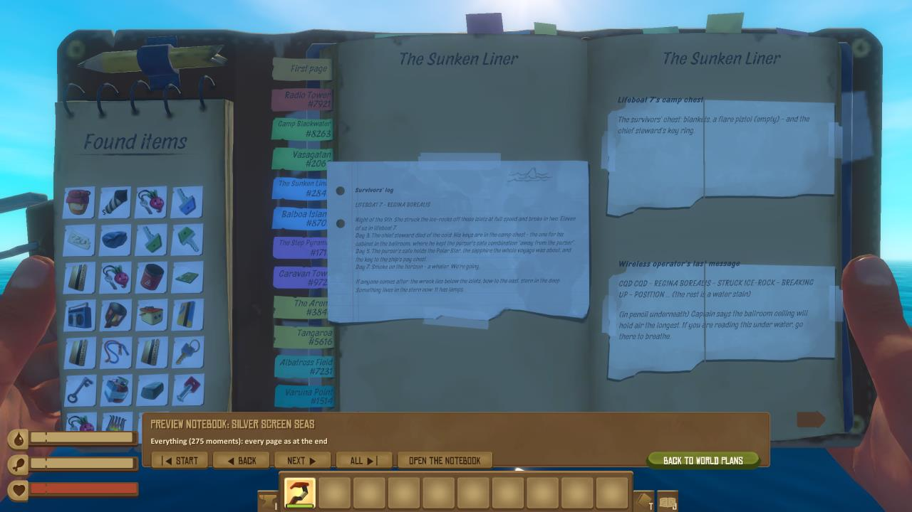
*Silver Screen Seas (Raft's story on): Raft's tabs and the plan's islands in story order - Radio Tower, Camp Blackwater,
Vasagatan, The Sunken Liner, Balboa... (the strip scrolls for the rest). The Sunken Liner's pages: a long note on Raft's
notepad on a page of its own, two shorter ones on the page beside it.*

Raft's own islands are shown as the plan's story has them: an island **left out** or **replaced** has no tab (its pages
go to the back of the book), and with **Raft's story off** none of Raft's tabs show. Everything else of Raft's notebook
is Raft's: its notes, voice lines, quest items and the page you are on (another player turning the page turns it for
everyone, as in Raft).

**The journal (J): side quests.** Islands outside the story - by chance, ordinary rules, side trips - keep everything
in the journal as before: their notes, story items, pages from events and their Receiver frequencies. The journal's
quest list says only how far the main story is ("Main story: 3 of 10 islands done - its quests, notes and items are
in Raft's notebook"); the per cent at the top still counts every quest.

**Saves.** Nothing of the mod goes into Raft's own notebook save: the tabs and pages are made again from the world's
story each time it loads. A world opened without the mod has Raft's own notebook.

### Making a main story: the helper, and Preview notebook

**New main story...** (World plans, next to Templates...) makes a main story step by step: Raft's story on or off,
then your saved islands in the order players meet them - for each, where it sits in Raft's story, its tab colour and
what gives the next coordinates. **Done: make the cards** makes the rule cards (every island on the Receiver, each after the one
before; the first one's coordinates given at the start when Raft's story is off or it comes first) and runs Check. Change the cards as you like after.

**Preview notebook** (World plans, next to Check) shows the plan *as it is in the window* - saved or not - in Raft's
own notebook: the mod goes to the test world (as Test in a world does), opens the book with every tab and page, and a
bar at the bottom steps through the story the way players will meet it: **|◀ Start** (nothing found yet), **◀ Back**,
**Next ▶** ("Saltmarsh Ferry: its coordinates are found", "quest step 3 of 6 done", "'The ferryman's log' is read",
"the next coordinates"...), **All ▶|**. **Back to World Plans** returns to the plan with your changes still there. **Open the notebook** opens the book again after Esc.

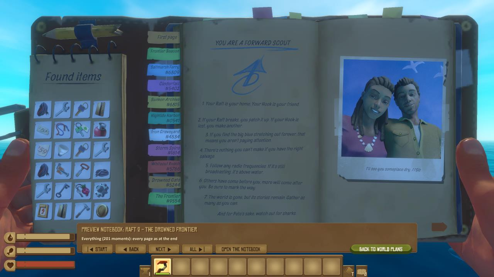
*Preview notebook on "Raft 2 - The Drowned Frontier" (Raft's story off): First page, then the plan's ten islands in
story order, each with its Receiver number; the plan's story items under Found items; the step-through bar below.*

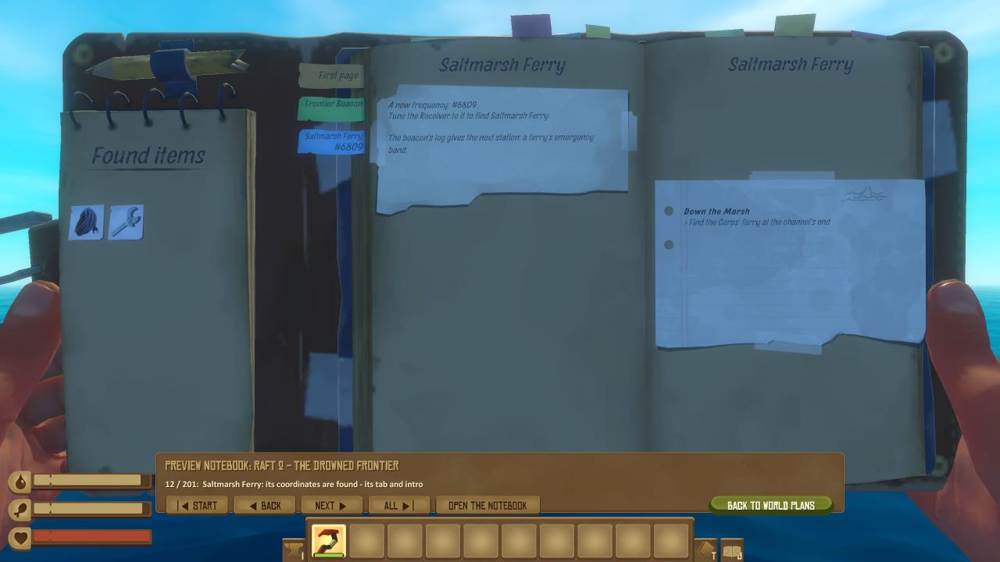
*Stepping through: Saltmarsh Ferry's coordinates are found - its tab, its intro and its quest's first step.*

**Check** warns about the notebook too: a main story island without notes (its tab shows only its intro and steps), a
note too long for its paper (over 1100 letters; a note over 300 gets a page of its own), a story item without a picture, a tab title over 24 letters, a "next coordinates" note that isn't
on the island.

The world option **Story islands in a new order** ([9.4](#94-extra-options)) works the same way for the notebook:
the numbers on Raft's notes follow the world's order.

## 7. World plans: which islands a world gets

A **world plan** decides which custom islands a world gets, **when** they come and **where**. Without a plan, islands
only turn up by chance while you sail. With a plan, you can tell a story: *"When the world starts, put an old camp
ahead of the raft. When its quest is done, bring my island Skull Rock 800 m to the north-east. When players reach Skull
Rock, bring a treasure island near it."*

A plan is a list of **rules**, and each rule brings **one island**. Every rule answers four questions:

| Question | For example |
|---|---|
| **When** does the island come? | the world starts, after sailing 3 km, on day 5, when an island's quest is done, when players reach an island |
| **What** island? | one of your saved islands, a new island of a map type (a camp, a volcano, a wreck...), one from the spawn pool, one of a list |
| **Where** does it go? | ahead of the raft, near another island (how far and which way), on its own Receiver frequency, by chance while sailing |
| **What are players told?** | a message on screen ("Smoke rises from a small island ahead.") and a name on the Receiver |

You make and change plans in the island editor's **World plans** window, and pick one for a world in Raft's **New
Game** box. You don't need to have built any islands yourself: the mod's map types ([4.6](#46-ready-made-islands-map-types))
are enough for a whole plan.

Before you share a plan or change one that running worlds use, see [12.4](#124-making-quests-and-plans-that-work).

### The three kinds of islands you meet at sea

Every custom island that turns up in a world came there in one of **three ways**. When you stand on them they are all
the same - land, objects, maybe a quest - but they are set up in different places, they come at different times, they
behave differently if you sail past them, and only one kind is part of a story. This part explains all three, with
The Long Voyage (a plan of the island library, [16.4](#164-the-world-plans)) as the example, because it has all three
at once.

**The short version:**

- **Random islands** come **by chance** while you sail. Nobody planned them: which island, where and when is rolled
  as you go. A world gets them when its plan has **Random islands while sailing: on** (the plan called *Random islands*,
  the default, has nothing else).
- **Side trips** are islands a **plan** brings at a **set point of the voyage** - "after sailing 4 km, 450 m ahead of
  the raft" - with a message on screen. Every world of that plan gets the same island at the same point. They are
  extras: nothing else in the plan waits for them. In The Long Voyage: **The Stranded Gull** after 2 km, **Signal
  Rock** after 4 km (its quest is called **"Dead Air"**), Ranger's Rest after 7 km, and so on.
- **Main quest islands** are islands a plan puts **into a story chain** - here into Raft's own story, each found with
  the **Receiver** on its own frequency - and the story only goes on when their quest is done. In The Long Voyage:
  **Wreckers' Cove** after Raft's Radio Tower, **Thornwood** after Vasagatan, and five more.

A **quest** belongs to an island, not to the way it came. "Dead Air" is the quest of the island Signal Rock; Signal Rock
would bring its quest along as a random island too. So "a quest island" can be any of the three kinds: what makes an
island a *main* quest island is that a plan's story waits for its quest.

#### The three kinds side by side

| | Random islands | Side trips | Main quest islands |
|---|---|---|---|
| **What it is** | An island picked by chance from the **spawn pool**: one of your saved islands, a brand-new generated island, or a new island of a map type (a sandbar, a wreck, an atoll...) | An island a **plan rule** brings at a set point: after a distance sailed, on a day, when the world starts | An island a **plan rule** puts into a **story chain**: after one of Raft's story islands (or in place of one, or first) |
| **Example in The Long Voyage** | Any island of your pool, a generated jungle island... | The Stranded Gull (2 km), Signal Rock - quest "Dead Air" (4 km), Ranger's Rest (7 km), Stilt Hollow (10 km)... | Wreckers' Cove (after the Radio Tower), Thornwood (after Vasagatan), Scrapyard Haven (after Balboa)... |
| **When it comes** | While the raft sails: one after every 3-6 of Raft's own islands met (the world's span), none in a new world's first 10 minutes, never while the raft is at one of Raft's islands | When the rule's **WHEN** happens. The Long Voyage's side trips: when the raft has sailed that many km in this world (counted from the world's start) | When it is **unlocked** - the story island before it is done (for Raft's islands: when you read the note there that would give the next frequency) - **and** a player tunes the Receiver to its frequency |
| **Where it appears** | 250-350 m ahead of the raft, a little to one side (10-35 degrees), at least 800 m from other custom islands | Where the rule's **WHERE** says. The Long Voyage's side trips: **450 m ahead** of the raft | The rule's metres **ahead of the raft when a player tunes the Receiver** to it (700-1000 m in The Long Voyage), like Raft's own story islands |
| **What tells you** | Nothing when it appears: you see it. Near it, its banner with its name | The rule's **message** on every player's screen as it appears, with how far and which way ("A mast on a rock ahead - its light is dead."), and its name on its Receiver dot | When it is unlocked: a banner with the rule's message and "Tune the Receiver to #4821", a page in the journal (J), and that number on Raft's note. On the Receiver: its name and frequency |
| **The same in every world?** | No: different islands at different places every time | Yes: the same island at the same distance in every world of the plan (only the exact spot ahead depends on where you sail) | Yes: the same island at the same place in the story. Only the 4-digit frequency is made new for each world |
| **Needed to finish the plan?** | No | No: optional extras. Skip them and nothing is missing from the story | **Yes** (in a plan with a story): its quest done unlocks the next step of the story - in The Long Voyage, the next story island's frequency |
| **If you sail past it** | It stays where it appeared. Beyond 800 m it is unloaded and comes back when you return. If you **reached it and its quest isn't done**, it comes back ahead of the raft by itself about 12 minutes later (up to 3 times) | The same as a random island: stays where it appeared; if you reached it and left its quest unfinished, it comes back ahead of the raft about 12 minutes later (up to 3 times). One you never reached doesn't come back | It stays where it came up: its dot on the Receiver shows the way back. It doesn't come back by itself |
| **Where you set it** | The plan's switch **Random islands while sailing** (World plans window); *which* islands: **World settings > Islands while sailing** ([9.5](#95-islands-while-sailing)) and `spawnpool.txt` ([10](#10-settings-files)) | A **rule** in the World plans window: WHEN **After sailing a distance**, BRING **One of my saved islands**, WHERE **Ahead of the raft**, TELL a message and a Receiver name, STORY **Side quest (not in the story)** | A **rule** in the World plans window: WHEN **When the world starts**, BRING **One of my saved islands**, WHERE **On the Receiver**, STORY **After** a story island, **next coordinates when** its quest is done |
| **In the plan file** ([7.7](#77-the-plan-file)) | `random = on` | `rule = signal \| island:Signal Rock \| km:4 \| ahead:450 \| A mast on a rock ahead - its light is dead. \| Signal Rock` | `rule = cove \| island:Wreckers' Cove \| start \| receiver:700 \| Under the Radio Tower's signal hides another... \| Wreckers' Cove \| after:RadioTower \| quest` |

#### Random islands, in detail

**How a world gets them.** In Raft's **New Game** box, **Custom Islands plan** → **Choose plan...** ([2](#2-starting-a-new-world)):

- **Random islands** (the default): *only* random islands, no story of the mod's.
- **No custom islands**: none at all.
- **Any other plan**: random islands only if that plan has **Random islands while sailing: on**. The Long Voyage has it
  on, so you meet random islands *between* its side trips and quest islands; The Abyss Expedition has it off. A plan made for
  a tight story usually has it off: then the world has only the plan's islands.

You switch it for a plan in the editor's **World plans** window: the switch **Random islands while sailing** at the top
of the plan (step 4 of [7.2](#72-your-first-world-plan-step-by-step)); in the plan file it is the line `random = on` or
`random = off`. In a running world the host can switch them with `CustomIslandsAuto on` / `off` (F10).

**Which islands can come.** The **spawn pool**: every island you have saved or downloaded (unless `spawnpool.txt`
gives it weight 0), brand-new generated islands (`generated` in `spawnpool.txt`), and the map types listed there. For
each new world you can untick islands in **World settings > Islands while sailing > CHOOSE ISLANDS...**
([9.5](#95-islands-while-sailing)). A **plan's own islands never come by chance**: when you install a plan from the
island library, its islands get weight 0 in `spawnpool.txt`, so Signal Rock can't turn up early as a random island and
then again at 4 km. (Islands you built or saved yourself are in the pool unless you give them 0 - if a plan of yours
uses one of your islands as a side trip or quest island, set it to 0 there, or untick it in the world's list.)

**How often and where.** One after every **3-6 of Raft's own islands** met (Raft's plain islands - not its story
islands - counted as the raft comes within about a kilometre of them; a new number in the span after each custom
island). The span is the world's: chosen in **World settings > Islands while sailing** ([9.5](#95-islands-while-sailing)),
`WorldIslandsGap` in a world. None in a new world's first **10 minutes** of play (`quietMinutes`; game time, kept with
the world - worlds made before this don't wait). `chancePerKm` only switches them on (above 0) or off (0).
`spawnDistanceMin` / `spawnDistanceMax` (250-350 m ahead), `minSpacing` (800 m between custom islands) - all in
`spawnpool.txt` ([10](#10-settings-files)). A finished island isn't picked again; an unfinished one comes back as it was
([3](#islands-appear-while-you-sail)). None appears while the raft is at one of Raft's own islands, and Raft won't put one of its
islands on top of a custom one later.

#### Side trips, in detail

A side trip is one **rule** of a plan: "bring this island at this point of the voyage, here, and tell the players".
To make one in the **World plans** window ([7.2](#72-your-first-world-plan-step-by-step) shows every click):

1. Open your plan and click **+ Add a rule**. Give it a name, for example `signal`.
2. **WHEN**: choose **After sailing a distance** and type the km, for example `4`. The distance is what the raft has
   sailed in this world since it started (`WorldPlan` in F10 shows it). Other WHENs make side trips too: **On a day**
   (day 5), or **When the world starts** for an island right at the beginning.
3. **BRING**: **One of my saved islands** and pick the island with **▾** (`Signal Rock`). Or **A new island of a map
   type** (`wreck`, `camp`, `sunken`...) for an island made new in every world, or **One island from a list** for a
   different one each time.
4. **WHERE**: **Ahead of the raft** and the metres (`450`). Raft draws about 400 m far, so at 450 m the island is just
   coming into sight. **By chance while sailing** instead makes it come up some time *after* the distance, like a
   random island.
5. **TELL**: the message every player sees when it appears (`A mast on a rock ahead - its light is dead.`) - the mod
   adds how far and which way - and the name on the Receiver (`Signal Rock`). Both are optional, but without a message
   players can't tell it from a random island.
6. **STORY**: leave it on **Side quest (not in the story)**. That is what keeps it a side trip: nothing waits for it,
   and its notes and story items go into the journal (J).
7. **Check**, then **Save**.

As a line of the plan file:

```
rule = signal | island:Signal Rock | km:4 | ahead:450 | A mast on a rock ahead - its light is dead. | Signal Rock
```

Good to know:
- Each rule fires **once per world**. Sail on to 4 km a second time (in the same world) and nothing new comes.
- If the raft is far from where it was when the rule fired, the island is still there: the rule placed it once, ahead
  of the raft at that moment. Its Receiver dot (with the name from TELL) shows it.
- A side trip can have its own quest. If you reach it and leave before the quest is done, it comes back ahead of the
  raft about 12 minutes later, up to three times ([3](#islands-appear-while-you-sail)); `returnMinutes` in
  `spawnpool.txt` changes the minutes (0 = never).
- Another rule can wait for a side trip ("when Signal Rock's quest is done, bring...") - then it is no longer a mere
  extra: the plan waits for it, and it comes back every time until that is done.

#### Main quest islands, in detail

A main quest island is a rule with a **place in a story chain**. The Long Voyage puts one after each of Raft's story
islands; your own plan can also make a story without Raft's ([6.5](#65-your-islands-in-rafts-story-the-receiver):
**Raft's story islands: off** and your islands **First**, **After** each other). To make one in the **World plans**
window:

1. Make sure the plan has **Raft's story islands: on** (the switch at the top), unless your story replaces Raft's.
2. **+ Add a rule**, name it (`cove`).
3. **WHEN**: **When the world starts**. That only means the rule doesn't wait for anything *else*: the **STORY** place
   below decides when the island is unlocked.
4. **BRING**: **One of my saved islands**, pick it with **▾** (`Wreckers' Cove`). It needs a **quest** ([6.1](#61-quests)).
5. **WHERE**: **On the Receiver**, and the metres it comes up ahead of the raft when a player tunes to it (`700`). The
   island gets its own 4-digit frequency, made new for each world.
6. **TELL**: a message (shown when the frequency is unlocked: `Under the Radio Tower's signal hides another: a lantern
   code, blinking over and over.`) and the name on the Receiver (`Wreckers' Cove`).
7. **STORY**: **After** and the story island (**Radio Tower**) - that makes it **main story** (and WHERE stays **On the
   Receiver**: a main story island is always found by its coordinates). **next coordinates when**: **Its quest is done**
   (the default, **Its quest is done (or reached)**, does the same for an island that has a quest).
8. **NOTEBOOK** (it appears for a main story island): a tab title if the island's name is too long, a tab colour, and
   the intro on its first page in Raft's notebook (optional).
9. **Check** shows the whole chain ("Radio Tower > 'cove' > Vasagatan > ..."); **Preview notebook** shows the tab and
   its pages; then **Save**.

As a line of the plan file:

```
rule = cove | island:Wreckers' Cove | start | receiver:700 | Under the Radio Tower's signal hides another: a lantern code, blinking over and over. | Wreckers' Cove | after:RadioTower | quest
```

**What players see, step by step** (The Long Voyage, first quest island):

1. On Raft's **Radio Tower** they read the note that normally gives Vasagatan's frequency. In this world it gives the
   **Wreckers' Cove** frequency instead: a banner says "Tune the Receiver to #4821" (each world has its own number),
   Raft's notebook (T) gets a **Wreckers' Cove #4821** tab after the Radio Tower's, and the note shows the number.
2. A player tunes Raft's **Receiver** to it. Wreckers' Cove comes up about 700 m ahead of the raft, and shows on the
   Receiver with its name.
3. They sail there and do its **quest**: its steps are on the tab's checklist page (crossed out as they are done) and in
   the quest panel while they are at the island; the notes they read there go onto the tab's pages.
4. The quest done, the story goes on: **Vasagatan's** frequency is unlocked ("The Receiver picks up a new frequency:
   #1234") and its tab shows in the notebook, and Raft's story continues as Raft has it - until Vasagatan's note
   unlocks the next quest island, Thornwood.

If you don't do the quest, the story stops there: the next story island's frequency never comes. `StoryChain` (F10)
shows the whole chain, what is unlocked and done, and every frequency.

#### Other ways an island can come

The three above are what you meet in most worlds. A plan or an island can also bring islands in other ways - they work
like side trips (a rule with a WHEN, a WHERE and a message), only the WHEN is something that happens on an island:

- **Quest chains**: "when Old Camp's quest is done, bring Skull Rock 800 m north-east of it" ([7.2](#72-your-first-world-plan-step-by-step),
  [7.4](#74-everything-a-rule-can-do)). The Abyss Expedition is made of these: each island comes **on the Receiver**
  when the one before's quest is done or players reach it. The plan waits for them, so if one drifts out of reach before you've done
  what the plan waits for, it comes back every time.
- **Islands that bring islands**: an island's own rules, made in the editor ([6.4](#64-islands-that-bring-islands)) -
  for example a quest reward that brings a treasure island.
- **The world randomizer's islands** (World settings, [9.3](#93-the-world-randomizer)): oddity islands, large islands
  and boss lairs while sailing - random islands of their own, not from your spawn pool.

#### How to tell them apart in a world

| You see... | It is... |
|---|---|
| An island comes up with **no message**; its Receiver dot has **no name** | A random island (or one of the randomizer's) |
| A **message** on screen as it appears ("A white hull glints on a sandbar ahead.") and a **named** Receiver dot | A plan rule's island: a side trip, or part of a quest chain |
| A banner "**Tune the Receiver to #....**", then the island comes when you tune to it | A main quest island in the story chain |

In F10 (Raft's console):
- `WorldPlan` - the world's plan, whether random islands are on, the km sailed and the day, and **every rule** with
  **[done]** in front of the ones that have brought their island;
- `StoryChain` - the story in order (Raft's islands and the plan's), what is unlocked and done, and the frequencies;
- `ListSpawned` - every custom island in this world, with how far it is from the raft.

#### The Long Voyage from start to end

| When | What comes | Kind |
|---|---|---|
| From the start, all voyage long | Now and then an island of your spawn pool | Random island |
| 2 km sailed | **The Stranded Gull**, 450 m ahead: "A white hull glints on a sandbar ahead." | Side trip |
| 4 km | **Signal Rock** (quest "Dead Air"): "A mast on a rock ahead - its light is dead." | Side trip |
| After the Radio Tower's note | **Wreckers' Cove** on the Receiver | Main quest island |
| 7 km | **Ranger's Rest** | Side trip |
| After the Cove's quest | Vasagatan's frequency, as Raft has it | Raft's story |
| After Vasagatan's note | **Thornwood** on the Receiver | Main quest island |
| 10, 13, 16 km | **Stilt Hollow**, **Mayor's Wharf**, **Crane Yard** | Side trips |
| ... | the same after Balboa, Caravan Town, Tangaroa, Varuna Point and Temperance | Main quest islands |
| 20, 24, 28, 32 km | **Frost Hollow**, **Tide Farm**, **Old Mine Islet**, **Shelter Atoll** | Side trips |
| After Temperance's quest island | Utopia, Raft's ending | Raft's story |

The side trips come by distance and the quest islands by the story, so where they fall between each other depends on
how fast you sail and play: a quick player may reach Vasagatan before 7 km, a slow one may have met five side trips
by then. [16.4](#164-the-world-plans) lists every island of the plan.

#### Questions

- **"An island appeared - is it random or part of the plan?"** Look for a message when it appeared and a name on its
  Receiver dot (the table above), or type `WorldPlan` in F10: a plan island's rule is marked **[done]**.
- **"Do I have to do the side trips?"** No. They are there to explore; the story never waits for them.
- **"I sailed past a side trip - is it gone?"** It stays where it came up (its Receiver dot shows where). If you had
  reached it and its quest wasn't done, it comes back ahead of the raft by itself after about 12 minutes, up to three
  times. One you never reached stays where it is.
- **"A quest island drifted away before I finished it."** Main quest islands stay where they came up - follow
  their dot on the Receiver, which shows the way and the distance. Islands a plan waits for in other ways come back by themselves until you've done
  what the plan waits for ([3](#islands-appear-while-you-sail)).
- **"Can I have only the plan's islands, no random ones?"** Yes: in your own plan, set **Random islands while sailing**
  to off. For a plan someone else made, make a copy (**Copy...** in World plans) and switch it off there, or untick
  every island in **World settings > Islands while sailing** for that world.
- **"Can a random island be one of the plan's islands?"** Not for a plan installed from the library (its islands have
  weight 0 in `spawnpool.txt`). For your own plan with your own islands, give them 0 in `spawnpool.txt` or untick them
  in the world's list, or they can turn up by chance too.
- **"Where do I change the km, the message, or which island?"** In the editor: **World plans**, open the plan, change
  the rule's card, **Save**. A world already playing that plan gets the change the next time it loads; rules that have
  already fired stay done.

### 7.1 The plans that come with the mod

Choose one in the New Game box (**Custom Islands plan**), or open it in World plans to see how it's made:

| Plan | What happens |
|---|---|
| **Random islands** (the default) | Islands turn up by chance while you sail ([section 3](#3-sailing-custom-islands-in-your-world)). No story |
| **No custom islands** | Plain Raft: no custom islands at all (the World settings still apply) |
| **Island hopping** | An old camp near the start; each island you reach shows the way to the next, further out |
| **Adventure** | A story: each quest leads to the next island (a camp, islets, a beast's plateau, a treasure), with a wreck and a sunken island on the way |
| **Growing sea** | Random islands, plus a special island every few km and days |
| **Receiver adventure** | A new adventure instead of Raft's story: each island is found with the Receiver, and its quest gives the next frequency |

**Island hopping**, **Adventure**, **Growing sea** and **Receiver adventure** are ordinary plan files: open one in World
plans and use **Copy...** to start your own plan from it.

### 7.2 Your first world plan, step by step

This walkthrough makes a plan called **Castaway trail** with four islands. It uses map types, so it works even if you
haven't built an island yet. Step 6 shows where to use one of your own islands instead.


*The World plans window with the Adventure plan open: the plan's buttons and switches at the top, one card per rule
(WHEN, BRING, WHERE, TELL, STORY), the map on the right, and + Add a rule, Check and Save at the bottom.*

**1. Open the World plans window.** In Raft's main menu click **EDITOR** and wait for the loading box to finish. In the
editor's top bar, click **World plans** (top right).

**Help while you work:** every part of the window has a small **?** next to it. Hover it (or click it) and a note
explains that part: what each choice of **WHEN**, **BRING** and **WHERE** means, what Check looks for, and so on. The green
**Help** button at the top right shows the steps below in short, with buttons that open this guide (the PDF, or this
section online).


*Hovering the ? after **When**: every choice it has, in a few words.*


*Help: how to make a plan, in eight steps, and the guide's buttons.*

**2. Start a new plan.** Click **New...**, type a name (`Castaway trail`) and press **Enter** (or **OK**). The window
now shows your empty plan: "No rules yet". The name is also the plan's file name, so it can't be the name of a plan you
already have.

**3. Describe it.** Click the long field under the switches and write one line about the plan, for example
`Follow a castaway's trail across four islands`. Players see it when they choose the plan in the New Game box.

**4. Set the two switches.**
- **Random islands while sailing: on / off.** On: islands from your spawn pool *also* turn up by chance, between your
  plan's islands. Off: the world has only the plan's islands. For a story, **off** is usually best - click it.
- **Raft's story islands: on / off.** On (the default): Raft's own story (Radio Tower, Vasagatan, ... Utopia) is still in
  the world, next to your islands. Off: your plan is the whole adventure. Leave it **on** for now; [6.5](#65-your-islands-in-rafts-story-the-receiver)
  explains the story row.

**5. The first island: an old camp when the world starts.** Click **+ Add a rule** (bottom left). A card appears with
one section per question ([7.3](#73-a-rule-card-part-by-part)). Each section has a **▼ list**: click it and pick a choice -
each choice says in a line what it does. Fill the card in:
- **Name** (top of the card, for example `rule1kqx`): type `camp`. The name is how other rules say "the camp".
- **WHEN**: it already says **When the world starts**.
- **BRING**: pick **A new island of a map type**, then click **▾** after the **map type** field and pick **Old camp** (or
  type `camp`).
- **WHERE**: it already says **Ahead of the raft**. Set the metres to `350`.
- **TELL**: the message `Smoke rises from a small island ahead.`, and **on the Receiver** `Old camp`.

The sentence at the top of the card now reads: *When the world starts: bring a new old camp, 350 m ahead of the raft.*
Read it after every change: it says in plain words what the rule will do. Under each section, a line in italics explains
the choice you made.

**6. The second island: your own island, when the camp's quest is done.** Click **+ Add a rule** again. A new rule
already waits for the rule before it: **WHEN** **When a quest is done**, island `camp`; **WHERE** **Near an island**,
600 m. Fill in:
- **Name**: `cove`.
- **BRING**: pick **One of my saved islands**, then **▾** and one of your islands (for example **Skull Rock** from
  [4.8](#48-your-first-island-step-by-step)). No island of your own yet? Leave it on **A new island of a map type** and
  choose **Tropical island**.
- **WHERE**: **Near an island**, `800` metres, and in the direction list **North-east**. The field after **of** can stay
  empty: then it means "the island where the WHEN happened", the camp. (You can also type `camp` there, or pick it with
  the **▾** after the field.)
- **TELL**: `The camp's notes speak of a cove to the north-east.`, on the Receiver `Cove`.

The camp's map type has a quest (the notice board). "When a quest is done" at an island that has no quest never fires -
use **When players reach an island** for those (next step).

**7. The third island: a treasure island when players reach the cove.** **+ Add a rule**, then:
- **Name**: `treasure`.
- **WHEN**: **When players reach an island**, then the **▾** after the **island** field and pick `cove` (or type it).
  The list has the plan's other rules and your saved islands, and says which have a quest.
- **BRING**: **A new island of a map type** → **▾** → **Treasure island**.
- **WHERE**: **Near an island**, `900` metres, **Any way**, of `cove`.
- **TELL**: `From the cliffs you spot another island.`, on the Receiver `Treasure`.

**8. A fourth island on the way: a wreck after 3 km.** Not every rule has to follow another. **+ Add a rule**, then:
- **Name**: `wreck`; **WHEN**: **After sailing a distance**, type `3` (km);
- **BRING**: **A new island of a map type** → **Wreck**;
- **WHERE**: **Ahead of the raft**, `300` metres; **TELL**: `Something floats ahead: a wrecked raft.`

**9. Check the plan.** Click **Check**. The box under the map says **√ Every rule can work.**, or lists what's wrong
(see [7.5](#75-check-finding-and-fixing-problems)). The map on the right sketches where the islands will go.

**10. Save.** Click **Save**. The bottom of the screen says `Saved plan 'Castaway trail' (4 rules)`. Always save before
you click **Close**: Close throws away changes since the last save.

**11. Play it.** Go back to the main menu (**MAIN MENU**, top right) → **NEW WORLD**. At the bottom right, click the
**Choose plan...** under Custom Islands plan, pick **Castaway trail** and **Select**, then click Raft's **Create**. In the world:
- the old camp is 350 m ahead of the raft right away, with the message on screen and "Old camp" on your Receiver;
- finish the camp's quest (the quest panel shows its steps) and the cove comes 800 m to the north-east;
- sail to the cove: when you reach it, the treasure island appears near it;
- after 3 km of sailing, the wreck comes up ahead, whatever else you're doing.

Press **F10** and type `WorldPlan` to see the world's plan and which rules have fired.

**12. Change it later.** Open **World plans**, click the **Plan** button at the top left and pick your plan. Change
what you want, **Save**. New worlds get the new version. A world that already uses the plan gets it the next time you load
it on your PC; rules that already happened stay done ([7.6](#76-playing-changing-and-sharing-a-plan)).

The finished plan as its file (`Mods\DynamicIslands\plans\Castaway trail.plan`, see [7.7](#77-the-plan-file)):

```
description = Follow a castaway's trail across four islands
random = off
story = on

rule = camp | type:camp | start | ahead:350 | Smoke rises from a small island ahead. | Old camp
rule = cove | island:Skull Rock | quest:camp | near:camp:800:north-east | The camp's notes speak of a cove to the north-east. | Cove
rule = treasure | type:treasure | visit:cove | near:cove:900:any | From the cliffs you spot another island. | Treasure
rule = wreck | type:wreck | km:3 | ahead:300 | Something floats ahead: a wrecked raft.
```

**Short cut: Templates...** (top right) adds a ready-made set of rules to the open plan: the four sample plans, and
**Detour in Raft's story**, **Balboa replaced**, **Sky chain** (flying islands, each appearing when players reach the one
before), **Story chain** (three of your islands, each quest bringing the next: pick your islands with **▾**) and **Quest
reward island**. Then change what you like. An id that's already in your plan gets a `b` added.

### 7.3 A rule card, part by part


*A rule card of the Adventure plan: its name and what it does in a sentence, then one section per question. Each section
has a ▼ list of its choices and a line in italics saying what the chosen one does.*


*The **BRING** list open: every choice, each with what it does. The chosen one is lit; click another to change it (Esc
or a click outside closes the list).*

| Part | What it does |
|---|---|
| **RULE 1** and **Name** | The rule's number and name (`camp`, `beast`). Other rules point at the island it brought with this name. Each name once per plan; no `\|`, `:`, `,` or `;` (they are taken out) |
| **▲ ▼ Remove** | Move the rule up or down in the list (the order only matters for reading: each rule waits for its own WHEN), or remove it |
| **The sentence** | Under the name: the rule in plain words. If it doesn't say what you meant, change the card |
| **WHEN** | What the rule waits for - a ▼ list of nine choices ([7.4](#74-everything-a-rule-can-do)). A choice that needs more shows named fields after it: **island**, **zone**, **signal**, **steps**, **day**, **km sailed**, **rule** |
| **BRING** | What kind of island: a new island of a map type, one of your saved islands, one island from a list, or a random one from the spawn pool. The field after it says which (**map type**, **island**, **islands**) |
| **WHERE** | Ahead of the raft, near an island, on the Receiver, or by chance while sailing; then the **metres** (50 to 5000). For "near an island", also the **direction** (a ▼ list: Any way, North, North-east...) and **of** which island (empty = the island where the WHEN happened) |
| **TELL** | The message every player sees when the island appears (up to 160 letters) (with how far and which way it is), and the island's name **on the Receiver** (up to 18 letters). Both optional |
| **STORY** | World plans only: **side quest** (the journal) or **main story** (Raft's notebook) - the island's place in the story (a ▼ list: side quest, main story first, after or in place of one of Raft's story islands, or beside Raft's story) and, for the main story, **next coordinates when** ([6.5](#65-your-islands-in-rafts-story-the-receiver)). A main story island's WHERE is always **On the Receiver** |
| **NOTEBOOK** | Main story only: the island's **tab title**, **tab colour** (Raft's nine) and the **first page** intro in Raft's notebook |
| **THE END** | Under the rules, when the plan has a main story: the last page of the story in Raft's notebook (optional) |
| **The lines in italics** | Under each section: what the chosen option does, with the numbers and names you gave. For a map type, what kind of island it makes |
| **?** | At the end of each section: hover it for every choice of that section in a few words |

**The ▾ lists.** A field that names something has a **▾** after it: the island a rule waits for, the zone, signal or quest
step on that island, the island to put it near, the map type or saved island to bring, and a story rule's "done when"
zone, signal, step or note. It lists what exists, so there is nothing to misspell: the plan's rules (with what they bring),
your saved islands (with "quest, 4 steps" or "no quest"), and the zones, signals and quest steps saved in that island's
file. Picking one fills the field; typing still works. A new map-type island is only made in the world, so its zones and
signals can't be listed: its list is empty and says so - type the name.


*The ▾ after the zone of "When a trigger zone fires" lists the zones of the island the rule waits for (here the saved island "shrine").*

### 7.4 Everything a rule can do

**When** the island comes. "Island" below means a rule's id (the island that rule brought) or the name of an island:

| When | Needs | The island comes... |
|---|---|---|
| **When the world starts** | - | as soon as the world starts |
| **After sailing a distance** | km | when the raft has sailed that far in this world |
| **On a day** | a day | on that in-game day |
| **When a quest is done** | an island | when that island's quest is done. The island must have a quest ([6.1](#61-quests)) |
| **When quest steps are done** | an island, steps | when that many steps of its quest are done |
| **When a trigger zone fires** | an island, a zone name | when a player walks into that trigger zone on it ([5.4](#54-trigger-zones-and-ambushes)) |
| **When players reach an island** | an island | when a player first comes to that island |
| **Right after another rule** | a rule's name | right after that rule's island has come |
| **When a signal is sent** | an island, a signal name | when an object on that island sends that signal (a **send a signal** action, [6.2](#62-behaviour-and-events)) |

**What** it brings:

| Bring | Which one | Good to know |
|---|---|---|
| **One of my saved islands** | one of your islands (`.island` files) | Every player gets it from the host; only the host needs the file |
| **A new island of a map type** | a map type: `random`, `sandbar`, `atoll`, `archipelago`, `stacks`, `boss`, `volcano`, `swamp`, `spire`, `treasure`, `camp`, `sunken`, `sky`, `wreck`, `ghostraft`, the styles `tropical`, `snowy`, `desert`, `forest`, `volcanic`, and the randomizer's `oddity` (or one kind: `van`, `caravan`, `planecrash`, `boatwreck`, `shack`, `statue`, `rocket`, `hut`), `large`, `lair` | A new island is made for the world, different in every world. No file needed, so it always works when shared |
| **A random island (spawn pool)** | - | A random island of the spawn pool, as random islands are: one of your islands, a new generated island or a map type listed there (`spawnpool.txt`, [10](#10-settings-files)) |
| **One island from a list** | island names, separated by commas | One of them is picked, ones not in the world yet first |

**Where** it goes:

| Where | Metres mean | Good to know |
|---|---|---|
| **Ahead of the raft** | how far ahead | The simplest: players can't miss it |
| **Near an island** | centre to centre from that island | With a direction and an island (**of**). If **WHEN** has no island (the world starts, a distance, a day, another rule), you must name one in **of** |
| **On the Receiver** | how far ahead it comes when tuned | It gets its own 4-digit frequency; it comes when a player tunes Raft's Receiver to it ([6.5](#65-your-islands-in-rafts-story-the-receiver)) |
| **By chance while sailing** | how far ahead | Comes up ahead after 0.3 to 1.8 km more of sailing once the rule fires, like a random island |

**Ideas to start from:**
- **A quest chain:** each island's rule waits for **When a quest is done** at the island before it, **Near an island** of it. Players
  follow the story from island to island. (Every island except the last needs a quest.)
- **Explore to find more:** **When players reach an island** instead of **When a quest is done**, for islands without quests.
- **Timed surprises:** **After sailing a distance** or **On a day** with **Ahead of the raft**, between the story's islands.
- **A secret:** a trigger zone in a cave (**When a trigger zone fires**) or a lever that sends a signal (**When a signal is sent**) brings a
  hidden island.
- **Something different every time:** **One island from a list** with a few of your islands, or a map type `random`.
- **Found by radio:** **On the Receiver**, with the message telling players the island is out there.

### 7.5 Check: finding and fixing problems

Click **Check** any time. It goes through the plan the way a world will play it, and looks **inside the islands** too:
each island's quest step by step (is there a zone, a note, a chest or creatures with the name each step needs?), its
trigger zones and signals, and - for new islands of a map type - a sample island of that type. Then a report opens:


*Check's report: each finding with its level, the rule it is about, why, how to fix it, and **Show rule** to go to its card.*

- **Problem** (red): the rule can't work - it never brings its island. Fix these first.
- **Warning** (yellow): it may not work as you mean (for example it waits for an island no rule of the plan brings).
- **Tip** (blue): good to know (no message, very far away, Raft's story...).

After the first Check, every card shows its own problems and warnings in red and yellow under its sentence, and they
follow as you change the plan. The box under the map sums up. **Save** checks too, and opens the report when there is a
problem. The report's **Check again** checks after you changed something.

What Check looks for:

| | Problems (it can't work) | Warnings and tips |
|---|---|---|
| **Names** | a rule with no name, two rules with the same name | a rule named like a rule on one of the islands the plan brings (what waits for that name may take the other's island) |
| **WHEN** | no number for a distance or a day; a quest wait at an island **without a quest**; a quest that **can't be finished** (a step needs a zone, note, chest or creatures the island hasn't, or more pages than it gives - a note gives a page only when it has text); more steps than the quest has; a **zone** or **signal** the island hasn't (Check lists the ones it has); an island or rule name that doesn't exist; a rule that waits for itself; **rules that wait for each other in a circle** | waits for a saved island **no rule of the plan brings** (a problem when random islands are off); waits for a rule that has a problem; needs more creatures than the island has (and they don't come back - by default they do, after the regrow days); creatures Raft leaves out of a game mode (screechers and puffer fish: none in Creative); a story item nothing on the island gives; a distance over 30 km or a day after 20 (slow to test), or 0 (it comes at once) |
| **BRING** | no island chosen, an island that isn't saved, a map type that doesn't exist, a list with no saved island, an empty spawn pool | some islands of a list aren't saved; a very big island (over 12 000 objects); the same island brought twice |
| **WHERE** | near an island nobody has; near "the island where it happened" when the WHEN happens at no island; near its own island | near a saved island no rule brings; near a rule it doesn't wait for (it waits until that island is there); very far away |
| **TELL** | | no message; found by Receiver but no Receiver name |
| **STORY** | its "next coordinates when" can't happen (as WHEN above, also a note number the island hasn't); after Utopia while Utopia ends the story (it never counts as done); a **main story island not on the Receiver** (it has no coordinates) | after an island that isn't in the story; Raft's story order and missing blueprints; **notebook:** a main story island without notes, a note over 1100 letters, a story item without a picture, a long tab title |
| **The plan** | no rules, random islands off and Raft's story off (a world gets nothing); an island's own rules using the story or the Receiver | nothing comes by itself (every rule waits for another island) |
| **Raft's blueprints** | | a blueprint that lies on one of Raft's story islands (the steering wheel, the engine's parts, the machete, the electric purifier, the titanium tools... 23 in all) that the plan **never gives** - its story island left out or replaced, and none of the plan's islands giving it as a reward, in a chest or from a note: the player could never build it. A tip lists which of the plan's islands give which blueprints, in the plan's order - a world plan is an adventure where the player unlocks more and more |
| **Quest traps** | | a later step's chest or animals there from the start (not "Hidden until shown"); story items given again (a zone that fires again, a chest that fills up, animals that come back); show/hide or open/close in an event that happens again (it flips back); has / uses up Raft items on the quest-done or a defeat event (they fire on the host: left out); "give items" on a note (only the first reader) - each with its fix ([12.4](#124-making-quests-and-plans-that-work)) |
| **Story items in order** | | an island with a lock (a keycard door, a locked chest...) that wants a story item - one of Raft's quest items like the Tangaroa keycard, or the island's own - which no island of the plan gives, or only an island of a later rule: players reach the lock without the key |

Check can't play the quests for you. Test your plan: create a world with it and play it through (F10 → `WorldPlan`
shows which rules have fired). A map type's island is made new in each world, so Check looks at a sample of it: its
names are the same every time, its exact places aren't.

### 7.6 Playing, changing and sharing a plan

- **Test this plan** (World plans, next to Preview notebook) saves the plan and makes a new world with it, a test world
  "Plan test <time>": its islands come as in any world. **Esc → Custom Islands → Back to the editor** brings you
  back to World plans on the plan (the test world stays under Load; delete old ones there).
- **Choose it** in the New Game box: **Choose plan...**, pick your plan and **Select** (**View the plan...** under
  it shows what the plan does: its description, Raft's story, each island and when it comes), then **Create**. The
  next new world starts on **Random islands** again (or the `defaultPlan` of `spawnpool.txt`). In a running world, the host can give it another plan: **Esc → CUSTOM
  ISLANDS → Plan** (a list of the plans; its islands come from now on, what is done or unlocked stays), or F10 →
  `WorldPlan <name>`; `WorldPlan` on its own shows the plan and which rules have fired.
- **Multiplayer:** only the host needs the plan and its islands. Players who join get every island as it appears
  ([section 8](#8-playing-together)).
- **The plan decides islands only.** Monster difficulty, build cost, the level up system, the randomizer and the extra
  options are chosen in World settings for each world, whatever plan it has ([section 9](#9-world-settings-rules-and-extra-systems)).
- **Copy...** saves the plan under another name. **Delete** moves the plan file to `Mods\DynamicIslands\deleted\plans` (it doesn't ask - move it
  back from there to undo); worlds that use it keep their own copy.
- **Share it:** **Export...** makes a pack (`.zip`) with the plan and every saved island it needs, to send to a friend
  or to put in the island library; **Import...** installs a pack someone sent you ([4.7](#47-saving-and-sharing)).
  Map type islands need no file, so a plan made only of map types always works for everyone.

**A world keeps its own copy of its plan.** When a world starts, the plan's rules are saved with the world:
- **you edit your plan** (in World plans, on the PC of the player who made the world): the next time the world loads,
  the changed plan plays - rules that already happened stay done, new ones come - and you're told so;
- deleting the plan file, an **update** of a library or pack plan, or **another player** hosting the world with a
  different plan of the same name never changes the world: it plays its own copy (to give a running world another
  plan on purpose, pick it under **Esc → CUSTOM ISLANDS → Plan**, or use `WorldPlan <name>` in it);
- the world's plan goes along when someone else hosts the world later ([section 8](#8-playing-together)), even if they
  never had the plan;
- worlds saved before this version get their copy the next time they're saved on a PC that has the plan file.

A plan can only bring islands that are on the host's PC. If one is missing, the host sees which island and where it
came from (the pack or library entry, or "ask the player who made this world"), and the rule waits until the island is
there. If there is no room for a rule's island, it keeps trying, looks further out after a few tries, and the host is told once.

### 7.7 The plan file

Plans are text files in `Mods\DynamicIslands\plans\<name>.plan`. The World plans window writes them for you, but you
can also open one in a text editor (the file starts with a short help). One `rule =` line per rule, its parts
separated by `|`:

```
rule = id | what | when | where | message | Receiver name
```

| Part | Written as |
|---|---|
| what | `island:<saved island>`, `type:<map type>`, `pool`, `oneof:<island>, <island>, ...` |
| when | `start`, `km:<km>`, `day:<day>`, `quest:<island>` (`quest:<island>:2` for its quest 2), `step:<island>:<steps>`, `zone:<island>:<zone>`, `visit:<island>`, `rule:<rule id>`, `signal:<island>:<signal>` |
| where | `ahead:<m>`, `near:<island>:<m>:<direction>`, `receiver:<m>`, `sailing:<m>`. In `near`, `self` = the island where the WHEN happened (the window writes it when **of** is empty); the direction can also be degrees |

Two more parts put an island into the main story: `| first` / `after:<story island or rule id>` / `instead:<story island>` / `beside`
and when it's done: `quest`, `visit`, `step:<n>`, `zone:<zone>`, `signal:<signal>`, `note:<note number>` (empty: its quest, or reaching it). Three more parts style its notebook tab: `| tab title | tab colour | tab intro`. Other lines: `description = ...`, `storyending = ...` (the last page; `\n` = a new line),
`random = on/off` (no line: off), `story = on/off`, `storyleaveout = Balboa, Tangaroa`. Lines this version can't read are kept as they are. Save the file; the World plans window and the New Game box read it the
next time they open.

## 8. Playing together

Up to eight players (Raft's maximum). **Every player needs the mod.**

- **The host decides, for everyone:** the islands, the plan, the World settings (world rules, randomizer, extra
  options, which islands turn up while sailing; [section 9](#9-world-settings-rules-and-extra-systems)), and the host's
  `spawnpool.txt` settings that change what players see (Receiver dots, unload distance) and the world's regrow days. A player's own
  files and last New Game choices never change the host's world, and only the host can change its settings.
- **Players who join** (or join again, or after a restart) get all of it: the islands and any island files they don't
  have, what was chopped, picked, looted and fired, doors and levers, quests, the crew's journal, where they stood on
  an island, and the tough animals' health.
- **Shared:** harvesting and pickups, chests (when several players open one at the same moment, the first gets it),
  zones, doors, quests and their rewards, story items, the journal. Things that move follow a clock all players share,
  so everyone sees them in the same place.
- **What grows back** is the host's decision: things come back when the island loads on the host after the regrow
  days; a player who has the island loaded sees it the next time it loads there.
- **Joining:** use Steam's "Join Game" on a friend (Raft's own Join World list is empty in this Raft version).
- **Someone else hosts next time:** Raft keeps the world on the host's PC. Copy its folder (`%USERPROFILE%\AppData\LocalLow\Redbeet
  Interactive\Raft\User\User_<Steam id>\World\<world name>`) to the new host's PC, into their own `User_<Steam id>\World`. The custom
  islands, what was used, quests, the journal, everyone's levels, the world's rules and its plan come along: the folder carries
  the mod's copy (`CustomIslands.txt`), and every player who joined keeps one too. Islands you only have from joining are used
  from their downloaded copies. Islands the plan hasn't brought yet are the one thing the new host may not have - see the
  table below.
- **Levels** (with the level up system on): each player's own, kept by the host and back when they join again; the
  host works out everyone's EXP, and each player sees the others' levels under their names.

**Before you swap hosts:** read [12.1 Playing together over several days](#121-playing-together-over-several-days) -
which copy of the world to host from, the same mod version for everyone, the PC clock, and what not to do.

### Who needs what: every case

Only **the host's** islands, plan and settings count in a game. Players who join need **the mod, nothing else**: no
islands, no plans, no packs. What they're sent is kept on their PC (islands as `<name>_<code>`), which is what lets
them host the world later.

| Case | What happens | What anyone has to do |
|---|---|---|
| **A hosts, B joins** (any number of players, joining and leaving any time) | B gets every island that has appeared, with what was chopped, looted and fired, the quests, the journal, levels and settings - also after leaving and joining again, or a crash | Nothing |
| **A adds islands while B plays** (a plan's rule, a random island, a spawned one) | B gets each new island as it appears | Nothing |
| **B hosts A's saved world later**, A joins | B uses the world's own copy (it comes in Raft's world folder, and B kept one while playing): the islands that appeared (from what B was sent), what was used, quests, journal, levels, World settings, and the **plan** | Copy the world folder to B (below). If the plan still has islands to bring that never appeared, B doesn't have them: B sees which ones. A exports the plan (4.7) and B imports it, or B gets it from the island library |
| **A world made from a pack or library plan** hosted by someone who never installed it | As above; the message names the pack or library entry | Install that pack or entry |
| **A world saved before worlds kept their plan** (older versions), hosted by someone without the plan file | The plan's remaining rules can't run: the host is told when the world loads | The first host saves the world once with this version (the plan is then in the world), or gives the plan file |
| **The world's maker edits the plan** while worlds use it | The next time such a world loads on their PC, it plays the changed plan (they're told) | Nothing |
| **The plan is updated (library or pack) or deleted**, or another player hosts with a different plan of the same name | Worlds already started keep their own copy | Nothing (`WorldPlan <name>` in a world to switch it on purpose) |
| **An older save of the world is loaded** (Raft's Load Game box keeps the last 8 saves) | The custom islands, what was chopped, looted and fired, quests, journal and settings go back to that save as well | Nothing |
| **An installed island is updated** while a world uses it | That world gets the new one when its objects keep their order; else it keeps the version it started with (new worlds get the new one) | Nothing |
| **You remove a pack** that a saved world uses | What the world uses is kept (you're told which world) | Nothing |
| **A pack's island has the name of one of yours** | Installed as `Name (Pack title)`; yours is untouched | Nothing |
| **A pack was made with a newer mod version** | A warning; "Install anyway" may leave out what this version doesn't know | Update the mod if something's missing |
| **An island downloaded or imported later**, in a world with random islands | Only turns up if you allowed it (import) - also in worlds already started; a plan's islands never do | Untick it for a new world in World settings (9.5) |
| **Different players have different islands with the same name** | The host's is used; others get the host's as a copy and keep their own | Nothing |

**Moving a world to another host:** Raft keeps the world on the host's PC in `%USERPROFILE%\AppData\LocalLow\Redbeet
Interactive\Raft\User\User_<Steam id>\World\<world name>`. Copy that folder into the new host's own `User_<Steam
id>\World`. It carries the mod's copy of the world (`CustomIslands.txt`), so the custom islands, the plan, what was used,
quests, the journal, levels and settings all come along.

---

## 9. World settings: rules and extra systems

Everything in this section is **optional and separate from island building**: switches that change how a whole world
plays, for players who know Raft well and want it different. None of them is needed to make or meet custom islands, and
a world where they are all left alone plays as plain Raft plus your islands.

- **World rules** (9.2): tougher or softer monsters, a dearer build menu.
- **World randomizer** (9.3): a normal Raft world made different every time: colours, alphas, finds, odd islands, bosses.
- **Extra options** (9.4): scrambled blueprints, the story islands in a new order, ghost rafts, private storages.
- **Islands while sailing** (9.5): which of your islands a world may meet.
- **The level up system** (9.6): EXP and stat points - a switch in the window, or an island made with it.

All of them belong to the world: chosen when it is created, saved with it, the same for every player (the host's), and
they come along when the world moves to another host ([section 8](#8-playing-together)).

### 9.1 The World settings window

Everything else the mod lets you choose for a new world is in one window, in four groups. Each part has a **?** or
an explanation. **Raft's own** puts every setting back to plain Raft; **Defaults...** opens this PC's `spawnpool.txt` settings ([section 10](#10-settings-files)); **Done** closes the window.


*The World settings window: the world rules and the world randomizer on the left, the extra options on the right.*

| Group | What it does |
|---|---|
| **World rules: monster difficulty** | How tough monsters are in this world: Timid, Normal, Fierce, Savage or Nightmare (see [section 9.2](#92-world-rules-monster-difficulty-and-build-cost)) |
| **World rules: build cost** | How many more materials the build menu costs: Raft's own up to +100 %, rounded (never below Raft's own) |
| **World randomizer** | A normal Raft world made different: a ▼ list with Off, Light, Normal or Wild (each says what it means), and which parts take part (lit parts are on: click a part to switch it off; see [section 9.3](#93-the-world-randomizer)) |
| **Extra options** | More ways to play Raft again, for players who know it by heart: each switched **ON** or off with its own button (below) |
| **Islands while sailing** | Which of your islands (and which kinds of new islands) turn up by chance while you sail in this world: **CHOOSE ISLANDS...** opens the list (below) |

**Raft's own** sets monsters to Normal, the build cost to Raft's own, the randomizer to Off and every extra option to
off, the level up system too (it leaves the island list alone). The line at the bottom of the window sums up what the world will get. Nothing is
final until you click **Create** in the New Game box.

**In a world:** press **Esc → Custom Islands** (a button in Raft's pause menu). The world's own settings window
opens: monster difficulty, build cost, the world randomizer, the extra options, the level up system and the islands
while sailing, plus the world's plan and story, and **the islands in this world** - nearest first, how far and which
way, and how far their quest has come. The **host** changes them there, and every player gets the change at
once. Players who joined see the host's settings, greyed out. (While you try an island from the editor, the same
window has **Back to the editor**, [4.9](#49-trying-the-island-in-a-world-test).)


*Esc → Custom Islands in a world: the same groups as the World settings window, changed for this world.*

The host can also change every group with a console command (F10):

| Group | Show it | Change it (host) |
|---|---|---|
| Monster difficulty | `Monsters` | `Monsters savage` |
| Build cost | `BuildCost` | `BuildCost 25` |
| World randomizer | `Randomizer` | `Randomizer wild`, `Randomizer -alphas +bosses` |
| Extra options | `WorldOptions` | `WorldOptions +ghostrafts -privatestorage` |
| Islands while sailing | `WorldIslands` | `WorldIslands -<island>`, `WorldIslands +<island>`, `WorldIslands all` |
| How often they come | `WorldIslandsGap` | `WorldIslandsGap 5-12` |

### 9.2 World rules: monster difficulty and build cost

#### Monster difficulty

| Level | Monsters' health | Damage they deal to players |
|---|---|---|
| **Timid** | ×0.75 | ×0.75 |
| **Normal** | ×1 (as Raft made them) | ×1 |
| **Fierce** | ×1.25 | ×1.25 |
| **Savage** | ×1.5 | ×1.5 |
| **Nightmare** | ×2 | ×2 |

Monsters are the animals that fight players, on Raft's islands and custom ones: sharks, warthogs, bears, polar bears,
screechers, puffer fish, rats, hyenas, bees, angler fish and the bosses. Left as Raft has them: puffer
fish damage, and everything about Bruce and your raft (his bites on it, how often he comes, how soon he comes back).
In Peaceful monsters leave you alone (only Raft's Varuna Point and Utopia bosses still fight), and in Creative nothing can hurt you, so there mostly their health changes.

#### Build cost

Everything in the **build menu** (the hammer's foundations, floors, walls, roofs, stairs...) costs **0-100 % more**,
rounded to the nearest, never below Raft's own: up to +45 % one plank stays one; at +50 % one plank becomes two, two become three, three become five. Removing a block gives back
half of what it cost when it was placed (as in Raft; a later change of the cost doesn't change it), and repairing and reinforcing cost more too. The crafting menu (Tab) costs the same
as in Raft.

**Both rules** are the host's for every player, also players who join later. The host can change them in a world:
`Monsters savage`, `BuildCost 25`. At the main menu the same commands set the choice for the next new world.

### 9.3 The world randomizer

The randomizer makes a **normal Raft world** play out differently every time, with or without custom islands, and
without touching Raft's story (the radio tower, Vasagatan, Balboa, Caravan Town, Tangaroa, Varuna Point, Temperance
and Utopia stay as they are). Choose it in the World settings window (New Game box, **WORLD SETTINGS...**): **Off**,
**Light**, **Normal** or **Wild**, and which parts take part (hover a level or a part: it says exactly what it does,
how often at each level, where, and what stays as Raft has it). The level sets how often things happen:

| | Light | Normal | Wild |
|---|---|---|---|
| Animals in another colour | about 15 % | about 30 % | about 55 % |
| Alpha fighters (sharks) | about 3 % (6 %) | about 6 % (12 %) | about 12 % (22 %) |
| An oddity island (after the first 1.5 km) | about every 12 km | about every 7 km | about every 4 km |
| A large island (after the first 3 km) | about every 20 km | about every 10 km | about every 7 km |
| A boss lair (after the first 4 km) | about every 40 km | about every 20 km | about every 12 km |

The parts (all on unless you click one off):

| Part | What you'll find |
|---|---|
| **Colours** | Animals and sharks (Bruce too) now and then in another colour: charcoal, ash, rust, moss, frost, night... lighter ones too (snow, cream, a pale shark: their textures brightened), and rarely a gold shark |
| **Animals** | More animals on Raft's islands, now and then puffer fish on the reef |
| **Alphas** | Rare bigger, darker **alpha** warthogs, bears, hyenas and screechers (3× health), and a huge **Big Bruce**. A banner warns you. Killed, they drop a **trophy head**, meat and leather |
| **Loot** | Some of the crates and giant clams on Raft's islands lie in other places; now and then extra crates and barrels |
| **Finds** | A **treasure hunt** (a map in a bottle on the beach leads to a buried chest), an **abandoned camp**, a **castaway's stash**, and on Raft's big islands a **den** with a guard and a hoard, and an **outpost** with props from the quest islands |
| **Oddities** | Small odd islands while you sail: a van, a caravan, a crashed plane, a stranded boat, a hermit's shack, a statue, rocket debris, a hut of raft blocks |
| **Bosses** | Now and then a **boss lair**: climb the plateau and a named beast (Old Ironhide, Frostfang, Ashmaw, the Tusk King, the Laughing One) wakes with two guards |
| **Large** | Now and then a **large island** as big as Raft's big ones, with a made-up name, animals, hidden loot, scenes from the quest islands, a den and up to two of the generator's landmarks (a wreck, a lighthouse, a jetty, a skyscraper...) |


*The oddity islands. Each has loot, a note and a banner with its name when you arrive.*


*Large islands: tropical or snowy, with warthogs and animals to catch, a made-up name ("Coral Cay") and a den whose
guard wakes when you walk in ("Something moves in the dark...").*


*Scenes on large islands, made from the props of Raft's quest islands, each with a chest and a note.*


*The Finds part can put a den on one of Raft's own big islands: a rock outcrop with a den inside, a guard and a hoard.*

**Changing it later:** `Randomizer` (F10) shows what it does in your world; the host can change it, for example
`Randomizer wild` or `Randomizer -alphas`. Everything follows from the world's seed, so every player sees the same
colours, alphas and crates.

### 9.4 Extra options

More ways to play Raft again. Each option has its own button in the window's right column, switched **ON** or off, with
an explanation under it. They can be combined freely.

#### Scrambled blueprints

The blueprints lying on Raft's story islands (Vasagatan, Balboa, Caravan Town, Tangaroa...) are swapped with each
other, so each is found on another story island than usual. The pickup's name tells you which blueprint you'll get. The
pairs come from the world's seed: every player finds the same blueprint in the same place, and no blueprint stays in its
own place. What the story needs is **never moved**: the Receiver and antenna, the steering wheel, the engine and its
fuel, the machete, the zipline, the headlight and the battery charger, so the story can always be finished. Only what a pickup gives changes;
which pickups there are, and which were taken, stays Raft's. Switching the option off (`WorldOptions -blueprints`) puts
what is left in the pickups back to Raft's own.

#### Story islands in a new order

Radio Tower, Vasagatan, Balboa, Caravan Town, Tangaroa, Varuna Point and Temperance come in a shuffled order. Raft has
no fixed places for them: each appears near the raft when the Receiver is tuned to a frequency a note unlocked. With the
option on, the Receiver's first frequency leads to the new order's first island, and the note you find there to the
next. The frequency numbers written on the notes follow, with the name of the island each now leads to ("#1234 -
Caravan Town"); the notes' own words still speak of Raft's order. **Utopia**,
the ending, stays last. Each story island holds its own keys and parts, so any order can be finished. A world plan with its own story chain ([section 7](#7-world-plans-which-islands-a-world-gets)) sets the order instead: then this option does nothing.

#### Ghost rafts

Abandoned rafts of Raft's own blocks lie on the sea and come up ahead while you sail: none in the first 1.5 km of a
world, then about one every 3 km. Three sizes:

| Size | How often | What is on it |
|---|---|---|
| Small | about 6 in 10 | A few foundations, a barrel and a message in a bottle |
| Medium | about 3 in 10 | A hut of walls and a roof, a barrel and a box, a captain's log, sometimes a rat or two |
| Large | about 1 in 10 | A wide raft with huts, pillars and a lookout, a hoard chest and barrels, guarded by rats on the deck and screechers circling above |

You can walk on their decks (they float like a real raft, the deck just above the water) and loot what is on them.
Every player sees the same ghost raft: the host brings it, as an island of the map type `ghostraft`.

#### Private storages

A storage opens only for the player who built it. Looking at someone else's shows whose it is instead of "Open", and
**E** does nothing. Storages built while the option was off (or before this version of the mod) have no builder and
open for everyone. The host keeps who built which with the world, so it stays after saving, loading and joining again.
The **host** may open the storage of a builder who isn't in the game (one who left and doesn't come back), so
nothing stays locked for good; other players still can't.

#### For every player

Every player in the world gets the host's options, also when joining later. The host can change them in a world:
`WorldOptions` (F10) shows them, `WorldOptions +ghostrafts -privatestorage` switches them.

### 9.5 Islands while sailing

With the plan **Random islands** (or a plan with random islands on), islands turn up by chance while you sail: every
island you have saved or downloaded, plus brand-new generated ones and the map types listed in `spawnpool.txt`
([section 10](#10-settings-files)). The group **Islands while sailing** in the World settings window chooses which of
them this world may meet. Its button, **CHOOSE ISLANDS...**, says how many take part (`all 42`, or `30 of 42`) and
opens the list:

- one row per island or kind of island, each with a **tick box**: your own islands by name (with their size and date),
  **New ... islands** for each map type (a new sandbar, wreck, atoll... each time) and **Brand-new generated islands**;
- untick the ones this world shouldn't have;
- the **search** field narrows the list (type part of a name), and **Tick shown** / **Untick shown** do every row
  shown, for example all your test islands at once.
- **Islands of world plans are never in the list**: the islands a world plan brings - each plan's own story islands,
  and the islands those bring - only come in their own plan, so you never meet another plan's island out of its story.
  The list holds the single islands: islands made or downloaded to be found while sailing. The world randomizer's own
  extras (`rnd-...` files) are never in it either. In the journal and other lists an extra is called by what it holds (**A castaway's stash**, **An abandoned camp**, **A treasure hunt**) or **Randomizer finds**, never by its file name.

Only what you untick is kept, so islands you make or download later join older worlds too, unless you untick them when
you make a new world. The choice belongs to the world (saved with it, so it stays when another player hosts the world
later), and the next new world starts from it. In a world the host can change it with `WorldIslands -<island>` /
`+<island>` / `all`; `WorldIslands` alone shows the list.

**How often:** under the button, **One after every [-] 3 [+] to [-] 6 [+] of Raft's islands**: an island from the list
comes after every so many of Raft's own islands you meet - a number between the two, new each time. **3-6** by default;
the lower number can be **2 to 20**, the higher **4 to 50** (in ones up to 10, then in fives), and the higher is never
below the lower. So 2-4 brings custom islands often, 20-50 rarely - however many islands are ticked, they never crowd
the sea. The span is saved with the world; in a world the host can change it with `WorldIslandsGap 5-12`
(`WorldIslandsGap` alone shows it and how many of Raft's islands were met since the last one). No island comes by chance
in a new world's first 10 minutes of play (`quietMinutes` in `spawnpool.txt`).

Islands that a quest, an island's rule or a world plan brings ([section 6.4](#64-islands-that-bring-islands),
[section 7](#7-world-plans-which-islands-a-world-gets)) come anyway: the list is only about islands by chance.

### 9.6 The level up system

Levels come to a world in two ways:
- **World settings** (New Game box): the **Level up system** switch among the extra options - on for the world from the
  start (the choice is remembered for the next new world);
- **an island made with Level up system: On** (the editor's **Island** tab, Rules, or the generator's **Level up**
  choice): once such an island appears in a world, levels come on there, for every player.

The host can switch it in a world with `Levels on` / `Levels off` (F10). **Off keeps everyone's levels** (they come back
when it is on again), and an island made with levels doesn't switch it back on after the host switched it off. A world
without it plays as Raft always does.


*The switch in the Island tab's Rules.*

#### Earning EXP

Hit a monster and the EXP it gave you floats up over it. Each hit gives the share of the monster's EXP that it took off
its health, so killing it gives all of it. If you fight it together with a friend, each of you gets your own share.
Chickens, goats, llamas, turtles, stingrays, dolphins, whales, puffins, Utopia's butler bots and people give nothing.


*A hit on a warthog: its EXP floats up (this picture is from before EXP was tripled).*

Tougher monsters that bite harder are worth more, measured against Bruce the shark, who is worth **120 EXP** (EXP
gained was doubled on 2026-10-02 and tripled on 2026-10-04: six times what the levels are measured in):

| Monster | EXP | Monster | EXP |
|---|---|---|---|
| Bruce (shark) | 120 | Bear | 80 |
| Warthog | 76 | Polar bear | 88 |
| Screecher | 70 | Hyena | 40 |
| Puffer fish | 56 | Rat | 40 |
| Mama bear (Balboa) | 400 | Hyena boss | 240 |

An island's own Hard or Boss animals are worth more than Raft's plain ones.

| From level | EXP to the next | About |
|---|---|---|
| 1 → 2 | 100 | 1 shark |
| 2 → 3 | 200 | 2 sharks |
| 3 → 4 | 400 | 4 sharks |
| 4 → 5 | 600 | 5 sharks |
| then | 200 more each level | about 2 more sharks each level |

#### Levelling up and spending points

A box shows when you reach a new level. **Click it** (in a menu, where the mouse is free) or press **K** to spend
your points. The **EXP bar** is one more of Raft's own stat bars, above thirst, hunger and health: a gold star on
its badge, a gold fill, the level on the left and the EXP to the next level on the right. It glows for a moment when you
earn EXP. A **+** after the level means points are waiting. While Raft's inventory (**Tab**) is open, a **Stats**
button sits next to the bar.


*Level 2: two stat points to spend. The EXP bar is at the bottom left.*


*The EXP bar with its star, styled like Raft's thirst, hunger and health bars, and the Stats button while the inventory is open.*

Every level gives **2 stat points**. Each point makes a stat **1% better**, and a stat takes at most 15 points (+15%):

| Stat | A point makes it |
|---|---|
| Walk speed, Run speed, Swim speed | 1% faster |
| Jump height | Jump 1% higher |
| Damage | 1% more damage to monsters, with every weapon |
| Health | 1% more maximum health |
| Hunger, Thirst | Drain 1% slower |
| Oxygen | Breath lasts 1% longer under water |


*The stats page (K): the level, the EXP, the monsters you defeated, and the nine stats. **+** puts a point in, **−**
takes it back while the page is open.*

All 135 points are there at level 69 (a stat could take 10 points before 2026-10-06; points already spent stay). After that the levels go on, without points.

**Playing together:** each player has their own level, and the host keeps it with the world. A player who joins again
gets theirs back. The host works out everyone's EXP, so a monster is worth the same to everybody. Other players see a
small gold **Lv 5** under your name.

---

## 10. Settings files

In `<Raft>\Mods\DynamicIslands\`. Text files: open them with Notepad. They explain themselves, and changes are picked
up while the game runs. You don't need to edit them by hand: **Defaults...** (in World settings of Raft's New Game box, and in
**Esc > Custom Islands**) sets the `spawnpool.txt` values in a window - each field is saved when you leave it, capped to
its range, and **Mod's own** puts the defaults back. In a world, **Esc > Custom Islands** also has the world's own
regrow days and the host's unload distance and Receiver settings (players who joined see the host's).

**`spawnpool.txt`** (islands that appear on their own; the host's counts):

| Setting | Default | What it does |
|---|---|---|
| `chancePerKm` | 0.25 | Random islands on (above 0) or off (0). How often they come is the world's own span: one after every 3-6 of Raft's islands met by default ([9.5](#95-islands-while-sailing)) |
| `quietMinutes` | 10 | No random island in a new world's first minutes of play (game time, kept with the world; 0-240) |
| `minSpacing` | 800 | Metres kept between custom islands |
| `spawnDistanceMin`, `spawnDistanceMax` | 250, 350 | How far ahead of the raft an island appears |
| `unloadDistance` | 800 | Islands further away are unloaded (and come back when you return) |
| `returnMinutes` | 12 | An island the players still need (its quest begun and not done, or one a plan waits for) that the raft left behind comes back ahead of the raft after this many minutes (0 = never; [3](#islands-appear-while-you-sail)) |
| `regrowDays` | 3 | In-game days until harvested things grow back (0 = never), for new worlds: a world keeps its own (`RegrowDays`, **Esc > Custom Islands**) |
| `showOnReceiver` | 1 | Custom islands as green dots on Raft's Receiver (0 = no) |
| `receiverDistance` | 2000 | ... only those within this many metres (0 = all); an island the players still need (its quest begun, one the plan waits for) shows however far |
| `defaultPlan` | Random islands | The plan new worlds get when none is chosen |
| `generated` | 1 | How often a brand-new generated island is picked (0 = never) |
| `generatedStyles` | all five | The styles generated islands can have |
| `generatedFlyingChance` | 0.1 | The chance a generated island flies |
| `generatedGather`, `generatedShallows` | 0, 0 | How much to gather on generated islands, on land and in the shallows (0-1, 0 = none) |
| `generatedShallowsDepth` | 6 | How deep the finds in the shallows go (2-20 m) |
| `generatedGatherOff` | (empty) | Kinds of things to gather switched off, comma separated (empty = all on) |
| `<island name> <weight>` | `* 1` | Which of your islands take part (`*` = every island not listed; weight 0 leaves one out) |
| `type:<map type> <weight>` | sandbar, wreck, atoll, sunken | Map types that take part |

Other files:

| File | What it holds |
|---|---|
| `*.island` | Your islands (and the ones you installed from packs) |
| `<name>_<hash>.island` | Islands downloaded from a host, or a version a saved world keeps after an update |
| `autosave\` | Unsaved editor work (4.7): offered when the editor opens, removed when the island is saved |
| `exports\` | Packs you exported (`<name>.zip`), and `exports.json` (what you filled in, so the next export is the next version) |
| `import\` | Put packs you got here to install them (Import...) |
| `library\installed.json` | What each installed pack wrote (so it can be updated and removed) |
| `library.txt` | The island library: `online = on/off`, and its `address` (where its list is) |
| `library\cache\` | The library's pictures, kept so they needn't be downloaded again |
| `plans\*.plan` | World plans |
| `maptypes\*.maptype` | Your own map types ([4.6](#46-ready-made-islands-map-types)) |
| `world_rules.txt`, `randomizer.txt` | Your last World settings choices (monsters, build cost, extra options, level up system, islands left out and how often they come; the randomizer), the start for the next new world; also your J and K keys |
| `worlds\<world>.txt` | Each world's custom islands and their state (what was used, quests, journal, levels, settings); the world's own folder carries a copy, `CustomIslands.txt` |
| `groups\`, `stamps\` | Your saved object groups and terrain stamps |
| `generator_presets\` | Your generator presets (**Save these settings...**) |
| `notice.txt` | That you folded the alpha box, for this version of the mod |
| `editor_light.txt` | The editor's time of day (the Light button) |
| `editor_skysea.txt` | Whether the editor shows Raft's sky and sea |
| `rulescache.txt` | The islands' own rules, kept so lists open fast (made again if you delete it) |
| `deleted\` | Islands you deleted in the editor (move one back to get it back) |
| `catalog_index.txt`, `placeables*.txt` | Where the editor finds Raft's objects (made again after a Raft update) |
| `Custom-Islands-Guide.pdf` | This guide, written out of the mod when the alpha box's **Guide (PDF)** opens it |
| `raft_*.txt`, `island_thumbs\`, `island_heights\` | Measurements of Raft's islands the generator uses (they come with the mod; a copy here is read first) |

## 11. Console commands

Press **F10** for RML's console.

| Command | Where | What it does |
|---|---|---|
| `SpawnIsland <name> [distance] [height]` | World, host | An island ahead of the raft (default 250 m, 20-390 m), at its own height unless you give one |
| `RemoveIsland <name>` / `RemoveIsland all` | World, host | Removes custom islands |
| `ListIslands` / `ListSpawned` | Anywhere / world | Your saved islands / the world's custom islands with their distance |
| `SpawnPool` | Anywhere | Which islands appear on their own, and how often |
| `CustomIslandsAuto on` / `off` | World, host | Automatic islands on or off for this world |
| `WorldPlan` / `WorldPlan <name>` | World | The world's plan and its rules / give it another plan (host) |
| `StoryChain` | World | The world's story chain: Raft's story islands and the plan's own in order, what is unlocked and done, and the plan islands' Receiver frequencies |
| `Randomizer` / `Randomizer <off/light/normal/wild> [-part] [+part]` | World | What the randomizer does here / change it (host) |
| `WorldOptions` / `WorldOptions +option -option` | World or main menu | The world's World settings / change them (host; blueprints, storyorder, ghostrafts, privatestorage; at the main menu: the next new world) |
| `Levels` / `Levels on` / `Levels off` | World or main menu | The level up system in this world / switch it (host; off keeps everyone's levels; at the main menu: for the next new world) |
| `Resync` | World, joined player | Ask the host for its custom islands again (the list, and any island file that hasn't come) |
| `WorldIslands` / `WorldIslands -<island>` / `+<island>` / `all` | World or main menu | Which islands turn up by chance while sailing in this world / leave one out, let it take part again, all of them (host; also `type:<map type>`; at the main menu: the next new world) |
| `WorldIslandsGap` / `WorldIslandsGap <min>-<max>` | World or main menu | How often random islands come: one after every min-max of Raft's own islands met (default 3-6; min 2-20, max 4-50) / change it (host; at the main menu: the next new world) |
| `Monsters` / `Monsters <level>` | World or main menu | The monster difficulty / change it (host; at the main menu: the next new world) |
| `BuildCost` / `BuildCost <0-100>` | World or main menu | The build cost / change it (host; at the main menu: the next new world) |
| `RegrowDays` / `RegrowDays <days>` | World | This world's days until things come back / change it (host; 0 = never; an island's own rule wins) |
| `ExportMapType <type> [file name]` | Anywhere | Writes a map type as a file in `maptypes\` to start your own from (default name `my-<type>`) |
| `ReloadMapTypes` | Anywhere | Reads the `maptypes\` files again and says which were left out and why |
| `LoadEditor` | Main menu | Opens the editor |

The editor's own commands (`SaveIsland`, `GenerateIsland`, `SetStyle`...) are in the [README](../README.md#console-commands-f10).

## 12. Known issues: what to avoid until they are fixed

Custom Islands is an alpha. Most of it just works, but a few things can lose progress, break a quest or confuse the
players when they are done in a certain way. This chapter lists them: **why** each one matters and **exactly what to
do** instead. **Every one of them is a known issue that is being fixed** - each is on the project's roadmap, and this
chapter gets shorter as they are fixed. Until then, following these steps keeps your worlds and adventures safe. What
can't be changed (Raft's own limits) is in [chapter 13](#13-limitations-what-cant-be-changed).

### 12.1 Playing together over several days

The world lives on the host's PC. When someone else hosts the next day, the mod works out which copy of the world is
the newest, and every player who joined keeps a copy too. These rules make sure the right copy is played.

#### Host from the folder of whoever hosted last

**Why:** the mod can't tell "an older copy on purpose" from "an older copy by mistake". If you host from your own older
copy, it simply continues that one. Since 2026-10-06 a player who joins with a newer copy keeps it aside
(`worlds\<world id>.kept-<n>.txt` in their `Mods\DynamicIslands`) and the host is told "<player>'s copy ... is newer -
your world may be missing their progress" - but the world you host still goes on from your older copy.

**What to do:**
1. The player who hosted last session presses **Esc** and chooses Raft's **Main menu** (this saves the world), then
   waits for the main menu. Only then is the folder complete.
2. They open the world's folder: paste `%USERPROFILE%\AppData\LocalLow\Redbeet Interactive\Raft\User` into the address
   bar of Windows Explorer, open their `User_<Steam id>` folder (the long number), then `World`. Each world is a folder
   with its name.
3. They right-click that world's folder > **Send to > Compressed (zipped) folder**, and send the zip to the next host
   (Discord, a cloud drive, a USB stick).
4. The next host opens their own `...\User\User_<their Steam id>\World` folder. **If a folder with the same world name
   is already there, rename it first** (for example `My world - old`) or delete it - never paste over it: merging two
   copies of one world into one folder mixes their saves.
5. They unzip the received folder into `World`, start Raft, and load the world from **Load Game** as usual.

**Also:**
- Copy the **whole** world folder: the `CustomIslands.txt` in it and every dated save folder. A single save folder or
  only the `.rgd` files are not enough.
- Don't keep and play two folders of the same world (a "backup" you also play in): they share one set of custom-island
  progress on your PC and get mixed up. The host is told when a world looks like a copy of another (same world id).
- The copy a player keeps from joining is not a backup on its own: it goes with a Raft world folder.

#### Everyone runs the same version of the mod

**Why:** joining with another version shows a warning naming both versions and which one to install, and then the game
goes on. An older version doesn't know the newer parts of a world - the story chain, levels, the plan's own copy, private
storages. Since 2026-10-06 it keeps the lines it doesn't know as they are and warns ("saved by a newer Custom Islands"),
but versions older than that **drop them**: when a player with such a version hosts and saves, the world loses those
parts for good, for everyone.

**What to do:**
1. Each player looks at the **EXPERIMENTAL ALPHA RELEASE** box on Raft's main menu: it says "(version 3.0)" or similar.
   The versions must be the same.
2. To update: close Raft, replace `DynamicIslands.rmod` in Raft's `mods` folder with the new one (don't unzip it -
   see [12.5](#125-names-files-and-your-pc)), start Raft again and check the box.
3. On the main menu the mod says once per start when a newer version is out on GitHub. To turn that off, add the line
   `updatecheck=off` to `world_rules.txt` (or set `online = off` in `library.txt`).
4. Update everyone **before** the next session, not in the middle of an adventure.

#### Everyone's PC clock and date are right

**Why:** since 2026-10-06 the newest copy of a world is found by a count that goes up at every save, not by the clock,
and time zones don't matter. The clock only decides between two copies with the same count, and the host is told when a
copy is dated more than a day ahead ("is a PC's clock set wrong?"). A right clock still helps.

**What to do:**
1. On every PC: Windows **Settings > Time & language > Date & time**: switch on **Set time automatically** and **Set
   time zone automatically** (or pick the right time zone), and click **Sync now**.
2. With friends in other time zones: let one person host a shared world when you can; if you swap hosts, the next host
   always uses the folder the last host sent (above) - never their own older one.

#### The group agrees on the regrow setting

**Why:** how many in-game days until harvested things, looted chests and used trigger zones come back is kept with the
world (an island whose builder set its own "Things come back after" keeps that). Since 2026-10-06 a world takes the days
from the host's `spawnpool.txt` the first time it is played and keeps them when another host plays it; a world from
before that day takes them from the first host who plays it with this version.

**What to do:**
1. To change a world's days: in the world the host opens **Esc > Custom Islands** and sets **Regrow days** (or types
   `RegrowDays <days>` in the F10 console). `0` means never. `regrowDays` in `spawnpool.txt` is only for new worlds.
2. The group can also agree on **Unload beyond (m)** and **Receiver dots** (same box, or `unloadDistance` and
   `showOnReceiver` in `spawnpool.txt`) - the host's values are the ones every player sees.

#### The next host has no own island named like one in the plan

**Why:** since 2026-10-06 a world remembers each plan island's content (a hash), and the plan's islands are found by it:
the host's own file if it is the same island, a downloaded copy, or the same island under another name (a pack's
"Camp (Pack title)"). A different island of the same name is **not** brought: the host is told the plan's island is
missing, and players who join are asked for it - when one has it, it comes. Worlds saved before that day still look
islands up **by name** for the islands not brought yet: an own "Camp" of the next host would be brought instead.

**What to do:**
1. In the world, press **F10** and type `WorldPlan`: it lists the plan's rules and the islands they bring.
2. In the editor, click **Open** and compare with the host's own saved islands. An island of your own with one of those
   names: pick it in the Islands window and **Rename** it (for example `Camp - mine`); your own worlds and plans that
   name it follow.
3. If the host is missing an island of the plan: get it from the plan's maker - their pack (**Import...**), or the
   island library entry the message names - before playing on.

#### Other things to know

- **Don't press Tidy up** (island library > Installed) right after handing a world to someone else if you may host it
  again: it removes copies of islands that only that world uses on your PC.

### 12.2 Saving and quitting

#### Quit to the main menu, not with Alt+F4

**Why:** Raft saves the world now and then (and when you leave to the main menu). The mod writes some of its progress
**at once** - when a story step is done, a Receiver frequency unlocked, or a setting changed. Since 2026-10-06, if Raft
is closed without saving (Alt+F4, the window's X, Task Manager, a crash), the next load takes the islands' chests, quests
and story from Raft's last save, so nothing is lost - only settings changed since are kept. What you did after Raft's
last save is gone, as in Raft.

**What to do:**
1. To stop playing: press **Esc** and choose Raft's **Main menu** (it saves), wait for the main menu, then **Exit**.
2. After a quest step, a story step or a change in **Esc > Custom Islands**, don't close Raft right away: leave to the
   main menu as above (the host - players who joined can quit any time).
3. After changing a setting during play, let Raft save before you stop.

#### Other things to know

- **Raft's Load Game box** (the last 8 saves) takes the custom islands back to each save only for saves made with this
  version of the mod - not the very first save of a new world, and not saves from before this feature.
- **Back up worlds you care about** (copy the world folder, see [12.1](#121-playing-together-over-several-days))
  before updating the mod or trying a new plan on them.

### 12.3 During a session

#### Take turns with the crew's last key

Fixed since 2026-10-06: when two players use the crew's **last key** (a story item that is used up) at the same
moment, the host checks it again and only the first one opens; the other gets the door's "otherwise" part.

(Fixed since 2026-10-01: a chest gives its loot once and a once-zone fires once even when the host is busy and answers
late; a lever pulled by several players in the same second moves once; quest steps that count add up everyone's.)

#### Changing settings in a running world

The world settings can be changed while you play (**Esc > Custom Islands**, or the F10 commands). Best when nobody else is
connected; then let Raft save (leave to the main menu once).

(Fixed since 2026-10-06: changing the build cost later is fine - every block gives back by the cost it was placed at;
switching **Story islands in a new order** keeps the Receiver's list in place - an island still unlocked keeps its spot.
Fixed since 2026-10-01: switching the level up system off and on keeps everyone's levels, and changing the world
randomizer no longer makes alphas tougher again or heals them.)

#### Other things to know

- **Big islands over the internet** take a while to arrive, and many at once can make the host's game lag. Let players
  join one at a time and stay near the raft until the islands have arrived.
- A second player can see an **alpha** weaker or dying early now and then (when it turned alpha while they were
  connected), and a Raft shark near a custom island can look different on their screen. Nothing is lost: fight on until
  it is dead on the host's screen.

### 12.4 Making quests and plans that work

These are the traps island builders run into. Always play your adventure once with **Test**
([4.9](#49-trying-the-island-in-a-world-test)), doing things in the wrong order on purpose. **Check** in World Plans finds most of these traps and says how to fix each.

#### No toggles in events that happen again

**Why:** a trigger zone set to fire **Once** is ready again after the regrow days, a chest that fills up opens again,
and a creature spot's **defeat** event fires again when the animals come back: a **show/hide** or **open/close** action
there flips the bridge or door back.

**What to do:**
1. For a zone the story needs only once (an ambush, a bridge shown): **Fires: Once ever** - it never fires again.
2. In events that can happen again (zones set to Once or Every time, defeat, chests that fill up), use **show**, **open**,
   **journal page** and **say** - not **show/hide** or **open/close**.

(Fixed since 2026-10-01: a chest that holds a story item never fills up again - no second key or log.)

#### Use story items for keys and what the story needs

**Why:** Raft items (a metal ingot, a plank...) are in one player's inventory: they leave with that player, and on the
island's "when its quest is done" event (**Island tab > Island events...**) and a creature spot's **defeat** event no
player does it, so **has item / uses up item** checks of Raft items are left out (the actions run without them). Story items belong to the whole crew, stay with the world
and work in every event.

**What to do:**
1. **Island tab > Story items...** > add the key (a name, a picture, a line of text).
2. Hand it out: put it in a chest (**Add items...** lists the story items too), or a **give items** action, or the
   quest's reward.
3. On the door: **Behaviour & events...** > **+ Only if...** > **uses up item** (or **has item**) > pick the story item.
4. A note's actions run once, for its first reader (reading it again shows its messages only): for something every
   player should get, use the quest's reward or a chest per player.

#### Don't edit islands or plans that running worlds use

**Why:** a saved world remembers its progress on an island by the order of things: its objects, its quest steps, its
bring rules. Some edits reach saved worlds and change what those numbers point at: a rule that already brought its
island brings it again (or a new rule counts as done and never comes), the quest jumps to another step or waits for a
note that was renamed. In a plan, worlds remember rules by their **id**: a rule renamed after it fired brings its island
again. (World Plans gives each new rule an id no rule of the plan had, like `rule4kmx`, so a new rule never takes a fired
rule's id.)

**What to do:**
1. **Safe** on an island worlds use: moving things, changing settings, adding objects, painting and shaping the ground.
2. **Not safe:** deleting or reordering its **Islands it brings...** rules, adding, removing or reordering **quest
   steps**, renaming a note, zone or object a step points at. For these: **Save as** a new name (`Camp v2`) and use the
   new island in new worlds and plans.
3. In a plan that worlds play: don't rename a rule's id after it has fired (its island would come again). Adding and
   deleting rules is fine, and so is changing a fired rule's words, WHEN or WHERE; changing what a fired rule **brings**
   makes it a new rule - that island comes too.
4. When the editor says which saved worlds use the island you are saving, stop and think whether the change is safe.

#### Other things to know

- **Rewards in Raft items** go to players within about 150 m of the island when the last step is done; a player who
  wasn't there (or joins later) gets their share when they come to the island, once. Story items go to the whole crew.
- **"Collect N story items" and "find journal pages"** count what the crew has found (story items also when a lock used
  them up since), and finish when a player comes to the island (so the reward reaches them).
- **Give "near an island" rules open sea.** A rule that finds no room (close to one of Raft's big islands, for a big
  island) waits; after a few tries it looks further out and all round, and the host is told it "has no room".
- **Avoid two copies of the same island in one world** when its quest counts journal pages.

### 12.5 Names, files and your PC

When Custom Islands starts it checks the PC: whether it can save in `Mods\DynamicIslands`, whether Raft sits in a
synced folder (and, when saving failed, under Program Files - Steam's own default folder works), whether the .rmod was unzipped there, and whether every part of the mod started.
If something is wrong, one box on the main menu says what and how to fix it.

#### Install the .rmod file as it is - don't unzip it

**Why:** an `.rmod` is a zip file. The mod reads its own files (its version, Raft's object lists, the blueprint list)
from the `.rmod`, so unzipped copies in `Mods\DynamicIslands` aren't used - but Raft's mod loader needs the `.rmod`
itself, and the start check names the unzipped files on the main menu every time.

**What to do:**
1. Put the file `DynamicIslands.rmod` itself into Raft's `mods` folder (`<Raft>\mods\`), next to the other mods.
2. If you unzipped it before: delete `modinfo.json`, `raft_*.txt` and any `.cs` files from `<Raft>\Mods\DynamicIslands`
   (keep your islands, plans and settings files). Restart Raft.
3. Don't keep the original **Dynamic Islands** mod (Franz's) in the mods folder next to this one: they use the same
   folder and patch the same parts of Raft.

#### Don't edit the mod's files while Raft runs

**Why:** the mod reads some files again when they change and rewrites others itself (the files in `worlds\` at every
save). Changes made while Raft runs can be lost or mixed in half-way.

**What to do:**
1. Close Raft first, then edit `spawnpool.txt`, `world_rules.txt`, `randomizer.txt` or `library.txt` with Notepad.
2. Write decimals with a dot (`0.5`, not `0,5`), even on a PC set to another language.
3. Don't edit the files in `worlds\` at all - and leave their first lines alone: Tidy up and host swap read them.

#### After a Raft update: open the editor once

**Why:** the mod keeps an index of where each of Raft's island objects comes from (`catalog_index.txt`). After a Raft
update it is made again the next time the editor opens. Until then, in a world, the mod still finds Raft's island
scenes by their names when Raft has renumbered them, and says once that the index is old - but an object Raft renamed or
removed can be missing on a custom island.

**What to do:** open the island editor once after Raft updates (the scan takes a minute or two, in the background).

#### A generated island's file was deleted

A world's islands made by the generator while sailing (`gen-<kind>-<seed>` in `Mods\DynamicIslands`) are made again
from their names when their file is gone: an island of the same kind and seed takes its place (not the very same one -
its size was chosen by chance too), and the host is told. Islands you made yourself can't be made again: keep them (My
islands... shows which worlds use each).

#### Keep Raft out of OneDrive and Program Files

**Why:** the mod writes its files next to Raft (`<Raft>\Mods\DynamicIslands`): islands, plans, the world lists. In
`C:\Program Files` Windows may not allow that, a synced folder (OneDrive, Dropbox, Google Drive, iCloud) can lock a file while it syncs, and an
antivirus with "controlled folder access" can block it. Then a save fails, and the mod says so on the screen (the
world's islands try again at the next save).

**What to do:**
1. Check where Raft is: in Steam, right-click Raft > **Manage > Browse local files**.
2. If it is under `Program Files` or a synced folder: Steam > **Settings > Storage** > add a drive or folder elsewhere
   (for example `D:\SteamLibrary`), then Raft > **Properties > Installed Files > Move install folder**.
3. With Windows Security's **Controlled folder access** on: allow Raft (`Raft.exe`) under **Allow an app through
   controlled folder access**.

#### Names that break

- **Island names:** the editor refuses names that start with `#` or `@` or hold `=`, `,` or `;` - the mod's own lists
  use them. An island saved under such a name by an older version: **Save as** a new name (an island "#1 Base"
  disappears from saved worlds, "@home" counts as unused, "Rock, big" can't be used in "one of these").
- **World names:** an apostrophe (`Bob's raft`) is fine since 2026-10-06. If Tidy up ever lists a world that still
  exists, don't press it.

#### Other things to know

- **Don't delete `gen-...` island files by hand** while a saved world uses them. Without its file the host gets a
  new island of the same kind and seed instead (see above), not the one you played. Remove unused ones with **Tidy up** in the island library, which leaves the ones worlds use.
- **Don't use the mod loader's Unload / Load** (F9) on Custom Islands during a session - restart Raft instead. (Unload
  takes the mod's patches and hooks out and says so, but its windows and the islands already in the world stay until
  Raft restarts.)
- **Island packs from people you don't know:** every island in a pack is read in full before anything is installed, and a
  pack that fails half way puts back what it changed - but prefer the island library (every entry is looked at), and
  report a pack that fails ([chapter 15](#15-reporting-a-problem)).

## 13. Limitations: what can't be changed

These come from Raft itself, from the game engine (Unity), or from a choice made on purpose. They are not bugs and are not
planned to change. Everything that can be fixed is in [chapter 12](#12-known-issues-what-to-avoid-until-they-are-fixed)
instead, and on the project's roadmap.

**Raft and its mod loader**
- **Every player needs the mod** (and the Raft Mod Loader): Raft can't show custom islands to a player without it.
- **Up to eight players**, Raft's own maximum.
- **Raft's own Join World list is empty** in this Raft version: join friends through Steam ("Join Game").
- **Levels, the place a player stood and private storages belong to a Steam account**: Raft knows players by their
  Steam id. A player who comes back with another Steam account starts over there.
- **Raft has no pets**: "catchable" animals are Raft's domestic ones (chicken, goat, llama), caught with the net launcher.
- **Story items live with the crew, not in Raft's inventory** (in the journal, or for the main story in Raft's
  notebook's Found items, which the mod builds again each time - nothing of it is in Raft's save). Raft's items are a
  fixed list; a new item would break the save for anyone who opens the world without the mod.
- **Objects from Raft's other islands and Raft's buildable items are decoration** in custom islands: a chest from
  Tangaroa doesn't store anything, a character doesn't move. Their game code belongs to Raft's own islands. The mod's own
  chests, notes, zones and creature spots, and the harvestable trees, rocks, ores and plants, have their gameplay.
- **The screecher's stone look can't be tinted** (it is not a normal texture).
- **Atmosphere zones** change Unity's fog and light plus a faint tint: how strong they look depends on Raft's own sky
  at that moment.

**The land**
- **One sea level.** Raft has one ocean: lakes and lagoons go down to sea level, and there is no water above it.
- **No caves or overhangs from the terrain.** An island's ground is one height map (one height at each point): build
  caves and arches from objects (rocks, Raft's big island pieces) instead.
- **Flying islands:** reaching one is up to the players (stairs or pillars from the raft) - that's the idea.
- **At most 12 000 objects per island** from the generator: more makes Raft stutter when the island loads.

**Versions**
- **An island saved with a newer version of the mod can't be opened by an older one** (the file says so). Update the mod.
- **Islands built with Unity (`.assets`, version 2)** are no longer read: rebuild them in the editor.

**Sharing**
- **Text inside islands** (notes, quests) is shown as its builder wrote it: a pack from someone you don't know can hold
  words you'd rather not see. The island library's entries are looked at before they go in.

## 14. Questions and problems

**No islands appear while I sail.** Run `SpawnPool`: are automatic islands on, and is the pool empty? The plan may be
"No custom islands" (`WorldPlan`). Islands appear only where there is room: near Raft's own islands they wait until
the sea is clear. `SpawnIsland <name>` places one right away.

**K does nothing, and there is no level bar.** The level up system is off in this world: switch it on in World settings
for a new world, or with `Levels on` (host, F10) in this one; an island made with **Level up system: On** switches it on
too (see [section 9.6](#96-the-level-up-system)).

**A friend's storage won't open.** The world has **Private storages** on ([9.4](#94-extra-options)): a storage opens
only for the player who built it. When its builder isn't in the game, the host can open it; or the host switches the
option off with `WorldOptions -privatestorage`.

**The Receiver led me to the wrong story island / the blueprint isn't where the wiki says.** The world has **Story
islands in a new order** or **Scrambled blueprints** on ([9.4](#94-extra-options)); `WorldOptions` shows which.

**A note's frequency leads nowhere, or a story island never comes.** The world's plan may leave that island out of
Raft's story, or put one of its own islands in its place ([6.5](#65-your-islands-in-rafts-story-the-receiver)).
`StoryChain` (F10) shows the chain and the plan islands' frequencies; a plan island on the Receiver comes only after
the island before it is done.

**One of my islands never turns up.** It may be unticked for this world ([9.5](#95-islands-while-sailing)): run
`WorldIslands`, and `WorldIslands +<island>` lets it take part again. Its weight in `spawnpool.txt` may also be 0.

**A story item isn't in my inventory, or I can't find a custom island's note.** A **main story** island's notes and
story items are in Raft's notebook (**T**: its tab, and Found items); a **side quest** island's are in the journal
(**J**). Both are the whole crew's ([3](#the-journal-j)).

**A note I read isn't in the journal.** Notes with no text add no page, and each note adds one page once per world
(someone else may have read it first: look for its title).

**Load World is greyed out.** Raft is offline from Steam. Check that Steam is online and restart Raft.

**"The host has Custom Islands 3.x - you have 3.y".** You and the host have different versions of the mod: islands,
quests and settings may not match between you. The message says which version to install; both of you update to the same
version (raftmodding.com or GitHub).

**"This older save has no record of its custom islands".** You loaded one of Raft's older saves (Load Game > a backup)
that was made before the mod kept a copy with each save, or the very first save of a new world. Its custom islands'
chests, quests and story are as in the world's newest save.

**"This world was saved by a newer Custom Islands".** Someone with a newer version of the mod hosted this world. What
this version doesn't know is kept as it is; update the mod before playing on.

**My island can't be saved under that name.** Windows keeps some names for itself (CON, PRN, AUX, NUL, COM1-9, LPT1-9 -
also with anything after a dot) and doesn't allow a name beginning or ending with a space, or ending with a dot, or `\ / : * ? " < > |`. Names can
be up to 60 characters. The message says what is wrong; choose another name.

**I loaded an older save of my world, and a chest I emptied is full again.** That's on purpose: Raft's Load Game box
keeps the last 8 saves of a world, and the mod's islands, chests, quests and journal go back with the save you pick, so
the world fits together (the items you took went back with Raft's save too). Leaving that world saves it as it is now,
so it becomes the newest save; to go back to where you were, load the **first older save** in the Load Game box -
the save you came from (the mod's islands and quests come back with it too).

**Raft closed while I was building an island.** Open the editor again: it offers the unsaved work it kept
([4.7](#47-saving-and-sharing)). Open it and **Save**.

**My island is far away / I can't find it.** Build Raft's Receiver: custom islands are green dots with their distance.

**I can't get onto a flying island (or a cliff island).** Build stairs or pillars up from the raft. The generator's
reach line tells a builder beforehand.

**A friend can't see my island.** Every player needs the mod, and the host's islands are the ones that count. Island
files are sent to players who join; they appear as `<name>_<hash>.island` in their folder. If the host was busy or a
message got lost, the mod keeps asking (it says "Waiting for the island..."); press F10 and type `Resync` to ask again
at once.

**"Some parts of Custom Islands are off".** A Raft update changed something the mod relies on: the box names the parts
that won't work until the mod is updated; everything else works and your islands and worlds aren't changed. Please
report it ([section 15](#15-reporting-a-problem)).

**Red boxes on my island in the editor.** Objects this Raft version doesn't have (after a Raft update): they are
kept as they were and saved back unchanged ([4.7](#47-saving-and-sharing)).

**Where are my islands?** In `<Raft>\Mods\DynamicIslands\` as `<name>.island`. To give one to a friend, **Export...** it
([4.7](#47-saving-and-sharing)): the pack has the islands it brings too.

**The story stopped: the next island never came.** The host is told on the screen when a plan (or an island's rule)
needs an island that isn't on the host's PC - usually after someone else started hosting the world. Install the pack
or library entry the message names, or ask the player who made the world to export the plan. For a world saved before
worlds kept their own plan, the plan file itself must be on the host's PC (see the table in
[section 8](#who-needs-what-every-case)).

**An installed island has an odd name like "Harbor (First Voyage)".** You had a different island called "Harbor", so
the pack's was installed under that name instead of replacing yours.

**A pack won't install.** The Import window says why: it may be made for a newer version of the mod, broken, or not an
island pack at all.

**How do I change a world's settings after it has started?** In the world: **Esc → Custom Islands**. The host changes
them there for every player ([9.1](#91-the-world-settings-window)).

**Test in the editor didn't get to the world.** The mod says why on the screen: the island needs a name (Save as
first), or Raft's Load button is off because Steam is offline. The test world **Custom Islands test** can also be
loaded by hand from Load Game; if it is broken, delete it there and Test makes a new one.

**"... is in use by another program".** Another program has the file open (a text editor, 7-Zip, a cloud folder
syncing it). Close it there and save (or delete, remove) again - nothing was changed meanwhile.

**Mods\DynamicIslands is full of old files.** The island library's Installed tab: **Tidy up** (see 4.7).

**The editor takes a moment to open.** The first time after starting Raft it loads about 700 objects from Raft's
islands; the loading box shows how far it is. After a Raft update it also scans Raft's other islands once, in the
background (a minute or two; the object browser's status line says so).

**Something went wrong.** Press F10: the mod's messages start with `[CUSTOM ISLANDS]`. Raft's log is
`%USERPROFILE%\AppData\LocalLow\Redbeet Interactive\Raft\Player.log`. To tell us about it, see
[section 15](#15-reporting-a-problem).

More: the [README](../README.md) (every feature, file and command, the known issues being fixed, the limitations and what has been tested).

## 15. Reporting a problem

This is an alpha, and your reports are how it gets better. A good report lets someone who wasn't there see what
happened, and make it happen again on their own PC. Please include:

1. **What happened, in detail.** What you did, step by step, from starting Raft or loading the world up to the problem:
   which island, which window or button, what you pressed or where you walked. Does it happen every time, now and then,
   or only once? Did it start after something (a new version of the mod, joining a friend, loading an older world)?
2. **What you expected** to happen if it had worked.
3. **Screenshots**, or a short video, if the problem can be seen: Steam's screenshot key (**F12**) or Windows'
   **Win+Shift+S**. If the console (**F10**) shows red messages, a screenshot of it helps too.
4. **The logs**, taken right after the problem and **before you restart Raft** (a new start replaces the log):
   - `%USERPROFILE%\AppData\LocalLow\Redbeet Interactive\Raft\Player.log`: Raft's log, with the mod's messages
     (`[CUSTOM ISLANDS]`). Paste the folder part of the path into the address bar of Windows Explorer to open it.
   - `Player-prev.log` in the same folder, if Raft crashed or you have started it again since: the previous start's log.
   - If Raft doesn't start with the mod at all: the mod loader's own log, `%APPDATA%\RaftModLoader\logs\hloader.log`.
   - **Playing together:** the logs of every player, the host's first, and who was the host.
   - The logs may show your Windows user name (in file paths) and your Steam name and id.
5. **The settings you used:**
   - **the versions:** Custom Islands (the box at the top right of the main menu says, for example, 3.0), Raft (bottom
     left of the main menu, for example 1.1.01), the mod loader (top of the main menu, for example v2.8.10), and which
     other mods you have;
   - **the world's settings:** Raft's game mode, the Custom Islands plan, and what you chose in World settings. In the
     world, press **F10** and run `WorldOptions`, `Monsters`, `BuildCost`, `Randomizer`, `WorldPlan`, `WorldIslands`,
     `StoryChain` and `SpawnPool`, then copy what they print (it is also in `Player.log`);
   - your settings files from `<Raft>\Mods\DynamicIslands\`: `spawnpool.txt`, and `world_rules.txt` and
     `randomizer.txt` if the problem is with a new world;
   - **single player or together;** if together: were you the host or did you join, and how many players were there.
6. **The islands and world plans involved:** their names, and the files or where to download them. Islands are
   `<Raft>\Mods\DynamicIslands\<name>.island`, world plans `<Raft>\Mods\DynamicIslands\plans\<name>.plan`. If the
   problem is in one world, add that world's `CustomIslands.txt` (in its folder, below), and if you
   can, the world itself: zip its folder from `%USERPROFILE%\AppData\LocalLow\Redbeet Interactive\Raft\User\`.

**The quick way: Report a problem.** The alpha box on the main menu ([section 1](#1-installing)) has a **Report a
problem** button. It opens a box with the list above in short, and buttons that do the work for you:
- **Copy report form** puts a form like the one below, with the mod's and Raft's versions filled in, on the clipboard (paste it with Ctrl+V);
- **Open log folder** opens the folder with `Player.log` and `Player-prev.log`;
- **Report on GitHub** opens a new issue on the mod's GitHub page with the form already in it;
- **Post on Discord** opens the Custom Islands Discord server.


*Report a problem: what to include, and the buttons for the form, the logs, GitHub and Discord.*

**Where to send it** (either is fine):

- **GitHub:** open an issue on the mod's GitHub page,
  [github.com/SwedenJohansson/DynamicIslands/issues](https://github.com/SwedenJohansson/DynamicIslands/issues)
  (**New issue**). Give it a short title that says what went wrong ("A chest on my island is empty again after
  loading"), write the report, and attach the files (zip them if there are many).
- **Discord:** post it on the mod's Discord server, [discord.gg/U7DfKY9tN](https://discord.gg/U7DfKY9tN), with the
  same details and the files attached.

A template to copy into the issue or the post:

```
What happened:
Steps to make it happen:
  1.
  2.
  3.
What I expected:
How often: every time / now and then / once
Versions: Custom Islands 3.0, Raft 1.1.01, mod loader v2.8.10, other mods:
Single player or together: (host / joined, how many players)
World settings: (what WorldOptions, Monsters, BuildCost, Randomizer, WorldPlan, WorldIslands, SpawnPool print)
Islands and world plans used: (names, files or download links)
Attached: Player.log, Player-prev.log, screenshots, ...
```

---

## 16. Learn from the library: example islands and plans

The **island library** (ISLAND LIBRARY in the main menu) has islands and world plans made with this mod's own editors -
every hill, door, quest and rule in them was made with the buttons this guide shows. Play them, then **open them in
the editor** and take them apart: they are the quickest way to learn how a quest island or a whole adventure is put
together.

Every island of the library also has **things to gather**, as Raft's own islands do: on land what suits the island -
palms, mangoes, pineapples, melons and bananas on the tropical ones, pines, berries and flowers on the snowy and forest
ones, date palms and melons in the desert, black and red flowers on the volcanic ones - and in the shallows round it
Raft's sea finds: sand, clay, stones, metal and copper ore, scrap, giant clams and seaweed.

### 16.1 Opening an example in the editor

1. **ISLAND LIBRARY** → **Islands** (or **World plans**) → **Download** the one you want (a plan downloads with every
   island it needs).
2. **EDITOR** → **Open** (top bar, Ctrl+O) → pick the island. Everything is there as its builder left it.
3. Click any object to see its **inspector**: a chest's loot, a note's text, a creature's toughness, a zone's message,
   and **Behaviour & events...** for doors, winches, valves and levers (what happens on use, the checks, the signals).
4. **Edit quest...** shows the quest's steps and reward; **Story items...** the keys and logs it uses.
5. A plan: **World plans** → **Plan ▼** → pick it: one rule card per island, and **Check** explains the whole story.
6. To play a plan: **NEW WORLD** → **Choose plan...**: a downloaded plan says *library plan* in the list, with a map of
   its first island and the islands it brings.

Change anything and **Save as** a new name: the original stays as downloaded.

> The examples were built step by step by a script that clicks the editor's own buttons (the "recipe player"), so
> they test the editors too. The scripts are in the mod's source (`content\recipes`), one line per editor action -
> readable as a building diary of each island.

**As thick with things as Raft's own islands.** Every example starts from the generator with its nature at **Like
Raft** - trees, bushes, rocks, things to pick up and the corals as thick on the ground as on Raft's own islands of the
style (see [4.5](#45-the-island-generator)). Where an island's theme asks for more (Thornwood's jungle) or less (a
sandbar, a snowfield), its script says so in a line starting `# (nature:`. To see the difference, generate an island
with **Like Raft** and with **Dense**, and dive at both.
The themed islands ([16.6](#166-the-themed-islands)) also have Raft's finds in the **shallow sea round them** - sand, clay, stones, metal and
copper ore, scrap and a giant clam to gather just off the shore, as every one of Raft's islands has.

### 16.2 The small and medium islands

| Island | What it is | What it shows you how to build |
|---|---|---|
| 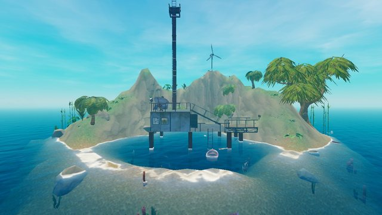 **Signal Rock** | A rock with a radio relay station: climb the station, dive for the lost transmitter coil, put the radio on the air and light the beacon (Raft's Radio Tower) | A building from Raft's radio tower pieces on pillars, ladders, a story item from a sunk crate, an object that is "used" with a story item (the transmitter), things shown and hidden by a behaviour (the beacon) |
| 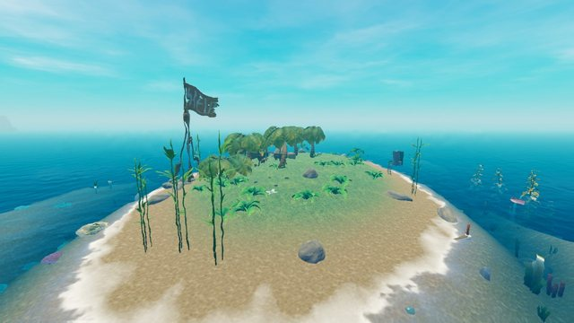 **The Stranded Gull** | A motor yacht aground on a sandbar, the crew's camp, the yacht's stern on the reef - with an angler fish in it (Raft's Vasagatan) | A wreck from Raft's stranded boat, a camp of Vasagatan's furniture, a creature under water guarding a safe |
| 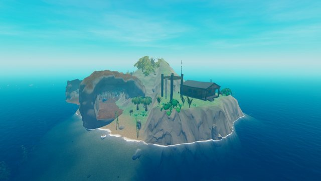 **Ranger's Rest** | A jungle hill: a ranger's cabin, a watchtower and the den of Old Scar, the bear that stole the supplies (Raft's Balboa) | A boss (a bear made bigger and tougher, tinted), a watchtower to climb, a cave den |
| 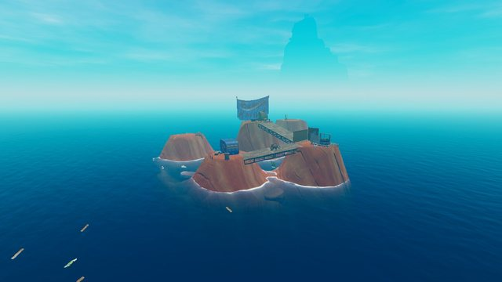 **Stilt Hollow** | Trailers on sandstone stacks joined by scaffold walkways; follow the red pipe to the valve, start the pump (Raft's Caravan Town) | Walkways between heights (scaffolding as ramps), a pump started with a story item, a white screecher |
| 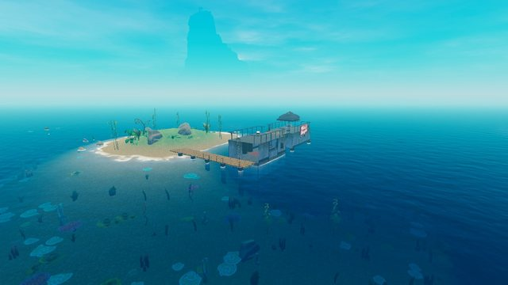 **Mayor's Wharf** | A drowned city block: City Hall's flooded floors, the mayor's office at its wharf, a cafe on a roof (Raft's Tangaroa) | Rooms under water, a keycard in a flooded locker, a vault, a pier of Raft's planks |
| 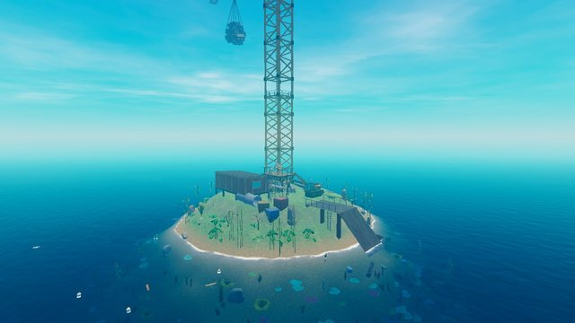 **Crane Yard** | A construction islet under a giant crane; the spotlight's parts went down with the pier's end (Raft's Varuna Point) | Three story items to collect under water, angler fish, a spotlight that is fixed and points to the reward |
| 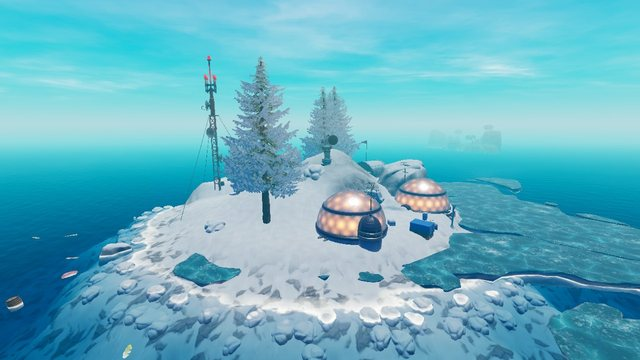 **Frost Hollow** | A snowy islet with igloos, a telescope and a dark lab; three cables, a power box, a polar bear (Raft's Temperance) | A power box that takes three story items, a sliding lab door that opens on a signal |
| 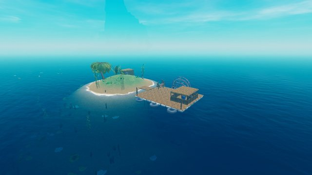 **Tide Farm** | A floating farm of Raft's foundations: crop beds, a glasshouse, a water wheel jammed by a crate (Raft's Utopia) | An island of only building blocks over water, a turning wheel, animals to **catch** as a quest step |
| 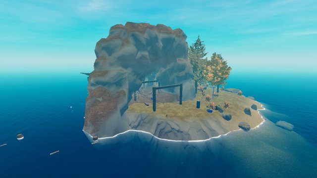 **Old Mine Islet** | An old mine in a rock mound: timbered tunnels, rails, ore carts - dark further in, where something has dug in | A cave from Balboa's cave pieces set into the land, darkness (an atmosphere zone) and lanterns, a head lamp in a locker |
| 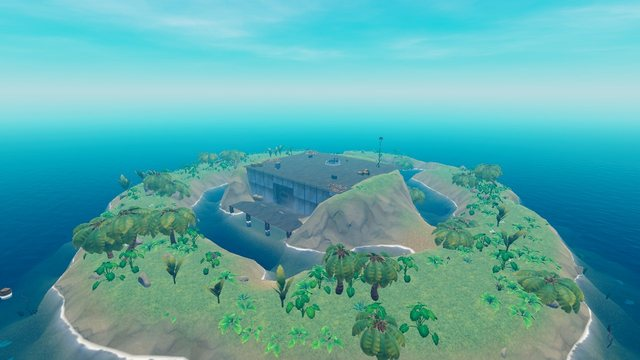 **Shelter Atoll** | A bomb shelter under an atoll's islet: seven dark rooms, rats, a dry generator, a blast gate | Rooms **under the ground** (a pit under a concrete roof), a hatch and a ladder down, a generator that lights the rooms and opens doors |

### 16.3 The very large islands

| Island | What it is | What it shows you how to build |
|---|---|---|
| 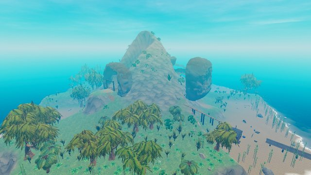 **Ironreef Caverns** | A jungle mountain over four caves: a mine, a vine crawl, a flooded shaft and the Bear Hall behind a rockfall | Several caves in one mountain, a plank road up a flank, a rockfall blown with charges (an object hidden by a behaviour), a boss in its hall |
| 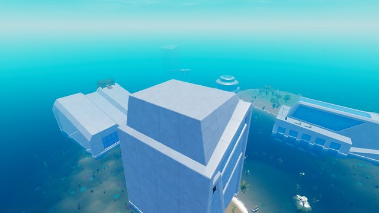 **The Drowned Metropolis** | Meridian, a city the sea took: tower crowns over the water, a ferry, a penthouse, offices on the sea floor, the Lantern Lord | Buildings standing in the sea, a penthouse on legs, three keycards, an angler fish boss in deep water |
| 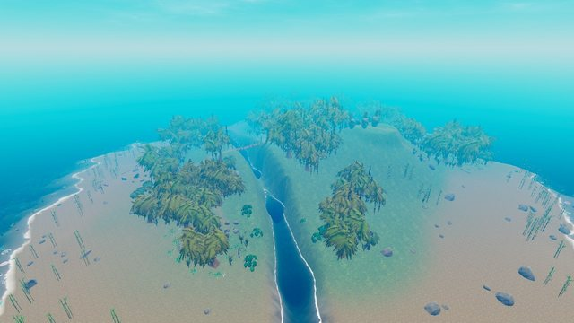 **Thornwood** | A jungle split by a river gorge: a rope bridge, three shrines, a stone circle where the Warthog King guards the idol | A gorge cut with the terrain brushes, a rope bridge, trails through dense jungle, a boss and its guards |
| 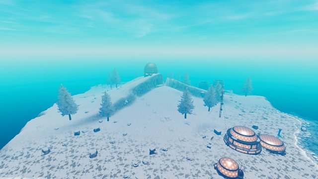 **Glacier Station** | A station on a glacier: glowing domes, an observatory on the peak, a crevasse with the Polar Bear Queen, a reactor | A reactor that, once running, sends a **signal** that opens its vault; a crevasse cut into the ice |
| 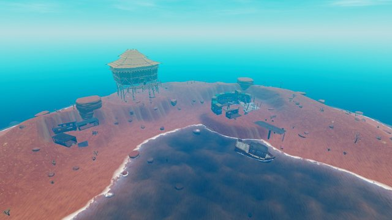 **Scrapyard Haven** | A junk town in a ring of stacked caravans: a gate trailer on a winch, a hyena pit, the scrap king's fortress on stilts | A gate that a **winch** lifts (moving objects), a stilt house set level on a ridge, a pack with an alpha |

### 16.4 The world plans

**The Long Voyage** - Raft's whole story, twice as long. After every story island but Utopia, a big quest island of
the library comes on its own Receiver frequency (the story island's radio picks it up); its quest done, the story goes
on as Raft's. The smaller library islands turn up as side trips while you sail (one every few km).

| After | The plan's island | What it is |
|---|---|---|
| Radio Tower | 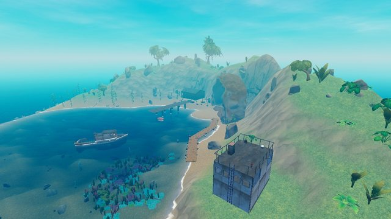 **Wreckers' Cove** | A cove with a wreckers' hamlet, the schooner Marigold on the reef, a smugglers' den in a sea cave and the false lantern that lured her there |
| Vasagatan | **Thornwood** | ([16.3](#163-the-very-large-islands)) |
| Balboa | **Scrapyard Haven** | ([16.3](#163-the-very-large-islands)) |
| Caravan Town | **Ironreef Caverns** | ([16.3](#163-the-very-large-islands)) |
| Tangaroa | **The Drowned Metropolis** | ([16.3](#163-the-very-large-islands)) |
| Varuna Point | 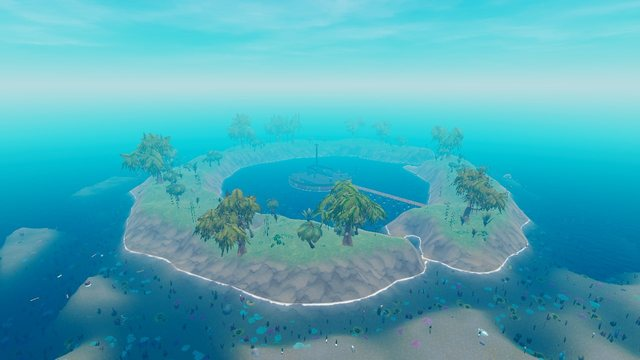 **Coral Observatory** | A research platform moored in an atoll's lagoon, coral samples in cases on the lagoon floor and a giant angler fish at the reef's edge |
| Temperance | **Glacier Station** | ([16.3](#163-the-very-large-islands)) |

The **side trips** - every one 450 m ahead of the raft, with its message on screen and its name on the Receiver:

| Sailed | Island | The message |
|---|---|---|
| 2 km | **The Stranded Gull** | A white hull glints on a sandbar ahead. |
| 4 km | **Signal Rock** (quest "Dead Air") | A mast on a rock ahead - its light is dead. |
| 7 km | **Ranger's Rest** | A jungle hill with a watch tower comes up ahead. |
| 10 km | **Stilt Hollow** | Trailers on stilts over a reef - someone lived out here. |
| 13 km | **Mayor's Wharf** | Rooftops stick out of the sea ahead: a sunken city block. |
| 16 km | **Crane Yard** | A crane rises from the sea ahead. |
| 20 km | **Frost Hollow** | A snowy islet with a hut - it's getting colder. |
| 24 km | **Tide Farm** | Water wheels turn on a floating farm ahead. |
| 28 km | **Old Mine Islet** | A headframe stands over an old shaft on the islet ahead. |
| 32 km | **Shelter Atoll** | A quiet atoll ahead - and a hatch in the middle of it. |

The **main quest islands** are each on the Receiver, 700 m (Wreckers' Cove), 900 m (Thornwood, Scrapyard Haven,
Ironreef Caverns) or 1000 m (the rest) ahead when tuned, and each is done when its quest is done. The plan also has
**Random islands while sailing: on** and **Raft's story islands: on** (all eight).

What it shows: all [three kinds of islands](#the-three-kinds-of-islands-you-meet-at-sea) in one plan - rules with a
**story place** ("after" a story island) and a **Receiver** frequency, "done when its quest is done", and side trips
brought **after a distance sailed**, ahead of the raft.

**Raft Remade** - Raft's story as you know it, but every story island is made anew. Each of Raft's eight story
islands is replaced on the Receiver by a remade version of itself: its land made by the generator **like** Raft's own
island ([4.5](#45-the-island-generator) - its shape and style, something new each time it is built), then rebuilt with
new set pieces, new missions, other monsters and a boss. Each hands out the blueprints the original island has, so the
raft still gets its steering wheel, engine, fuel, machete and everything the story needs; the last island's quest is
the ending.

| Instead of | The plan's island | What it is |
|---|---|---|
| Radio Tower | 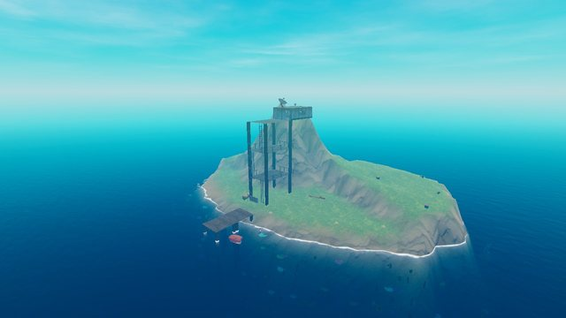 **Radio Tower Remade** | A three-deck tower on a steep rock, a battery bank in the old shark cage, Old Beak on the roof |
| Vasagatan | 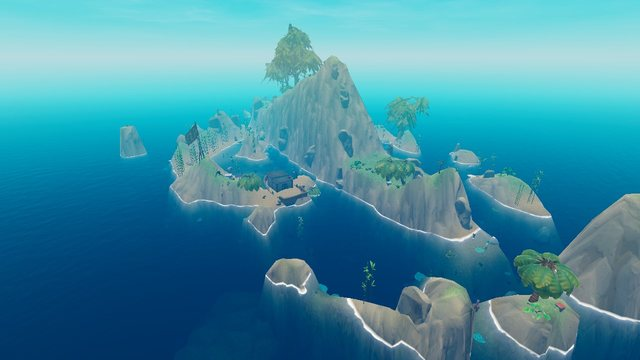 **Vasagatan Remade** | A ship broken in two on the reef - her bow on a sandbar full of rats, her stern sunk in the bay, her crew's camp in the dunes |
| Balboa | 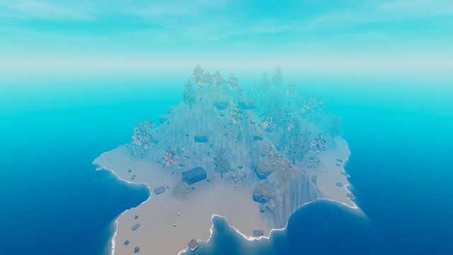 **Balboa Remade** | A forest of pine and maple round a mountain: the rangers' station, the Mama bear's den behind a vine-grown barricade (cut with the machete), a radio mast on the summit |
| Caravan Town | 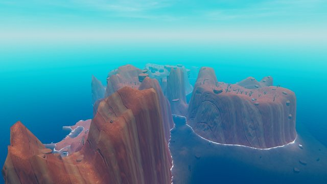 **Caravan Town Remade** | Red sandstone stacks: a market in the inlet, a lift of ladders, a bridge slid across by a winch to the mayor's pillar - and a white screecher on his roof |
| Tangaroa | 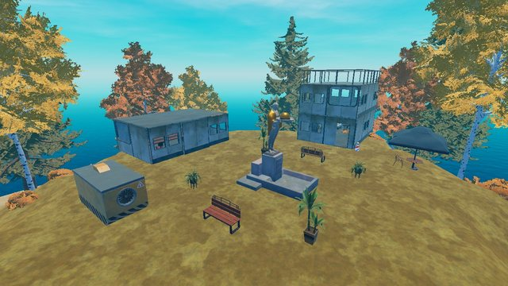 **Tangaroa Remade** | The floating city on a hill of its own: a harbour deck on one of the old ring pontoons, the pump house, the square with the founder's statue, the generator and the council's vault (three key cards) |
| Varuna Point | 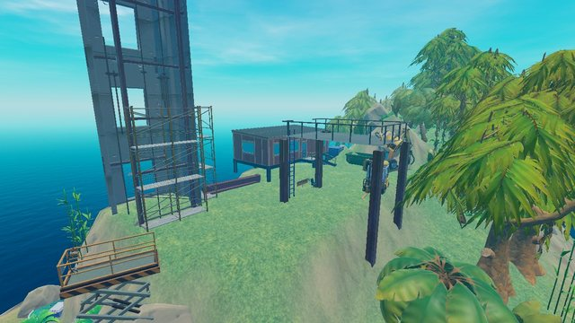 **Varuna Point Remade** | A construction site on a long rocky point: the half-built tower in its scaffolding, the floodlight's four parts on the sea floor, the floodlight tower, a giant angler in the deep |
| Temperance | 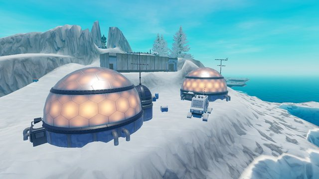 **Temperance Remade** | An igloo village, Selene's station whose reactor opens its inner doors (three cable drums - one under the ice), the telescope on the peak, the polar bear mother |
| Utopia | 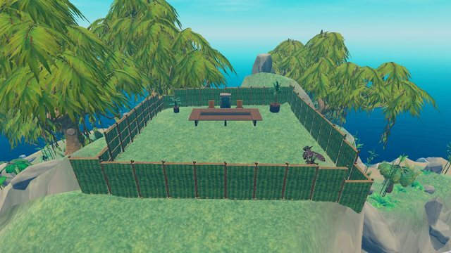 **Utopia Remade** | The end of the voyage: docks with Utopia's market, the warden's prison house on its stilts, and his yard on the summit behind a palisade - a gate with two keys, his hyena pack and their alpha |

Each island is on the Receiver at its story island's place (600 to 1200 m ahead when tuned), and each is done when its
quest is done; the plan also has **Random islands while sailing: on** and **Raft's story islands: on**.

What it shows: rules that take a story island's place (**instead of**, [7.4](#74-everything-a-rule-can-do)), islands
made from Raft's own islands with the generator's **like**, and on each island a different way to lock the reward:
a story item used on an object (a battery, a crank, cables, floodlight parts), a key card count (Tangaroa's vault takes
three), a signal (Varuna's strongbox opens only once the floodlight burns), two keys at once (Utopia's gate).

**The Abyss Expedition** - an expedition downwards beside Raft's story: each island comes **on the Receiver** (500 to
900 m ahead when tuned) when the one before is done - its quest done, or players reached it: an old mine, a buried
shelter, a **sunken island** (a map type, made new for every world), caverns, a **wreck** (a map type too), a drowned
city - and at the end **The Abyss**.

| The plan's last island | What it is | What it shows you how to build |
|---|---|---|
| 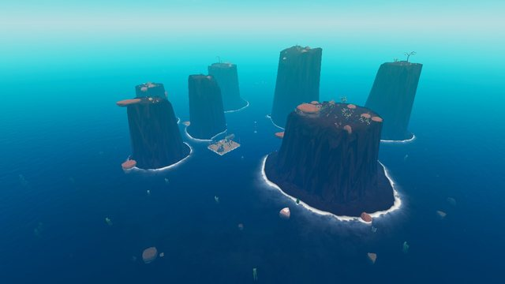 **The Abyss** | A ring of black sea stacks around a trench 42 m deep: the expedition's raft moored over its edge, its air line running down to three air pockets (a container on a shelf, a gas tank on a ledge, a shack on the floor) and, on the floor, the lair of the Abyssal Angler and its brood | A raft of Raft's foundations, a trench cut with the brushes (a bowl, a shaft, a shelf and a ledge flattened into its walls), **air pockets** - trigger zones with Air, hidden until the valve shows them, with rising bubbles ([5.4](#54-trigger-zones-and-ambushes)) |

The plan has **Random islands while sailing: off** and **Raft's story islands: on**.

What it shows: rules brought by **quests and visits**, main story islands **beside** Raft's story
([6.5](#65-your-islands-in-rafts-story-the-receiver)), and map types mixed with your own islands.

**Raft 2: The Drowned Frontier** - a sequel with a story of its own: years after Utopia the sea is rising again, and a
trail of the old Frontier Corps' stations leads across the storm belt to the last high ground. Raft's story islands are
off; the plan's ten quest islands come one after the other - the first is on the Receiver from the start, and each quest done
gives the next station's frequency on the Receiver. Raft's key blueprints are found along the way in Raft's order, so
the raft can still be steered, driven and fuelled; the tenth island's quest is the ending.

| Station | The plan's island | What it is |
|---|---|---|
| 1 | 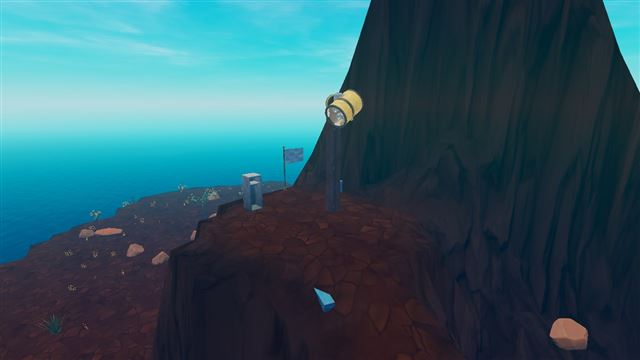 **Frontier Beacon** | A black volcanic spike: the keeper's hut on the ash flats, a ramp of fill up to the beacon's terrace, a spare cell in a sunk supply boat, stone birds and their sentinel (the Receiver's and the antenna's blueprints) |
| 2 | 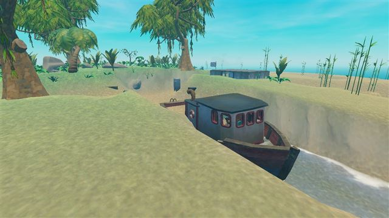 **Saltmarsh Ferry** | A salt marsh cut by a tidal channel, the Corps' ferry beached at its end - pump her dry, clear the rats out of her hold (the motor wheel's and the steering wheel's) |
| 3 | 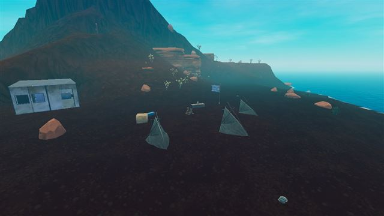 **Cinderfall** | A volcano with a geothermal plant at its foot - three relief valves on its flanks, the stone birds' matriarch, roaches in the turbine hall (the machete and the fuel blueprints) |
| 4 | 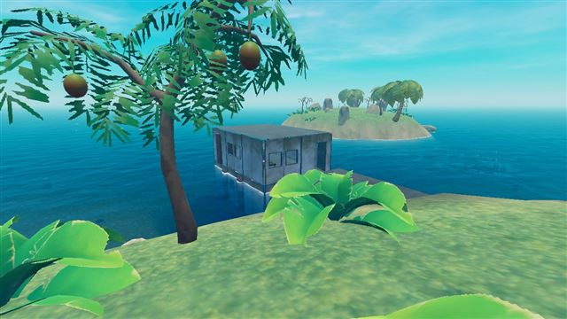 **The Sunken Archive** | An archive standing in the sea between five palm islets, its stacks flooded - catalogue cards, an air pocket, an angler at the vault (the engine controls', the metal detector's, the firework's and the zipline's) |
| 5 | 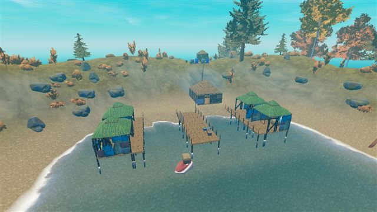 **Hightide Harbor** | A fishing town on stilts round a bay - bears in the fish hall, the water works on the hill, a lamp tower of Raft's blocks to light (the water blueprints) |
| 6 | 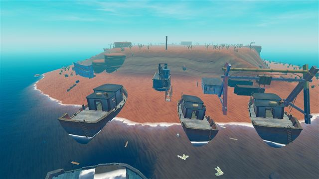 **The Iron Graveyard** | A ship breakers' yard on a red mesa's beach - beached hulls to climb, a barge sunk off the beach, a crawler crane, the turbine on the mesa (the power blueprints); off the quest, Raft's **generator** and **radio** (a supply drop) and Vasagatan's **engine** (`lib_features`) |
| 7 | 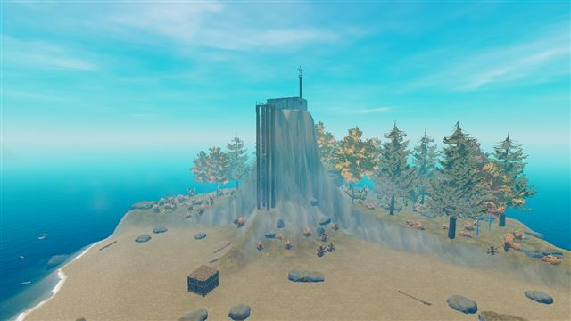 **Storm Spire** | A weather station on a needle of rock in the storm belt - a short climb, three conductor rods, the storm bird; six steps, short on purpose (the electric smelter's, the advanced biofuel extractor's and anchor's) |
| 8 | 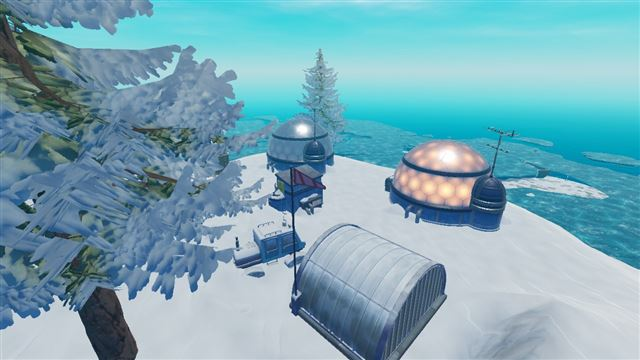 **Whiteout Reach** | The Corps' winter camp on a snowy hill - a supply ship frozen into the shore ice, the polar bear matriarch in a crevasse, the radio hut on the summit |
| 9 | 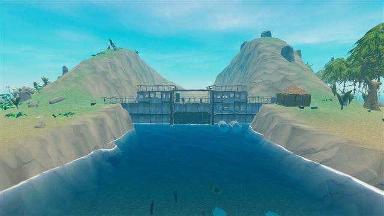 **The Drowned Gate** | A sea wall across a strait between two hills - its lock of two steel gates that sink to open, the pump house's flooded hall with an angler in it, the gate office's vault (the titanium tools', the big backpack's and the electric zipline's) |
| 10 | 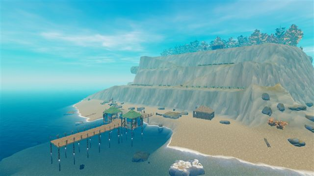 **The Frontier** | The last high ground: a harbour town under a great mesa, farm terraces climbing its face, the upper town and the Corps' hall on the rim, the Corps' lift down the cliff to a vault sunk in a cove - thirty-two steps in six chapters |

The first island is on the Receiver from the start (500 m ahead when tuned); each one after it (800 to 1300 m ahead when
tuned) once the one before is done, and each is done when its quest is done. The plan has **Random islands while
sailing: on** and **Raft's story islands: off**.

What it shows: a plan with a story chain of its own (**first** and **after**, [7.4](#74-everything-a-rule-can-do)) and
no island of Raft's; quests of every length - six steps on Storm Spire, thirty-two in six chapters on The Frontier;
story items an object only uses up once the quest has counted them (an **Only if** the quest reached that step before
the check that **uses them up**, so a player who finds things early can't lock the quest); a lift that moves the
player (**teleport to**); doors that slide aside when three seals are set.

**Silver Screen Seas** - Raft's whole story with the library's themed islands ([16.6](#166-the-themed-islands)). After
every story island a big themed island comes on its own Receiver frequency (after Temperance two, one after the other);
its quest done, the story goes on as Raft's. The ten normal-size themed islands turn up as side trips while you sail.

| After | The plan's island | Size |
|---|---|---|
| Radio Tower | 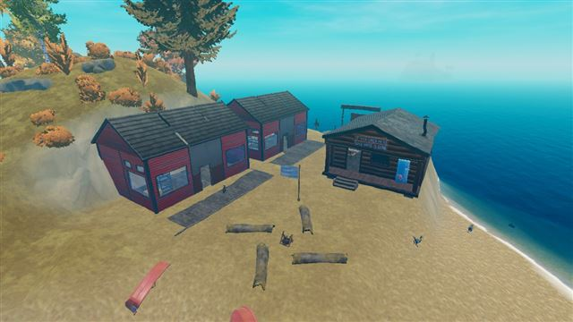 **Camp Blackwater** | twice the size |
| Vasagatan | 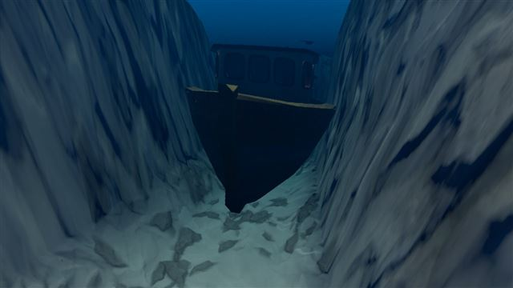 **The Sunken Liner** | twice the size |
| Balboa | 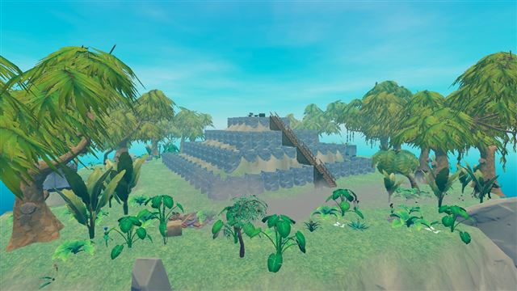 **The Step Pyramid** | twice the size |
| Caravan Town | 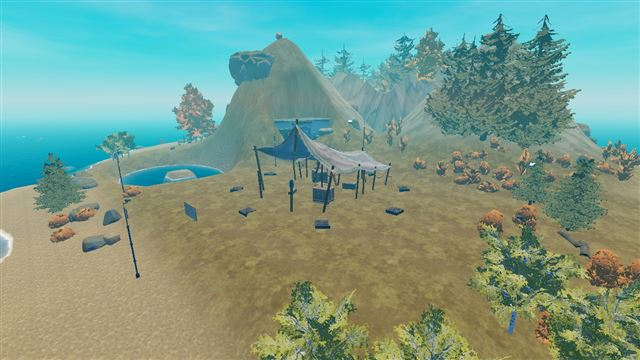 **The Arena** | three times the size |
| Tangaroa | 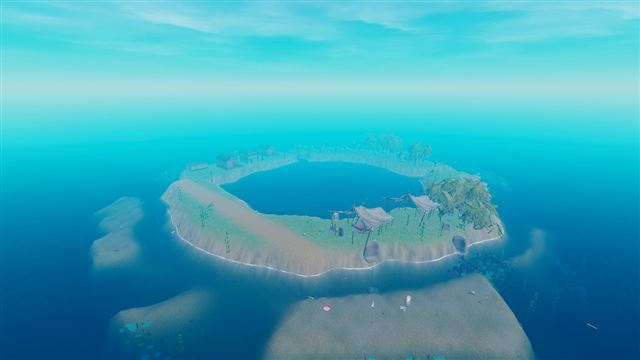 **Albatross Field** | three times the size |
| Varuna Point | 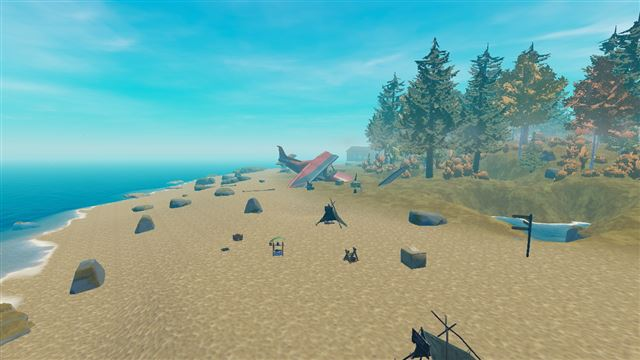 **The Island of Stations** | five times the size |
| Temperance | 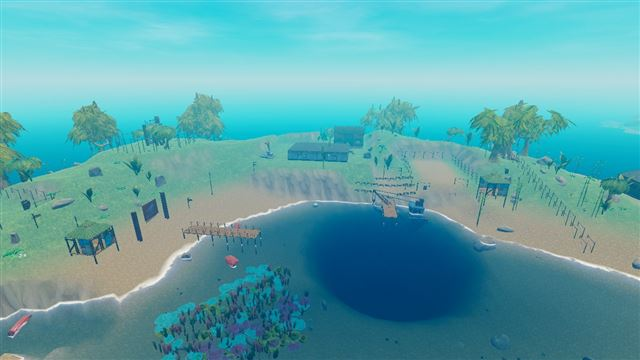 **Primeval Park** | five times the size |
| Primeval Park | 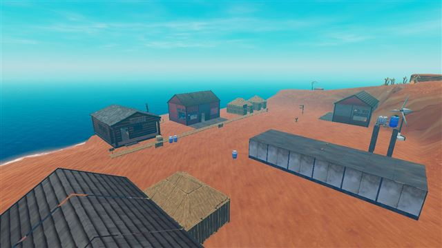 **Sundown Canyons** | ten times the size |

The **side trips**, every one 450 m ahead of the raft: Tiki Lagoon (2 km), Gilded Skull Cove (4 km), The Drowned
Labyrinth (7 km), Keeper's Light (10 km), Embers Isle (13 km), The Safe Room (16 km), Sun Atoll (20 km), The Rock Pen
(24 km), Highmoor Lodge (28 km) and Crater Lair (32 km).

The main quest islands are on the Receiver 700 m (Camp Blackwater), 900 m (the next three) or 1000 m (the rest) ahead
when tuned, and each is done when its quest is done. The plan has **Random islands while sailing: on** and **Raft's
story islands: on** (all eight).

What it shows: a story island's place taken by **two** islands in a row - Sundown Canyons comes **after** Primeval
Park, a rule of the plan itself ([7.4](#74-everything-a-rule-can-do)) - because nothing can come after Utopia, which
ends Raft's story and never counts as done.

### 16.5 Where to look for...

| To learn how to make... | Open |
|---|---|
| Ladders up a building or a rock | Signal Rock, Scrapyard Haven (its fortress), Wreckers' Cove (the lantern) |
| A door, gate or bridge that opens (moves) | Shelter Atoll (the commander's door), Scrapyard Haven (the gate on a winch), Frost Hollow (the lab door), Caravan Town Remade (a bridge slid across by a winch), Tangaroa Remade (a shutter the generator slides aside), Temperance Remade (the reactor's inner doors), Utopia Remade (a gate with two locks), The Frontier (the hall's sliding doors) |
| Something that opens only after something else (a **signal**) | Glacier Station (the reactor and its vault), Wreckers' Cove (the doused lantern and the hoard), Coral Observatory (the analyzer and the safe) |
| An object used with a story item (a key, a fuse, samples, a wrench) | Signal Rock (the coil), Stilt Hollow (the valve), Coral Observatory (three samples at once), The Abyss (the air valve), The Frontier (three valve wheels, the horn's reed, the seal press - each used up only once the quest has counted it) |
| A lift or anything that moves the player | The Frontier (the Corps' lift: **teleport to** its other end), The Safe Room (a hatch down an escape shaft and back), Rookery Cliffs (Raft's own scissor lift, which carries you) |
| Roads and terraces up a steep slope (the terrain brushes) | The Frontier (two farm terraces and three wide ramps up a 35 m mesa), The Iron Graveyard (a ramp cut up the mesa's cliff), The Safe Room (a driveway cut along a cliff face) |
| A town | Hightide Harbor (a fishing town on stilts), The Frontier (a harbour town and an upper town of four quarters) |
| Caves | Old Mine Islet, Ironreef Caverns (four), Wreckers' Cove (a sea cave) |
| Rooms under the ground | Shelter Atoll |
| Darkness and light (atmosphere zones, lamps that come on) | Shelter Atoll, Old Mine Islet, Ironreef Caverns, The Abyss (its lair) |
| Things under water to dive for | The Stranded Gull, Mayor's Wharf, Crane Yard, The Drowned Metropolis, Coral Observatory, The Abyss |
| Air pockets for a long dive | The Abyss |
| A boss (bigger, tougher, tinted) | Ranger's Rest (Old Scar), Thornwood (the Warthog King), Glacier Station (the Polar Bear Queen), The Drowned Metropolis (the Lantern Lord), Scrapyard Haven (the alpha), Coral Observatory (the giant angler), The Abyss (the Abyssal Angler), and one on each of Raft Remade's islands (the Mama bear, the white screecher, the giant angler, the polar bear mother, the hyena alpha...) |
| Animals to catch | Tide Farm, The Frontier (the grower's goats), Tiki Lagoon (the petting zoo's runaway goats) |
| Buildings from Raft's pieces | Signal Rock and Wreckers' Cove (radio tower pieces), Shelter Atoll and Coral Observatory (Selene rooms), Mayor's Wharf (City Hall), Hightide Harbor and The Frontier (Raft's own wooden walls with hip roofs on their pillars) |
| A raft or a deck of Raft's foundations | Tide Farm, The Abyss |
| Land shaped with the brushes | Thornwood (a gorge), Glacier Station (a crevasse), Coral Observatory (a blue hole), Scrapyard Haven (a pit and a terrace), The Abyss (a trench with a shelf and a ledge) |
| An island in Raft's story | The Long Voyage (after each story island), Raft Remade (instead of each story island) |
| An island made from one of Raft's own (the generator's **like**) | Raft Remade's eight islands |
| A chain of islands that bring each other | The Abyss Expedition |
| **Raft's zipline** (a line with its far end moved, the zipline tool in a chest) | Cablecar Stacks (from the summit down to the shore stack) |
| **Machete vines** hiding a chest that shows once they are cut | Thornwood (two caches; the Boar King's offering gives a machete), Gilded Skull Cove, Primeval Park, Old Vine Hill |
| **Buried treasure** for the metal detector and the shovel | Gilded Skull Cove (the detector in the hoard), The Cartographer's Isles (the detector and a shovel in the map case), Wreckers' Cove |
| Raft's **dirt spots** (the shovel) | Crowfield Farm, The Clockwork Orchard, Old Vine Hill, Primeval Park, Glasshouse Gardens |
| **Wild beehives** (honeycomb that fills up again) | Bramblehive Knoll, Crowfield Farm, Old Vine Hill, Thornwood, Glasshouse Gardens |
| Raft's **keycard door** (a ready piece: it wants Raft's own keycard, found in a chest on the island) and a **hatch** with a chest under it | Star Fort (the quartermaster's strongroom in the north barracks, his satchel on the glacis; the hatch on the parade ground) |
| Raft's **crank wheel** and **lever** (each sends a **signal**: a crate shown, a bolted chest let go) | The Clockwork Orchard (either side of the workshop) |
| Raft's **lift** (Varuna Point's scissor lift: it carries you up, stands there extended, and carries you down again) | Rookery Cliffs (Eskil's egg hoist beside a ledge cut into the south crag) |
| Raft's **cage** cut open with the **bolt cutters**, and a **security camera** that sweeps | Primeval Park (the feed chest caged in the boar paddock, the cutters in the keeper's tool chest; the camera on the keeper's hut) |
| A **generator** started with Raft's generator part, a **radio** that works on its power and gives away a hidden supply drop, Vasagatan's **engine** started with a gas tank | The Iron Graveyard (the part in a mechanic's toolbox, the radio on the yard office's table; the trawler's engine on the yard, its fuel in a crate) |
| Temperance's **turning mirrors** (a chest that opens once both are turned) | Glasshouse Gardens (Lind's sun mirrors and her seed chest) |


### 16.6 The themed islands

Islands built round a theme the movies love - a pirate cove, a beach club, a desert villa with a safe room and more -
each with its own island type and its own quest. Ten are the normal size; the others are two, three, five or even ten times
as big (the island's **Radius** in the generator, [4.5](#45-the-island-generator)). Like the other examples, each one's
script is in `content\recipes` and the island opens in the editor.

| Island | What it is | What it shows you how to build |
|---|---|---|
| 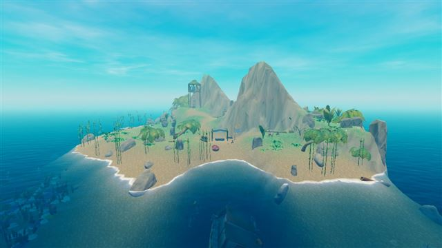 **Gilded Skull Cove** | Two jungle peaks over a cove like the brows of a skull: a pirate captain's camp, her ship sunk in the cove's mouth, her map torn in three and her hoard under three standing stones | A map of three story items laid together on a table, a stilt lookout to climb, stones to push in a verse's order (each one moves only after the one before it: a chain of **signals**), feral hogs |
| 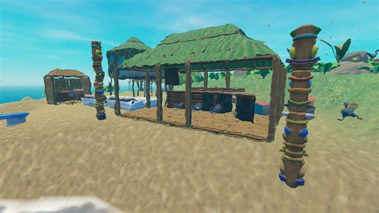 **Tiki Lagoon** | A beach club on sandy keys, left in a hurry before a storm: a tiki bar, bungalows on stilts over the lagoon, a deep pool with a sunken pedal boat, two runaway goats | A bar of Raft's floor blocks under a thatch hip roof (`roof`), huts on stilts and walkways over water (`stilt_hut`, `boardwalk`), a generator that switches lights and music on (things **shown** by a behaviour) and opens a safe (a **signal**), animals to **catch** |
| 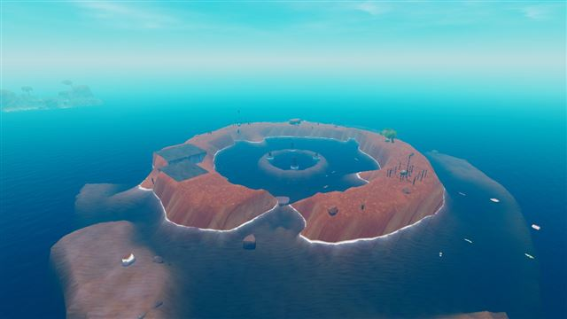 **Sun Atoll** | A ring of sun-baked islets round a lagoon after a weapons test: an observation blockhouse buried in a dune, the tower's stumps round a crater at ground zero, measuring posts behind wire | Rooms in pits under concrete slabs (on the terrain's 1.95 m grid), a trench, a crater dive, a story item that turns a **zone** on (the dosimeter), three films for a projector that opens a safe |
| 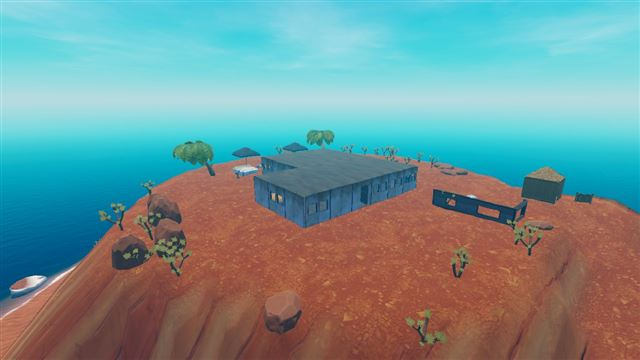 **The Safe Room** | A concrete villa on a red desert bluff, broken into one night: the owner and her daughter hid in the steel room behind the study's bookshelf, and the men's dogs still guard the garden | A driveway cut up a cliff face, rooms of the radio tower's pieces, a keypad that wants three story items, a bookshelf that **slides** aside (a mover) and shows hidden dogs, a hatch that **teleports** down an escape shaft |
| 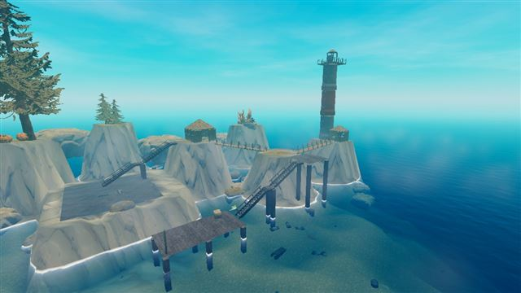 **Keeper's Light** | Sea stacks in a grey sea joined by rope bridges: a lighthouse dark for three nights, the keepers' cottage, and a flooded cistern under a concrete slab where something with a lamp on its head waits | Buildings on three sea stacks joined by rope bridges (lanes of floor blocks with rope rails), a lighthouse of concrete pipes with ladders up its outside, a cistern dug into the rock and a hatch down into it, a lamp lit with a story item |
| 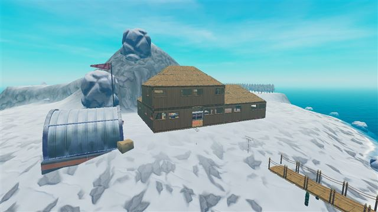 **Highmoor Lodge** | A mountain lodge on a snowy hill, closed for the winter: the caretaker's typed pages all over the house, music in the empty ballroom, a maze of young firs with a white bear at its heart, a boiler to vent | A two-storey house of Raft's solid wooden walls with a stair and a hip roof, wings with their own roofs, a maze (evergreen runs with invisible walls, `Helper_Wall`), a **Find pages** step, three valves in order (signals), a door that **slides** aside on a key |
| 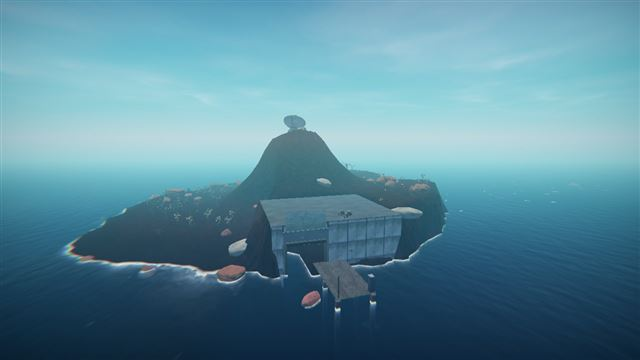 **Crater Lair** | A black volcanic cone with a great dish humming in its crater and a hangar hidden in its west bluff: a seaplane, a control room, a pet's pool behind bars and a getaway jetty | A slab of the mountain that a hidden panel lifts (a door that **moves**), rooms dug into a bluff, a keycard dived for in a pool behind bars, a **timed** escape - a blast door that shuts 45 seconds after the codes burn |
| 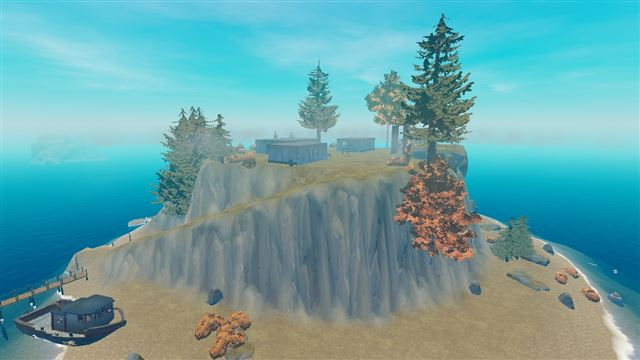 **The Rock Pen** | A prison on a flat granite rock in the fog: the yard, a guard tower, cell block B, the mess hall - and the drain inmate 1147 dug from his cell's vent down to the sea | Cells with fronts of bars that **slide** open on a key, a tower of thick legs with a ladder, a vent that **teleports** you into a tunnel at the cliff's foot, a kit shown only once you are in the tunnel, an outer rock raised from the sea floor |
| 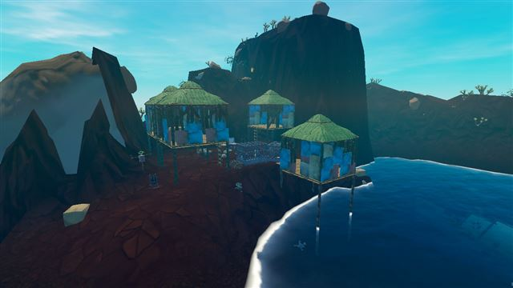 **Embers Isle** | A black volcanic crescent round a bay: a whalers' village of stilt huts round a fire that never goes out, a captured botanist's journal - and her boat hidden in a vine-hung sea cave under the headland | A village of stilt huts round a fire, a chest that blows a horn and **shows** hunters with trained boars (a chase, with music), Balboa's vine cave set into a cliff at the waterline |
|  **Camp Blackwater** (twice the size) | A summer camp on a forest lake, empty since the season ended early: cabins, canoes, an archery range, a radio still playing - and the Ridge Bear the head counselor stayed behind to lure away | A lake dug down to the sea's level inland, a camp of Balboa's log house and relay-station cabins, a bait pile that **shows** the bear, a fire lookout with a ladder, a flare that **gives** a key |
|  **The Step Pyramid** (twice the size) | A jungle plateau with sheer cliffs and the Rain Kings' stepped pyramid on top: a staked shrine, a sacred well straight down to the sea, a moat of stakes and three jade tablets for the summit altar | A pyramid raised from the ground in square tiers with walls of stone blocks and Raft's stairs, a well dug past the sea's level with a gorge out to sea, stepping stones **shown** when a tablet is taken, stakes that sink on a hidden lever |
| 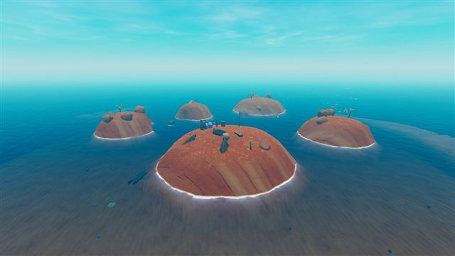 **The Drowned Labyrinth** | Sandy desert islets on a turquoise reef and a dive camp on the largest - and 19 m under the reef a labyrinth of flooded tunnels: a guideline through the dark, an air bell, a hall of columns and a tide gate that opens for forty breaths | Temperance's underwater cave tunnels joined end to end under a reef (`kit_labyrinth` measures where each piece's passage runs), holes dug through the reef down to them, an air bell, a gate that **opens** for a while and shuts again |
|  **The Sunken Liner** (twice the size) | Icy rocks in a cold sea and a great liner broken in two on the sea floor between them: the bow standing upright, the ballroom with a breath of air under its ceiling, the purser's safe with the Polar Star - and something with lamps in the stern | A trench dug 16-24 m down between the rocks, a ship's halves of Raft's wrecks set on the sea floor, rooms of the radio tower's walls under water with air in them (a **zone** that refills your breath), a survivors' camp on the biggest rock |
|  **Albatross Field** (three times the size) | A coral atoll with a wartime airfield: a runway along its west side, canvas hangars, a control tower with a glass cab, a power bunker, a fuel dump on the next islet, a fighter ditched in the lagoon - and one flight still out on patrol | Caravan Town's great roof on its poles as field hangars, a tower of the relay station's stairs and rooms, passes cut through an atoll's ring, four lamps lit in order (each needs the **signal** of the one before), a story item **given** when the generator starts |
|  **The Arena** (three times the size) | Two forested peaks over a green plain built for a contest that still runs on its own: a great canopy of supplies ringed by starting plates, cameras on poles, three rounds of beasts, a gift dropped on a lake's islet - and a door in the peak that opens when the champion falls | Hidden animals **shown** round by round (each round's **defeat** shows the next), a chained crate that opens on a **signal**, a lake dug round an islet, a control room of Selene's cells in a pit cut into a slope under a slab, its sliding door **opened** by the champion's defeat |
|  **The Island of Stations** (five times the size) | A misty forest marsh where a plane came down among the stations of a vanished research initiative: a radio station, a lab sunk in the bay, a zoo of empty cages, a village round a green, an observatory - and a hatch whose vault opens for sixty seconds | Five story items gathered across a big island, rooms under a slab reached by a ladder down a shaft, a lab under water with air under its ceiling, a vault door that **opens** for a while and **closes** again (and a lever inside that opens it), a long quest in chapters |
|  **Primeval Park** (five times the size) | A park of giant beasts on a jungle crescent round a bay, dark since a storm blew its fuses: a visitor centre, a boar paddock, a river ride, a power house, an aviary, a show lagoon - and behind the great gate, the park's Queen | A low crescent from the generator (a tall one is all ridge), a terrace cut for a block of rooms, a channel dug from the bay inland, three story items **taken** together by a switch that **shows** the park's lights, a gate that wants power, a card and a key, animals that wake when you enter their **zone**, a quest in four chapters; Raft's machete vines, a chest caged until Raft's **bolt cutters** open it and a sweeping **security camera** (`lib_features`) |
| 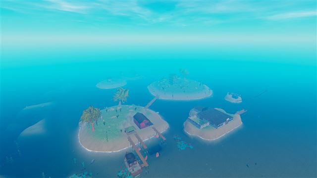 **Paradise Archipelago** (ten times the size) | Seven sandy keys joined by boardwalks: a marina, a hotel tower, a water park, villas, a lighthouse bar - and on its own key the Golden Gull casino with its gold still in the vault | A heist in chapters: five kits gathered from five keys (story items), breakers pulled in order to black out the casino, a dive through a service tunnel, lasers switched off for thirty seconds by a card (a **timed** hide/show), a time lock, the gold carried to the getaway boat |
|  **Sundown Canyons** (ten times the size) | A red-rock island of canyons and mesas: a frontier town on the west shore with a bank, saloon, jail and station, a silver train derailed in a canyon, a blown trestle over a river, a mine whose lift runs up through Black Mesa - and the outlaw gang's fort on top | A railroad of ties and rails laid up a canyon cut through the hills (`rot=0,0,0` keeps them lying flat), a river let in from the sea through a gorge, a lift that **teleports** you up through a mesa, a ladder trail up cliff bands faced with timber walls, animals to **catch** with a net, a long quest in chapters |
| 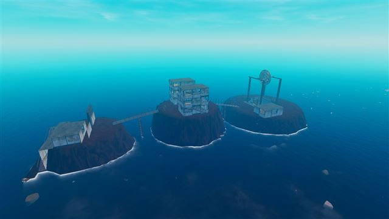 **Blackwall** (twice the size) | Three black basalt stacks built over with concrete - a sea wall, blocks of flats, a mine head - closed in one night when the seam flooded; four letters never posted, a flooded shaft | Stacks raised from a shallow shelf, blocks of the radio tower's rooms with outside stairs, bridges between stacks, letters **taken** by a sorting rack that gives a key, a padlocked gate that **turns** open, a shaft dived into the dark |
| 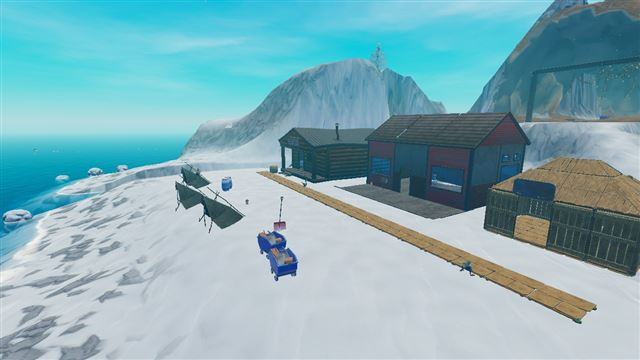 **Frostgold Creek** (twice the size) | A gold-rush boomtown in the snow at the mouth of a creek between two peaks: sluice boxes along the creek, an assay office, a mine with a white bear, a claim post on the saddle | A creek dug from the coast up a valley to a pool, plank sluices ramped off its banks, five nuggets found in different ways (boxes, a cave, a dive) weighed on scales that **give** a slip, a chest that only opens on a **signal** |
| 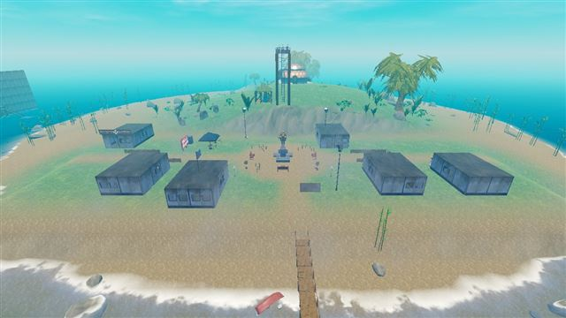 **Halcyon Cove** (three times the size) | A perfect little town where it rains on cue and there are cameras in the flower beds - and out at sea a wall painted like the sky, with a door in it | A rain **zone** switched off by a machine, four hidden cameras that each **give** a tape once, a console that wants a key and all four tapes, a wall of the radio tower's walls on a raised sandbank with one piece that **swings open** like a door |
| 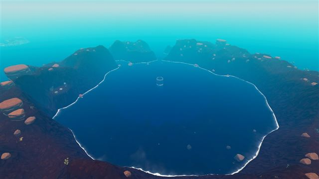 **Aurelis** (five times the size) | A ring of volcanic hills round a lagoon, and in a blue hole in its middle a drowned city: an agora, temples, a canal, a tower, a gate of three crystals with a guardian, a throne hall with air under its ceiling | A hole dug in three terraces with angle loops, Varuna's pipes stacked into a tower, Selene's cells as a throne hall behind a gate that sinks when three story items are **taken**, an altar whose zone is **shown** later, a tower's top **shown** rising out of the water |
| 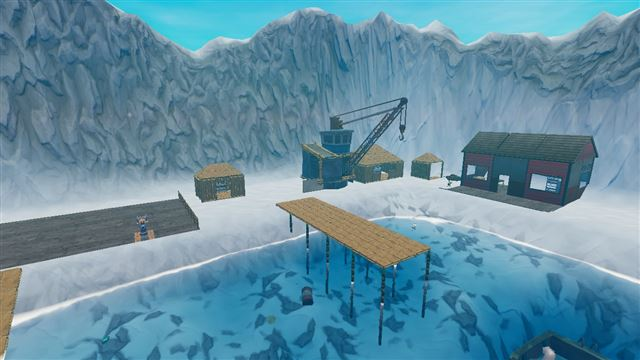 **Whalebone Bay** (three times the size) | A whaling station in a snowy bay: a quay with a steam crane, a boiler house, a flensing plan with its harpoon cannon, a white church and the manager's house - and the last catcher sunk at the quay with the men's pay | A boiler fired by three sacks **taken** from three places, a crane that hauls a strongbox up from the sea floor (one **hidden**, one **shown**), a firing pin that spikes a cannon and **shows** a whale |
| 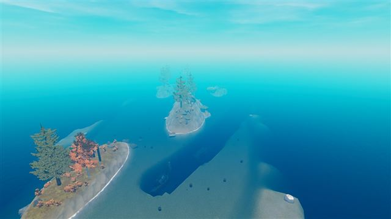 **The Kraken's Wake** (three times the size) | A chain of pine islets on a reef, and along its south side five wrecks in a line, each deeper than the last - the wake of something that pulled a squadron down - ending at a trench | A furrow dug deeper along its length with wrecks laid in it on the ground (`ground sit`), a harpoon gun whose three parts are **taken** by a battery, a boss and its brood **shown** together, a quest that leads you down and down |
| 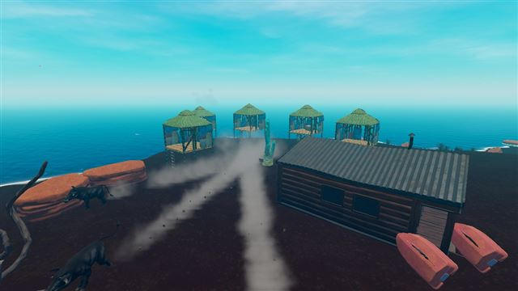 **Heart of Fire** (ten times the size) | Two great peaks over an island of ash: a burnt village, a navigator's wreck in the bay, a lava tube, an obsidian temple, the Mother's spring and summit - and a fire-bird over the pass | A whole island in two layers: ash and dead trees **shown**, palms, fruit and flowers **hidden**, swapped (and the sky's atmosphere with them) when the quest's last story item is laid down; braziers lit in order (signals), a zone **shown** only when its step comes, a quest in four chapters |


### 16.7 The new islands

More islands of the library, each with its own theme and island type - and a quest of its own kind: a timed escape, an
underwater survey, a climb and a riddle, a barter chain, a round-up... (some have no quest at all: islands to wander).
They come in five sizes: normal, twice, four times, seven times and twenty times the usual size.

| Island | What it is | What it shows you how to build |
|---|---|---|
| 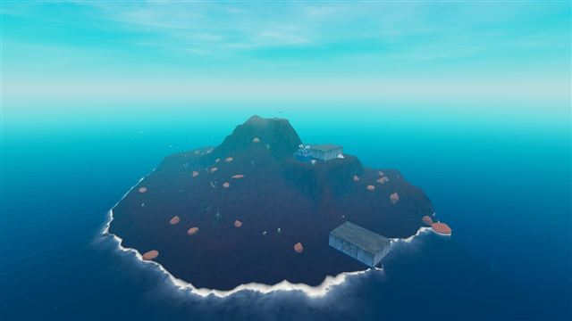 **Sulphur Vent** | A fuming volcanic cone with a sulphur works on its shoulder; lift the sample case off the vent's cap and you have forty seconds to reach the boathouse | A **timed** escape: a chest whose opening **shows** a gas zone, **opens** a shutter and **closes** it again 40 seconds later, and a lever that runs the same again for a second try |
| 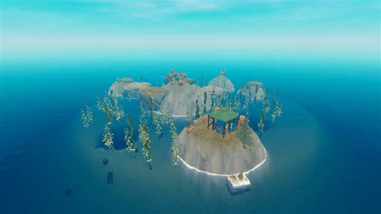 **Kelpdeep Rock** | Pine islets over a forest of giant kelp, and four caves under it to measure | Kelp scattered on the sea floor (`scatter ... wet`), caves dug into a reef with fallen rocks over them, air pockets, four posts that each **give** a reading once (`!signal`), a recorder that **takes** all four |
| 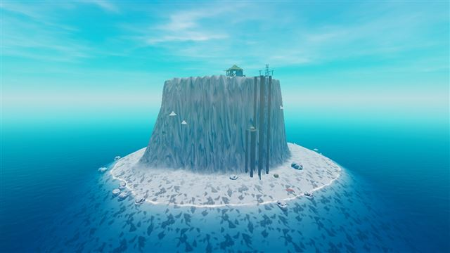 **Hermit's Table** | A flat-topped rock on sheer cliffs, a ladder scaffold up its face, a hermit's hut with three riddles and three levers | A scaffold of thick pillars with ladders stacked up its face and a ledge, three levers of which two **show** hidden birds and one **gives** the key |
| 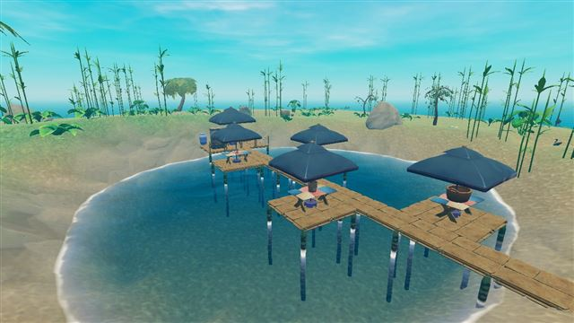 **Gullsong Bazaar** | A floating bazaar on a marsh lagoon, closed for the season: five stalls, one thing left at each | A lagoon dug in a marsh with a boardwalk and pontoons over it (a `stall` macro), a **barter chain**: each stall **takes** one story item and **gives** the next |
| 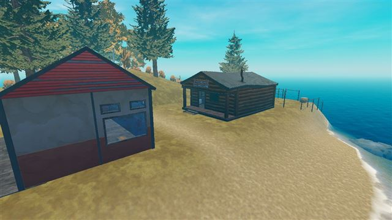 **Crowfield Farm** | A small farm on a green island - a farmhouse, a barn, a windmill, scarecrows - and three goats loose on the hill | A farmyard levelled on a plain with fields of harvestables, a **catch** step with the net launcher from a chest, a basket that opens once the quest has reached it (`quest|4`) |
| 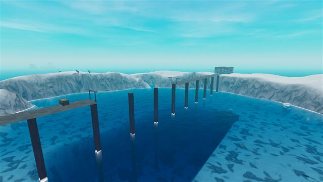 **Viaduct Lagoon** (twice the size) | A snowbound railway atoll whose viaduct broke under the mail train; three cars on the lagoon's floor, air under their roofs | A viaduct of thick pillars standing from a trench 11 m deep (their feet buried where the floor is higher), its broken spans lying on the floor, **air pockets** (an air zone under each car's roof) for salvage dives |
| 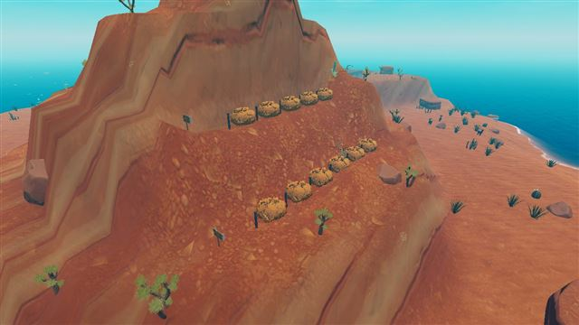 **Old Vine Hill** (twice the size) | A terraced vineyard on two dry peaks, a cellar in the hill and a flooded reserve vault below it | Terraces flattened in steps round a peak with rows of vines (a `vines` macro), a **pages** step, four casks tapped in order (each needs the last one's **signal**; out of order they just drip), a vault that the pump **opens** and fills with air |
| 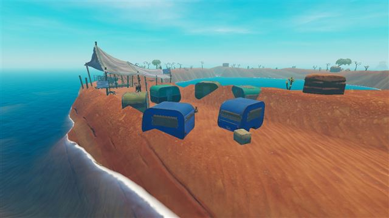 **Big Top Atoll** (twice the size) | A circus wintering on a sandy atoll: the big top, wagons in a circle, a trapeze rig - and its menagerie loose | Caravan Town's great roof on its pillars as a big top, objects placed round a circle with `cos`/`sin`, two **catch** steps one after the other, hyenas that wait for a zone, a trunk to dive for |
| 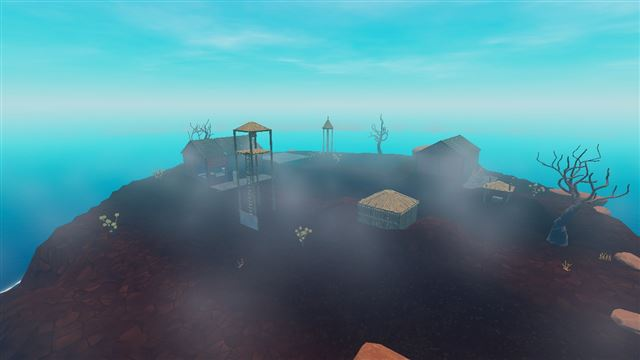 **Ashfall** (twice the size) | A village on a volcanic table-land buried to its eaves in ash: a bell house, a town hall, a bakery, a school with its door buried, a chapel's crypt, and the shelter in a lava tube by the sea | A **pages** hunt through dug-out houses (banks of ground against the walls, the village's rocks cleared), a door of packed ash that sinks when dug with a shovel (`if.use=has`, a mover), a crypt in a pit under a slab, a bell that **opens** a gate far below and **shows** its zone, a road cut up a cliff in two legs |
| 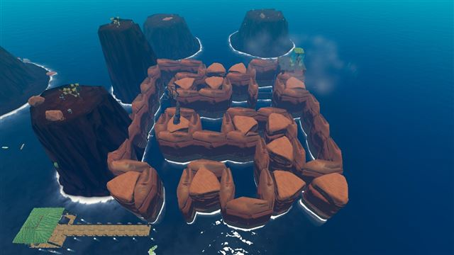 **Redstack Maze** (twice the size) | A maze of red rock stacks in the sea, six cells by six, with a heron shrine behind a water gate; the tide-keeper's lever opens the gate for 75 seconds | A maze laid out on a grid (walls of one rock stretched thin, a column in every unused cell), a **timed** gate (open, `wait|75`, close), landmarks a chart names, a shrine on a deck on posts, a bell that **teleports** the player home |
| 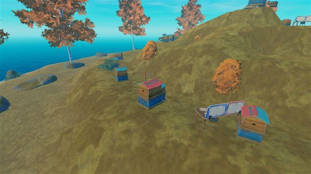 **Bramblehive Knoll** | A beekeeper's knoll cut into three ring terraces of hives, a mead shed by the landing and the bee-mother skep on the summit | Crisp ring terraces (flatten strokes round each band) with a ramp between each, hives as chests, swarms that can't be beaten, a press that **takes** three combs and **gives** the mead, a delivery to a chest that takes it |
| 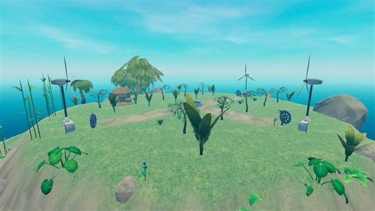 **The Clockwork Orchard** | An inventor's orchard on a flat-topped rock: three wind pumps at its rim, gutters to a dry fountain, his workshop under the cliff | A **resettable order puzzle** on state checks (`state|cog|shown`: a wrong pump hides every cog), hidden spinning cogs, a shutter that sinks when the fountain runs; Raft's **crank wheel** and **lever** by the workshop, each sending a **signal** (`lib_features`) |
| 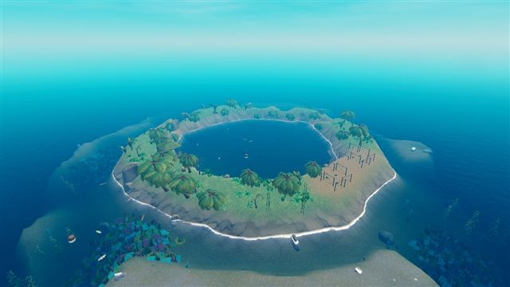 **Turtlewatch Atoll** | A sea-turtle sanctuary on a palm-ringed atoll: hatchery pens, a warden's hut on stilts, a reef lookout - **no quest**, a place to wander | An island without a quest: notes and boxes to find, animals in a lagoon (turtles, rays, dolphins), shallows in the lagoon as well as round the coast |
| 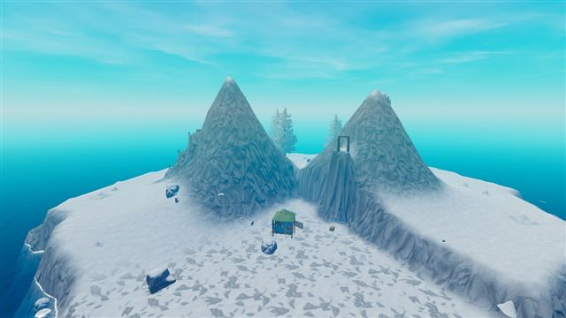 **Rookery Cliffs** (twice the size) | Two snowy crags loud with sea-birds - **no quest**, a place to climb: an egg collector's cabin, a winch basket up a cliff, ladders from ledge to ledge past nests, screechers on the top | Ledges cut one above the other on a cliff face and joined by ladders, a basket that rides up a cliff (a `teleport`), nests and notes to find without a quest; Raft's own **lift** that carries you up to a ledge cut into a crag (`lib_features`) |
| 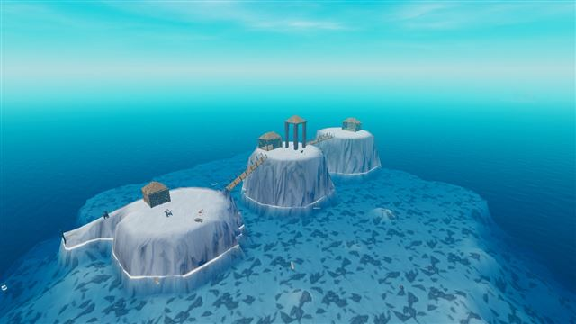 **The Bell Stack** | Three snowy sea-stacks joined by a rope bridge, a chapel bell, a torn chant and a hermit's cell | Sea-stacks flattened at two heights, a rope bridge, a **pages** step, a bell that refuses until the chant is whole and then **shows** a hidden plank bridge |
| 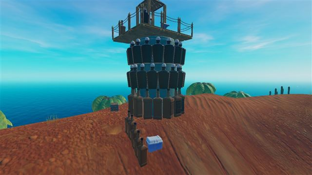 **Driftglass Bay** | A desert crescent round a shallow bay, a lighthouse built of glass bottles on its crest, a beachcomber's hut on stilts and a driftwood whale | A **collection** of eight story items from notes (a note that **gives** an item when read) on land and under water, a lamp that **takes** all eight and **shows** its light, a chest locked until then |
| 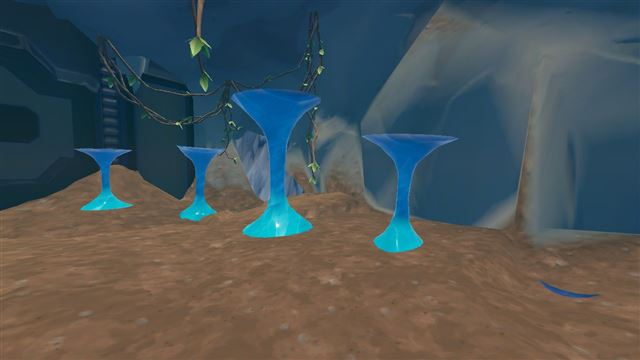 **The Ice Organ** (twice the size) | A frozen crescent with an organ of five ice pillars in the sea cave under its ridge, the organist's score cut in ice beside it and a crypt behind an iron gate | A **music sequence**: five pipes struck in the score's order with a mallet (each needs the last one's **signal**; out of order it just clangs), a great icicle that drops the crypt's key, a bear that sleeps until the gate opens |
| 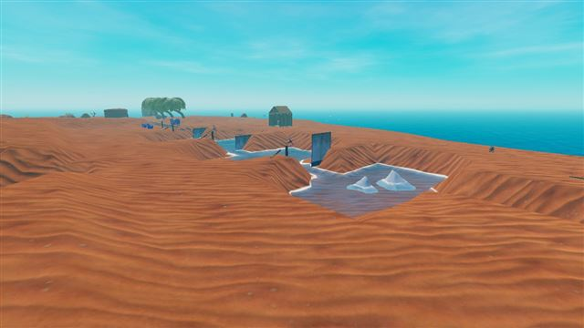 **Saltpan Delta** (twice the size) | A bust salt works on a desert delta: three pans of brine, sluices between them, a pump house, a salt store full of rats, a wagon line down to the jetty | **Restarting a works**: a crank, sluice boards that **move** to drain three pans in turn, salt raked from each, a wagon that **takes** three sacks and rides the line to the jetty |
| 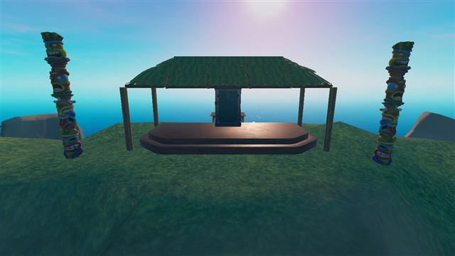 **Lanternfall** (twice the size) | A palm crescent at dusk laid out for a lantern festival that never started: lantern posts along the shore and up the hill, food stalls, a stage, rockets in their rack | A **count** of twelve lanterns lit with a taper (each lantern **shows** its own light once), a stage that waits for all twelve and sets off a fireworks finale |
| 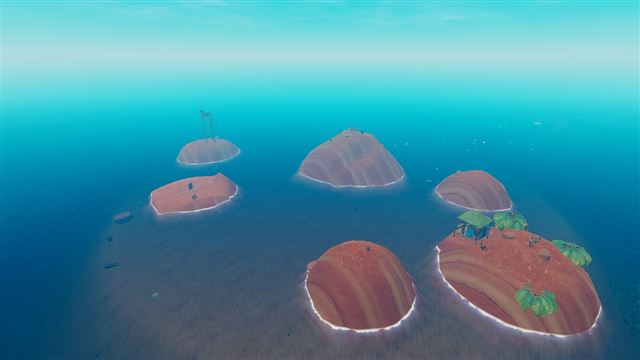 **The Cartographer's Isles** (twice the size) | A mapmaker's desert archipelago round a green lagoon: her drafting hut, a trig pillar, a survey tower, a drowned post and an X on a sandbar | A **map trail**: four pieces of a map, each found only where the last one's bearing points (hidden until then), one of them under water, and a dig at the X |
| 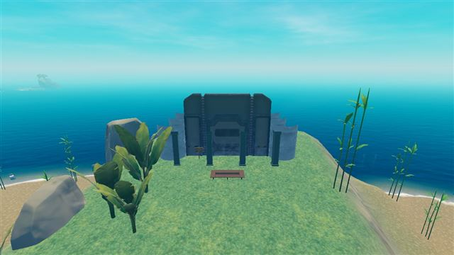 **Shellback** (four times the size) | An island like a sleeping tortoise with a shrine at each leg - a flooded sea cave, a needle of rock, a ring of stones, the sacred hens - and the Shell-keepers' temple on her head | **Four trials of four kinds** (a dive, a climb, a fight, a catch), each giving a scute, and a temple gate that **takes** all four |
| 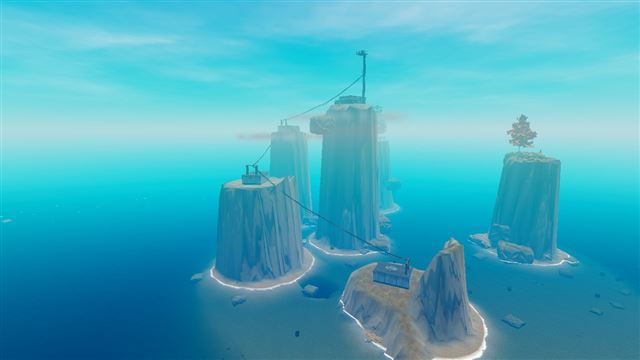 **Cablecar Stacks** (four times the size) | A cable car up four forested sea stacks, stopped by three faults: a spare fuse lost in the sea, screechers in the mid station's wheel, the high station's brakes locked | **Restoring a network**: each station's fault fixed in its own way (a dive, a fight, three brakes released in order), each car a ride (`wait`, then a `teleport` to the next station) |
| 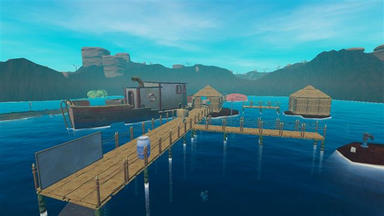 **Sargasso Town** (four times the size) | A floating town of wrecks in a volcano's lagoon: hulls roped to hulls, plank streets, a council house on a weed islet - and five captains away for the season | **Five favours for five votes**: a fetch, a fight in a galley, a dive under a capsized hull (air in it), a repair, a lost spyglass - plank streets as boardwalks turned with `push ... yaw=`, a ballot box that waits for all five |
| 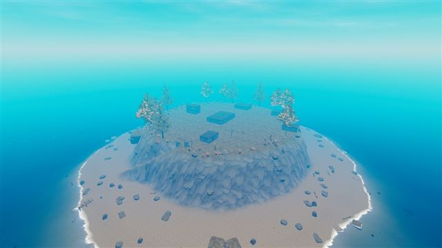 **Glasshouse Gardens** (four times the size) | A botanist's gardens on a cliff-top plateau: a palm house, a lily house, a potting shed, and one slanting road cut up the cliff from the cove | One long **slanting road** cut into a cliff (flatten strokes stepping up, smoothed), doors walked through, a hidden lever in the lily house; Temperance's **turning mirrors** that unlock a chest together (`lib_features`) |
| 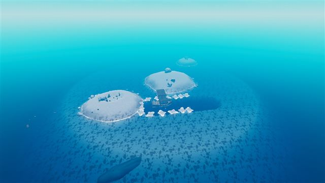 **Floe Reach** (four times the size) | An ice coast with floes on the shallows, fishing holes in the ice and a plunger that blasts the channel open | Floes as drifts **grounded** on flattened shoals (never floating), holes that the blast **hides** with the ice, a plunger that drops into place |
| 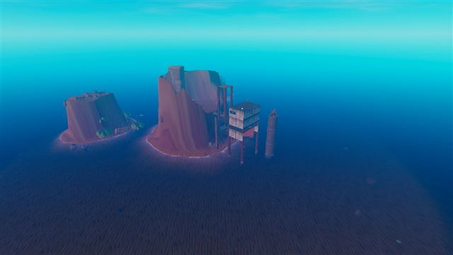 **Rig Seventeen** (four times the size) | An old oil rig on rusty legs among red sea stacks that always catches fire on a cold start: screechers on the derrick, three valves to shut through the flames, a lifeboat behind a fire door | A rig of radio tower storeys on legs with ladders between its decks, **fires** that hide and show (a glow, a wall), valves that each free the next, a **timed** run to the lifeboat |
| 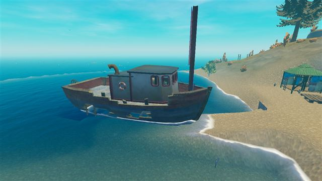 **Keel & Mast** (four times the size) | A shipwright's yard at the head of a wooded bay and the Second Wind on her slipway, nearly finished - three planks, a mast spar, a sail, and a launch | A ship finished piece by piece (hidden strakes, mast, rigging and sail **shown** as they come), chocks knocked out in a rhyme's order, a **launch**: every piece of her moving together down the slip into the bay |
| 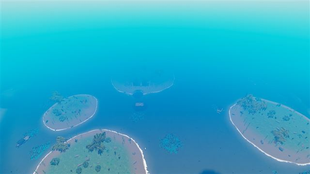 **The Trade Wind Archipelago** (twenty times the size) | Palm islands on one vast reef, three harbour towns and a regatta course of eight buoys round them all, sailed in your own raft | A **course**: buoys hidden until the one before is rounded (each zone **shows** the next), a committee boat of foundations at sea, a stilt town on boardwalks over the water |
| 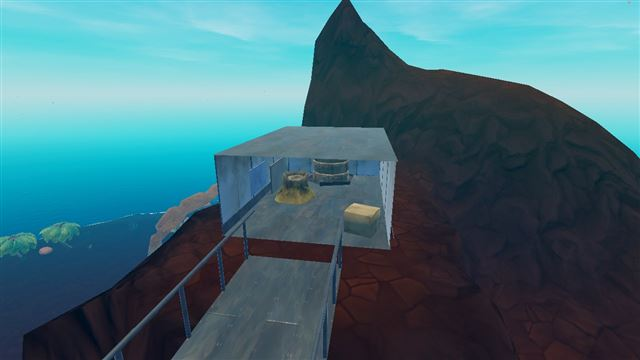 **Twin Forges** (four times the size) | Two rival smiths' forges at the ends of a high saddle, a chasm between with ladders down to a vault | A **saddle** flattened between two peaks with a building at each end, ladders down through a gap in a bridge's fence into a chasm, a contest between two forges |
| 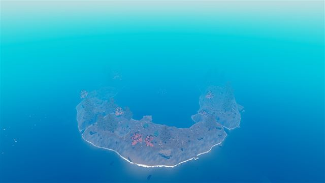 **Four Seasons** (seven times the size) | One island cut by four channels into four seasons - an ice spire, a spring hut, a summer reef, an autumn orchard - round a weather house in the middle | Four quarters with their own nature and tints, channels dug between them, a tower with ladders, a harvest bell, a weather house that waits for all four |
| 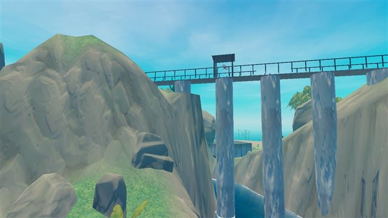 **The Aqueduct** (four times the size) | An old aqueduct striding across a valley on stretched pillars, a dry fountain square at its end and a harbour on the far coast | A deck **on piers** along a line at an angle (`push ... yaw=`), a cut along the line for its bed, a road in three legs up from the harbour, valves along the deck in order |
| 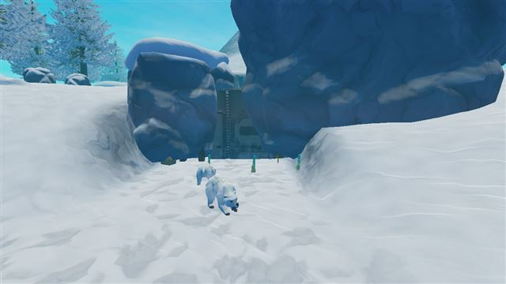 **Hollow Mountain** (seven times the size) | One snowy mountain the Delvers hollowed out: a gate sealed with three keystones, halls on three levels joined by lifts, a lake hall in its roots and a throne on an islet | Halls built in **notches** cut into a mountain, **lifts** (a lever-like use, `wait`, `teleport`), keystones set in order, a lake under a roof of slabs on columns, a stone guardian |
| 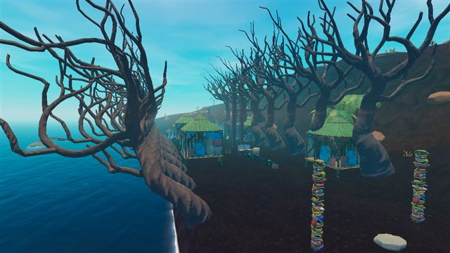 **Ribcage Reef** (seven times the size) | The bleached skeleton of a giant sea creature on a black volcanic crescent: a stilt village inside its ribs, a stage under its jaw, its skull half drowned in the bay | **Bones** of dead trees leaning in pairs, a **timed** song (four rib-chimes struck in order inside thirty breaths), a skull's chamber on the bay's floor with air in the eye, a festival that **shows** |
| 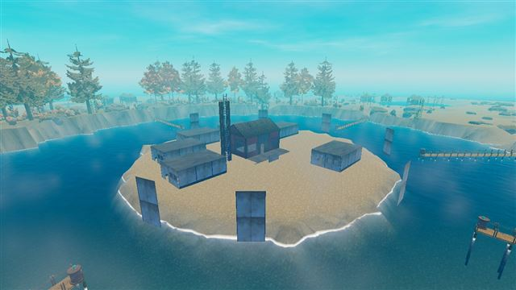 **The Great Fen** (twenty times the size) | A vast wetland with seven stilt villages round a great mere and the lost town of Sevenbridge on its island, cut off behind seven raised drawbridges | **Seven drawbridges** (a raised leaf hidden, a lowered deck shown), each lowered by a different kind of task - a catch, a dive, horns in order, a fight, a delivery, a timed lock, a boss - and a bell that waits for all seven |
| 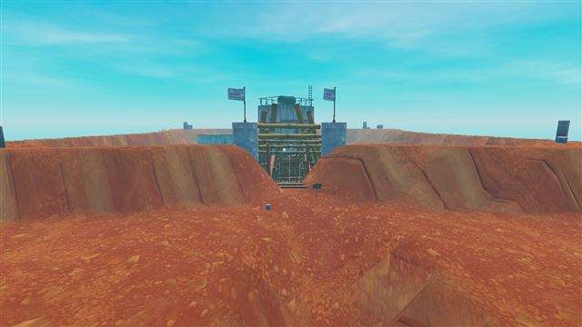 **Star Fort** (seven times the size) | A star-shaped fortress on a desert table-land, its garrison gone, the island's beasts still coming over the walls bastion by bastion | **Banks** raised as strokes along a star, ramps up to each bastion, four **waves** that wait for their zones, a magazine that **takes** four keys, a great gun that calls the pack's leader; Raft's **keycard door** on a strongroom (the keycard in a chest outside the walls) and a **hatch** (`lib_features`) |
| 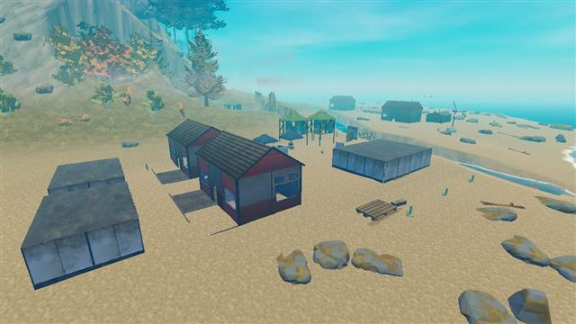 **The Last Kingdom** (twenty times the size) | A whole small kingdom: a harbour town, a river with a watermill and farms, a dark forest, a lake with a drowned chapel and a castle on the hill - empty until its crown is found | A **river** dug from a lake to the sea with a ford and a toll bridge, a mill that turns when its sluice lifts, three seals gathered across the land, a coronation that **shows** banners on every tower |
| 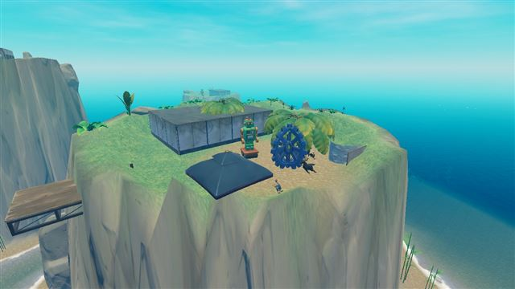 **The Clockwork City** (seven times the size) | A city of clockmakers on stacks above the sea: a harbour stack, the Hall of Hours on the plaza stack, gearworks on a pier, an observatory and a clock tower - joined by shuttles | **Shuttles** between levels (a lever, `wait`, a `teleport` to a zone), rooms in an undercroft, a clock tower whose hands are set in order |
| 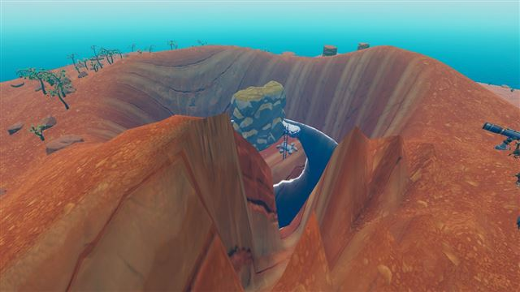 **Starfall Crater** (four times the size) | A crater lake round a grey-blue fallen star on its islet, closed like a clam; an observer's cradle on the rim and a sunk probe in the lake | A lake dug as a **ring** of strokes round an islet (cut down, never raised past 8 m), a **dive** for the probe's parts, a star that **shows** its glow when the cradle is fed |

---

*This guide describes Custom Islands 3.0, the Experimental Alpha Release. It is kept up to date with the mod: every
change to a feature updates this guide, the README and the PDF copy of this guide (`docs/Custom-Islands-Guide.pdf`)
together.*


### 16.8 Raft's story islands, piece by piece

What Raft's own story islands (the Radio Tower, Vasagatan, Balboa, Caravan Town, Tangaroa, Varuna Point, Temperance
and Utopia) are made of, and how to make the same on your island. From a scan of their scenes: 1,912 pieces with a
script that makes them do something (the dev command `CIStoryAudit`, left out of the release, writes the list).

| On Raft's islands | On your island |
|---|---|
| Things to pick up, harvest, cut and dig (460 pickups) | **Things to gather** (chapter 4), Raft's own, working as there - with Raft's **wild beehive** (Balboa, Caravan Town), its **dirt spots**, Tangaroa's banana trees, trees and strawberries, Caravan Town's acacias, Balboa's mushrooms and the finds on the story islands' land; a snowy pine to cut |
| Quest items (keys, keycards, tokens, tapes, parts: 319 pickups) | Raft's **quest item pickups** in the object list (23 of them: search "QuestItemPickup"); picked up with the interact key, the crew gets Raft's quest item as a story item (`story:raft-<type>`, Raft's name and picture), for checks and chests on any island of the world |
| Notes and notebook pages (68) | Notes ([5.2](#52-notes-and-signs)), the journal and Raft's notebook ([6.5](#65-your-islands-in-rafts-story-the-receiver)) |
| Buttons, levers, crank wheels, hatches, doors that open with a key or keycard (about 150 interactables) | Any object with **Behaviour & events**: players can use it, *only if* the player has an item (kept, or used up like a key), then open, move, show, hide, signal... Ready to place: Raft's **keycard and key doors** (Tangaroa's plantation door wants Raft's Tangaroa keycard, Utopia's entrance and hut doors their keys, Varuna's garage door the Motherlode key, Temperance's reactor door the reactor key, a padlocked door the bolt cutters, Detto's door the code) open (go) for a crew that holds that quest item and keep it for the next door; **hatches** open when used; **crank wheels** and **levers** send the signals `crank` and `lever` that other objects, the quest and the world plan can wait for |
| Animations, lights, sounds, particles, screen shake when something is used | Behaviours (move, turn, show/hide lamps), sound and atmosphere zones |
| Trigger boxes | Trigger zones |
| Enemy spawners that keep coming until a quest step (30) | Creature spots that come back, or a show action (an ambush) |
| Elevators and lifts (23) | Ready **lifts**: Tangaroa's elevator and Varuna Point's skylifts go up 6 m when used and down on the next use, carrying the player standing on them (Behaviour: move, "Carries players" - any moving object can carry players); or the action **teleport to** |
| Generators, the radio and its battery, fuel and engine parts | Ready **generators** (Balboa's, Tangaroa's, Utopia's, Vasagatan's) start with Raft's generator part (used up) and send `power`; **radios** (the radio tower's, Balboa's) work with power - a started generator or Raft's battery charger part - and send `radio`; Vasagatan's **engine** starts with Raft's gas tank and sends `engine`. Started once, they run for good. The signals open what you like (show a cache, a quest step) |
| Cages, security cameras | Ready **cages** (Utopia's dog cage, the radio tower's shark cage) open (go) for a crew with Raft's bolt cutters, sending `cage`; the radio tower's **camera** sweeps back and forth |
| Zipline lines (7) | Raft's **zipline lines**, ridden with the zipline tool, their far end set in the object panel |
| The machete's vines (Balboa) | Raft's **choppable vines**, cut with the machete (kept for the next vines) |
| Treasure for the metal detector and the shovel (Caravan Town, 175 dig piles) | **Buried treasure** (Raft's own treasure points) |
| Bosses and their arenas | Creature spots with a bigger, tougher, tinted boss; a sound zone for its music; Utopia's boss room doors as scenery a defeat event can hide. Raft's own arenas (Olof's phases, the hyena boss) run on its story characters and are not on custom islands |
| The Receiver's frequencies and the story chain | World plans and Raft's story chain ([7](#7-world-plans-which-islands-a-world-gets), [6.5](#65-your-islands-in-rafts-story-the-receiver)) |
| Character unlocks, cooking recipe pickups, mystery packages | Not on custom islands: they only work inside Raft's own islands (their scripts belong to its story save) |
| Keypads with a code (Tangaroa, Vasagatan) | A **keypad code** on any usable object ([6.2](#62-behaviour-and-events)) |
| Puzzle mini-games: Temperance's laser mirrors and igloo wires, Utopia's pipes, water wheels and justice scales, Tangaroa's claw crane | Ready **turning mirrors** (Temperance's): each use turns one a quarter and sends `mirror`; checks on their state (open = turned) make a mirror puzzle. Otherwise build them as **sequences**: levers or wheels that send signals in the right order (The Clockwork Orchard, Old Vine Hill). Raft's own mini-games (the laser beam, wires, pipes, scales, claw crane) need their story scripts and are on the roadmap |
