# Custom Islands: the guide

A picture-by-picture guide to **Custom Islands** (DynamicIslands), a [Raft](https://raft-game.com/) mod for the
[Raft Mod Loader](https://www.raftmodding.com/). It is for players who want new islands in their worlds, and for
builders who want to make islands of their own. The [README](../README.md) has the full reference (every setting,
file and command); this guide shows you around.

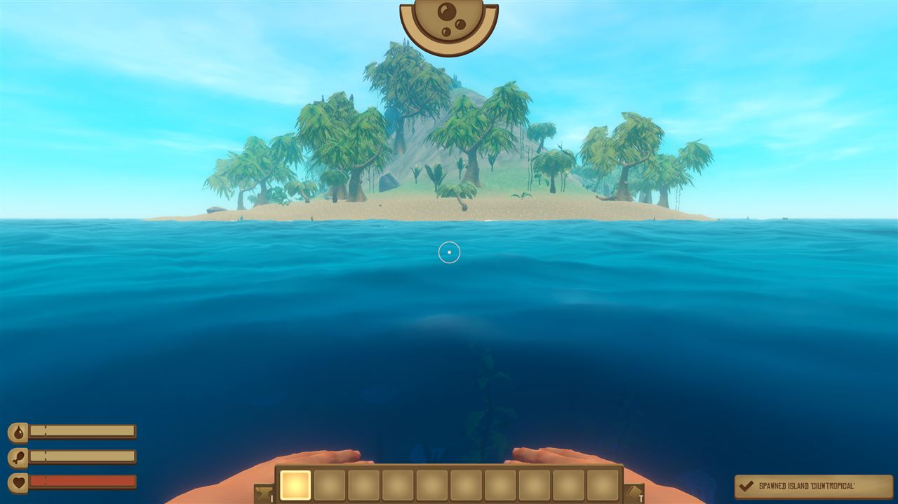
*A custom island met while sailing: made by the mod's island generator, with Raft's own palms, rocks and reef.*

## Contents

1. [Installing](#1-installing)
2. [Starting a new world](#2-starting-a-new-world)
3. [Sailing: custom islands in your world](#3-sailing-custom-islands-in-your-world)
4. [The world randomizer](#4-the-world-randomizer)
5. [World rules: monster difficulty and build cost](#5-world-rules-monster-difficulty-and-build-cost)
6. [The level up system](#6-the-level-up-system)
7. [Building your own island: the editor](#7-building-your-own-island-the-editor)
8. [Making islands come alive](#8-making-islands-come-alive)
9. [Stories: quests, behaviours, story items](#9-stories-quests-behaviours-story-items)
10. [World plans: which islands a world gets](#10-world-plans-which-islands-a-world-gets)
11. [Playing together](#11-playing-together)
12. [Settings files](#12-settings-files)
13. [Console commands](#13-console-commands)
14. [Questions and problems](#14-questions-and-problems)

---

## 1. Installing

> **Uncharted waters - alpha:** this is the mod's first release, an early alpha. Things are likely to change, some systems might be
> unstable, and progress is not guaranteed to be saved - back up the worlds you care about (Raft keeps them in
> `%USERPROFILE%\AppData\LocalLow\Redbeet Interactive\Raft\User`). The main menu shows this in a box at the top right; **Got it**
> folds it into a bar until the next version of the mod.

1. Install the **Raft Mod Loader** (RML) from [raftmodding.com](https://www.raftmodding.com/) and start Raft through it.
2. Put `DynamicIslands.rmod` into Raft's `mods` folder (for example
   `...\steamapps\common\Raft\mods\`), or install the mod from its raftmodding.com page.
3. Start Raft with RML's **Play** button. The first start takes a little longer: RML compiles the mod.

The mod keeps its files in `<Raft>\Mods\DynamicIslands\`: your islands (`*.island`), the settings files
(`spawnpool.txt` and others, see [section 12](#12-settings-files)) and the world plans (`plans\`).

**Playing together?** Every player needs the mod. The host's islands, files and settings are sent to everyone who
joins (see [section 11](#11-playing-together)).

## 2. Starting a new world

Click **NEW WORLD** in Raft's main menu. The mod adds four things to Raft's own box: two sliders under Raft's game
modes, the **World randomizer**, the **Custom Islands plan** and **World settings**. Each has a **?** or an explanation: hover it for the details.

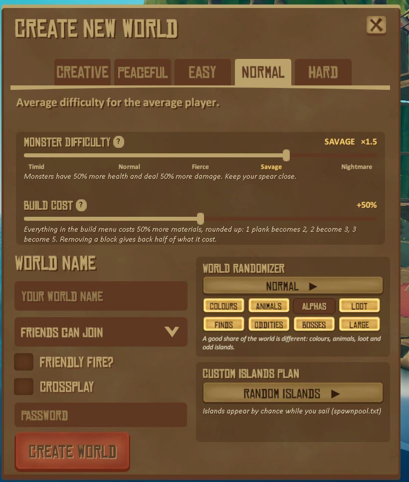
*Raft's New Game box with the mod: monster difficulty (here Savage, ×1.5), build cost (+50 %), the world randomizer
(Normal, all parts but Alphas) and the Custom Islands plan (Random islands).*

| Part | What it does |
|---|---|
| **Monster difficulty** | How tough monsters are in this world: Timid, Normal, Fierce, Savage or Nightmare (see [section 5](#5-world-rules-monster-difficulty-and-build-cost)) |
| **Build cost** | How many more materials the build menu costs: Raft's own up to +100 %, rounded up |
| **World randomizer** | A normal Raft world made different: Off, Light, Normal or Wild, and which parts take part (click a part to switch it off; see [section 4](#4-the-world-randomizer)) |
| **Custom Islands plan** | Which custom islands the world gets: **Random islands** (they appear by chance while you sail), **No custom islands**, or a plan such as **Adventure** (a story from island to island; see [section 10](#10-world-plans-which-islands-a-world-gets)) |
| **World settings...** | More options for this world: scrambled blueprints, story islands in a new order, ghost rafts, private storages (see below) |

Your choices are remembered for the next new world. They belong to the world: saved with it, the same for every
player, and every new world gets its own.

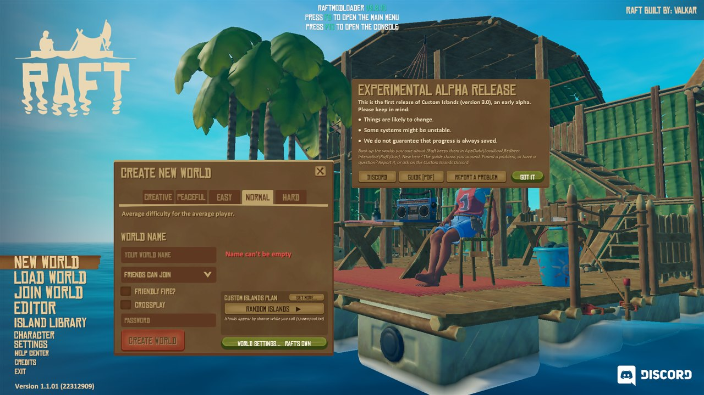
*The whole main menu. The EDITOR button opens the island editor (section 7).*

### World settings: more ways to play Raft again

Under the Custom Islands plan, **WORLD SETTINGS...** opens a window with the world's extra options, for players who
know Raft by heart. Click an option to switch it **ON** or off; **Done** keeps your choice (remembered for the next
world), **All off** switches every one off.

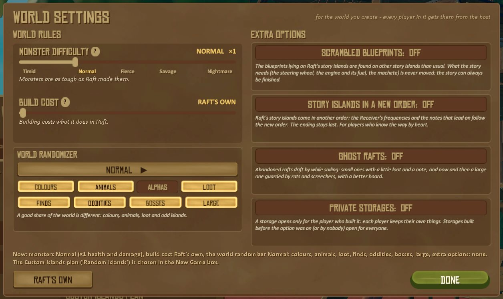
*The World settings window, every option on.*

| Option | What it does |
|---|---|
| **Scrambled blueprints** | The blueprints lying on Raft's story islands are found on other story islands than usual - the pickup's name tells you which one you'll get. What the story needs (the steering wheel, the engine and its fuel, the machete) is never moved, so the story can always be finished. |
| **Story islands in a new order** | Radio Tower, Vasagatan, Balboa, Caravan Town, Tangaroa, Varuna Point and Temperance come in a shuffled order: the Receiver's first frequency leads to the new order's first island, and the note you find there to the next. The frequency numbers written on the notes follow; the notes' text still speaks of Raft's own order. Utopia, the ending, stays last. |
| **Ghost rafts** | Abandoned rafts lie on the sea and come up ahead while you sail (not in the first 1.5 km, then about one every 3 km): small ones with a barrel and a message in a bottle, medium ones with a hut and a captain's log (sometimes rats), and now and then a large one with huts, a lookout and a hoard chest - guarded by rats on the deck and screechers circling above. You can walk on their decks. |
| **Private storages** | A storage opens only for the player who built it: looking at someone else's shows whose it is. Storages built while the option was off open for everyone. |

Every player in the world gets the host's options, also when joining later. The host can change them in a world:
`WorldOptions` (F10) shows them, `WorldOptions +ghostrafts -privatestorage` switches them.

## 3. Sailing: custom islands in your world

### Islands appear while you sail

With the **Random islands** plan, now and then an island appears **250-350 m ahead of the raft** (about one island
every 4 km). It can be:

- one of **your own islands** (every saved island takes part unless `spawnpool.txt` says otherwise),
- a **brand-new generated island**: a random size and style (tropical, snowy, desert, forest or volcanic), sometimes
  flying; it is saved as `gen-<style>-<seed>.island`, so it stays in that world,
- a **map type**: a sandbar, a wreck of raft blocks, an atoll or a sunken island (more in [7.6](#76-ready-made-islands-map-types)).

Islands keep clear of Raft's own islands and of each other, and Raft won't put its islands on top of them later.
Islands far behind the raft are unloaded (after 800 m) and come back when you return.

**On the Receiver:** once you have built Raft's Receiver, custom islands show as **green dots** with their distance,
even far ones. An island a rule brought (a quest reward, a plan) carries its name on its dot.

### Arriving

An island with a name shows it as a **banner** when you come near (once per island per session), with its author and
a short welcome if the builder wrote them.

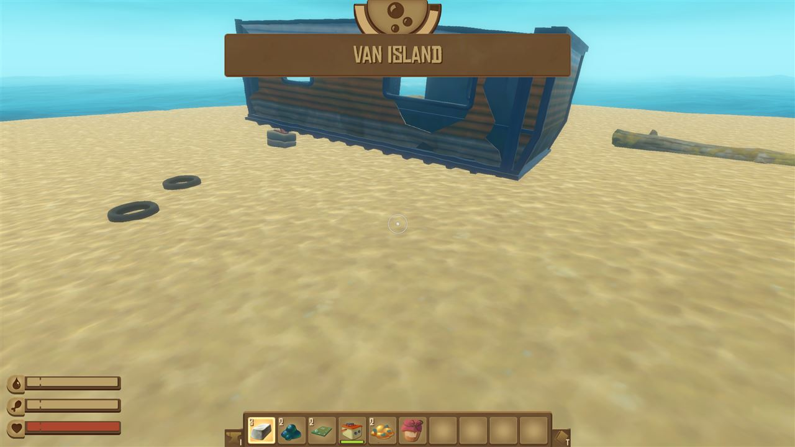
*Arriving at "Van Island", one of the world randomizer's oddity islands.*

### What you can do on an island

Custom islands work like Raft's own: you can **walk** on them, the **raft runs aground** on them, and you can
**chop** palms, pines, birches and mango trees and **pick up** rocks, ores, clay, sand, berries, pineapples,
flowers and more. What you took **stays taken** (also after saving, loading and sailing away), and it **grows
back** after 3 in-game days (the island's builder or `spawnpool.txt` can change that).

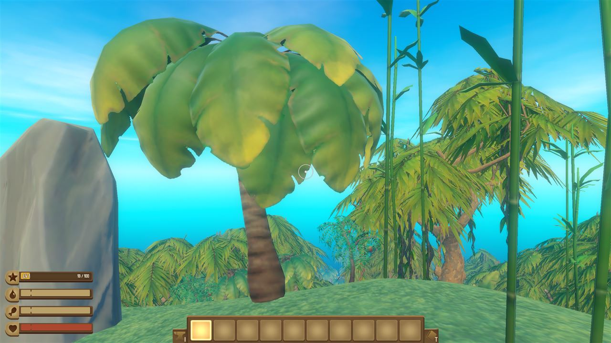
*On a generated tropical island: Raft's bamboo, palms and plants, placed where Raft's own islands have them.*

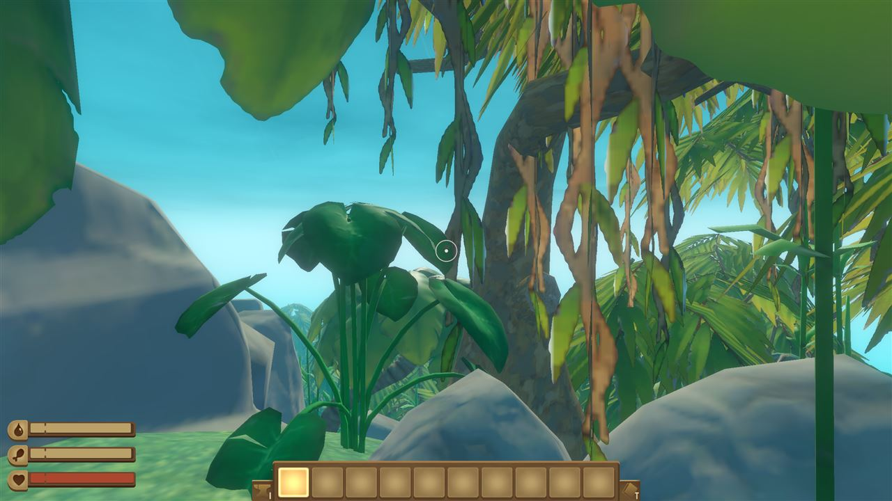
*A generated island with the Nature setting on "Jungle": you have to squeeze between the trees.*

**Diving:** generated islands rise from a deep sea floor like Raft's own: a sandy shelf about 10 m deep with corals
and sea plants, then a drop-off. Giant clams, silver algae, stones, ores, scrap and the seaweed on sea vines can be
picked up.

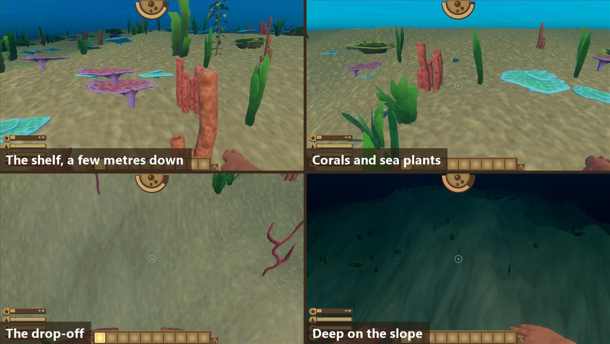
*Under water around a generated island: the shelf, the reef, the drop-off and the slope further down.*

**Flying and sunken islands:** some islands float high in the sky (build stairs or pillars up from the raft), others
lie under the surface for divers.

### Notes, chests, zones and creatures

The builder of an island can give it much more than land (see [section 8](#8-making-islands-come-alive)). In a world:

- **Notes:** look at a readable object (a sign, a paper, a bottle...) and press the interact key (**E**) to read it.
  Close it with E, Tab, Esc or the button.
- **Chests:** look at one and press **E**: the items go into your inventory. The chest is then empty for everyone
  until it fills up again (after the regrow days, or never). Some chests are **locked** until you have their key.
- **Trigger zones:** invisible areas that fire when a player walks in: a message, items, or an **ambush** (animals
  that appear the moment you step in).
- **Creatures:** Raft's own animals at the island's creature spots, with the builder's toughness, size and colour.
  Warthogs and bears fight you; chickens, goats and llamas can be caught with Raft's net launcher and kept on the raft.
  Killed and caught animals come back after the regrow days unless the builder said never.

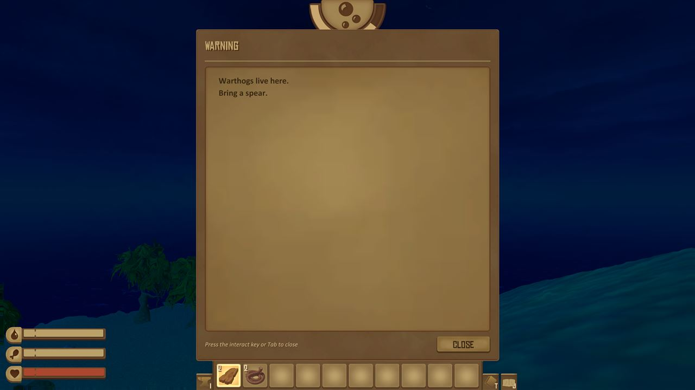
*A note found on an island ("Warthogs live here. Bring a spear."). Press E, Tab or Esc to close it.*

### Quests

An island with a quest shows a **quest panel** on the right when you arrive, with its steps: go somewhere, read a
note, open a chest, defeat or catch animals, collect story items, find journal pages. Each step done shows what's
next; the last one gives the reward to every player near the island.

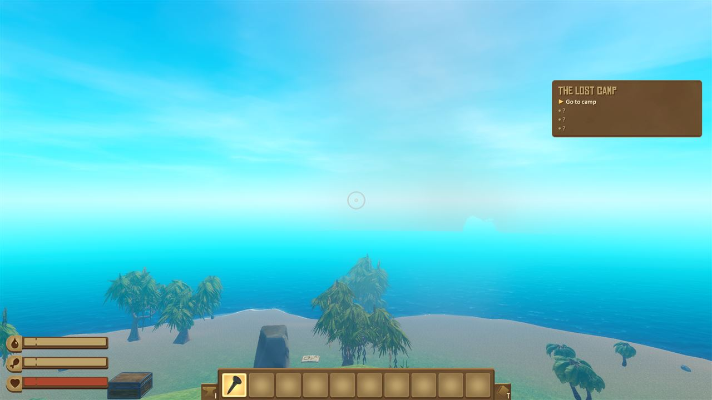
*The quest panel of "The lost camp" on the right: the first step is "Go to camp".*

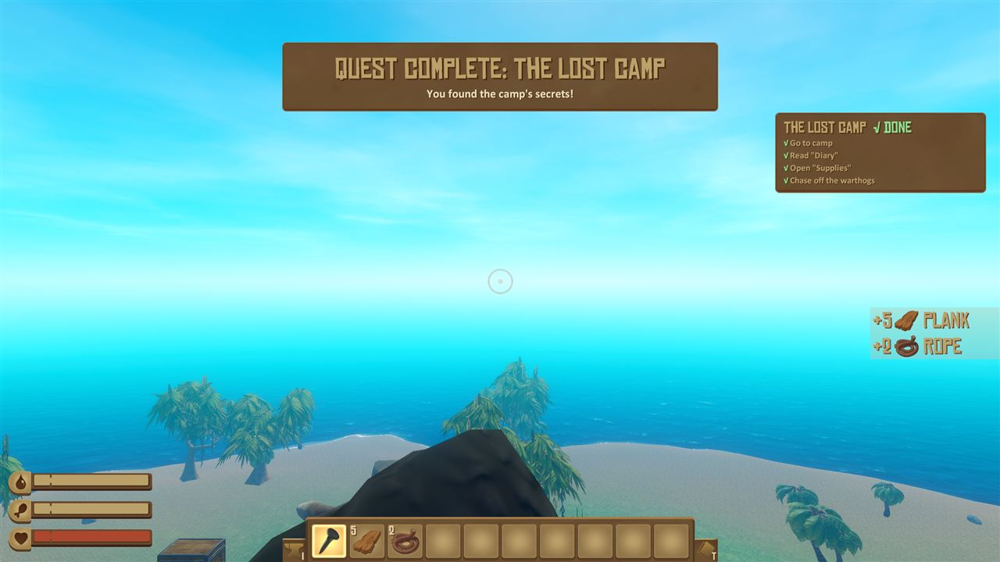
*Quest complete: the banner, every step ticked in the panel, and the reward (planks and rope) in the inventory.*

### New islands from quests and rules

A finished quest (or a plan's rule) can **bring a new island**: every player sees a banner with a message and how far
and which way it is, and the island's dot on the Receiver carries its name.

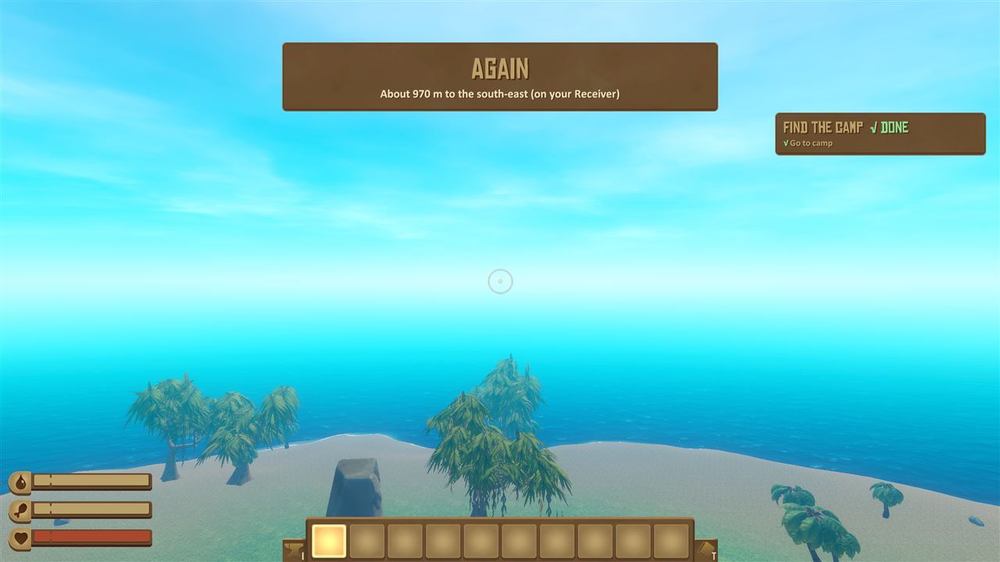
*A rule brought a new island: "About 970 m to the south-east (on your Receiver)". The quest panel shows the
finished step.*

### The journal (J)

Press **J** to open the journal: the crew's **story items** (keys, maps, logs...) with their pictures, and every note
you have read, on paper. Story items belong to the whole crew, like Raft's own quest items.

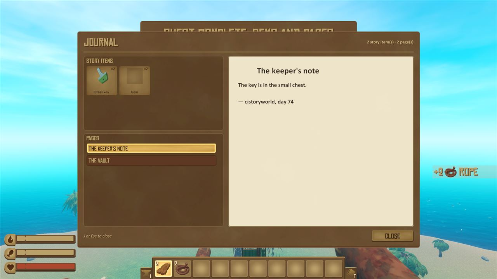
*The journal: two story items at the top left, the pages read below, and the page "The keeper's note" open.*

## 4. The world randomizer

The randomizer makes a **normal Raft world** play out differently every time, with or without custom islands, and
without touching Raft's story (the radio tower, Vasagatan, Balboa, Caravan Town, Tangaroa, Varuna Point, Temperance
and Utopia stay as they are). Choose it in the New Game box: **Off**, **Light**, **Normal** or **Wild**, and which
parts take part:

| Part | What you'll find |
|---|---|
| **Colours** | Animals and sharks (Bruce too) now and then in another colour: charcoal, ash, rust, moss, frost, night... and rarely a gold shark |
| **Animals** | More animals on Raft's islands, now and then puffer fish on the reef |
| **Alphas** | Rare bigger, darker **alpha** warthogs, bears, hyenas and screechers (3× health), and a huge **Big Bruce**. A banner warns you. Killed, they drop a **trophy head**, meat and leather |
| **Loot** | Some of the crates and giant clams on Raft's islands lie in other places; now and then extra crates and barrels |
| **Finds** | A **treasure hunt** (a map in a bottle on the beach leads to a buried chest), an **abandoned camp**, a **castaway's stash**, and on Raft's big islands a **den** with a guard and a hoard |
| **Oddities** | Small odd islands while you sail: a van, a caravan, a crashed plane, a stranded boat, a hermit's shack, a statue, rocket debris, a hut of raft blocks |
| **Bosses** | Now and then a **boss lair**: climb the plateau and a named beast (Old Ironhide, Frostfang, Ashmaw, the Tusk King, the Laughing One) wakes with two guards |
| **Large** | Now and then a **large island** as big as Raft's big ones, with a made-up name, animals, hidden loot, scenes from the quest islands and a den |

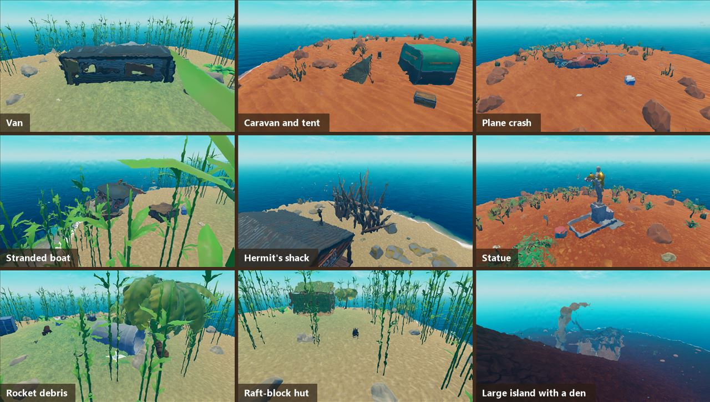
*The oddity islands. Each has loot, a note and a banner with its name when you arrive.*

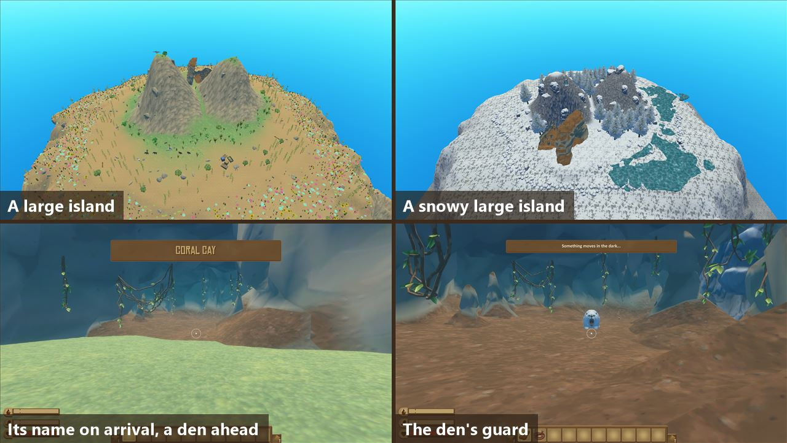
*Large islands: tropical or snowy, with warthogs and animals to catch, a made-up name ("Coral Cay") and a den whose
guard wakes when you walk in ("Something moves in the dark...").*

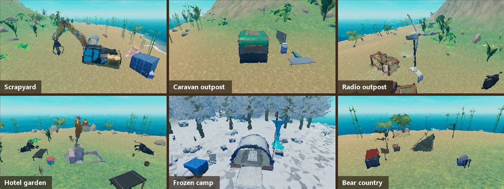
*Scenes on large islands, made from the props of Raft's quest islands, each with a chest and a note.*

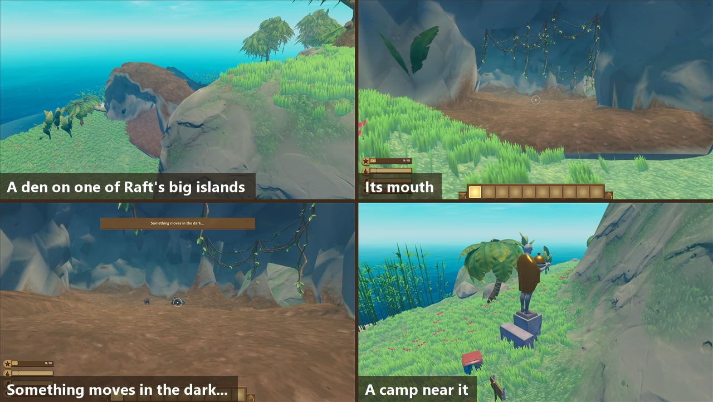
*The Finds part can put a den on one of Raft's own big islands: a rock outcrop with a den inside, a guard and a hoard.*

**Changing it later:** `Randomizer` (F10) shows what it does in your world; the host can change it, for example
`Randomizer wild` or `Randomizer -alphas`. Everything follows from the world's seed, so every player sees the same
colours, alphas and crates.

## 5. World rules: monster difficulty and build cost

### Monster difficulty

| Level | Monsters' health | Damage they deal to players |
|---|---|---|
| **Timid** | ×0.75 | ×0.75 |
| **Normal** | ×1 (as Raft made them) | ×1 |
| **Fierce** | ×1.25 | ×1.25 |
| **Savage** | ×1.5 | ×1.5 |
| **Nightmare** | ×2 | ×2 |

Monsters are the animals that fight players, on Raft's islands and custom ones: sharks, warthogs, bears, polar bears,
screechers, puffer fish, rats, hyenas, bees, angler fish, the butler bots and the bosses. Left as Raft has them: puffer
fish damage, and everything about Bruce and your raft (his bites on it, how often he comes, how soon he comes back).
In Peaceful and Creative monsters can't hurt you, so only their health changes.

### Build cost

Everything in the **build menu** (the hammer's foundations, floors, walls, roofs, stairs...) costs **0-100 % more**,
always rounded up: at +50 % one plank becomes two, two become three, three become five. Removing a block gives back
half of what it cost (as in Raft), and repairing and reinforcing cost more too. The crafting menu (Tab) costs the same
as in Raft.

**Both rules** are the host's for every player, also players who join later. The host can change them in a world:
`Monsters savage`, `BuildCost 25`. At the main menu the same commands set the choice for the next new world.

---

## 6. The level up system

Levels come to a world with an island made with **Level up system: On**. You switch it on in the editor's
**Island** tab (Rules), or with the generator's **Level up** choice. Once such an island has appeared in a world, levels
are on there for good, for every player. A world without one plays as Raft always does.

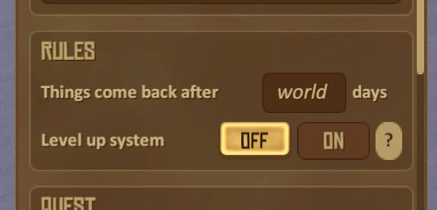
*The switch in the Island tab's Rules.*

### Earning EXP

Hit a monster and the EXP it gave you floats up over it. Each hit gives the share of the monster's EXP that it took off
its health, so killing it gives all of it. If you fight it together with a friend, each of you gets your own share.
Chickens, goats, llamas, turtles, stingrays, dolphins, whales and people give nothing.

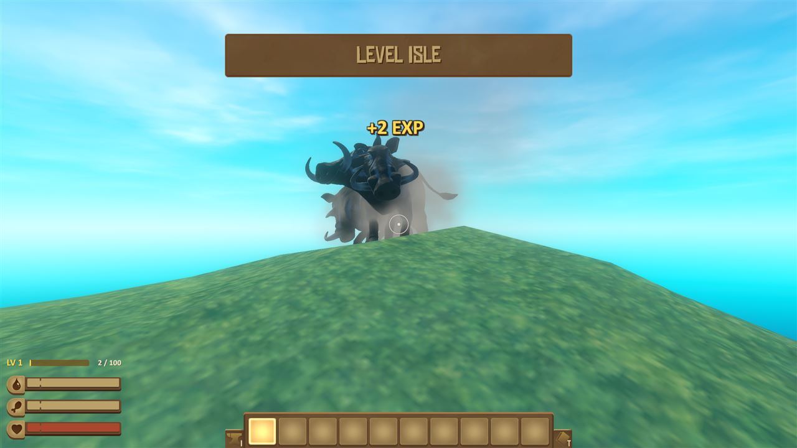
*A hit on a warthog: +2 EXP.*

Tougher monsters that bite harder are worth more, measured against Bruce the shark, who is worth **20 EXP**:

| Monster | EXP | Monster | EXP |
|---|---|---|---|
| Bruce (shark) | 20 | Bear | 13 |
| Warthog | 13 | Polar bear | 15 |
| Screecher | 12 | Hyena | 7 |
| Puffer fish | 9 | Rat | 7 |
| Mama bear (Balboa) | 67 | Hyena boss | 40 |

An island's own Hard or Boss animals are worth more than Raft's plain ones.

| From level | EXP to the next | About |
|---|---|---|
| 1 → 2 | 100 | 5 sharks |
| 2 → 3 | 200 | 10 sharks |
| 3 → 4 | 400 | 20 sharks |
| 4 → 5 | 600 | 30 sharks |
| then | 200 more each level | 10 more sharks each level |

### Levelling up and spending points

A box shows when you reach a new level. **Click it** (in a menu, where the mouse is free) or press **K** to spend
your points. The **EXP bar** is one more of Raft's own stat bars, above thirst, hunger and health: a gold star on
its badge, a gold fill, the level on the left and the EXP to the next level on the right. It glows for a moment when you
earn EXP. A **+** after the level means points are waiting. While Raft's inventory (**Tab**) is open, a **Stats**
button sits next to the bar.

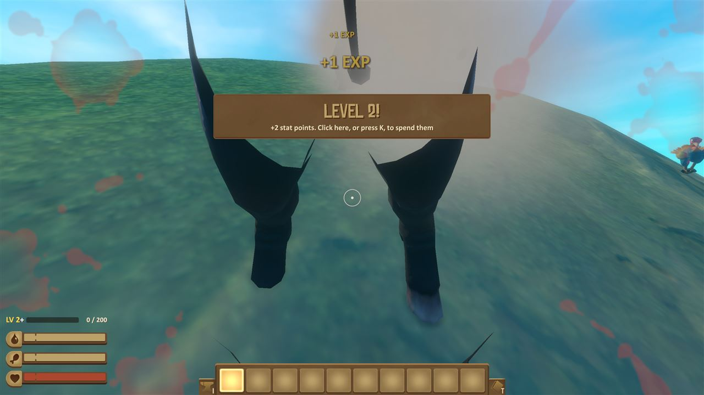
*Level 2: two stat points to spend. The EXP bar is at the bottom left.*

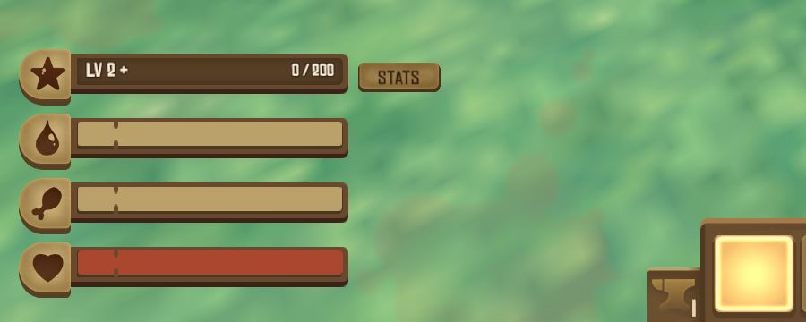
*The EXP bar with its star, styled like Raft's thirst, hunger and health bars, and the Stats button while the inventory is open.*

Every level gives **2 stat points**. Each point makes a stat **1% better**, and a stat takes at most 10 points (+10%):

| Stat | A point makes it |
|---|---|
| Walk speed, Run speed, Swim speed | 1% faster |
| Jump height | Jump 1% higher |
| Damage | 1% more damage to monsters, with every weapon |
| Health | 1% more maximum health |
| Hunger, Thirst | Drain 1% slower |
| Oxygen | Breath lasts 1% longer under water |

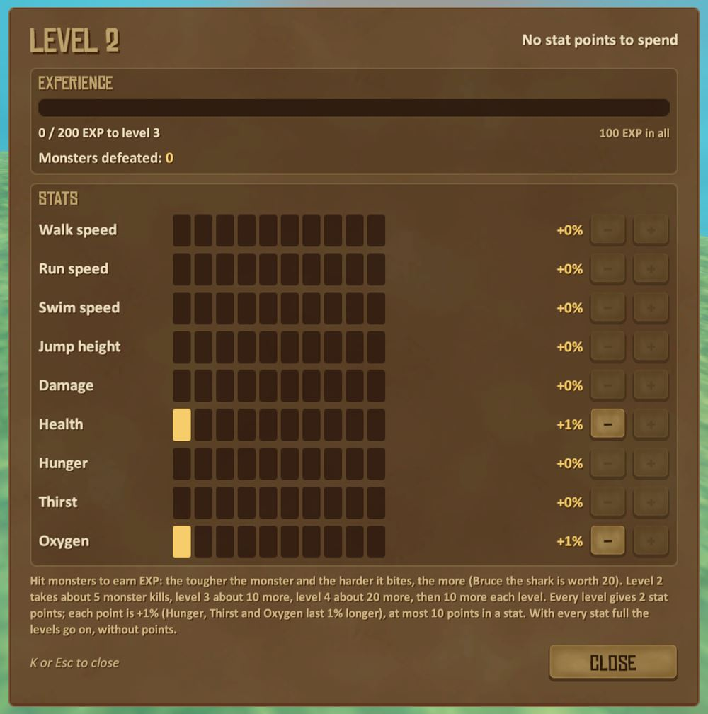
*The stats page (K): the level, the EXP, the monsters you defeated, and the nine stats. **+** puts a point in, **−**
takes it back while the page is open.*

All 90 points are there at level 46. After that the levels go on, without points.

**Playing together:** each player has their own level, and the host keeps it with the world. A player who joins again
gets theirs back. The host works out everyone's EXP, so a monster is worth the same to everybody. Other players see a
small gold **Lv 5** under your name.

---

## 7. Building your own island: the editor

Click **EDITOR** in the main menu. A loading box shows what it is doing ("Opening the editor", then "Loading Raft's
objects from its islands" with a bar) until the editor is ready: a few seconds the first time after starting Raft,
less after that. The editor opens on the sea with an empty build area.

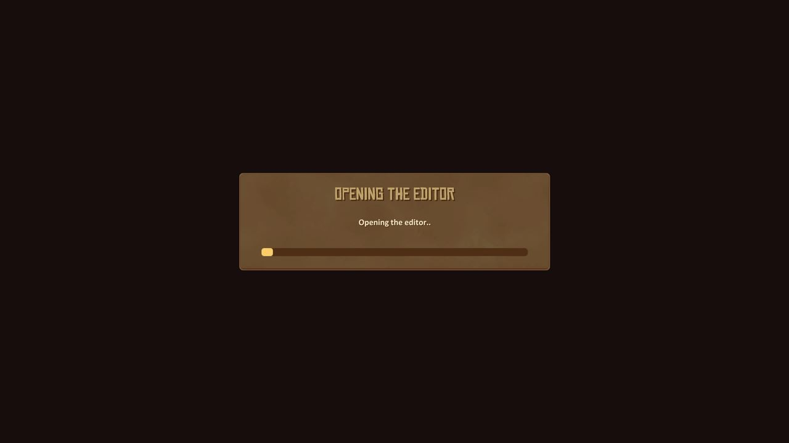
*The box that covers the screen while the editor opens.*

### 7.1 The screen

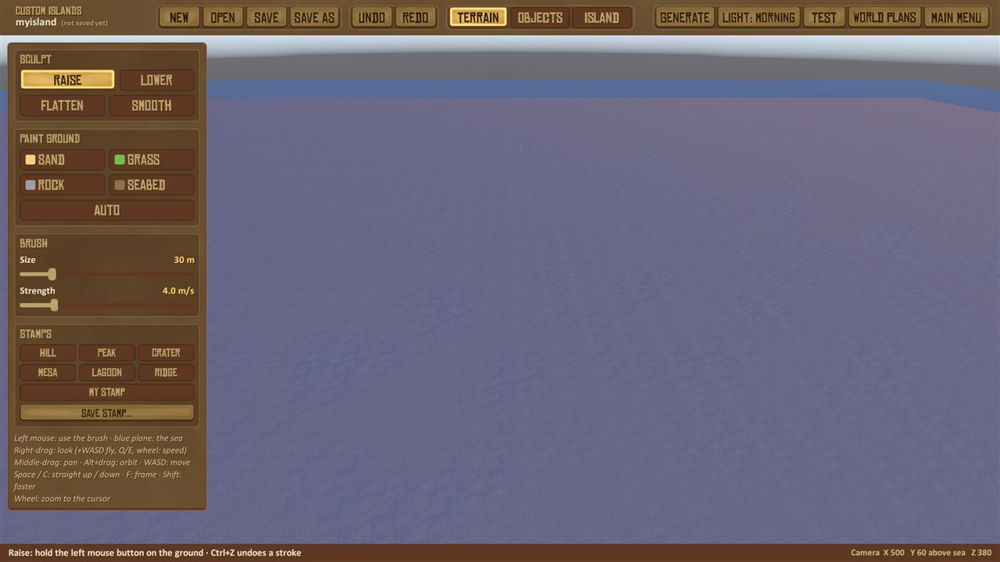
*The editor on the Terrain tab.*

- **Top bar:** New, Open, Save, Save as · Undo, Redo · the three tabs **Terrain**, **Objects**, **Island** (F1, F2, F3)
  · **Generate** (the island generator), **World plans**, **Main menu**. The island's name is at the top left.
- **Tool panel** (left): the tab's tools in bordered groups. The lit button is the one in use.
- **Status bar** (bottom): explains the tool, or the button under the mouse. On the right: where the camera is.
- **The blue plane is the sea.** Everything below it is under water in the game.

**Moving the camera** (like Unity's scene view):

| Do this | To |
|---|---|
| **Right-drag** | look around; while held, **WASD** flies where you look, **Q/E** go down and up, the **wheel** sets the speed |
| **WASD** or arrows | move over the island at the same height |
| **Middle-drag** | pan (the ground follows the cursor) |
| **Alt + left-drag** | orbit around the selection, or the middle of the view |
| **Wheel** | zoom towards what is under the cursor |
| **F** | frame the selection, or the whole island |
| **Shift** | three times faster |

Undo and redo everything with **Ctrl+Z** / **Ctrl+Y**; save with **Ctrl+S**, open with **Ctrl+O**.

### 7.2 Shaping the land (Terrain tab)

- **Sculpt:** **Raise**, **Lower**, **Flatten**, **Smooth**. Hold the left mouse button on the ground; the white ring
  shows the brush.
- **Paint ground:** the style's four textures (for a tropical island Sand, Grass, Rock, Seabed). **Auto** textures an
  area by its height and slope again.
- **Brush:** size and strength.
- **Stamps:** click the ground to put down a **Hill**, **Peak**, **Crater**, **Mesa**, **Lagoon** or **Ridge**, as big
  as the brush (Q/E turn it). **Save stamp...** keeps the land under the brush as a stamp of your own.

**Island styles.** On the Island tab, **Style** ◄ ► switches between Tropical, Snowy, Desert, Forest and Volcanic: the
ground takes the style's textures, the paint buttons get its names, and the generator uses its plants and animals.

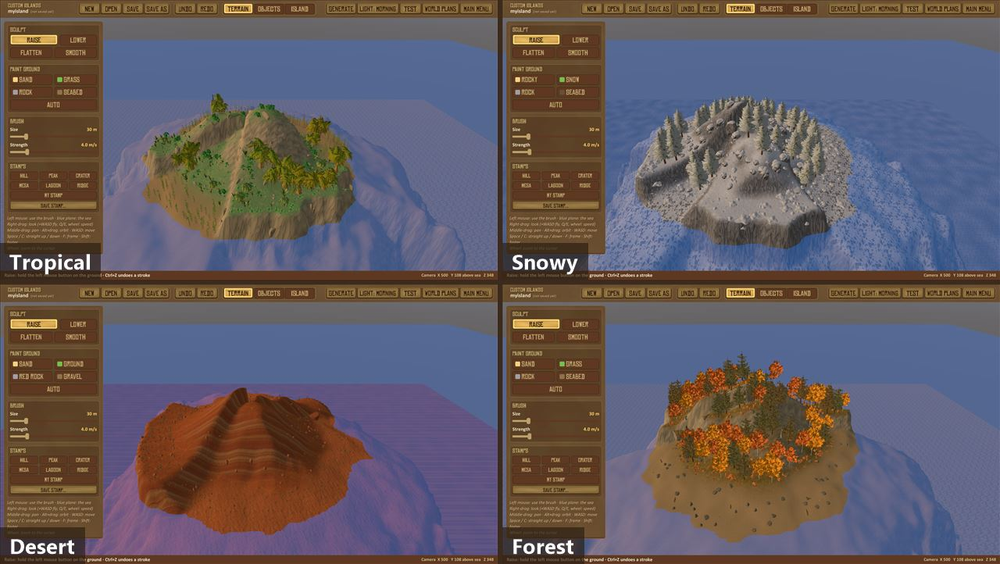
*The same kind of island in four styles, as the generator makes them: tropical palms, snowy pines, desert red rock,
forest birches.*

### 7.3 Placing objects (Objects tab)

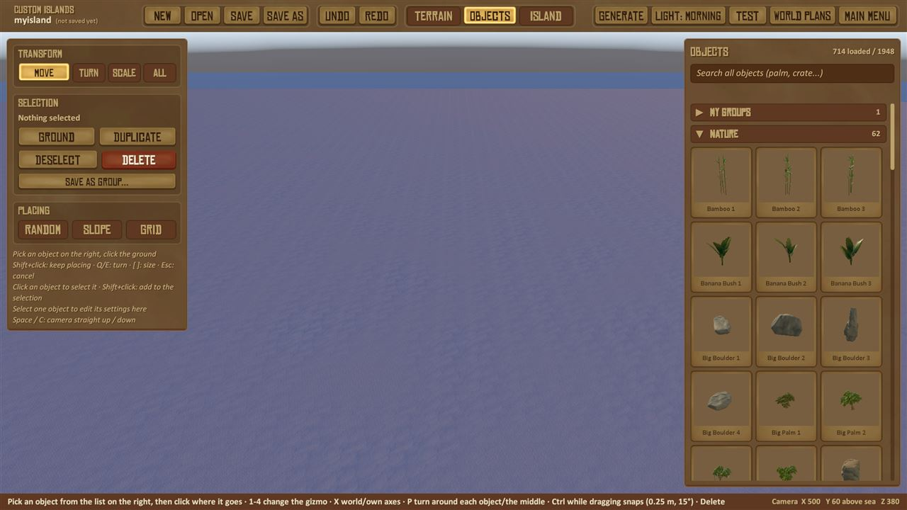
*The Objects tab: the tools on the left, the object browser on the right (713 of 1,947 objects loaded).*

The **object browser** on the right has **every object of Raft**, about 1,900, each with a picture: nature, harvestable
trees and rocks, Raft's 88 building blocks (to build huts or your own abandoned rafts), everything else you can build
on a raft, and the objects of Raft's story islands (they load the first time you open their category). **Search**
finds objects in every category.

- **Place:** click an object in the browser, then click the ground. **Q/E** turn it, **[** and **]** resize it,
  **Shift+click** keeps placing, **Esc** stops.
- **Select:** click a placed object; **Shift+click** adds more.
- **Transform** (keys 1-4): Move, Turn, Scale or All, with the coloured handles.
- **Selection:** **Ground** drops the selection onto the terrain, **Duplicate** (Ctrl+D), **Deselect**, **Delete**.
- **Placing:** **Random** gives each placed object a random turn and size, **Slope** leans it with the ground, **Grid**
  snaps to Raft's 1.5 m building grid (Q/E then turn in 90° steps).
- **Groups:** select several objects and click **Save as group...**. The group appears under **My groups** at the top
  of the browser, to place on any island.

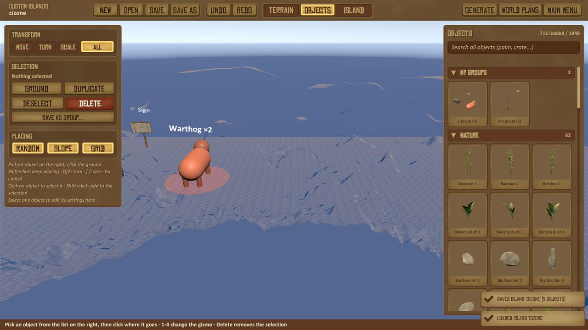
*A herd of two warthogs (the pink marker) and a sign. "My groups" in the browser holds two saved groups.*

Selecting a single object shows its **inspector** in the tool panel: creature settings, a note, loot, a zone, a colour,
behaviours (see [section 8](#8-making-islands-come-alive)).

### 7.4 The Island tab

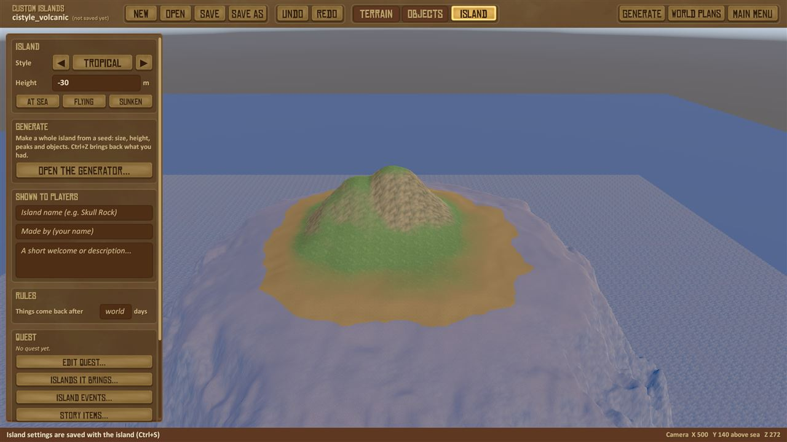
*The Island tab: style, height in the world, the generator, the name players see, the island's rules and its quest.*

- **Style** and **Height** in the world: **At sea** (0), **Flying** (60 m up) or **Sunken** (30 m under water), or any
  number. The editor always shows the island at sea level; the height applies in the game.
- **Shown to players:** the island's **name**, your name and a short welcome. Players see them as a banner.
- **Rules:** how many in-game days until chopped trees, picked items, killed animals, looted chests and fired zones
  come back on this island (empty = the world's setting, 0 = never).
  **Level up system** Off / On: see [section 6](#6-the-level-up-system).
- **Quest**, **Islands it brings**, **Island events**, **Story items**: see [section 9](#9-stories-quests-behaviours-story-items).

### 7.5 The island generator

**Generate** (top bar) makes a whole island for you to start from. The **preview** map on the right follows every
change; the line under it says how big the island is and how many objects it will get. The **seed** picks one island
of all possible ones: the same seed and settings always give the same island. Every setting has a **?** to hover.
Generating replaces the island you have; **Ctrl+Z** brings it back.

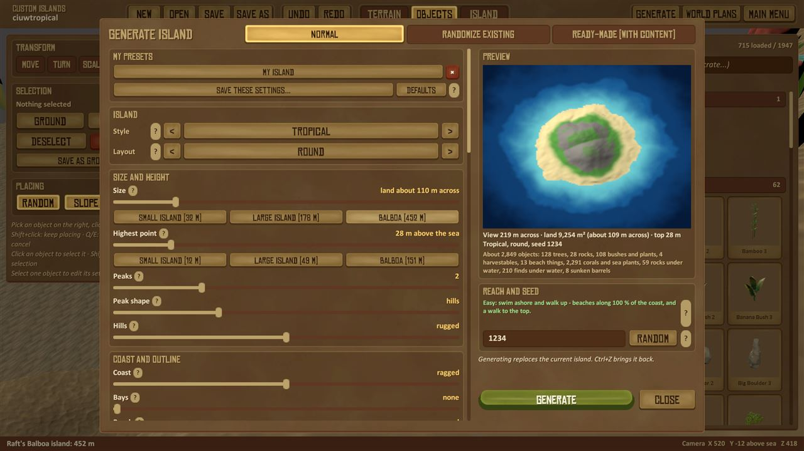
*The Normal tab: your presets, the style and layout, the size and height (with buttons for the size and height of
Raft's own small island, large island and Balboa), peaks, hills and the coast.*

- **Island:** the **style** and the **layout**: round, atoll, archipelago, sea stacks, plateau, marsh, crescent, twin
  peaks.
- **Size and height, coast and outline, land features:** peaks and their shape, hills, coast, bays, beach, cliffs,
  stretch, valleys, lakes, terraces, erosion.
- **Under water:** a **deep sea floor like Raft's** (a shelf about 10 m deep, then a drop-off) or a **shallow** one
  (a flat seabed 20 m down), the width of the shallow water, how steep the drop-off is, and the seabed (sand, rocky,
  or a reef ring).
- **Nature:** trees, bushes, rocks, beach things and harvestables, with quick buttons **None**, **Sparse**,
  **Like Raft**, **Dense** and **Jungle**. "Like Raft" places everything where Raft's own islands have it: a nearly
  bare beach, palms inland on grass, boulders on steep ground.
- **Life under water:** corals, sea vines, kelp, rocks, stones, ores, giant clams and sunken barrels, placed like
  around Raft's own islands.
- **Animals:** hostile creatures (the style's own, or the kinds you click), how tough (Easy, Normal, Hard, Boss),
  friendly animals to catch, sea creatures.
- **Loot:** how many loot boxes, their lowest and highest **tier** (1: planks and plastic ... 5: titanium, explosive
  goo, batteries), in the open or hidden.
- **My presets:** **Save these settings...** keeps them under a name; **Defaults** starts over.

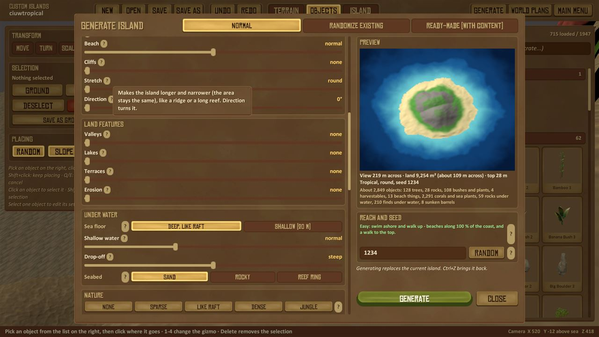
*Further down the Normal tab: the land features, the Under water group (Deep, like Raft) and the Nature quick buttons.
Hovering a ? shows its help (here Stretch).*

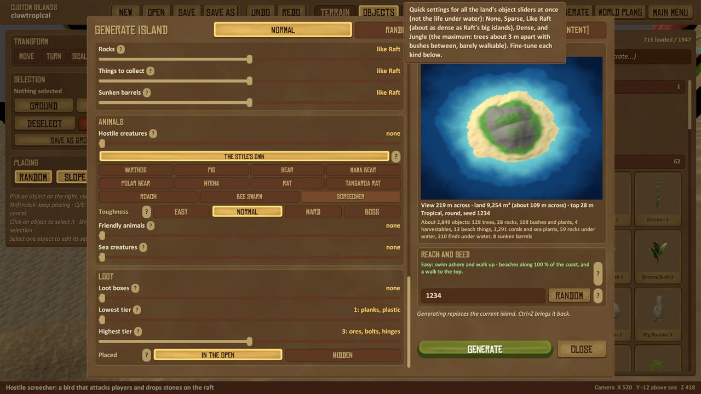
*The bottom of the Normal tab: things to collect, sunken barrels, animals (the kinds to click, the toughness) and loot.*

**Can players reach it?** Above the seed, a coloured line says whether a player arriving by raft can get onto the
island: **Easy** (beaches, walk to the top), **Reachable**, **Possible but tricky** (a jump onto a low ledge),
**Possible but unlikely**, or **Not from the raft without building** (cliffs all around: players need stairs, a
ladder or foundations). It is worked out with Raft's own player: how steep it can walk, how high it jumps.

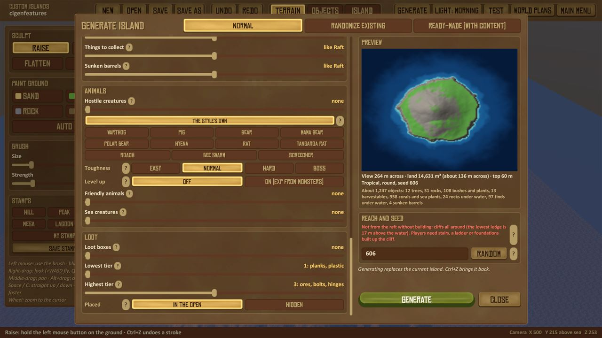
*A cliff island: "Not from the raft without building: cliffs all around (the lowest ledge is 17 m above the water)."*

**Randomize existing:** click one of Raft's 33 islands (each has a picture). **Something new like it** makes a new
island with its size, height and look; **A variation of it** starts from the island's own ground and reshapes it
(stretch, mirror, roughen, coast, valleys...).

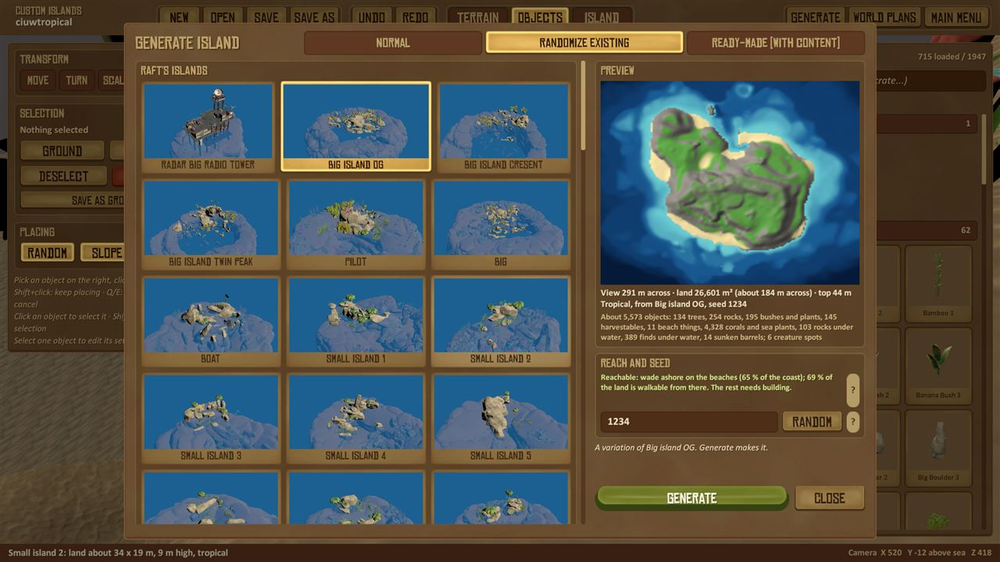
*Randomize existing: Raft's islands, measured, with a picture each. Here a variation of "Big Island OG".*

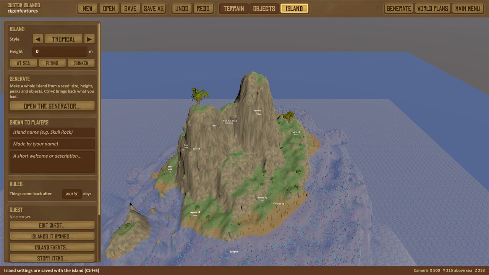
*A variation made from one of Raft's big islands, opened in the editor.*

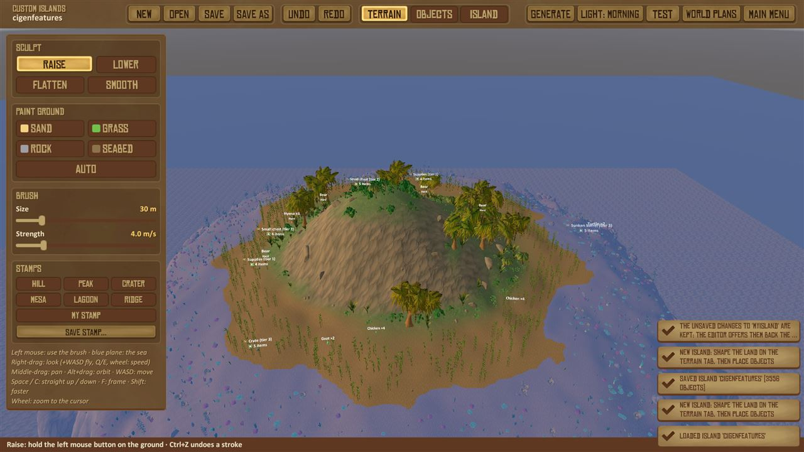
*A generated island in the editor, ready to change: its trees and bushes are ordinary objects you can move or delete.*

The editor's view under water shows what a deep sea floor looks like:

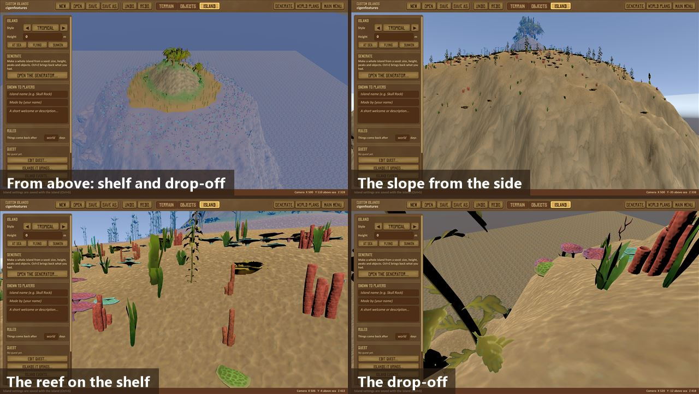
*A generated island on the deep sea floor: the shelf and drop-off from above, the slope, the reef, the drop-off.*

### 7.6 Ready-made islands (map types)

The generator's **Ready-made (with content)** tab makes whole islands with a story: chests, notes, creatures, zones
and a quest, from a seed. Click a card, then **Make** (click twice): the island is saved as `gen-<type>-<seed>` and
opened for you to change.

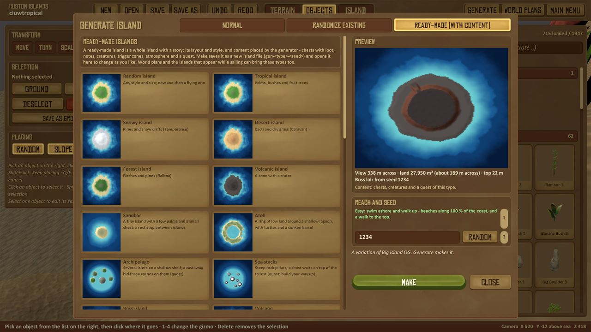
*The Ready-made tab: plain islands of each style, and the map types with their content.*

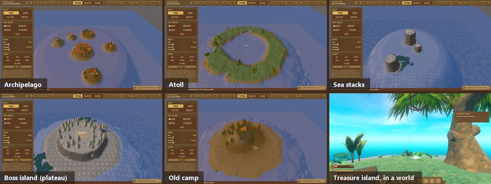
*Some map types: an archipelago (a castaway's caches), an atoll, sea stacks (a chest on the tallest), a boss island,
an old camp, and a treasure island in a world, its quest panel saying "Find the map on the beach".*

| Map type | What it is |
|---|---|
| Sandbar | A tiny island with a few palms and a small chest: a rest stop |
| Atoll | A ring of land around a shallow lagoon |
| Archipelago | Several islets; a castaway's note and three caches |
| Sea stacks | Steep rock pillars; a chest on top of the tallest (build your way up) |
| Boss island | A plateau with cliffs and a ramp; the arena wakes a boss bear |
| Volcano, swamp, frozen spire | A tall volcano with embers; low land with pools and mist; a snowy peak with a cache on top |
| Treasure island | A map in a bottle on the beach leads to the X and a treasure chest |
| Old camp | An abandoned camp with a notice board and supplies: a good first island of a story |
| Sunken island, sky island, wreck | Under water; floating 45-90 m up with a cache; an abandoned raft of Raft's blocks |
| Oddities, boss lair, large island | The world randomizer's islands ([section 4](#4-the-world-randomizer)) |

### 7.7 Saving and sharing

**Save** (Ctrl+S) saves straight away once the island has a name; **Save as** and **Open** show the **Islands**
window: a name, the height in the world, and your saved islands (click = pick, double-click = open, Delete asks
first).

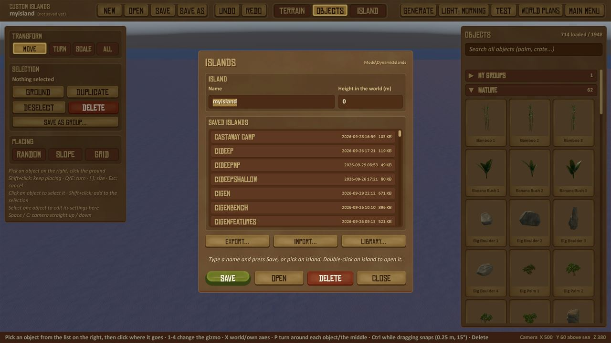
*The Islands window: the name and height, and the saved islands with their date and size.*

Islands are files in `<Raft>\Mods\DynamicIslands\` (`<name>.island`). **Share an island by copying its file** to a
friend's folder. In multiplayer the host's island files are sent to players who don't have them.

### 7.8 Your first island, step by step

1. Main menu → **EDITOR**.
2. **Generate** → Normal tab: Style **Tropical**, click **Small island**, Nature **Like Raft** → **Generate**.
3. **Terrain** tab: raise a hill, paint a sandy path, stamp a **Lagoon**.
4. **Objects** tab: search "chest", place a **Chest**, click **Add items...** and pick some loot.
5. Place a **Sign** from "Notes & signs", click **Edit note...**, write a welcome.
6. **Island** tab: give it a name ("Skull Rock") and your name.
7. **Save** (Ctrl+S), type a name, Enter.
8. Main menu → **NEW WORLD** → create a world. Your island takes part in the Random islands plan, or press F10 and type
   `SpawnIsland <name> 250` to have it appear 250 m ahead right away.

---

## 8. Making islands come alive

Select an object to see its **inspector** in the tool panel. Everything here can be undone.

### 8.1 Creatures

Open **Animals: hostile**, **Animals: catchable** or **Sea creatures** in the browser and place an animal: warthog,
pig, bear, polar bear, hyena, rats, roach, bee swarm, screecher; chicken, goat, llama; puffer fish, angler fish,
turtle, stingray, dolphin, whale.

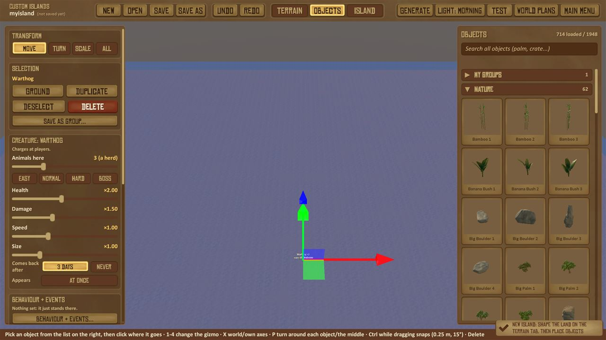
*A warthog spot: a herd of 3, health ×2, damage ×1.5, comes back after 3 days, appears at once.*

- **Animals here:** 1 to 8 (a herd).
- **Easy / Normal / Hard / Boss**, or set **health**, **damage**, **speed** and **size** yourself.
- **Comes back after** the regrow days, or **Never**.
- **Appears** at once, or **when a zone fires** (an ambush, see 7.4).
- **Colour** (every object): a swatch, the strength, or your own mix.

In the editor a creature is a coloured marker with its name, or Raft's real model once you have been in a world since
starting Raft:

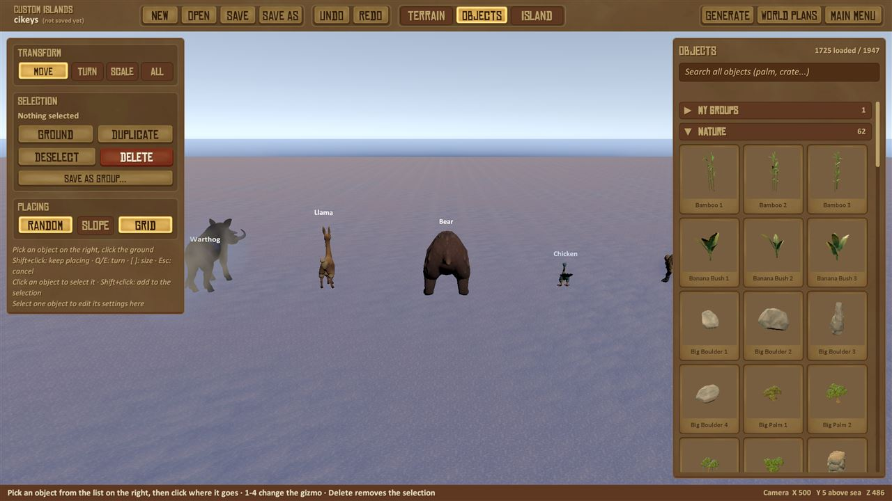
*Creature spots with Raft's own models: a warthog, a llama, a bear, a chicken.*

### 8.2 Notes and signs

"Notes & signs" has a paper, a bundle of papers, an open book, a sign, a notice board and a message in a bottle, and
**any object can be made readable** (**Add a note to it...**). A sign shows its note's title on its board.

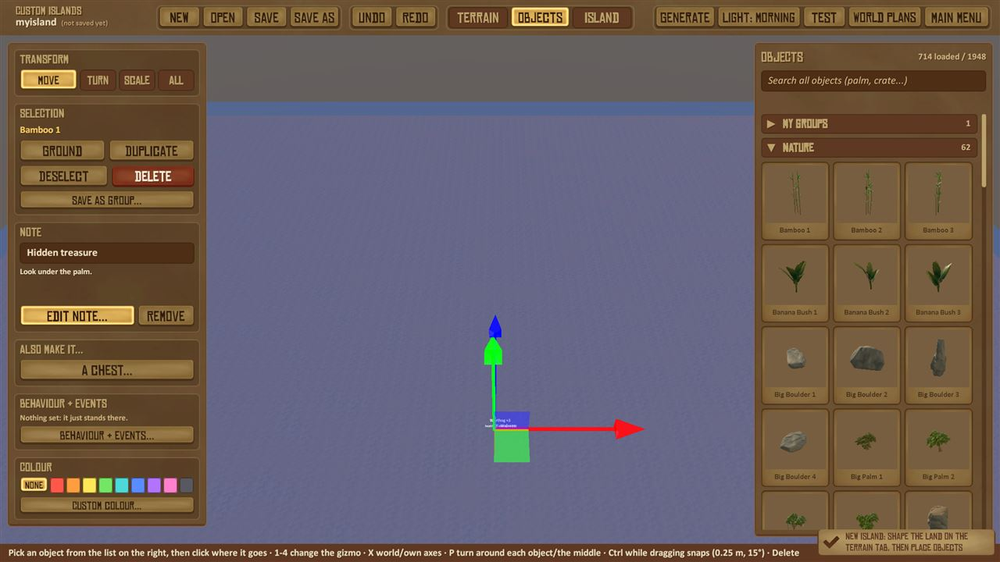
*An object with a note: its title "Hidden treasure" and the start of the text.*

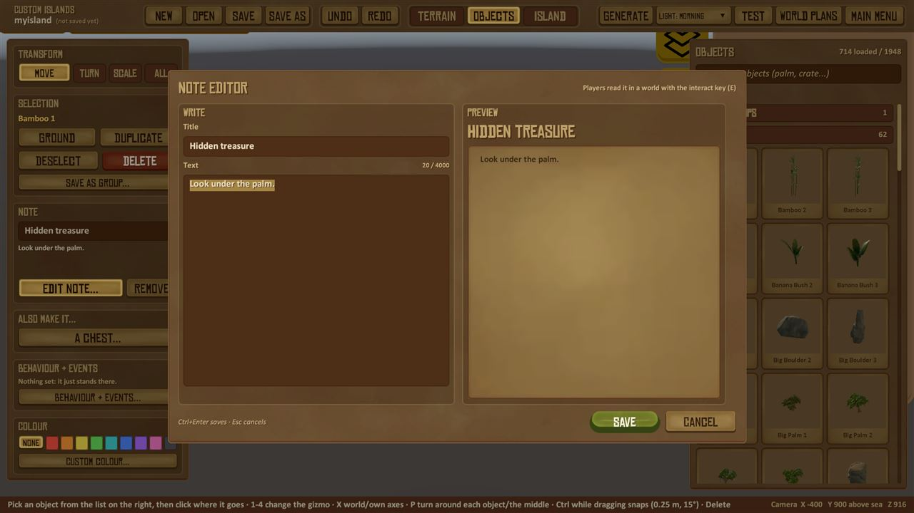
*The note editor: the title, the text (Enter starts a new line), and a preview of the paper players will see.*

### 8.3 Chests and loot

"Loot & chests" has chests, a crate, a wooden box and barrels, and **any object can hold loot** (**A chest...**).

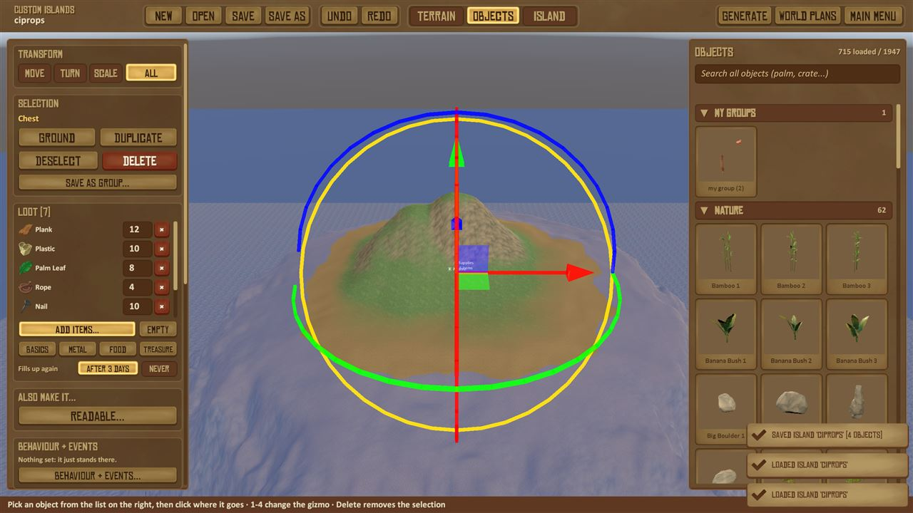
*A chest's loot: planks, plastic, palm leaves, rope and nails. The Basics, Metal, Food and Treasure sets fill it
quickly; it fills up again after 3 days, or never.*

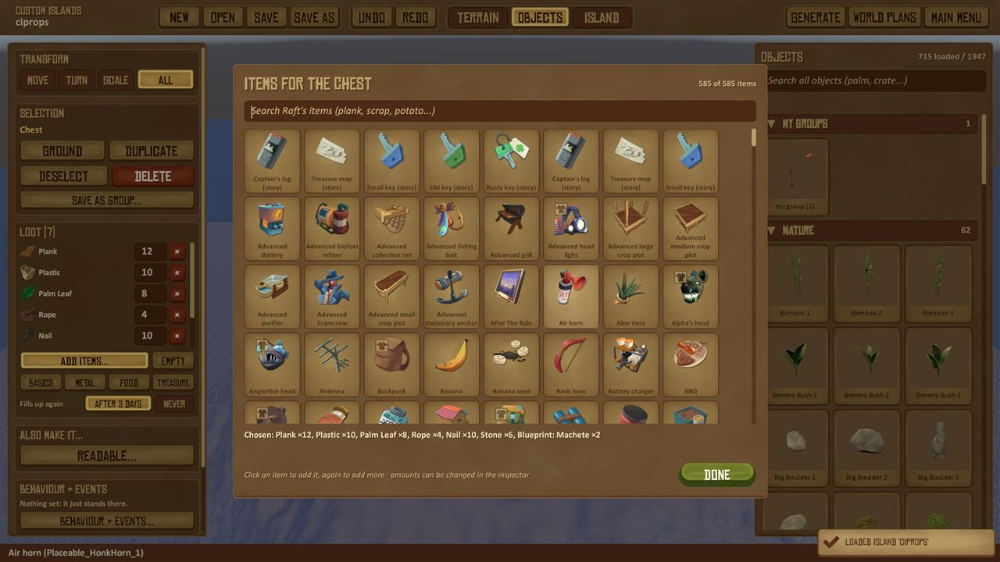
*Add items...: every item of Raft with its picture and a search. Click an item to add one, again to add more.*

### 8.4 Trigger zones and ambushes

A **trigger zone** ("Zones & triggers") is an invisible sphere. When a player walks in it shows your **message**,
**gives items**, and wakes the creatures that wait for it. It fires **once** per world (again after the regrow days)
or **every time**.

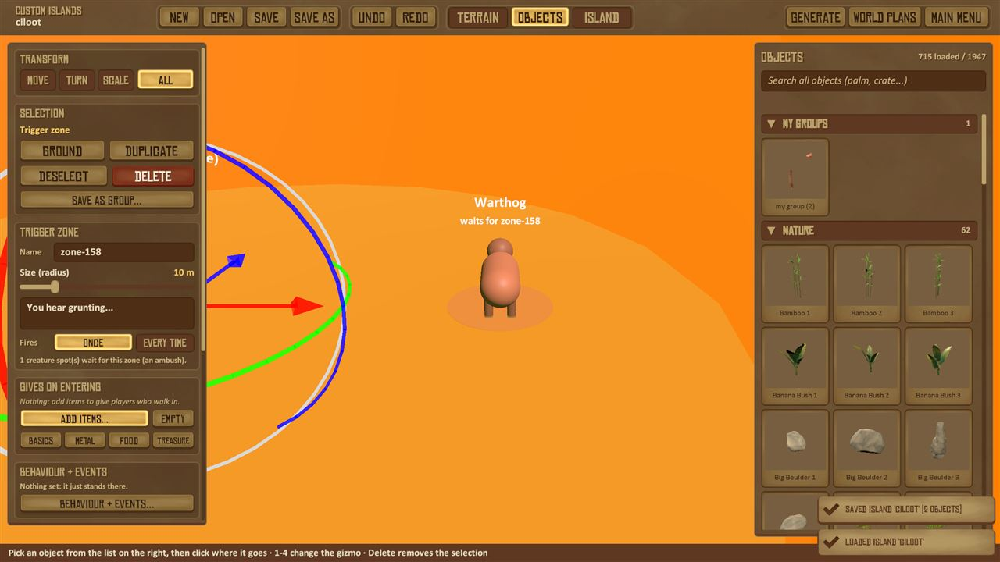
*A trigger zone (the orange sphere): its name, size 10 m, the message "You hear grunting...", fires once, and one
creature spot waits for it.*

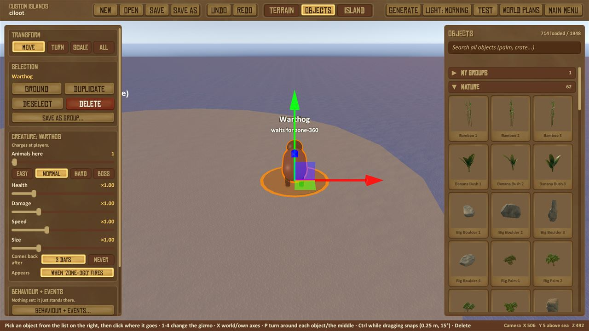
*The warthog's **Appears** is set to "when zone-158 fires": its name tag says it waits. It appears the moment a player
walks into the zone.*

**Invisible walls and ramps** (also in "Zones & triggers") are solid in the world but not seen: block a path, fence
an arena, or make a cliff climbable.

### 8.5 Atmosphere and sound

An **atmosphere zone** changes the fog colour, the light and adds particles (fireflies, mist, snow, embers) around a
spot; a **sound zone** plays one of Raft's 500+ sounds while a player is inside, or once on entering.

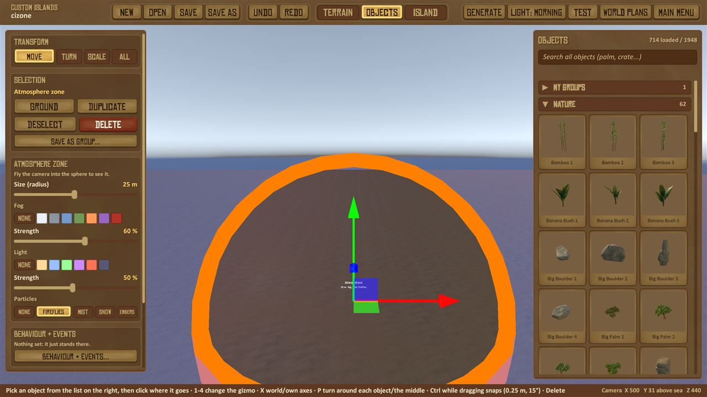
*An atmosphere zone: its size, fog colour and strength, light tint and strength, and particles (fireflies).*

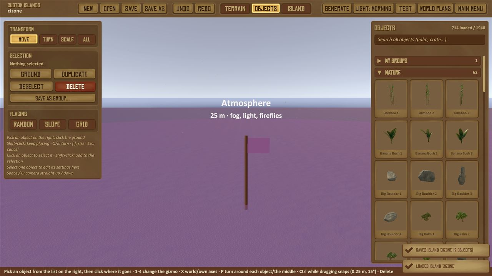
*Fly the camera into the zone to see it: purple fog and fireflies.*

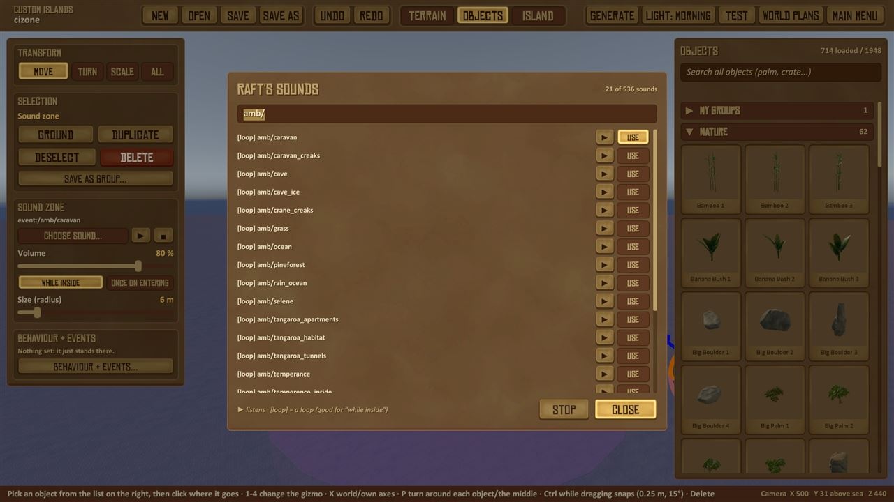
*Choose sound...: Raft's sounds with a search. ► listens, Use picks it.*

---

## 9. Stories: quests, behaviours, story items

### 9.1 Quests

**Island tab → Edit quest...**: a title, an introduction (shown when players arrive), up to 10 steps in order, a
reward and a closing message.

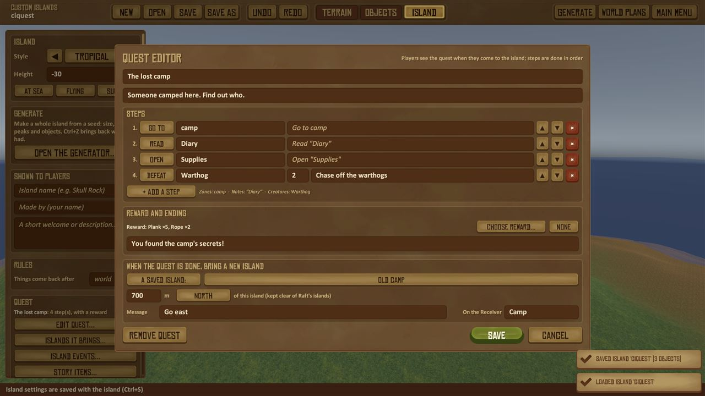
*The quest "The lost camp": go to the camp, read the diary, open the supplies, chase off 2 warthogs. The reward is
planks and rope, and when the quest is done it brings a saved island "Old camp" 700 m north, with a message and a
name on the Receiver.*

Steps: **go to** a trigger zone, **read** a note, **open** a chest, **defeat** or **catch** a number of animals,
**collect** a number of a story item, **find** journal pages. Steps point at things on the island by name; the
editor lists the names it knows.

### 9.2 Behaviour and events

Select any object → **Behaviour + events...**. No code needed:

- **A name** that actions refer to (objects with the same name act together).
- **Movement:** spin, bob, move back and forth, or **open and close** like a door, gate, bridge or lift (with a
  Preview in the editor).
- **At first:** there, or **hidden until shown** (a hidden creature spot is an ambush).
- **Players can use it:** Raft's "press E" hint with your own text ("Pull the lever").
- **Collision:** Raft's own, walk through, one box, or solid.
- **When ... then:** when a player uses it, walks into a zone, reads a note, opens a chest, or all the animals of a
  spot are defeated → show / hide objects, open / close doors, say a message, give items, play a sound, teleport the
  player, send a signal, write a journal page, or **wait** some seconds first.
- **Only if ...:** the player **has** an item or story item (or **uses one up**, like a key), an object is open,
  closed, shown or hidden, a signal was sent, the quest reached a step. Turn a check round with **not**; ask for
  **all** or **any** of them. **Otherwise** say a message.

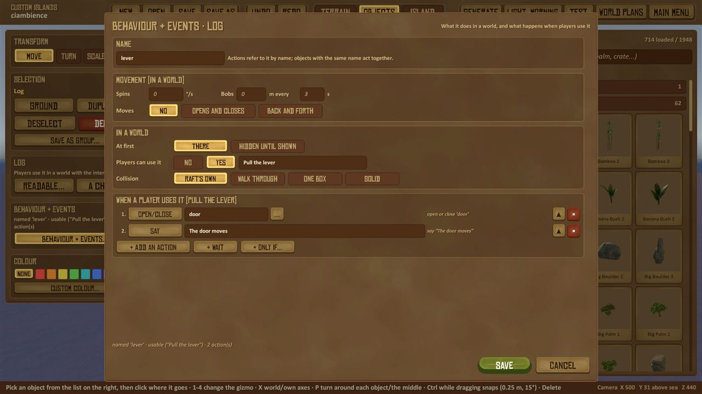
*A log named "lever" that players can use ("Pull the lever"): it opens or closes the door and says "The door moves".*

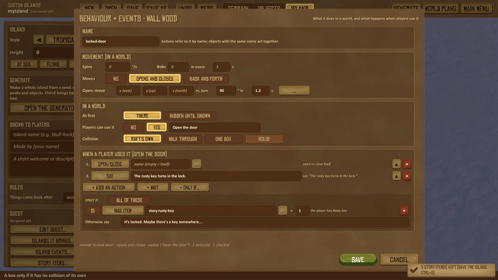
*A door that opens only if the player has the story item "rusty key"; otherwise it says "It's locked. Maybe there's a
key somewhere..."*

**Island events** (Island tab): actions for when players first come to the island and when its quest is done.

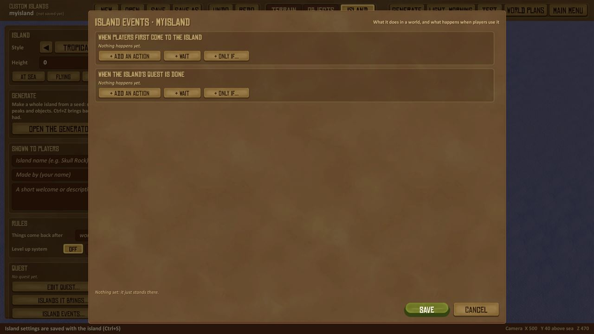
*Island events: what happens when players first come to the island, and when its quest is done.*

### 9.3 Story items and story sets

**Island tab → Story items...**: keys, map pieces, logs... with a name, a description and a picture (Raft's quest
item pictures or any Raft item). Chests, zones, quest rewards and "give" actions hand them out; "only if" checks ask
for them; players find them in the journal (J).

**Story sets** place a ready piece of a story in one step: **a locked door and its key** (in a chest with a note),
**a trail of notes** leading to a hidden chest, **a treasure map** (a bottle gives the map; the X digs up a chest
only for someone who has it), or **a locked chest** whose key is hidden in driftwood nearby.

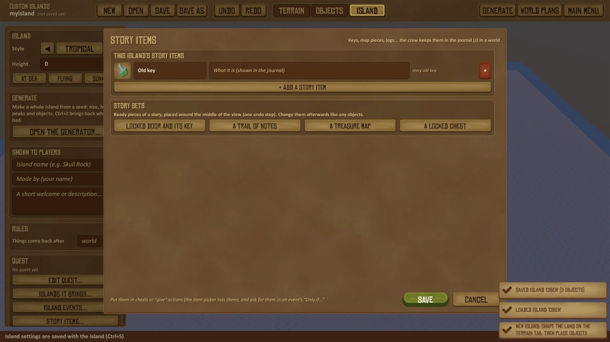
*The Story items window: the island's story items ("Old key") and the four story sets.*

### 9.4 Islands that bring islands

**Island tab → Islands it brings...** gives the island its own rules: "when my quest is done", "when step 2 is done",
"when zone X fires" or "when players first get here" → bring a saved island or a new island of a map type, how far
and which way, with a message and a name on the Receiver. A chain of shared island files is a story on its own.

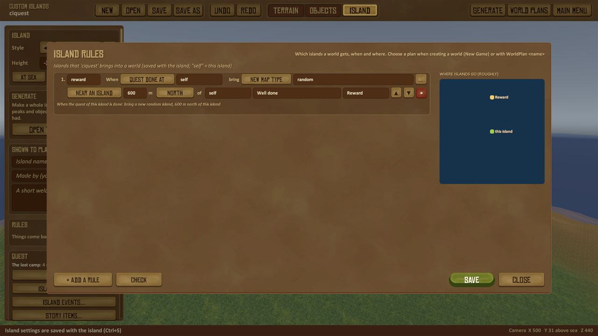
*An island rule: when this island's quest is done, bring a new island of a random type 600 m north, with the
message "Well done" and the name "Reward" on the Receiver. The map on the right sketches where islands go.*

## 10. World plans: which islands a world gets

A **world plan** is a list of rules; each rule brings one island: **what** (a saved island, a new island of a map
type, one from the spawn pool), **when** (the world starts, after N km, on day N, a quest done, a zone fired, players
reach an island, a signal, after another rule), **where** (ahead of the raft, or near an island in a direction) and
what players are **told**.

Choose a plan in the New Game box (**Custom Islands plan**). The mod comes with:

- **Random islands**: islands by chance while sailing (the default), **No custom islands**,
- **Island hopping**: an old camp, then each island you reach shows the way to the next,
- **Adventure**: a story where each quest leads to the next island, with a wreck and a sunken island on the way,
- **Growing sea**: random islands plus a special one every few km and days.

Make your own with **World plans** in the editor's top bar:

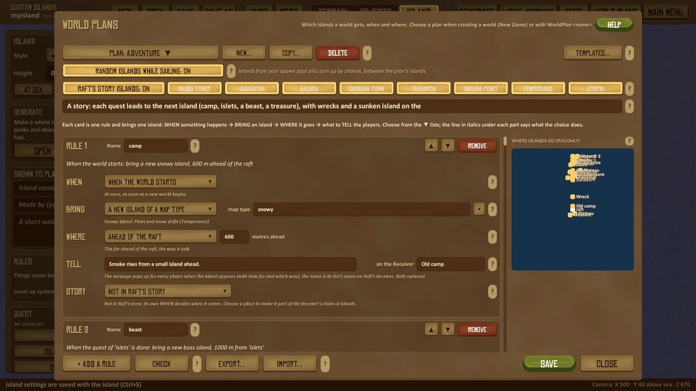
*The Adventure plan: rules for a camp at the start, islets and a beast's plateau after the quests, a treasure island,
a wreck after 2 km and a sunken island after 5 km. The map on the right sketches where they go.*

**New**, **Copy**, **Delete**, **Templates...** (ready-made sets of rules), **random islands while sailing** on or off,
**Check** (lists rules that can't work), **Save**. Plans are text files in `Mods\DynamicIslands\plans`. In a world,
`WorldPlan` shows the plan and which rules have fired; the host can give the world another plan with
`WorldPlan <name>`.

## 11. Playing together

Up to eight players (Raft's maximum). **Every player needs the mod.**

- **The host decides, for everyone:** the islands, the world rules, the randomizer, the plan, and the host's
  `spawnpool.txt` settings that change what players see (regrow days, Receiver dots, unload distance). A player's own
  files and last New Game choices never change the host's world, and only the host can change its settings.
- **Players who join** (or join again, or after a restart) get all of it: the islands and any island files they don't
  have, what was chopped, picked, looted and fired, doors and levers, quests, the crew's journal, where they stood on
  an island, and the tough animals' health.
- **Shared:** harvesting and pickups, chests (when several players open one at the same moment, the first gets it),
  zones, doors, quests and their rewards, story items, the journal. Things that move follow a clock all players share,
  so everyone sees them in the same place.
- **What grows back** is the host's decision: things come back when the island loads on the host after the regrow
  days; a player who has the island loaded sees it the next time it loads there.
- **Joining:** use Steam's "Join Game" on a friend (Raft's own Join World list is empty in this Raft version).
- **Someone else hosts next time:** Raft keeps the world on the host's PC. Copy its folder (`%USERPROFILE%\AppData\LocalLow\Redbeet
  Interactive\Raft\User\User_<Steam id>\World\<world name>`) to the new host's PC, into their own `User_<Steam id>\World`. The custom
  islands, what was used, quests, the journal, everyone's levels and the world's rules come along: the folder carries the mod's
  copy (`CustomIslands.txt`), and every player who joined keeps one too. Islands you only have from joining are used from their
  downloaded copies.
- **Levels** (with the level up system on): each player's own, kept by the host and back when they join again; the
  host works out everyone's EXP, and each player sees the others' levels under their names.

## 12. Settings files

In `<Raft>\Mods\DynamicIslands\`. Text files: open them with Notepad. They explain themselves, and changes are picked
up while the game runs.

**`spawnpool.txt`** (islands that appear on their own; the host's counts):

| Setting | Default | What it does |
|---|---|---|
| `chancePerKm` | 0.25 | Chance that an island appears for each km the raft sails (0 to 1) |
| `minSpacing` | 800 | Metres kept between custom islands |
| `spawnDistanceMin`, `spawnDistanceMax` | 250, 350 | How far ahead of the raft an island appears |
| `unloadDistance` | 800 | Islands further away are unloaded (and come back when you return) |
| `regrowDays` | 3 | In-game days until harvested things grow back (0 = never) |
| `showOnReceiver` | 1 | Custom islands as green dots on Raft's Receiver (0 = no) |
| `defaultPlan` | Random islands | The plan new worlds get when none is chosen |
| `generated` | 1 | How often a brand-new generated island is picked (0 = never) |
| `generatedStyles` | all five | The styles generated islands can have |
| `generatedFlyingChance` | 0.1 | The chance a generated island flies |
| `<island name> <weight>` | `* 1` | Which of your islands take part (`*` = every island not listed; weight 0 leaves one out) |
| `type:<map type> <weight>` | sandbar, wreck, atoll, sunken | Map types that take part |

Other files: `*.island` (your islands), `plans\*.plan` (world plans), `world_rules.txt` and `randomizer.txt` (your last
New Game choices), `worlds\<world>.txt` (each world's custom islands and their state), `groups\` and `stamps\` (your
groups and stamps), `<name>_<hash>.island` (islands downloaded from a host).

## 13. Console commands

Press **F10** for RML's console.

| Command | Where | What it does |
|---|---|---|
| `SpawnIsland <name> [distance] [height]` | World, host | An island ahead of the raft (default 250 m) |
| `RemoveIsland <name>` / `RemoveIsland all` | World, host | Removes custom islands |
| `ListIslands` / `ListSpawned` | Anywhere / world | Your saved islands / the world's custom islands with their distance |
| `SpawnPool` | World | Which islands appear on their own, and how often |
| `CustomIslandsAuto on` / `off` | World, host | Automatic islands on or off for this world |
| `WorldPlan` / `WorldPlan <name>` | World | The world's plan and its rules / give it another plan (host) |
| `Randomizer` / `Randomizer <off/light/normal/wild> [-part] [+part]` | World | What the randomizer does here / change it (host) |
| `WorldOptions` / `WorldOptions +option -option` | World | The world's World settings / change them (host; blueprints, storyorder, ghostrafts, privatestorage) |
| `Monsters` / `Monsters <level>` | World or main menu | The monster difficulty / change it (host; at the main menu: the next new world) |
| `BuildCost` / `BuildCost <0-100>` | World or main menu | The build cost / change it (host; at the main menu: the next new world) |
| `LoadEditor` | Main menu | Opens the editor |

The editor's own commands (`SaveIsland`, `GenerateIsland`, `SetStyle`...) are in the [README](../README.md#console-commands-f10).

## 14. Questions and problems

**No islands appear while I sail.** Run `SpawnPool`: are automatic islands on, and is the pool empty? The plan may be
"No custom islands" (`WorldPlan`). Islands appear only where there is room: near Raft's own islands they wait until
the sea is clear. `SpawnIsland <name>` places one right away.

**K does nothing, and there is no level bar.** The level up system is off in this world. It comes on once an island made
with **Level up system: On** has appeared in the world (see [section 6](#6-the-level-up-system)).

**Load World is greyed out.** Raft is offline from Steam. Check that Steam is online and restart Raft.

**My island is far away / I can't find it.** Build Raft's Receiver: custom islands are green dots with their distance.

**I can't get onto a flying island (or a cliff island).** Build stairs or pillars up from the raft. The generator's
reach line tells a builder beforehand.

**A friend can't see my island.** Every player needs the mod, and the host's islands are the ones that count. Island
files are sent to players who join; they appear as `<name>_<hash>.island` in their folder.

**Where are my islands?** In `<Raft>\Mods\DynamicIslands\` as `<name>.island`. Copy the file to share it.

**The editor takes a moment to open.** The first time after starting Raft it loads about 700 objects from Raft's
islands; the loading box shows how far it is. After a Raft update it also scans Raft's other islands once, in the
background (about half a minute; the object browser's status line says so).

**Something went wrong.** Press F10: the mod's messages start with `[CUSTOM ISLANDS]`. Raft's log is
`%USERPROFILE%\AppData\LocalLow\Redbeet Interactive\Raft\Player.log`.

More: the [README](../README.md) (every feature, file and command, and the known limitations).
