# Custom Islands: the guide

A picture-by-picture guide to **Custom Islands** (DynamicIslands), a [Raft](https://raft-game.com/) mod for the
[Raft Mod Loader](https://www.raftmodding.com/). It is for players who want new islands in their worlds, and for
builders who want to make islands and whole adventures of their own. You don't need to know anything about modding:
everything is done with buttons in the game. The [README](../README.md) has the full reference (every setting, file
and command); this guide shows you around.

The guide follows the heart of the mod first: **meeting custom islands** while you sail (sections 2-3), **building your
own** in the editor (4-5), giving them **stories** - quests, doors and keys, story items, islands in Raft's story (6) -
and **world plans** that decide which islands a world gets, when and where (7). Section 8 is about playing together. The
**optional systems** that change a whole world - world rules, the world randomizer, the extra options, the island list
and the level up system - are gathered in section 9, followed by the files, the console commands, help, and how to
report a problem (section 13).


*A custom island met while sailing: made by the mod's island generator, with Raft's own palms, rocks and reef.*

## Quick start

Pick what you want to do; each line leads to the part of the guide you need.

| I want to... | Do this | Read |
|---|---|---|
| **Just play with new islands** | Install the mod, click **NEW WORLD**, leave everything as it is, **Create**, and sail | [1](#1-installing), [2](#2-starting-a-new-world), [3](#3-sailing-custom-islands-in-your-world) |
| **Play an adventure someone made** | **ISLAND LIBRARY** in the main menu → **World plans** → **Download**; then **NEW WORLD** → choose it as the Custom Islands plan | [4.7](#47-saving-and-sharing), [7.6](#76-playing-changing-and-sharing-a-plan) |
| **Build my own island** | **EDITOR** → **Generate** an island → shape it, add objects → **Save** | [4.8](#48-your-first-island-step-by-step) |
| **Give my island a quest or a secret** | Island tab → **Edit quest...**; an object → **Behaviour + events...** | [5](#5-making-islands-come-alive), [6](#6-stories-quests-behaviours-story-items) |
| **Make my own adventure across several islands** | **EDITOR** → **WORLD PLANS** → **New...** → one rule per island → **Save**; choose it in NEW WORLD | [7.2](#72-your-first-world-plan-step-by-step) |
| **Play with friends** | Everyone installs the mod; the host creates the world; friends join through Steam | [8](#8-playing-together) |
| **Change how a world plays** (tougher monsters, levels, a randomized world) | **NEW WORLD** → **WORLD SETTINGS...** | [9](#9-world-settings-rules-and-extra-systems) |
| **Report a bug or ask a question** | Main menu alpha box → **Report a problem** (or **Discord**) | [13](#13-reporting-a-problem) |

### Words used in this guide

| Word | Meaning |
|---|---|
| **Custom island** | An island of this mod, as opposed to Raft's own islands. You meet them while sailing, like Raft's |
| **Island file** | A saved island, `<name>.island` in `Mods\DynamicIslands\`. Made in the editor, downloaded, or sent by a host |
| **Map type** | A kind of island the mod makes new for each world: a camp, a volcano, a wreck, a sky island... ([4.6](#46-ready-made-islands-map-types)). No file needed |
| **Generated island** | An island made by the island generator from a style and a size ([4.5](#45-the-island-generator)) |
| **Spawn pool** | The islands that may turn up by chance while you sail (`spawnpool.txt`, [10](#10-settings-files)) |
| **Quest** | An island's list of steps (go there, read that, open this...) with a reward at the end ([6.1](#61-quests)) |
| **Story item** | A key, a map, a log... that the crew carries and the journal (J) shows ([6.3](#63-story-items-and-story-sets)) |
| **Journal** | The crew's book of the custom islands (J): their story items and every note read, shared by everyone in the world. Not Raft's notebook (T) ([3](#the-journal-j)) |
| **World plan** | A list of rules for a world: which islands it gets, when and where ([7](#7-world-plans-which-islands-a-world-gets)) |
| **Rule** | One line of a plan: *when* something happens, bring *this island*, *there*, and tell the players *this* |
| **Raft's story / the Receiver chain** | Raft's own story islands (Radio Tower ... Utopia), found by tuning the Receiver. A plan can change it ([6.5](#65-your-islands-in-rafts-story-the-receiver)) |
| **World settings** | Optional switches for one world: monster difficulty, build cost, randomizer, extra options, levels ([9](#9-world-settings-rules-and-extra-systems)) |
| **Pack** | A `.zip` made with **Export...**: a plan or island with every island it needs, to share ([4.7](#47-saving-and-sharing)) |
| **Island library** | The public collection of plans and islands others made, downloaded in the game ([4.7](#47-saving-and-sharing)) |
| **Host** | The player whose PC runs the world in multiplayer. The host's islands, plan and settings count ([8](#8-playing-together)) |

## Contents

1. [Installing](#1-installing)
2. [Starting a new world](#2-starting-a-new-world)
3. [Sailing: custom islands in your world](#3-sailing-custom-islands-in-your-world)
4. [Building your own island: the editor](#4-building-your-own-island-the-editor)
   - [4.1 The screen](#41-the-screen) · [4.2 Shaping the land](#42-shaping-the-land-terrain-tab) ·
     [4.3 Placing objects](#43-placing-objects-objects-tab) · [4.4 The Island tab](#44-the-island-tab)
   - [4.5 The island generator](#45-the-island-generator) · [4.6 Ready-made islands (map types)](#46-ready-made-islands-map-types)
   - [4.7 Saving and sharing: autosave, export, import, the island library](#47-saving-and-sharing)
   - [4.8 Your first island, step by step](#48-your-first-island-step-by-step) · [4.9 Trying the island in a world (Test)](#49-trying-the-island-in-a-world-test)
5. [Making islands come alive](#5-making-islands-come-alive): [creatures](#51-creatures), [notes](#52-notes-and-signs),
   [chests](#53-chests-and-loot), [zones and ambushes](#54-trigger-zones-and-ambushes), [atmosphere and sound](#55-atmosphere-and-sound)
6. [Stories: quests, behaviours, story items](#6-stories-quests-behaviours-story-items)
   - [6.1 Quests](#61-quests) · [6.2 Behaviour and events](#62-behaviour-and-events) · [6.3 Story items](#63-story-items-and-story-sets)
   - [6.4 Islands that bring islands](#64-islands-that-bring-islands) · [6.5 Your islands in Raft's story (the Receiver)](#65-your-islands-in-rafts-story-the-receiver) ·
     [Raft's notebook and the journal in each kind of plan](#rafts-notebook-and-the-journal-in-each-kind-of-plan)
7. [World plans: which islands a world gets](#7-world-plans-which-islands-a-world-gets)
   - [7.1 The plans that come with the mod](#71-the-plans-that-come-with-the-mod)
   - [7.2 Your first world plan, step by step](#72-your-first-world-plan-step-by-step)
   - [7.3 A rule card, part by part](#73-a-rule-card-part-by-part) · [7.4 Everything a rule can do](#74-everything-a-rule-can-do)
   - [7.5 Check: finding and fixing problems](#75-check-finding-and-fixing-problems)
   - [7.6 Playing, changing and sharing a plan](#76-playing-changing-and-sharing-a-plan) · [7.7 The plan file](#77-the-plan-file)
8. [Playing together](#8-playing-together)
   - [Who needs what: every case](#who-needs-what-every-case)
9. [World settings: rules and extra systems](#9-world-settings-rules-and-extra-systems)
   - [9.1 The World settings window](#91-the-world-settings-window)
   - [9.2 World rules: monster difficulty and build cost](#92-world-rules-monster-difficulty-and-build-cost)
   - [9.3 The world randomizer](#93-the-world-randomizer)
   - [9.4 Extra options](#94-extra-options)
   - [9.5 Islands while sailing](#95-islands-while-sailing)
   - [9.6 The level up system](#96-the-level-up-system)
10. [Settings files](#10-settings-files)
11. [Console commands](#11-console-commands)
12. [Questions and problems](#12-questions-and-problems)
13. [Reporting a problem](#13-reporting-a-problem)

---

## 1. Installing

> **Experimental Alpha Release:** this is the mod's first release, an early alpha. Things are likely to change, some systems might be
> unstable, and progress is not guaranteed to be saved - back up the worlds you care about (Raft keeps them in
> `%USERPROFILE%\AppData\LocalLow\Redbeet Interactive\Raft\User`). The main menu shows this in the **EXPERIMENTAL ALPHA
> RELEASE** box right of the middle, with the mod's version and three buttons: **Discord** (the Custom Islands Discord
> server), **Guide (PDF)** (this guide, which comes with the mod) and **Report a problem** ([section 13](#13-reporting-a-problem)).
> Drag the box anywhere you like; it stays where you put it. It steps aside while another window of the main menu is
> open (New Game, Load World, Settings, the island library...) and comes back when you close it. **Got it** folds it into a slim bar with the same buttons (its
> **Show** opens it again); the mod remembers that for this version only (in `notice.txt`), so a new version shows the
> whole box again.

1. Install the **Raft Mod Loader** (RML) from [raftmodding.com](https://www.raftmodding.com/) and start Raft through it.
2. Put `DynamicIslands.rmod` into Raft's `mods` folder (for example
   `...\steamapps\common\Raft\mods\`), or install the mod from its raftmodding.com page.
3. Start Raft with RML's **Play** button. The first start takes a little longer: RML compiles the mod.

The mod keeps its files in `<Raft>\Mods\DynamicIslands\`: your islands (`*.island`), the settings files
(`spawnpool.txt` and others, see [section 10](#10-settings-files)) and the world plans (`plans\`).

**Playing together?** Every player needs the mod. The host's islands, files and settings are sent to everyone who
joins (see [section 8](#8-playing-together)).

## 2. Starting a new world

Click **NEW WORLD** in Raft's main menu. Raft's box looks as it always does, with two things of the mod at the bottom
right: the **Custom Islands plan** and the **WORLD SETTINGS...** button, which says how many settings differ from
plain Raft.


*Raft's New Game box with the Custom Islands plan (Random islands) and the World settings button.*

| Part | What it does |
|---|---|
| **Custom Islands plan** | A **▼ list**: click it to see every plan with a line on what it does, and click one to choose it. Which custom islands the world gets: **Random islands** (they appear by chance while you sail), **No custom islands**, or a plan such as **Adventure** (a story from island to island; see [section 7](#7-world-plans-which-islands-a-world-gets)). **Get more...** opens the island library to download plans others made; a plan you download there is chosen here ([4.7](#47-saving-and-sharing)) |
| **World settings...** | Opens the World settings window: the world's rules, the world randomizer, the extra options and which islands turn up while sailing ([section 9](#9-world-settings-rules-and-extra-systems)). The button reads `Raft's own` while nothing differs from plain Raft, otherwise how many settings you changed (`3 changed`) |

Then click Raft's **Create** as usual. Your choices are remembered for the next new world. They belong to the world:
saved with it, the same for every player, and every new world gets its own.

**Just want new islands?** Leave the plan on **Random islands**, leave World settings as they are (`Raft's own`) and
create the world: islands turn up while you sail ([section 3](#3-sailing-custom-islands-in-your-world)), and the rest of
Raft plays as it always does. The World settings are optional extras for players who know Raft well; they are described
together near the end of this guide.


*The whole main menu. The EDITOR button opens the island editor ([section 4](#4-building-your-own-island-the-editor)), ISLAND LIBRARY the island library; the EXPERIMENTAL ALPHA RELEASE box (drag it anywhere), here folded with Got it, keeps its Discord, Guide and Report a problem buttons (Show opens it again). It steps aside while New World or any other window is open.*

## 3. Sailing: custom islands in your world

### Islands appear while you sail

With the **Random islands** plan, now and then an island appears **250-350 m ahead of the raft** (about one island
every 4 km). It can be:

- one of **your own islands** (every saved island takes part unless `spawnpool.txt` says otherwise),
- a **brand-new generated island**: a random size and style (tropical, snowy, desert, forest or volcanic), sometimes
  flying; it is saved as `gen-<style>-<seed>.island`, so it stays in that world,
- a **map type**: a sandbar, a wreck of raft blocks, an atoll or a sunken island (more in [4.6](#46-ready-made-islands-map-types)).

Which of these a world may meet can be chosen when it is created ([9.5](#95-islands-while-sailing)). The optional world
settings add more things to meet at sea: the randomizer's odd islands, large islands and boss lairs
([9.3](#93-the-world-randomizer)) and ghost rafts ([9.4](#94-extra-options)).

Islands keep clear of Raft's own islands and of each other, and Raft won't put its islands on top of them later.
Islands far behind the raft are unloaded (after 800 m) and come back when you return.

**On the Receiver:** once you have built Raft's Receiver, custom islands show as **green dots** with their distance,
even far ones. An island a rule brought (a quest reward, a plan) carries its name on its dot.

### Arriving

An island with a name shows it as a **banner** when you come near (once per island per session), with its author and
a short welcome if the builder wrote them.


*Arriving at "Van Island", one of the world randomizer's oddity islands.*

### What you can do on an island

Custom islands work like Raft's own: you can **walk** on them, the **raft runs aground** on them, and you can
**chop** palms, pines, birches and mango trees and **pick up** rocks, ores, clay, sand, berries, pineapples,
flowers and more. What you took **stays taken** (also after saving, loading and sailing away), and it **grows
back** after 3 in-game days (the island's builder or `spawnpool.txt` can change that).


*On a generated tropical island: Raft's bamboo, palms and plants, placed where Raft's own islands have them.*


*A generated island with the Nature setting on "Jungle": you have to squeeze between the trees.*

**Diving:** generated islands rise from a deep sea floor like Raft's own: a sandy shelf about 10 m deep with corals
and sea plants, then a drop-off. Giant clams, silver algae, stones, ores, scrap and the seaweed on sea vines can be
picked up.


*Under water around a generated island: the shelf, the reef, the drop-off and the slope further down.*

**Flying and sunken islands:** some islands float high in the sky (build stairs or pillars up from the raft), others
lie under the surface for divers.

### Notes, chests, zones and creatures

The builder of an island can give it much more than land (see [section 5](#5-making-islands-come-alive)). In a world:

- **Notes:** look at a readable object (a sign, a paper, a bottle...) and press the interact key (**E**) to read it.
  Close it with E, Tab, Esc or the button.
- **Chests:** look at one and press **E**: the items go into your inventory. The chest is then empty for everyone
  until it fills up again (after the regrow days, or never). Some chests are **locked** until you have their key.
- **Trigger zones:** invisible areas that fire when a player walks in: a message, items, or an **ambush** (animals
  that appear the moment you step in).
- **Creatures:** Raft's own animals at the island's creature spots, with the builder's toughness, size and colour.
  Warthogs and bears fight you; chickens, goats and llamas can be caught with Raft's net launcher and kept on the raft.
  Killed and caught animals come back after the regrow days unless the builder said never.


*A note found on an island ("Warthogs live here. Bring a spear."). Press E, Tab or Esc to close it.*

### Quests

An island with a quest shows a **quest panel** on the right when you arrive, with its steps: go somewhere, read a
note, open a chest, defeat or catch animals, collect story items, find journal pages. Each step done shows what's
next; the last one gives the reward to every player near the island.


*The quest panel of "The lost camp" on the right: the first step is "Go to camp".*


*Quest complete: the banner, every step ticked in the panel, and the reward (planks and rope) in the inventory.*

### New islands from quests and rules

A finished quest (or a plan's rule) can **bring a new island**: every player sees a banner with a message and how far
and which way it is, and the island's dot on the Receiver carries its name.


*A rule brought a new island: "About 970 m to the south-east (on your Receiver)". The quest panel shows the
finished step.*

### The journal (J)

The **journal** is the crew's book of the custom islands' story: what you found on them and what you carry for them.
Press **J** in a world to open it; **J**, **Esc** or **Close** closes it. (J does nothing while you type in the chat
or console, while a note is open, or in the editor.) Its key is also shown at the hotbar: after Raft's notebook tab
(**T**) come the journal's tab (**J**, an open book) and, while the level up system is on in the world, the stats
page's (**K**, a star).


*The journal: two story items at the top left, the pages read below, and the page "The keeper's note" open.*

**What's in it**

- **Story items** (top left): keys, map pieces, logs... that the islands' builders made. Each shows its picture and
  name, with **×2**, **×3**... when the crew has more than one. Click one to see its picture and description on the
  paper. They come from chests, trigger zones, quest rewards and island events; a message tells you ("Story item: Old
  key (J: journal)"). An item that is **used up** (say a key a locked door takes) leaves the journal.
- **Pages** (bottom left), newest first: every note you read on a custom island - the first time anyone reads it,
  once, with its title - pages an island writes when something happens (an island event "write a journal page"), and
  the frequencies a world plan gives out ("Tune the Receiver to #4821"). Point at a page for the island it came from;
  click it to read it on the paper, signed with the island and the day it was found.
- The top right counts the story items and the pages. An empty journal says where to look.

**One journal for the whole crew.** Everyone in the world shares it: a note one player reads is in everyone's
journal, and a key one player finds opens the door for all. The host keeps it, a player who joins gets it, it is
saved with the world, and it goes back with an older save ([8](#8-playing-together)).

**The journal and quests.** The journal doesn't list quests: an island's quest is shown in the **quest panel** on the
right while you are **at that island** ([Quests](#quests)), and it leaves when you sail away. But the journal is what
some steps count:

- **Find (a number of) a story item** counts that story item in the journal - so an item found before the quest
  counts too, and one used up no longer does.
- **Find pages on this island** counts the journal's pages from that island's notes and events; **on any island**
  counts every page.

So when a quest step waits for items or pages, press J to see what the crew has.

**The journal and Raft's notebook.** Raft's own notebook (**T**) stays as it always was, and the two don't mix:

| | Raft's notebook (T) | The journal (J) |
|---|---|---|
| **Pages** | The notes of Raft's story islands (Radio Tower, Vasagatan, Balboa...) | The notes of custom islands, pages their events write, and frequencies a world plan gives out |
| **Items** | Raft's quest items (Raft's keys, key cards...) | The custom islands' story items |
| **The Receiver** | The frequencies of Raft's story; when a plan changes Raft's story, the notebook follows it ([6.5](#65-your-islands-in-rafts-story-the-receiver)) | A page with each frequency a plan's rule unlocks for its own island, and with a Raft story island's frequency when one of the plan's islands unlocked it (no Raft note gives it then) |
| **Quests** | - (Raft's story goes by its notes and the Receiver) | - (the quest panel shows the quest of the island you're at) |
| **Without the mod** | Always there | Kept in the mod's file of the world: the world still loads without the mod, and the journal comes back with it |

How the two books look when a plan keeps all, some or none of Raft's story, with or without its own islands in it:
[Raft's notebook and the journal in each kind of plan](#rafts-notebook-and-the-journal-in-each-kind-of-plan).

Why two books? Raft's notebook has a fixed set of pages and quest items, made for Raft's story. New pages or items put
into it would be lost, or break the world's save when it is opened without the mod. So custom islands write into
their own book, kept with the mod's state of the world. For the same reason story items aren't in your inventory:
the crew holds them in the journal, like Raft holds its quest items outside the inventory.

---

## 4. Building your own island: the editor

Click **EDITOR** in the main menu. A loading box shows what it is doing ("Opening the editor", then "Loading Raft's
objects from its islands" with a bar) until the editor is ready: a few seconds the first time after starting Raft,
less after that. The editor opens on the sea with an empty build area.


*The box that covers the screen while the editor opens.*

### 4.1 The screen


*The editor on the Terrain tab.*

- **Top bar:** New, Open, Save, Save as · Undo, Redo · the three tabs **Terrain**, **Objects**, **Island** (F1, F2, F3)
  · **Generate** (the island generator), **Light** (the time of day, below), **Test** (try the island in a world,
  [4.9](#49-trying-the-island-in-a-world-test)), **World plans**, **Main menu**. The island's name is at the top left.
- **Tool panel** (left): the tab's tools in bordered groups. The lit button is the one in use.
- **Status bar** (bottom): explains the tool, or the button under the mouse. On the right: where the camera is.
- **The blue plane is the sea.** Everything below it is under water in the game.

**Moving the camera** (like Unity's scene view):

| Do this | To |
|---|---|
| **Right-drag** | look around; while held, **WASD** flies where you look, **Q/E** go down and up, the **wheel** sets the speed |
| **WASD** or arrows | move over the island at the same height |
| **Space** / **C** | go straight up / straight down, whichever way the camera looks (the Terrain and Objects tabs' tips say so too) |
| **Middle-drag** | pan (the ground follows the cursor) |
| **Alt + left-drag** | orbit around the selection, or the middle of the view |
| **Wheel** | zoom towards what is under the cursor |
| **F** | frame the selection, or the whole island |
| **Shift** | three times faster |

Undo and redo everything with **Ctrl+Z** / **Ctrl+Y**; save with **Ctrl+S**, open with **Ctrl+O**.

**Light: the time of day.** The top bar's **Light** list has **Morning, Noon, Evening, Night** and
**Overcast** (click it and pick one): the sun's height, colour and shadows, the sky's light on everything and a haze far out change, so you
can see how the island will look at that time in Raft (a dark cave mouth at night, a beach in the evening sun). It is
only how the editor shows the island - nothing is saved in the island. Your choice is kept for the next time you open
the editor (Noon the first time).

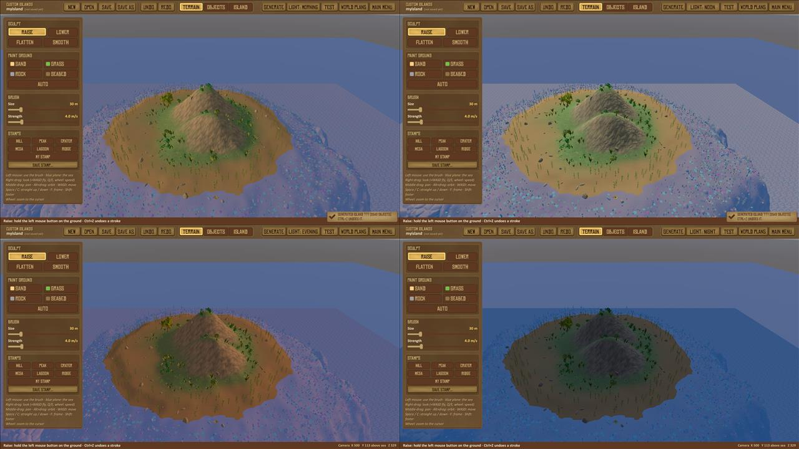
*The same island at Morning, Noon, Evening and Night.*

### 4.2 Shaping the land (Terrain tab)

- **Sculpt:** **Raise**, **Lower**, **Flatten**, **Smooth**. Hold the left mouse button on the ground; the white ring
  shows the brush.
- **Paint ground:** the style's four textures (for a tropical island Sand, Grass, Rock, Seabed). **Auto** textures an
  area by its height and slope again.
- **Brush:** size and strength.
- **Stamps:** click the ground to put down a **Hill**, **Peak**, **Crater**, **Mesa**, **Lagoon** or **Ridge**, as big
  as the brush (Q/E turn it). **Save stamp...** keeps the land under the brush as a stamp of your own.

**Island styles.** On the Island tab, **Style** ◄ ► steps through Tropical, Snowy, Desert, Forest and Volcanic (or click the name for the list): the
ground takes the style's textures, the paint buttons get its names, and the generator uses its plants and animals.


*The same kind of island in four styles, as the generator makes them: tropical palms, snowy pines, desert red rock,
forest birches.*

### 4.3 Placing objects (Objects tab)


*The Objects tab: the tools on the left, the object browser on the right (713 of 1,947 objects loaded).*

The **object browser** on the right has **every object of Raft**, about 1,900, each with a picture: nature, harvestable
trees and rocks, Raft's 88 building blocks (to build huts or your own abandoned rafts), everything else you can build
on a raft, and the objects of Raft's story islands (they load the first time you open their category). **Search**
finds objects in every category.

- **Place:** click an object in the browser, then click the ground. **Q/E** turn it, **[** and **]** resize it,
  **Shift+click** keeps placing, **Esc** stops.
- **Select:** click a placed object; **Shift+click** adds more.
- **Transform** (keys 1-4): Move, Turn, Scale or All, with the coloured handles. **X** switches the arrows between the
  world's directions and the object's own turn; **P** turns and scales around each object's own point or the middle of
  the selection; hold **Ctrl** while dragging to snap (0.25 m, 15°). An island holds at most 100 000 objects (the editor
  says so past 12 000: big islands take longer to appear in a world).
- **Selection:** **Ground** drops the selection onto the terrain, **Duplicate** (Ctrl+D), **Deselect**, **Delete**.
- **Placing:** **Random** gives each placed object a random turn and size, **Slope** leans it with the ground, **Grid**
  snaps to Raft's 1.5 m building grid (Q/E then turn in 90° steps).
- **Groups:** select several objects and click **Save as group...**. The group appears under **My groups** at the top
  of the browser, to place on any island.


*A herd of two warthogs (the pink marker) and a sign. "My groups" in the browser holds two saved groups.*

Selecting a single object shows its **inspector** in the tool panel: creature settings, a note, loot, a zone, a colour,
behaviours (see [section 5](#5-making-islands-come-alive)).

### 4.4 The Island tab


*The Island tab: style, height in the world, the generator, the name players see, the island's rules and its quest.*

- **Style** and **Height** in the world: **At sea** (0), **Flying** (60 m up) or **Sunken** (30 m under water), or any
  number. The editor always shows the island at sea level; the height applies in the game.
- **Shown to players:** the island's **name**, your name and a short welcome. Players see them as a banner.
- **Rules:** how many in-game days until chopped trees, picked items, killed animals, looted chests and fired zones
  come back on this island (empty = the world's setting, 0 = never).
  **Level up system** Off / On: see [section 9.6](#96-the-level-up-system).
- **Quest**, **Islands it brings**, **Island events**, **Story items**: see [section 6](#6-stories-quests-behaviours-story-items).

### 4.5 The island generator

**Generate** (top bar) makes a whole island for you to start from. The **preview** map on the right follows every
change; the line under it says how big the island is and how many objects it will get. The **seed** picks one island
of all possible ones: the same seed and settings always give the same island. Every setting has a **?** to hover.
Generating replaces the island you have; **Ctrl+Z** brings it back.


*The Normal tab: your presets, the style and layout, the size and height (with buttons for the size and height of
Raft's own small island, large island and Balboa), peaks, hills and the coast.*

- **Island:** the **style** and the **layout**: round, atoll, archipelago, sea stacks, plateau, marsh, crescent, twin
  peaks.
- **Size and height, coast and outline, land features:** peaks and their shape, hills, coast, bays, beach, cliffs,
  stretch, valleys, lakes, terraces, erosion.
- **Under water:** a **deep sea floor like Raft's** (a shelf about 10 m deep, then a drop-off) or a **shallow** one
  (a flat seabed 20 m down), the width of the shallow water, how steep the drop-off is, and the seabed (sand, rocky,
  or a reef ring).
- **Nature:** trees, bushes, rocks, beach things and harvestables, with quick buttons **None**, **Sparse**,
  **Like Raft**, **Dense** and **Jungle**. "Like Raft" places everything where Raft's own islands have it: a nearly
  bare beach, palms inland on grass, boulders on steep ground.
- **Life under water:** corals, sea vines, kelp, rocks, stones, ores, giant clams and sunken barrels, placed like
  around Raft's own islands.
- **Animals:** hostile creatures (the style's own, or the kinds you click), how tough (Easy, Normal, Hard, Boss),
  friendly animals to catch, sea creatures.
- **Loot:** how many loot boxes, their lowest and highest **tier** (1: planks and plastic ... 5: titanium, explosive
  goo, batteries), in the open or hidden.
- **My presets:** **Save these settings...** keeps them under a name; **Defaults** starts over.


*Further down the Normal tab: the land features, the Under water group (Deep, like Raft) and the Nature quick buttons.
Hovering a ? shows its help (here Stretch).*


*The bottom of the Normal tab: things to collect, sunken barrels, animals (the kinds to click, the toughness) and loot.*

**Can players reach it?** Above the seed, a coloured line says whether a player arriving by raft can get onto the
island: **Easy** (beaches, walk to the top), **Reachable**, **Possible but tricky** (a jump onto a low ledge),
**Possible but unlikely**, or **Not from the raft without building** (cliffs all around: players need stairs, a
ladder or foundations). It is worked out with Raft's own player: how steep it can walk, how high it jumps.


*A cliff island: "Not from the raft without building: cliffs all around (the lowest ledge is 17 m above the water)."*

**Randomize existing:** click one of Raft's 33 islands (each has a picture). **Something new like it** makes a new
island with its size, height and look; **A variation of it** starts from the island's own ground and reshapes it
(stretch, mirror, roughen, coast, valleys...).


*Randomize existing: Raft's islands, measured, with a picture each. Here a variation of "Big Island OG".*


*A variation made from one of Raft's big islands, opened in the editor.*


*A generated island in the editor, ready to change: its trees and bushes are ordinary objects you can move or delete.*

The editor's view under water shows what a deep sea floor looks like:


*A generated island on the deep sea floor: the shelf and drop-off from above, the slope, the reef, the drop-off.*

### 4.6 Ready-made islands (map types)

The generator's **Ready-made (with content)** tab makes whole islands with a story: chests, notes, creatures, zones
and a quest, from a seed. Click a card, then **Make** (click twice): the island is saved as `gen-<type>-<seed>` and
opened for you to change.


*The Ready-made tab: plain islands of each style, and the map types with their content.*


*Some map types: an archipelago (a castaway's caches), an atoll, sea stacks (a chest on the tallest), a boss island,
an old camp, and a treasure island in a world, its quest panel saying "Find the map on the beach".*

| Map type | What it is |
|---|---|
| Sandbar | A tiny island with a few palms and a small chest: a rest stop |
| Atoll | A ring of land around a shallow lagoon |
| Archipelago | Several islets; a castaway's note and three caches |
| Sea stacks | Steep rock pillars; a chest on top of the tallest (build your way up) |
| Boss island | A plateau with cliffs and a ramp; the arena wakes a boss bear |
| Volcano, swamp, frozen spire | A tall volcano with embers; low land with pools and mist; a snowy peak with a cache on top |
| Treasure island | A map in a bottle on the beach leads to the X and a treasure chest |
| Old camp | An abandoned camp with a notice board and supplies: a good first island of a story |
| Sunken island, sky island | Under water, with corals, sunken barrels and puffer fish; floating 45-90 m up with a cache |
| Wreck, ghost raft | No land: an abandoned raft of Raft's own blocks, floating like a real raft (the deck just above the water). A wreck has barrels to loot; a ghost raft is small, medium or large with a note, and the large ones are guarded by rats and screechers ([9.4](#94-extra-options)) |
| Oddities, boss lair, large island | The world randomizer's islands ([section 9.3](#93-the-world-randomizer)) |

### 4.7 Saving and sharing

**Save** (Ctrl+S) saves straight away once the island has its own name (a new island asks for one first: until then it
is only "myisland"); **Save as** and **Open** show the **Islands** window: a name, the height in the world, and your
saved islands (click = pick, double-click = open, Delete asks first and says which saved worlds, plans and other
islands' rules use the island). A deleted island isn't erased: it is moved to `Mods\DynamicIslands\deleted` -
move the file back into `Mods\DynamicIslands` to get it back. Copies kept for saved worlds (`<name>_<hash>`) aren't
in the list: the island library's **Tidy up** clears the ones nothing uses.

**Nothing unsaved is lost:** opening another island, **New**, or a map type's **Make** while the island has unsaved
changes keeps them as its autosave first (the editor says so, and offers them back the next time it opens).


*The Islands window: the name and height, and the saved islands with their date and size.*

Islands are files in `<Raft>\Mods\DynamicIslands\` (`<name>.island`). In multiplayer the host's island files are sent
to players who don't have them, so nobody needs to share files just to play together ([section 8](#8-playing-together)).

**Autosave.** While the island has changes you haven't saved, the editor keeps a copy every 3 minutes, and when you
leave to the main menu or quit Raft (`Mods\DynamicIslands\autosave\<name>.island` - not an island of yours, it never
turns up anywhere). If Raft closes before you saved (a crash, the power going), the next time the editor opens it
offers the unsaved work: **Open** it (then **Save** to keep it), **Throw them away**, or **Not now** (asked again next
time). Saving the island removes its autosave. Every change counts - the land, objects, their settings, and the
island's own settings on the Island tab (name, texts, style, height, rules, quest, events, story items), which Undo and
Redo also take back and forth; save before you close Raft all the same. Selecting objects isn't a change.

**Objects this Raft version doesn't have.** After a Raft update an object an island uses may be gone or renamed. In the
editor it shows as a **red box** in its place (the island says how many when it opens): it keeps its name, place, size
and settings, and saving writes it back unchanged, so a later version of Raft or the mod can show it again. Delete the
box if you don't want it. In a world such an object is left out, and the player is told once.

**Saving an island your saved worlds have.** A saved world remembers what was used on the island - trees chopped,
things picked up, chests looted, zones fired, doors opened - by the order of the island's objects. So:
- changes that keep that order reach those worlds the next time they load: moving objects, changing their settings,
  the ground, the island's settings, and **new objects** (they come after the others). The first time you save over
  such an island, the editor says which worlds have it. If you moved its ground, anything built on it there may no
  longer fit;
- changes that would mix it up - **deleting objects**, changing their order, or making an object a chest - don't reach
  them: those worlds keep playing the version they started with (the editor says so; a copy `<name>_<code>.island` is
  kept for them), and new worlds get your new version. To give a world the new version anyway, save your changes under a
  new name (**Save as**) and bring that island into the world.

**Sharing an island or a plan: Export.** In the Islands window, pick an island and click **Export...**; in the World
plan window (a plan open) click **Export...**. The **Share** window says what goes along:
- an island takes the islands its rules bring with it ("Palm Cove + 1 island it brings: Treasure Cove"), and theirs, so
  its quest chain still works for whoever gets it;
- a plan takes every island it needs. Rules of the kind "a new island of a map type" need no file (every player's mod
  makes those), and islands from the spawn pool come from each player's own islands;
- if one of those islands isn't saved, the export stops and names it.

Fill in the **title**, **author** (your Steam name to start with), a one-line **summary**, a **description** (what
players find, how long it takes, what you had in mind, e.g. "best with Fierce monsters" - a pack never sets difficulty
or other World settings; the player's own choices always apply), **tags**, **players** and **length**, and whether
**others may change it and share their version** (they must credit you either way). The **picture** is what the
editor's camera shows: close the window, move the view, open it again, or click **Take picture**; its middle becomes the
icon. **Export** writes a pack, `Mods\DynamicIslands\exports\<name>.zip`; **Open folder** shows it; **Share...** opens the
island library's page to send it in. Export the same island or plan again later and the pack is the next version of
the same entry (so whoever has it can update it).

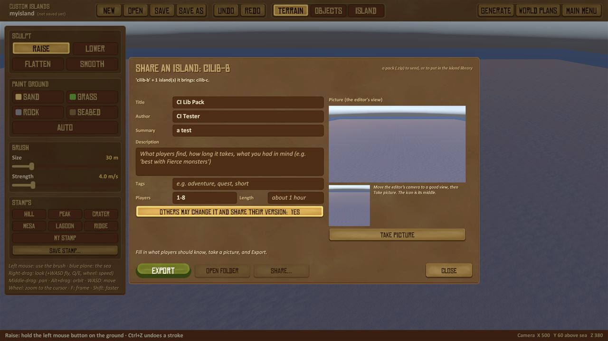
*The Share window: what goes along, the entry's info on the left, the picture of the editor's view on the right.*

**Getting islands from a pack: Import.** Put a pack (`.zip`) you got into `Mods\DynamicIslands\import` (**Open import
folder**), click **Import...** in the Islands window or the World plan window, and pick it: the window says what it
holds, who made it and its version. **Install** puts it in place:
- **Your own files are never overwritten.** If you have a different island with the same name, the pack's is installed
  as `Name (Pack title)` and the pack's plan and islands are changed to use that name. The same island (the very same
  file) is shared, not copied. A plan whose name you already use gets the author added: `First Voyage (Author)`.
- An **island** from a pack only turns up by chance while sailing if you tick **Also let it turn up while sailing** -
  then also in worlds you've already started with random islands (you can untick it for a new world in World
  settings, [9.5](#95-islands-while-sailing)). A **plan's** islands never turn up at random: they come when the plan
  brings them.
- A pack made with a **newer version** of the mod says so: "Install anyway" may leave out things this version doesn't
  know, and a quest that needs them may not be finishable. An island file of a newer *format* can't be read at all and
  is refused ("update the mod").
- A broken or harmful pack (too big, too many files, a file that would land outside the mod's folder, a program, not an
  island file) is refused with the reason, and nothing is written.
- Installing a newer version of something you installed **updates** it. Worlds you've already started get the new
  version when its objects keep their order (a fixed quest, new ground, objects added), as with your own saves (4.7);
  when objects were removed or reordered they keep the version they started with (the old file stays for them, and
  the install says which). If you changed one of its islands in the editor, yours is
  kept unless you tick **Replace files I changed**.

**Installed from packs** lists everything you installed, with **Remove** (click twice). Remove deletes what the entry
installed but keeps anything a saved world still uses (it says which world), and never touches your own islands and
plans. Under it, **Tidy up** (click twice) says what has piled up and clears it:
- copies of islands you got from multiplayer hosts (`<name>_<code>`) that no saved world on this PC uses - also none of
  Raft's older saves of a world (a host sends them again if needed);
- generated islands (`gen-...`: made while sailing, or with **Make** and never given a name) that no saved world, plan,
  island rule or library entry uses - moved to `Mods\DynamicIslands\deleted`, so they can be got back;
- the mod's files of worlds you deleted in Raft (only worlds you hosted: the copies of worlds you joined are kept, so
  you can host them later) - moved to `Mods\DynamicIslands\worlds\removed`.

An entry whose files you deleted since (in the editor, or by hand) shows as not installed again, so it can be
downloaded again.

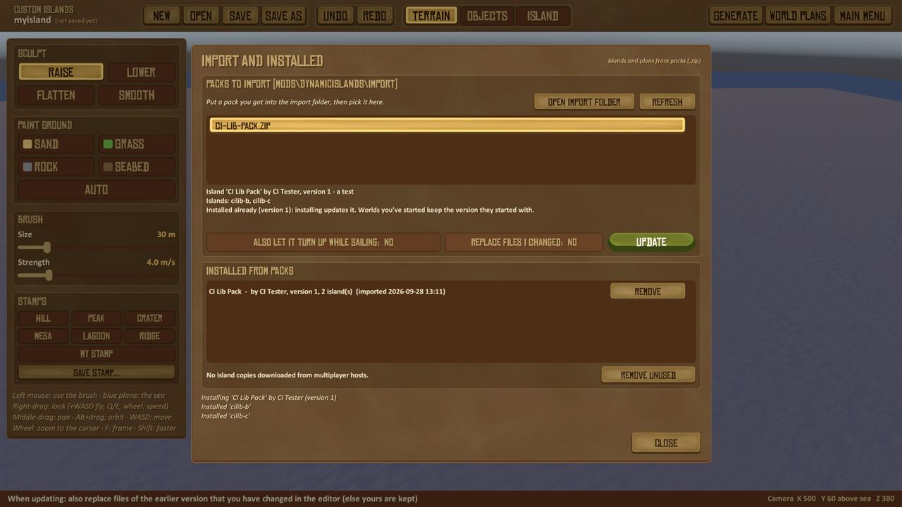
*The Import window: packs in the import folder, what the picked one holds, and what's installed.*

Import is offered in the island editor (the Islands and World plan windows), never inside a running world.

**The island library: download plans and islands others made.** **ISLAND LIBRARY** in Raft's main menu (also **Get
more...** in the New Game box and **Library...** in the Islands window) opens the library: a public collection on
GitHub ([SwedenJohansson/CustomIslands-Library](https://github.com/SwedenJohansson/CustomIslands-Library)) where every
entry is looked at before it goes in.
- **World plans** and **Islands** tabs, a **search** (titles, authors, summaries, tags), featured entries first. Each
  row has the entry's icon, title, author and summary, and says **INSTALLED** or **UPDATE** when that applies.
- The picked entry shows its pictures (**<** **>**), description, author, version, date, size, how many islands, players
  and length, and one button:
  - **Download** - downloads it and installs it the same way as Import (your own files are never overwritten, a plan's
    islands never turn up at random, an island only if you tick **Also turn up while sailing**);
  - **Update** - the library has a newer version than the one you have: installs it (worlds you've already started
    get it when its objects keep their order, else keep the version they started with). It replaces the entry's files, also ones you changed in the editor or World
    plans since: then the first click names them and **Sure? Update** goes ahead. To keep your changes, open the
    island (or plan) and **Save as** a new name first;
  - **Installed** - you have the newest version. **Remove** (click twice) takes it away again, keeping what a saved
    world uses.
  - An entry made with a newer version of the mod says **Download anyway**, with the warning.

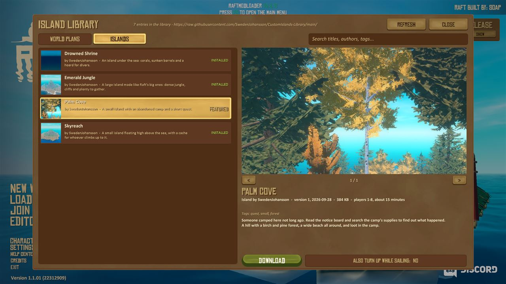
*The island library: the islands tab with three installed and Palm Cove picked; its picture, description and Download.*

- Every downloaded file is checked against the library's list (its size and a fingerprint); if one doesn't match,
  nothing is installed. A plan downloaded from the New Game box's **Get more...** is chosen there right away.
- The mod goes online only while this window is open, and sends nothing but the downloads - no account, no Steam id.
  Without internet it says "Can't reach the island library"; packs someone sent you still install with **Import...**.
  `Mods\DynamicIslands\library.txt` can switch it off (`online = off`).

**Sharing yours in the library:** click **Submit yours...** at the top of the island library. It explains the three steps:
1. **Export** your island or plan in the editor (above), with a title, summary, description and picture;
2. **post the pack** (`.zip`) on the [Custom Islands Discord](https://discord.gg/U7DfKY9tN) with a few words about it;
3. it is **approved first**: every entry is looked at before it goes into the library, so it can take a while. Once it
   is in, every player sees it in the library.

Its buttons open the Discord, your exports folder and this section of the guide. By submitting, you say you made it and
share it under CC BY 4.0 (others may use it and must credit you).

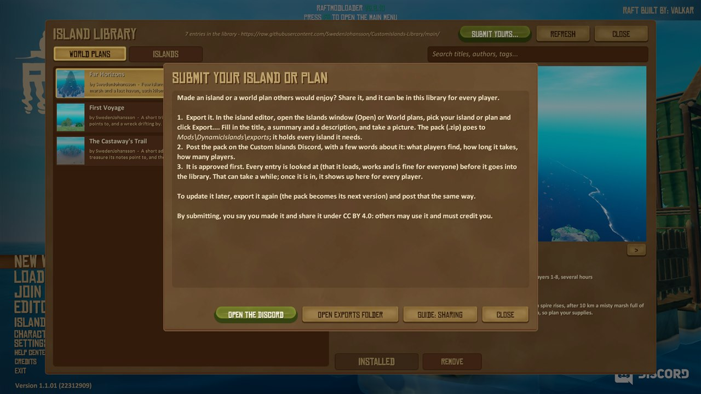
*Submit yours... in the island library: export, post it on the Discord, approved first.*

**Or with GitHub:** after an export, **Share...** in the Share window opens the library's
[Submit an island or plan](https://github.com/SwedenJohansson/CustomIslands-Library/issues/new?template=submit.yml)
form (a free GitHub account is needed) and the folder with your pack: drag the `.zip` in, tick the box (you made it and
share it under CC BY 4.0: others may use it and must credit you), send. To update it later, export it again (it keeps
its entry) and send that the same way.

### 4.8 Your first island, step by step

1. Main menu → **EDITOR**.
2. **Generate** → Normal tab: Style **Tropical**, click **Small island**, Nature **Like Raft** → **Generate**.
3. **Terrain** tab: raise a hill, paint a sandy path, stamp a **Lagoon**.
4. **Objects** tab: search "chest", place a **Chest**, click **Add items...** and pick some loot.
5. Place a **Sign** from "Notes & signs", click **Edit note...**, write a welcome.
6. **Island** tab: give it a name ("Skull Rock") and your name.
7. **Save** (Ctrl+S), type a name, Enter.
8. **Test** in the top bar: the island is tried in a world at once, and **Back to the editor** brings you back
   ([4.9](#49-trying-the-island-in-a-world-test)).
9. Main menu → **NEW WORLD** → create a world. Your island takes part in the Random islands plan, or press F10 and type
   `SpawnIsland <name> 250` to have it appear 250 m ahead right away.

**Next:** give the island a quest ([6.1](#61-quests)), then make a world plan that brings it into a world at the right
moment, with other islands after it ([7.2](#72-your-first-world-plan-step-by-step)).

### 4.9 Trying the island in a world (Test)

**Test** in the editor's top bar tries the island you are making in a real world, without leaving it by hand:

1. The island is saved (it needs a name: Save as first for a new one).
2. The mod goes to the main menu and loads the world **Custom Islands test** - it makes it the first time, as a normal
   world with the plan **No custom islands**, so nothing else turns up.
3. Your island is put beside the raft and you stand on it. Islands tried there before are taken away first.
4. Walk around, open the chests, read the notes, meet the creatures, try the quest.
5. **Esc → Custom Islands → Back to the editor**: the test world is left **without saving** and the editor opens
   again with your island, where you left it.

The test world is made with your last World settings choices (monsters, randomizer, extra options...); change them
there with **Esc → Custom Islands** if you want to try the island another way. It never counts as a saved world that
uses your islands (no kept copies or warnings for it).

Change something, **Test** again. The test world is a world like any other in Raft's Load Game list: you can load it
yourself too, and delete it from there when you no longer want it. (Trying an island in one of your own worlds is still
possible with F10 → `SpawnIsland <name> 250`.)

---

## 5. Making islands come alive

Select an object to see its **inspector** in the tool panel. Everything here can be undone.

### 5.1 Creatures

Open **Animals: hostile**, **Animals: catchable** or **Sea creatures** in the browser and place an animal: warthog,
pig, bear, polar bear, hyena, rats, roach, bee swarm, screecher; chicken, goat, llama; puffer fish, angler fish,
turtle, stingray, dolphin, whale.


*A warthog spot: a herd of 3, health ×2, damage ×1.5, comes back after 3 days, appears at once.*

- **Animals here:** 1 to 8 (a herd).
- **Easy / Normal / Hard / Boss**, or set **health**, **damage**, **speed** and **size** yourself.
- **Comes back after** the regrow days, or **Never**.
- **Appears** at once, or **when a zone fires** (an ambush, see [5.4](#54-trigger-zones-and-ambushes)).
- **Colour** (every object): a swatch, the strength, or your own mix.

In the editor a creature is a coloured marker with its name, or Raft's real model once you have been in a world since
starting Raft:


*Creature spots with Raft's own models: a warthog, a llama, a bear, a chicken.*

### 5.2 Notes and signs

"Notes & signs" has a paper, a bundle of papers, an open book, a sign, a notice board and a message in a bottle, and
**any object can be made readable** (**Add a note to it...**). A sign shows its note's title on its board.


*An object with a note: its title "Hidden treasure" and the start of the text.*


*The note editor: the title, the text (Enter starts a new line), and a preview of the paper players will see.*

### 5.3 Chests and loot

"Loot & chests" has chests, a crate, a wooden box and barrels, and **any object can hold loot** (**A chest...**).


*A chest's loot: planks, plastic, palm leaves, rope and nails. The Basics, Metal, Food and Treasure sets fill it
quickly; it fills up again after 3 days, or never.*


*Add items...: every item of Raft with its picture and a search. Click an item to add one, again to add more.*

**The abandoned raft crate.** "Loot & chests" also has Raft's own **Abandoned raft crate**: the box you grab on the
small abandoned rafts that drift by in Raft. In a world it works as there: a player takes it whole (look at it, **E**) and
gets a handful of random items from Raft's own loot for those rafts - now and then a cooking recipe or a mystery package.
Its contents **can't be chosen** (use a chest for chosen loot), and it **doesn't count for a quest's "Open a chest" step** -
the editor says so too, in the object list's hint and on the crate's own panel when you select it, and Check tells
you when a quest needs a chest and the island only has raft crates. Once taken it
stays gone, and comes back after the island's regrow days like harvested things ([4.4](#44-the-island-tab); 0 = never).

### 5.4 Trigger zones and ambushes

A **trigger zone** ("Zones & triggers") is an invisible sphere. When a player walks in it shows your **message**,
**gives items**, and wakes the creatures that wait for it. It fires **once** per world (again after the regrow days)
or **every time**.


*A trigger zone (the orange sphere): its name, size 10 m, the message "You hear grunting...", fires once, and one
creature spot waits for it.*


*The warthog's **Appears** is set to "when zone-158 fires": its name tag says it waits. It appears the moment a player
walks into the zone.*

**Invisible walls and ramps** (also in "Zones & triggers") are solid in the world but not seen: block a path, fence
an arena, or make a cliff climbable.

### 5.5 Atmosphere and sound

An **atmosphere zone** changes the fog colour, the light and adds particles (fireflies, mist, snow, embers) around a
spot; a **sound zone** plays one of Raft's 500+ sounds while a player is inside, or once on entering.


*An atmosphere zone: its size, fog colour and strength, light tint and strength, and particles (fireflies).*


*Fly the camera into the zone to see it: purple fog and fireflies.*


*Choose sound...: Raft's sounds with a search. ► listens, Use picks it.*

---

## 6. Stories: quests, behaviours, story items

### 6.1 Quests

**Island tab → Edit quest...**: a title, an introduction (shown when players arrive), up to 10 steps in order, a
reward and a closing message.


*The quest "The lost camp": go to the camp, read the diary, open the supplies, chase off 2 warthogs. The reward is
planks and rope, and when the quest is done it brings a saved island "Old camp" 700 m north, with a message and a
name on the Receiver.*

Steps: **go to** a trigger zone, **read** a note, **open** a chest (one of the mod's chests - Raft's abandoned raft crate doesn't count), **defeat** or **catch** a number of animals,
**collect** a number of a story item, **find** journal pages. Each step's kind is a **▼ list** (each kind says what it
asks). Steps point at things on the island by name: the small **▾** beside the name lists the names this island has
for that kind - its trigger zones, note titles, chest titles or creatures - so you can pick one instead of typing it
(place the zones, notes, chests and creatures first). **When the quest is done, bring a new island** chooses from a
list too (nothing, a saved island, a new island of a map type), and so does its direction.

### 6.2 Behaviour and events

Select any object → **Behaviour + events...**. No code needed:

- **A name** that actions refer to (objects with the same name act together).
- **Movement:** spin, bob, move back and forth, or **open and close** like a door, gate, bridge or lift (with a
  Preview in the editor).
- **At first:** there, or **hidden until shown** (a hidden creature spot is an ambush).
- **Players can use it:** Raft's "press E" hint with your own text ("Pull the lever").
- **Collision:** Raft's own, walk through, one box, or solid.
- **When ... then:** when a player uses it, walks into a zone, reads a note, opens a chest, or all the animals of a
  spot are defeated → show / hide objects, open / close doors, say a message, give items, play a sound, teleport the
  player, send a signal, write a journal page, or **wait** some seconds first. Each action is chosen from a **▼ list**
  that says what it does; **…** beside a name lists the names on this island.
- **Only if ...:** the player **has** an item or story item (or **uses one up**, like a key), an object is open,
  closed, shown or hidden, a signal was sent, the quest reached a step (a ▼ list too). Turn a check round with **not**; ask for
  **all** or **any** of them. **Otherwise** say a message.


*A log named "lever" that players can use ("Pull the lever"): it opens or closes the door and says "The door moves".*


*A door that opens only if the player has the story item "rusty key"; otherwise it says "It's locked. Maybe there's a
key somewhere..."*

**Island events** (Island tab): actions for when players first come to the island and when its quest is done.


*Island events: what happens when players first come to the island, and when its quest is done.*

### 6.3 Story items and story sets

**Island tab → Story items...**: keys, map pieces, logs... with a name, a description and a picture (Raft's quest
item pictures or any Raft item). Chests, zones, quest rewards and "give" actions hand them out; "only if" checks ask
for them; players find them in the journal (J).

**What ends up in the players' journal** ([3](#the-journal-j)), so you can plan a story with it:

- Every note with text becomes a page the first time someone reads it, titled with the note's title (give notes
  clear titles: the page list shows them). A note with no text adds no page.
- An event's **write a journal page** adds a page with your title and text (once per world) - a clue, a diary entry,
  what the crew learned.
- Story items show with their picture, name and description; when a check **uses one up**, it leaves the journal.
- A quest step **Find a story item** or **Find pages** counts what the journal holds, also what was found before the
  quest.

**Story sets** place a ready piece of a story in one step: **a locked door and its key** (in a chest with a note),
**a trail of notes** leading to a hidden chest, **a treasure map** (a bottle gives the map; the X digs up a chest
only for someone who has it), or **a locked chest** whose key is hidden in driftwood nearby.


*The Story items window: the island's story items ("Old key") and the four story sets.*

### 6.4 Islands that bring islands

**Island tab → Islands it brings...** gives the island its own rules: "when my quest is done", "when step 2 is done",
"when zone X fires" or "when players first get here" → bring a saved island or a new island of a map type, how far
and which way, with a message and a name on the Receiver. The cards work like a world plan's rules ([7.3](#73-a-rule-card-part-by-part)),
but they travel with the island: a chain of shared island files is a story on its own, in any world where the first
island turns up. A world plan is the better choice when you want to decide the whole world's story in one place.


*An island rule: when this island's quest is done, bring a new island of a random type 600 m north, with the
message "Well done" and the name "Reward" on the Receiver. The map on the right sketches where islands go.*

### 6.5 Your islands in Raft's story (the Receiver)

Raft's own story is a chain. A note on each story island gives the **frequency** of the next one, and players find it
by tuning the **Receiver** to it: Radio Tower, Vasagatan, Balboa, Caravan Town, Tangaroa, Varuna Point, Temperance
and, last, Utopia, the ending. A world plan ([section 7](#7-world-plans-which-islands-a-world-gets)) can change that
chain, in the editor's **World plans** window:

- **Raft's story islands: on/off.** On (the default) keeps Raft's story. **Off** leaves all of Raft's story islands
  out: the plan's own islands are the whole adventure. Raft's ordinary islands still turn up as in any world.
- **Leave out one story island:** click its name in the row next to the switch (it goes dark). The note before it then
  leads to the one after it. For example, without Balboa, Vasagatan's note gives Caravan Town's frequency.
- **Put your island into the story:** on a rule's card, the **STORY** list chooses its place:
  - **First**: before everything, unlocked from the start of the world;
  - **After** one of Raft's story islands, or after another of your islands in the story;
  - **In place of** a story island: that island is left out and yours takes its place. Its note leads to your island,
    and your island leads on to the one after.
- **Done when:** when your island counts as done, so the next step is unlocked:
  - by default, when its quest is done, or when players reach it if it has no quest;
  - or when players reach it, when N steps of its quest are done, when one of its zones fires, or when it sends a
    signal.
- **Where** it appears, for any rule:
  - **on the Receiver**: it gets its own 4-digit frequency, made for each world. When it is unlocked, every player sees
    a banner "Tune the Receiver to #4821", the journal gets a page, and the number on the note before it shows it.
    **Any player** can dial it on the Receiver; the island then comes up ahead of the raft, like Raft's story islands;
  - **by chance while sailing**: it comes up ahead some time after it is unlocked;
  - **ahead of the raft** or **near an island**, as soon as it is unlocked.
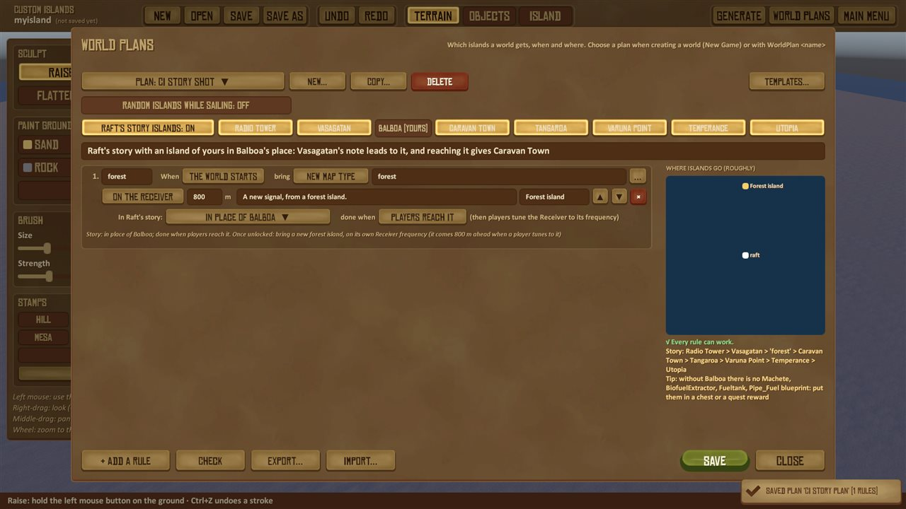
*Check on the template "Balboa replaced" (a new forest island in Balboa's place): every rule can work, and two tips - the
story in order (Radio Tower > Vasagatan > 'forest' > Caravan Town > ... > Utopia) and the blueprints Balboa held.*

- A rule's own **when** still counts. A story island "after Vasagatan" with "after sailing 3 km" is unlocked by
  Vasagatan's note, but comes only once the raft has also sailed 3 km.

When one of your islands unlocks one of Raft's story islands, no note of Raft's told the players, so a banner does:
"The Receiver picks up a new frequency: #1234", and the journal keeps it as a page ("A new signal").

**Check** shows the chain the plan makes (for example "Radio Tower > Vasagatan > 'forest' > Caravan Town > ..."), and
gives tips. They are only recommendations; you can do what you want:
- Raft's story starts at the Radio Tower;
- Utopia is Raft's ending, so without it last the story has no ending;
- a left-out island may hold blueprints the story needs. Without Balboa there is no machete, fuel tank, fuel pipes or
  biofuel extractor, so put them in a chest or a quest reward of your own.

**Templates...** has three to start from:
- **Receiver adventure**: Raft's story off, four islands each found with the Receiver, each quest giving the next
  frequency;
- **Detour in Raft's story**: one of your islands after Vasagatan;
- **Balboa replaced**: an island in Balboa's place.

In a world, `StoryChain` (F10) shows the chain and where it stands. The chain belongs to the world: it is saved with
it, the same for every player, and it comes along when another player hosts the world. If you edit your plan's story
later (its islands, Raft's story on or off, the islands left out), the changed chain plays the next time the world
loads, like any change to your plan ([section 7](#7-world-plans-which-islands-a-world-gets)): what is unlocked and
done stays, and your Receiver islands keep their frequencies.

### Raft's notebook and the journal in each kind of plan

**The short answer:**

- **Raft's notebook (T) never shows custom content.** It only ever holds Raft's own story: the notes found on
  Raft's story islands and Raft's quest items. A custom island's notes, story items, quests and pages never go into
  it - not even when your island takes a story island's place. The plan changes only two things there: **which of
  Raft's frequencies get unlocked**, and **the number written on a Raft note** - a note shows the frequency of what
  comes next in *this world's* chain (your island's, when it is on the Receiver, or "#----" when what comes next isn't
  found with the Receiver).
- **The journal (J) is only for custom content** - but not only for quests. It collects from every custom island,
  with or without a quest: notes read, pages events write, story items, and the frequencies the plan gives out. It
  never holds Raft's notes or quest items, and it lists no quests: a quest shows in the **quest panel** while you are
  at its island ([3](#quests)), the same in every kind of plan.
- **Custom islands outside the story** (by chance, or brought by an ordinary rule) work the same in every case below:
  their quest in the quest panel, their notes and story items in the journal.

**Case by case.** "Your islands in the story" means rules with a place in the **STORY** list (first, after, in place
of); islands with quests that a plan brings in other ways count as "outside the story" above.

| The plan keeps... | Without your islands in the story | With your islands in the story |
|---|---|---|
| **All of Raft's story** (on, nothing left out) | **Notebook:** exactly as in Raft without the mod. **Journal:** only what custom islands you meet give (empty if none have notes or story items) | **Notebook:** Raft's notes and quest items as usual, but the note before your island shows *your island's* number instead of the next Raft island's. **Journal:** your island's frequency (a page, with the banner), its notes and story items. When your island is done, the next Raft island's number comes as a banner **and a journal page** ("A new signal") - no Raft note gives it any more |
| **Some of it** (islands left out or replaced) | **Notebook:** the note before a left-out island shows the number of the one after it; a left-out island's notes and quest items never come (the island never does). **Journal:** nothing about the left-out islands | As in the row above, and an island **in place of** a story island takes that island's spot: the note before it shows your island's number, and after it the story goes on to the next Raft island (a banner and a journal page give its number) |
| **None of it** (Raft's story off) | **Notebook:** none of Raft's story notes, quest items or story frequencies - the Receiver finds nothing of Raft's. **Journal:** only what custom islands you meet give | **Notebook:** as on the left - it stays out of the adventure. **Journal:** the whole adventure is followed here: each Receiver island's frequency as it is unlocked, the notes and story items of your islands; each island's quest in the quest panel. The first island of the chain is unlocked from the start |

The world option **Story islands in a new order** ([9.4](#94-extra-options)) works the same way for the notebook:
the numbers on Raft's notes follow the world's order.

## 7. World plans: which islands a world gets

A **world plan** decides which custom islands a world gets, **when** they come and **where**. Without a plan, islands
only turn up by chance while you sail. With a plan, you can tell a story: *"When the world starts, put an old camp
ahead of the raft. When its quest is done, bring my island Skull Rock 800 m to the north-east. When players reach Skull
Rock, bring a treasure island near it."*

A plan is a list of **rules**, and each rule brings **one island**. Every rule answers four questions:

| Question | For example |
|---|---|
| **When** does the island come? | the world starts, after sailing 3 km, on day 5, when an island's quest is done, when players reach an island |
| **What** island? | one of your saved islands, a new island of a map type (a camp, a volcano, a wreck...), one from the spawn pool, one of a list |
| **Where** does it go? | ahead of the raft, near another island (how far and which way), on its own Receiver frequency, by chance while sailing |
| **What are players told?** | a message on screen ("Smoke rises from a small island ahead.") and a name on the Receiver |

You make and change plans in the island editor's **World plans** window, and pick one for a world in Raft's **New
Game** box. You don't need to have built any islands yourself: the mod's map types ([4.6](#46-ready-made-islands-map-types))
are enough for a whole plan.

### 7.1 The plans that come with the mod

Choose one in the New Game box (**Custom Islands plan**), or open it in World plans to see how it's made:

| Plan | What happens |
|---|---|
| **Random islands** (the default) | Islands turn up by chance while you sail ([section 3](#3-sailing-custom-islands-in-your-world)). No story |
| **No custom islands** | Plain Raft: no custom islands at all (the World settings still apply) |
| **Island hopping** | An old camp near the start; each island you reach shows the way to the next, further out |
| **Adventure** | A story: each quest leads to the next island (a camp, islets, a beast's plateau, a treasure), with a wreck and a sunken island on the way |
| **Growing sea** | Random islands, plus a special island every few km and days |
| **Receiver adventure** | A new adventure instead of Raft's story: each island is found with the Receiver, and its quest gives the next frequency |

**Island hopping**, **Adventure**, **Growing sea** and **Receiver adventure** are ordinary plan files: open one in World
plans and use **Copy...** to start your own plan from it.

### 7.2 Your first world plan, step by step

This walkthrough makes a plan called **Castaway trail** with four islands. It uses map types, so it works even if you
haven't built an island yet. Step 6 shows where to use one of your own islands instead.


*The World plans window with the Adventure plan open: the plan's buttons and switches at the top, one card per rule
(WHEN, BRING, WHERE, TELL, STORY), the map on the right, and + Add a rule, Check and Save at the bottom.*

**1. Open the World plans window.** In Raft's main menu click **EDITOR** and wait for the loading box to finish. In the
editor's top bar, click **WORLD PLANS** (top right).

**Help while you work:** every part of the window has a small **?** next to it. Hover it (or click it) and a note
explains that part: what each choice of **WHEN**, **BRING** and **WHERE** means, what Check looks for, and so on. The green
**Help** button at the top right shows the steps below in short, with buttons that open this guide (the PDF, or this
section online).

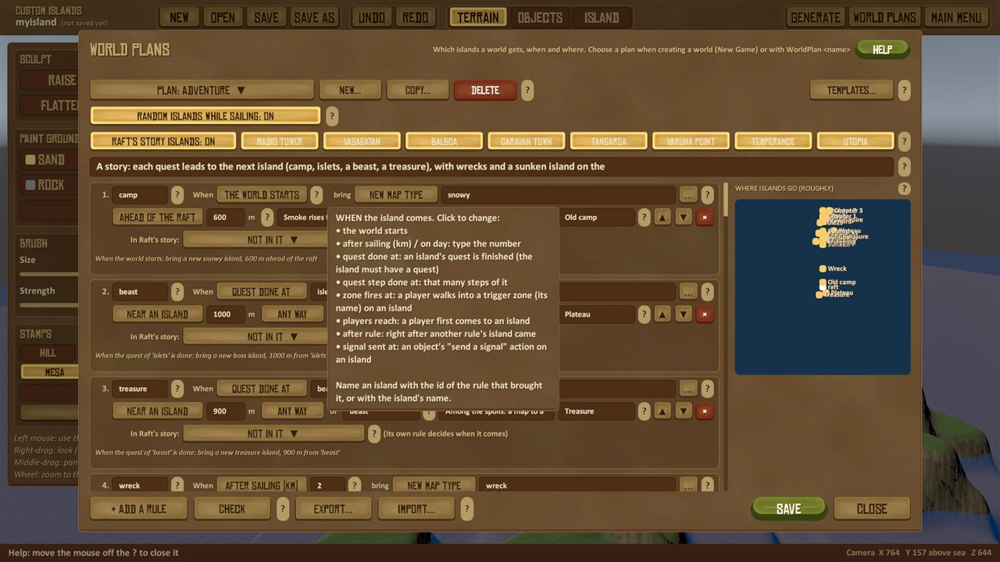
*Hovering the ? after **When**: every choice it has, in a few words.*

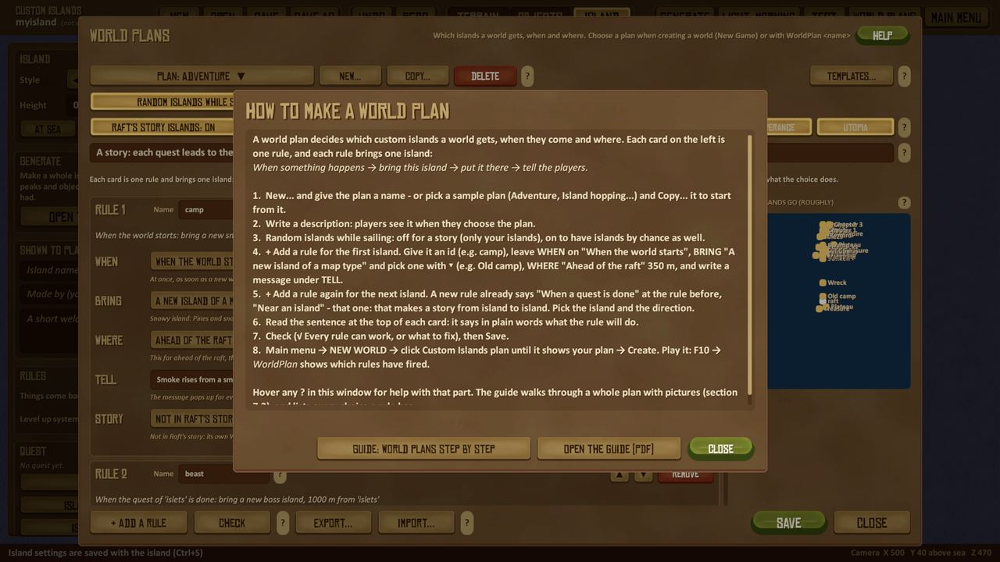
*Help: how to make a plan, in eight steps, and the guide's buttons.*

**2. Start a new plan.** Click **New...**, type a name (`Castaway trail`) and press **Enter** (or **OK**). The window
now shows your empty plan: "No rules yet". The name is also the plan's file name, so it can't be the name of a plan you
already have.

**3. Describe it.** Click the long field under the switches and write one line about the plan, for example
`Follow a castaway's trail across four islands`. Players see it when they choose the plan in the New Game box.

**4. Set the two switches.**
- **Random islands while sailing: on / off.** On: islands from your spawn pool *also* turn up by chance, between your
  plan's islands. Off: the world has only the plan's islands. For a story, **off** is usually best - click it.
- **Raft's story islands: on / off.** On (the default): Raft's own story (Radio Tower, Vasagatan, ... Utopia) is still in
  the world, next to your islands. Off: your plan is the whole adventure. Leave it **on** for now; [6.5](#65-your-islands-in-rafts-story-the-receiver)
  explains the story row.

**5. The first island: an old camp when the world starts.** Click **+ Add a rule** (bottom left). A card appears with
one section per question ([7.3](#73-a-rule-card-part-by-part)). Each section has a **▼ list**: click it and pick a choice -
each choice says in a line what it does. Fill the card in:
- **Name** (top of the card, `rule1`): type `camp`. The name is how other rules say "the camp".
- **WHEN**: it already says **When the world starts**.
- **BRING**: pick **A new island of a map type**, then click **▾** after the **map type** field and pick **Old camp** (or
  type `camp`).
- **WHERE**: it already says **Ahead of the raft**. Set the metres to `350`.
- **TELL**: the message `Smoke rises from a small island ahead.`, and **on the Receiver** `Old camp`.

The sentence at the top of the card now reads: *When the world starts: bring a new old camp, 350 m ahead of the raft.*
Read it after every change: it says in plain words what the rule will do. Under each section, a line in italics explains
the choice you made.

**6. The second island: your own island, when the camp's quest is done.** Click **+ Add a rule** again. A new rule
already waits for the rule before it: **WHEN** **When a quest is done**, island `camp`; **WHERE** **Near an island**,
600 m. Fill in:
- **Name**: `cove`.
- **BRING**: pick **One of my saved islands**, then **▾** and one of your islands (for example **Skull Rock** from
  [4.8](#48-your-first-island-step-by-step)). No island of your own yet? Leave it on **A new island of a map type** and
  choose **Tropical island**.
- **WHERE**: **Near an island**, `800` metres, and in the direction list **North-east**. The field after **of** can stay
  empty: then it means "the island where the WHEN happened", the camp. (You can also type `camp` there, or pick it with
  the **▾** after the field.)
- **TELL**: `The camp's notes speak of a cove to the north-east.`, on the Receiver `Cove`.

The camp's map type has a quest (the notice board). "When a quest is done" at an island that has no quest never fires -
use **When players reach an island** for those (next step).

**7. The third island: a treasure island when players reach the cove.** **+ Add a rule**, then:
- **Name**: `treasure`.
- **WHEN**: **When players reach an island**, then the **▾** after the **island** field and pick `cove` (or type it).
  The list has the plan's other rules and your saved islands, and says which have a quest.
- **BRING**: **A new island of a map type** → **▾** → **Treasure island**.
- **WHERE**: **Near an island**, `900` metres, **Any way**, of `cove`.
- **TELL**: `From the cliffs you spot another island.`, on the Receiver `Treasure`.

**8. A fourth island on the way: a wreck after 3 km.** Not every rule has to follow another. **+ Add a rule**, then:
- **Name**: `wreck`; **WHEN**: **After sailing a distance**, type `3` (km);
- **BRING**: **A new island of a map type** → **Wreck**;
- **WHERE**: **Ahead of the raft**, `300` metres; **TELL**: `Something floats ahead: a wrecked raft.`

**9. Check the plan.** Click **Check**. The box under the map says **√ Every rule can work.**, or lists what's wrong
(see [7.5](#75-check-finding-and-fixing-problems)). The map on the right sketches where the islands will go.

**10. Save.** Click **Save**. The bottom of the screen says `Saved plan 'Castaway trail' (4 rules)`. Always save before
you click **Close**: Close throws away changes since the last save.

**11. Play it.** Go back to the main menu (**MAIN MENU**, top right) → **NEW WORLD**. At the bottom right, click the
**Custom Islands plan** list and choose **Castaway trail**, then click Raft's **Create**. In the world:
- the old camp is 350 m ahead of the raft right away, with the message on screen and "Old camp" on your Receiver;
- finish the camp's quest (the quest panel shows its steps) and the cove comes 800 m to the north-east;
- sail to the cove: when you reach it, the treasure island appears near it;
- after 3 km of sailing, the wreck comes up ahead, whatever else you're doing.

Press **F10** and type `WorldPlan` to see the world's plan and which rules have fired.

**12. Change it later.** Open **WORLD PLANS**, click the **Plan** button at the top left and pick your plan. Change
what you want, **Save**. New worlds get the new version. A world that already uses the plan gets it the next time you load
it on your PC; rules that already happened stay done ([7.6](#76-playing-changing-and-sharing-a-plan)).

The finished plan as its file (`Mods\DynamicIslands\plans\Castaway trail.plan`, see [7.7](#77-the-plan-file)):

```
description = Follow a castaway's trail across four islands
random = off
story = on

rule = camp | type:camp | start | ahead:350 | Smoke rises from a small island ahead. | Old camp
rule = cove | island:Skull Rock | quest:camp | near:camp:800:north-east | The camp's notes speak of a cove to the north-east. | Cove
rule = treasure | type:treasure | visit:cove | near:cove:900:any | From the cliffs you spot another island. | Treasure
rule = wreck | type:wreck | km:3 | ahead:300 | Something floats ahead: a wrecked raft.
```

**Short cut: Templates...** (top right) adds a ready-made set of rules to the open plan: the four sample plans, and
**Detour in Raft's story**, **Balboa replaced**, **Sky chain** (flying islands, each appearing when players reach the one
before), **Story chain** (three of your islands, each quest bringing the next: pick your islands with **▾**) and **Quest
reward island**. Then change what you like. An id that's already in your plan gets a `b` added.

### 7.3 A rule card, part by part

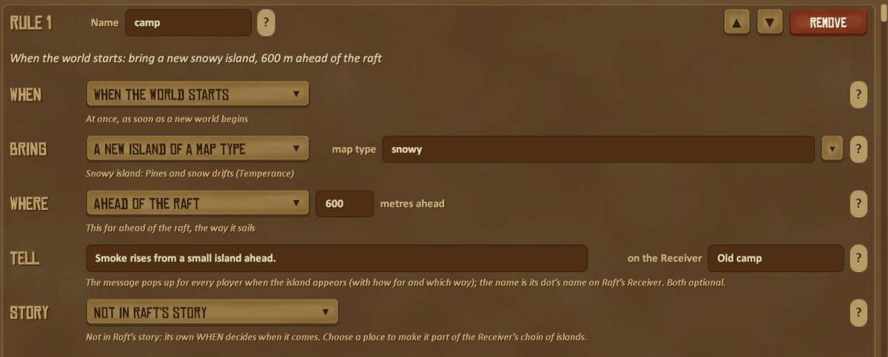
*A rule card of the Adventure plan: its name and what it does in a sentence, then one section per question. Each section
has a ▼ list of its choices and a line in italics saying what the chosen one does.*

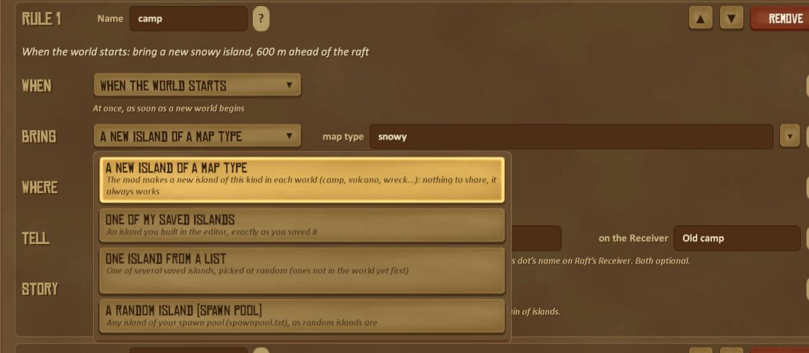
*The **BRING** list open: every choice, each with what it does. The chosen one is lit; click another to change it (Esc
or a click outside closes the list).*

| Part | What it does |
|---|---|
| **RULE 1** and **Name** | The rule's number and name (`camp`, `beast`). Other rules point at the island it brought with this name. Each name once per plan; no `\|` or `:` |
| **▲ ▼ Remove** | Move the rule up or down in the list (the order only matters for reading: each rule waits for its own WHEN), or remove it |
| **The sentence** | Under the name: the rule in plain words. If it doesn't say what you meant, change the card |
| **WHEN** | What the rule waits for - a ▼ list of nine choices ([7.4](#74-everything-a-rule-can-do)). A choice that needs more shows named fields after it: **island**, **zone**, **signal**, **steps**, **day**, **km sailed** |
| **BRING** | What kind of island: a new island of a map type, one of your saved islands, one island from a list, or a random one from the spawn pool. The field after it says which (**map type**, **island**, **islands**) |
| **WHERE** | Ahead of the raft, near an island, on the Receiver, or by chance while sailing; then the **metres**. For "near an island", also the **direction** (a ▼ list: Any way, North, North-east...) and **of** which island (empty = the island where the WHEN happened) |
| **TELL** | The message every player sees when the island appears (with how far and which way it is), and the island's name **on the Receiver**. Both optional |
| **STORY** | World plans only: the island's place in Raft's story (a ▼ list: not in it, first, after or in place of one of Raft's story islands...) and, when it's in the story, **done when** ([6.5](#65-your-islands-in-rafts-story-the-receiver)) |
| **The lines in italics** | Under each section: what the chosen option does, with the numbers and names you gave. For a map type, what kind of island it makes |
| **?** | At the end of each section: hover it for every choice of that section in a few words |

**The ▾ lists.** A field that names something has a **▾** after it: the island a rule waits for, the zone, signal or quest
step on that island, the island to put it near, the map type or saved island to bring, and a story rule's "done when"
zone, signal or step. It lists what exists, so there is nothing to misspell: the plan's rules (with what they bring),
your saved islands (with "quest, 4 steps" or "no quest"), and the zones, signals and quest steps saved in that island's
file. Picking one fills the field; typing still works. A new map-type island is only made in the world, so its zones and
signals can't be listed: its list is empty and says so - type the name.

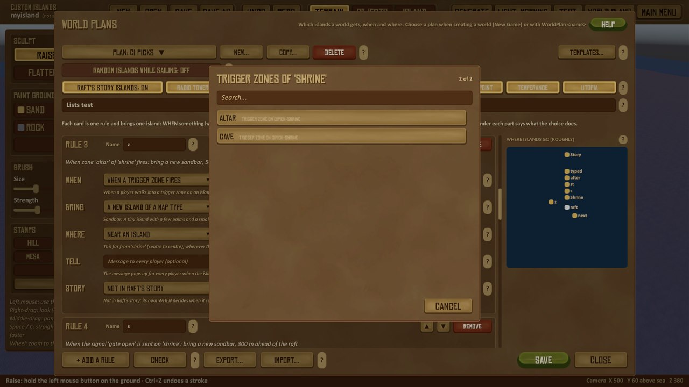
*The ▾ after the zone of "When a trigger zone fires" lists the zones of the island the rule waits for (here the saved island "shrine").*

### 7.4 Everything a rule can do

**When** the island comes. "Island" below means a rule's id (the island that rule brought) or the name of an island:

| When | Needs | The island comes... |
|---|---|---|
| **When the world starts** | - | as soon as the world starts |
| **After sailing a distance** | km | when the raft has sailed that far in this world |
| **On a day** | a day | on that in-game day |
| **When a quest is done** | an island | when that island's quest is done. The island must have a quest ([6.1](#61-quests)) |
| **When quest steps are done** | an island, steps | when that many steps of its quest are done |
| **When a trigger zone fires** | an island, a zone name | when a player walks into that trigger zone on it ([5.4](#54-trigger-zones-and-ambushes)) |
| **When players reach an island** | an island | when a player first comes to that island |
| **Right after another rule** | a rule's name | right after that rule's island has come |
| **When a signal is sent** | an island, a signal name | when an object on that island sends that signal (a **send a signal** action, [6.2](#62-behaviour-and-events)) |

**What** it brings:

| Bring | Which one | Good to know |
|---|---|---|
| **One of my saved islands** | one of your islands (`.island` files) | Every player gets it from the host; only the host needs the file |
| **A new island of a map type** | a map type: `random`, `sandbar`, `atoll`, `archipelago`, `stacks`, `boss`, `volcano`, `swamp`, `spire`, `treasure`, `camp`, `sunken`, `sky`, `wreck`, the styles `tropical`, `snowy`, `desert`, `forest`, `volcanic`, and the randomizer's `oddity`, `large`, `lair` | A new island is made for the world, different in every world. No file needed, so it always works when shared |
| **A random island (spawn pool)** | - | A random one of your islands that may turn up while sailing (`spawnpool.txt`, [10](#10-settings-files)) |
| **One island from a list** | island names, separated by commas | One of them is picked, ones not in the world yet first |

**Where** it goes:

| Where | Metres mean | Good to know |
|---|---|---|
| **Ahead of the raft** | how far ahead | The simplest: players can't miss it |
| **Near an island** | centre to centre from that island | With a direction and an island (**of**). If **WHEN** has no island (the world starts, a distance, a day, another rule), you must name one in **of** |
| **On the Receiver** | how far ahead it comes when tuned | It gets its own 4-digit frequency; it comes when a player tunes Raft's Receiver to it ([6.5](#65-your-islands-in-rafts-story-the-receiver)) |
| **By chance while sailing** | how far ahead | Comes up ahead some time after the rule fires, like a random island |

**Ideas to start from:**
- **A quest chain:** each island's rule waits for **When a quest is done** at the island before it, **Near an island** of it. Players
  follow the story from island to island. (Every island except the last needs a quest.)
- **Explore to find more:** **When players reach an island** instead of **When a quest is done**, for islands without quests.
- **Timed surprises:** **After sailing a distance** or **On a day** with **Ahead of the raft**, between the story's islands.
- **A secret:** a trigger zone in a cave (**When a trigger zone fires**) or a lever that sends a signal (**When a signal is sent**) brings a
  hidden island.
- **Something different every time:** **One island from a list** with a few of your islands, or a map type `random`.
- **Found by radio:** **On the Receiver**, with the message telling players the island is out there.

### 7.5 Check: finding and fixing problems

Click **Check** any time. It goes through the plan the way a world will play it, and looks **inside the islands** too:
each island's quest step by step (is there a zone, a note, a chest or creatures with the name each step needs?), its
trigger zones and signals, and - for new islands of a map type - a sample island of that type. Then a report opens:

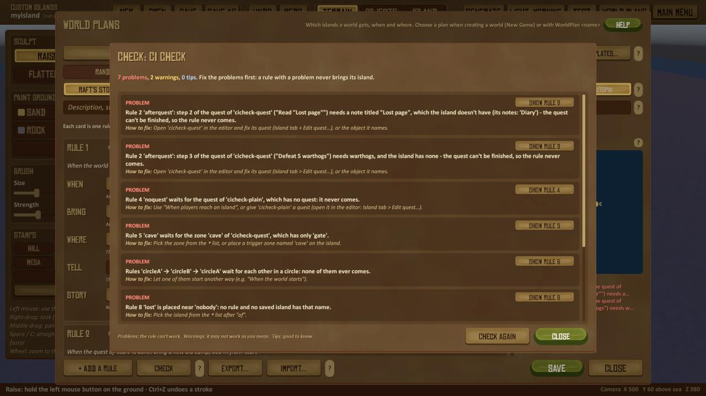
*Check's report: each finding with its level, the rule it is about, why, how to fix it, and **Show rule** to go to its card.*

- **Problem** (red): the rule can't work - it never brings its island. Fix these first.
- **Warning** (yellow): it may not work as you mean (for example it waits for an island no rule of the plan brings).
- **Tip** (blue): good to know (no message, very far away, Raft's story...).

After the first Check, every card shows its own problems and warnings in red and yellow under its sentence, and they
follow as you change the plan. The box under the map sums up. **Save** checks too, and opens the report when there is a
problem. The report's **Check again** checks after you changed something.

What Check looks for:

| | Problems (it can't work) | Warnings and tips |
|---|---|---|
| **Names** | a rule with no name, two rules with the same name | |
| **WHEN** | no number for a distance or a day; a quest wait at an island **without a quest**; a quest that **can't be finished** (a step needs a zone, note, chest or creatures the island hasn't, or more pages than it has notes); more steps than the quest has; a **zone** or **signal** the island hasn't (Check lists the ones it has); an island or rule name that doesn't exist; a rule that waits for itself; **rules that wait for each other in a circle** | waits for a saved island **no rule of the plan brings** (a problem when random islands are off); waits for a rule that has a problem; needs more creatures than the island has (and they don't come back); a story item nothing on the island gives; a distance or day so large it's slow to test |
| **BRING** | no island chosen, an island that isn't saved, a map type that doesn't exist, a list with no saved island, an empty spawn pool | some islands of a list aren't saved; a very big island (over 12 000 objects); the same island brought twice |
| **WHERE** | near an island nobody has; near "the island where it happened" when the WHEN happens at no island; near its own island | near a saved island no rule brings; near a rule it doesn't wait for (it waits until that island is there); very far away |
| **TELL** | | no message; found by Receiver but no Receiver name |
| **STORY** | its "done when" can't happen (as WHEN above) | after an island that isn't in the story; Raft's story order and missing blueprints |
| **The plan** | no rules, random islands off and Raft's story off (a world gets nothing); an island's own rules using the story or the Receiver | nothing comes by itself (every rule waits for another island) |

Check can't play the quests for you. Test your plan: create a world with it and play it through (F10 → `WorldPlan`
shows which rules have fired). A map type's island is made new in each world, so Check looks at a sample of it: its
names are the same every time, its exact places aren't.

### 7.6 Playing, changing and sharing a plan

- **Choose it** in the New Game box: click the **Custom Islands plan** list and choose your plan, then **Create**. The
  choice is remembered for the next new world. In a running world, the host can give it another plan: **Esc → CUSTOM
  ISLANDS → Plan** (a list of the plans; its islands come from now on, what is done or unlocked stays), or F10 →
  `WorldPlan <name>`; `WorldPlan` on its own shows the plan and which rules have fired.
- **Multiplayer:** only the host needs the plan and its islands. Players who join get every island as it appears
  ([section 8](#8-playing-together)).
- **The plan decides islands only.** Monster difficulty, build cost, the level up system, the randomizer and the extra
  options are chosen in World settings for each world, whatever plan it has ([section 9](#9-world-settings-rules-and-extra-systems)).
- **Copy...** saves the plan under another name. **Delete** removes the plan file straight away (it doesn't ask); worlds
  that use it keep their own copy.
- **Share it:** **Export...** makes a pack (`.zip`) with the plan and every saved island it needs, to send to a friend
  or to put in the island library; **Import...** installs a pack someone sent you ([4.7](#47-saving-and-sharing)).
  Map type islands need no file, so a plan made only of map types always works for everyone.

**A world keeps its own copy of its plan.** When a world starts, the plan's rules are saved with the world:
- **you edit your plan** (in World plans, on the PC of the player who made the world): the next time the world loads,
  the changed plan plays - rules that already happened stay done, new ones come - and you're told so;
- deleting the plan file, an **update** of a library or pack plan, or **another player** hosting the world with a
  different plan of the same name never changes the world: it plays its own copy (to give a running world another
  plan on purpose, pick it under **Esc → CUSTOM ISLANDS → Plan**, or use `WorldPlan <name>` in it);
- the world's plan goes along when someone else hosts the world later ([section 8](#8-playing-together)), even if they
  never had the plan;
- worlds saved before this version get their copy the next time they're saved on a PC that has the plan file.

A plan can only bring islands that are on the host's PC. If one is missing, the host sees which island and where it
came from (the pack or library entry, or "ask the player who made this world"), and the rule waits until the island is
there.

### 7.7 The plan file

Plans are text files in `Mods\DynamicIslands\plans\<name>.plan`. The World plans window writes them for you, but you
can also open one in a text editor (the file starts with a short help). One `rule =` line per rule, its parts
separated by `|`:

```
rule = id | what | when | where | message | Receiver name
```

| Part | Written as |
|---|---|
| what | `island:<saved island>`, `type:<map type>`, `pool`, `oneof:<island>, <island>, ...` |
| when | `start`, `km:<km>`, `day:<day>`, `quest:<island>`, `step:<island>:<steps>`, `zone:<island>:<zone>`, `visit:<island>`, `rule:<rule id>`, `signal:<island>:<signal>` |
| where | `ahead:<m>`, `near:<island>:<m>:<direction>`, `receiver:<m>`, `sailing:<m>` |

Two more parts put an island into Raft's story: `| first` / `after:<story island or rule id>` / `instead:<story island>`
and when it's done: `quest`, `visit`, `step:<n>`, `zone:<zone>`, `signal:<signal>`. Other lines: `description = ...`,
`random = on/off`, `story = on/off`, `storyleaveout = Balboa, Tangaroa`. Save the file; the World plans window and the New Game box read it the
next time they open.

## 8. Playing together

Up to eight players (Raft's maximum). **Every player needs the mod.**

- **The host decides, for everyone:** the islands, the plan, the World settings (world rules, randomizer, extra
  options, which islands turn up while sailing; [section 9](#9-world-settings-rules-and-extra-systems)), and the host's
  `spawnpool.txt` settings that change what players see (regrow days, Receiver dots, unload distance). A player's own
  files and last New Game choices never change the host's world, and only the host can change its settings.
- **Players who join** (or join again, or after a restart) get all of it: the islands and any island files they don't
  have, what was chopped, picked, looted and fired, doors and levers, quests, the crew's journal, where they stood on
  an island, and the tough animals' health.
- **Shared:** harvesting and pickups, chests (when several players open one at the same moment, the first gets it),
  zones, doors, quests and their rewards, story items, the journal. Things that move follow a clock all players share,
  so everyone sees them in the same place.
- **What grows back** is the host's decision: things come back when the island loads on the host after the regrow
  days; a player who has the island loaded sees it the next time it loads there.
- **Joining:** use Steam's "Join Game" on a friend (Raft's own Join World list is empty in this Raft version).
- **Someone else hosts next time:** Raft keeps the world on the host's PC. Copy its folder (`%USERPROFILE%\AppData\LocalLow\Redbeet
  Interactive\Raft\User\User_<Steam id>\World\<world name>`) to the new host's PC, into their own `User_<Steam id>\World`. The custom
  islands, what was used, quests, the journal, everyone's levels, the world's rules and its plan come along: the folder carries
  the mod's copy (`CustomIslands.txt`), and every player who joined keeps one too. Islands you only have from joining are used
  from their downloaded copies. Islands the plan hasn't brought yet are the one thing the new host may not have - see the
  table below.
- **Levels** (with the level up system on): each player's own, kept by the host and back when they join again; the
  host works out everyone's EXP, and each player sees the others' levels under their names.

### Who needs what: every case

Only **the host's** islands, plan and settings count in a game. Players who join need **the mod, nothing else**: no
islands, no plans, no packs. What they're sent is kept on their PC (islands as `<name>_<code>`), which is what lets
them host the world later.

| Case | What happens | What anyone has to do |
|---|---|---|
| **A hosts, B joins** (any number of players, joining and leaving any time) | B gets every island that has appeared, with what was chopped, looted and fired, the quests, the journal, levels and settings - also after leaving and joining again, or a crash | Nothing |
| **A adds islands while B plays** (a plan's rule, a random island, a spawned one) | B gets each new island as it appears | Nothing |
| **B hosts A's saved world later**, A joins | B uses the world's own copy (it comes in Raft's world folder, and B kept one while playing): the islands that appeared (from what B was sent), what was used, quests, journal, levels, World settings, and the **plan** | Copy the world folder to B (below). If the plan still has islands to bring that never appeared, B doesn't have them: B sees which ones. A exports the plan (4.7) and B imports it, or B gets it from the island library |
| **A world made from a pack or library plan** hosted by someone who never installed it | As above; the message names the pack or library entry | Install that pack or entry |
| **A world saved before worlds kept their plan** (older versions), hosted by someone without the plan file | The plan's remaining rules can't run: the host is told when the world loads | The first host saves the world once with this version (the plan is then in the world), or gives the plan file |
| **The world's maker edits the plan** while worlds use it | The next time such a world loads on their PC, it plays the changed plan (they're told) | Nothing |
| **The plan is updated (library or pack) or deleted**, or another player hosts with a different plan of the same name | Worlds already started keep their own copy | Nothing (`WorldPlan <name>` in a world to switch it on purpose) |
| **An older save of the world is loaded** (Raft's Load Game box keeps the last 8 saves) | The custom islands, what was chopped, looted and fired, quests, journal and settings go back to that save as well | Nothing |
| **An installed island is updated** while a world uses it | That world gets the new one when its objects keep their order; else it keeps the version it started with (new worlds get the new one) | Nothing |
| **You remove a pack** that a saved world uses | What the world uses is kept (you're told which world) | Nothing |
| **A pack's island has the name of one of yours** | Installed as `Name (Pack title)`; yours is untouched | Nothing |
| **A pack was made with a newer mod version** | A warning; "Install anyway" may leave out what this version doesn't know | Update the mod if something's missing |
| **An island downloaded or imported later**, in a world with random islands | Only turns up if you allowed it (import) - also in worlds already started; a plan's islands never do | Untick it for a new world in World settings (9.5) |
| **Different players have different islands with the same name** | The host's is used; others get the host's as a copy and keep their own | Nothing |

**Moving a world to another host:** Raft keeps the world on the host's PC in `%USERPROFILE%\AppData\LocalLow\Redbeet
Interactive\Raft\User\User_<Steam id>\World\<world name>`. Copy that folder into the new host's own `User_<Steam
id>\World`. It carries the mod's copy of the world (`CustomIslands.txt`), so the custom islands, the plan, what was used,
quests, the journal, levels and settings all come along.

---

## 9. World settings: rules and extra systems

Everything in this section is **optional and separate from island building**: switches that change how a whole world
plays, for players who know Raft well and want it different. None of them is needed to make or meet custom islands, and
a world where they are all left alone plays as plain Raft plus your islands.

- **World rules** (9.2): tougher or softer monsters, a dearer build menu.
- **World randomizer** (9.3): a normal Raft world made different every time: colours, alphas, finds, odd islands, bosses.
- **Extra options** (9.4): scrambled blueprints, the story islands in a new order, ghost rafts, private storages.
- **Islands while sailing** (9.5): which of your islands a world may meet.
- **The level up system** (9.6): EXP and stat points - a switch in the window, or an island made with it.

All of them belong to the world: chosen when it is created, saved with it, the same for every player (the host's), and
they come along when the world moves to another host ([section 8](#8-playing-together)).

### 9.1 The World settings window

Everything else the mod lets you choose for a new world is in one window, in four groups. Each part has a **?** or
an explanation. **Raft's own** puts every setting back to plain Raft; **Done** closes the window.


*The World settings window: the world rules and the world randomizer on the left, the extra options on the right.*

| Group | What it does |
|---|---|
| **World rules: monster difficulty** | How tough monsters are in this world: Timid, Normal, Fierce, Savage or Nightmare (see [section 9.2](#92-world-rules-monster-difficulty-and-build-cost)) |
| **World rules: build cost** | How many more materials the build menu costs: Raft's own up to +100 %, rounded up |
| **World randomizer** | A normal Raft world made different: a ▼ list with Off, Light, Normal or Wild (each says what it means), and which parts take part (lit parts are on: click a part to switch it off; see [section 9.3](#93-the-world-randomizer)) |
| **Extra options** | More ways to play Raft again, for players who know it by heart: each switched **ON** or off with its own button (below) |
| **Islands while sailing** | Which of your islands (and which kinds of new islands) turn up by chance while you sail in this world: **CHOOSE ISLANDS...** opens the list (below) |

**Raft's own** sets monsters to Normal, the build cost to Raft's own, the randomizer to Off and every extra option to
off (it leaves the island list alone). The line at the bottom of the window sums up what the world will get. Nothing is
final until you click **Create** in the New Game box.

**In a world:** press **Esc → Custom Islands** (a button in Raft's pause menu). The world's own settings window
opens: monster difficulty, build cost, the world randomizer, the extra options, the level up system and the islands
while sailing, plus the world's plan and story. The **host** changes them there, and every player gets the change at
once. Players who joined see the host's settings, greyed out. (While you try an island from the editor, the same
window has **Back to the editor**, [4.9](#49-trying-the-island-in-a-world-test).)

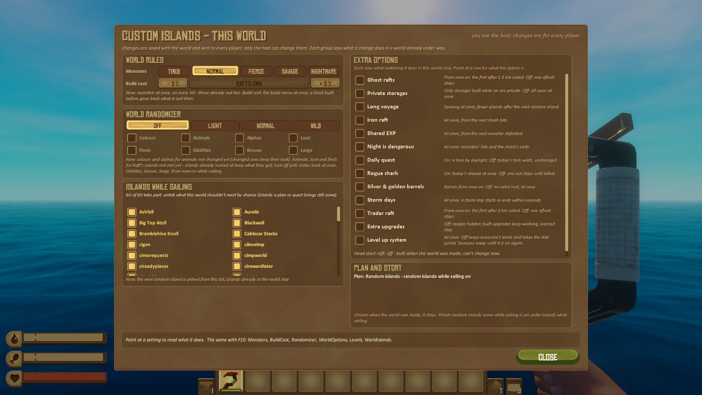
*Esc → Custom Islands in a world: the same groups as the World settings window, changed for this world.*

The host can also change every group with a console command (F10):

| Group | Show it | Change it (host) |
|---|---|---|
| Monster difficulty | `Monsters` | `Monsters savage` |
| Build cost | `BuildCost` | `BuildCost 25` |
| World randomizer | `Randomizer` | `Randomizer wild`, `Randomizer -alphas +bosses` |
| Extra options | `WorldOptions` | `WorldOptions +ghostrafts -privatestorage` |
| Islands while sailing | `WorldIslands` | `WorldIslands -<island>`, `WorldIslands +<island>`, `WorldIslands all` |

### 9.2 World rules: monster difficulty and build cost

#### Monster difficulty

| Level | Monsters' health | Damage they deal to players |
|---|---|---|
| **Timid** | ×0.75 | ×0.75 |
| **Normal** | ×1 (as Raft made them) | ×1 |
| **Fierce** | ×1.25 | ×1.25 |
| **Savage** | ×1.5 | ×1.5 |
| **Nightmare** | ×2 | ×2 |

Monsters are the animals that fight players, on Raft's islands and custom ones: sharks, warthogs, bears, polar bears,
screechers, puffer fish, rats, hyenas, bees, angler fish, the butler bots and the bosses. Left as Raft has them: puffer
fish damage, and everything about Bruce and your raft (his bites on it, how often he comes, how soon he comes back).
In Peaceful and Creative monsters can't hurt you, so only their health changes.

#### Build cost

Everything in the **build menu** (the hammer's foundations, floors, walls, roofs, stairs...) costs **0-100 % more**,
always rounded up: at +50 % one plank becomes two, two become three, three become five. Removing a block gives back
half of what it cost (as in Raft), and repairing and reinforcing cost more too. The crafting menu (Tab) costs the same
as in Raft.

**Both rules** are the host's for every player, also players who join later. The host can change them in a world:
`Monsters savage`, `BuildCost 25`. At the main menu the same commands set the choice for the next new world.

### 9.3 The world randomizer

The randomizer makes a **normal Raft world** play out differently every time, with or without custom islands, and
without touching Raft's story (the radio tower, Vasagatan, Balboa, Caravan Town, Tangaroa, Varuna Point, Temperance
and Utopia stay as they are). Choose it in the World settings window (New Game box, **WORLD SETTINGS...**): **Off**,
**Light**, **Normal** or **Wild**, and which parts take part. The level sets how often things happen:

| | Light | Normal | Wild |
|---|---|---|---|
| Animals in another colour | about 15 % | about 30 % | about 55 % |
| Alpha fighters (sharks) | about 3 % (6 %) | about 6 % (12 %) | about 12 % (22 %) |
| An oddity island (after the first 1.5 km) | about every 12 km | about every 7 km | about every 4 km |
| A large island (after the first 3 km) | about every 20 km | about every 10 km | about every 7 km |
| A boss lair (after the first 4 km) | about every 40 km | about every 20 km | about every 12 km |

The parts (all on unless you click one off):

| Part | What you'll find |
|---|---|
| **Colours** | Animals and sharks (Bruce too) now and then in another colour: charcoal, ash, rust, moss, frost, night... and rarely a gold shark |
| **Animals** | More animals on Raft's islands, now and then puffer fish on the reef |
| **Alphas** | Rare bigger, darker **alpha** warthogs, bears, hyenas and screechers (3× health), and a huge **Big Bruce**. A banner warns you. Killed, they drop a **trophy head**, meat and leather |
| **Loot** | Some of the crates and giant clams on Raft's islands lie in other places; now and then extra crates and barrels |
| **Finds** | A **treasure hunt** (a map in a bottle on the beach leads to a buried chest), an **abandoned camp**, a **castaway's stash**, and on Raft's big islands a **den** with a guard and a hoard |
| **Oddities** | Small odd islands while you sail: a van, a caravan, a crashed plane, a stranded boat, a hermit's shack, a statue, rocket debris, a hut of raft blocks |
| **Bosses** | Now and then a **boss lair**: climb the plateau and a named beast (Old Ironhide, Frostfang, Ashmaw, the Tusk King, the Laughing One) wakes with two guards |
| **Large** | Now and then a **large island** as big as Raft's big ones, with a made-up name, animals, hidden loot, scenes from the quest islands and a den |


*The oddity islands. Each has loot, a note and a banner with its name when you arrive.*


*Large islands: tropical or snowy, with warthogs and animals to catch, a made-up name ("Coral Cay") and a den whose
guard wakes when you walk in ("Something moves in the dark...").*


*Scenes on large islands, made from the props of Raft's quest islands, each with a chest and a note.*


*The Finds part can put a den on one of Raft's own big islands: a rock outcrop with a den inside, a guard and a hoard.*

**Changing it later:** `Randomizer` (F10) shows what it does in your world; the host can change it, for example
`Randomizer wild` or `Randomizer -alphas`. Everything follows from the world's seed, so every player sees the same
colours, alphas and crates.

### 9.4 Extra options

More ways to play Raft again. Each option has its own button in the window's right column, switched **ON** or off, with
an explanation under it. They can be combined freely.

#### Scrambled blueprints

The blueprints lying on Raft's story islands (Vasagatan, Balboa, Caravan Town, Tangaroa...) are swapped with each
other, so each is found on another story island than usual. The pickup's name tells you which blueprint you'll get. The
pairs come from the world's seed: every player finds the same blueprint in the same place, and no blueprint stays in its
own place. What the story needs is **never moved**: the Receiver and antenna, the steering wheel, the engine and its
fuel, the machete, the zipline and the headlight, so the story can always be finished. Only what a pickup gives changes;
which pickups there are, and which were taken, stays Raft's. Switching the option off (`WorldOptions -blueprints`) puts
what is left in the pickups back to Raft's own.

#### Story islands in a new order

Radio Tower, Vasagatan, Balboa, Caravan Town, Tangaroa, Varuna Point and Temperance come in a shuffled order. Raft has
no fixed places for them: each appears near the raft when the Receiver is tuned to a frequency a note unlocked. With the
option on, the Receiver's first frequency leads to the new order's first island, and the note you find there to the
next. The frequency numbers written on the notes follow; the notes' text still speaks of Raft's own order. **Utopia**,
the ending, stays last. Each story island holds its own keys and parts, so any order can be finished.

#### Ghost rafts

Abandoned rafts of Raft's own blocks lie on the sea and come up ahead while you sail: none in the first 1.5 km of a
world, then about one every 3 km. Three sizes:

| Size | How often | What is on it |
|---|---|---|
| Small | about 6 in 10 | A few foundations, a barrel and a message in a bottle |
| Medium | about 3 in 10 | A hut of walls and a roof, a barrel and a box, a captain's log, sometimes a rat or two |
| Large | about 1 in 10 | A wide raft with huts, pillars and a lookout, a hoard chest and barrels, guarded by rats on the deck and screechers circling above |

You can walk on their decks (they float like a real raft, the deck just above the water) and loot what is on them.
Every player sees the same ghost raft: the host brings it, as an island of the map type `ghostraft`.

#### Private storages

A storage opens only for the player who built it. Looking at someone else's shows whose it is instead of "Open", and
**E** does nothing. Storages built while the option was off (or before this version of the mod) have no builder and
open for everyone. The host keeps who built which with the world, so it stays after saving, loading and joining again.

#### For every player

Every player in the world gets the host's options, also when joining later. The host can change them in a world:
`WorldOptions` (F10) shows them, `WorldOptions +ghostrafts -privatestorage` switches them.

### 9.5 Islands while sailing

With the plan **Random islands** (or a plan with random islands on), islands turn up by chance while you sail: every
island you have saved or downloaded, plus brand-new generated ones and the map types listed in `spawnpool.txt`
([section 10](#10-settings-files)). The group **Islands while sailing** in the World settings window chooses which of
them this world may meet. Its button, **CHOOSE ISLANDS...**, says how many take part (`all 42`, or `30 of 42`) and
opens the list:

- one row per island or kind of island, each with a **tick box**: your own islands by name (with their size and date),
  **New ... islands** for each map type (a new sandbar, wreck, atoll... each time) and **Brand-new generated islands**;
- untick the ones this world shouldn't have;
- the **search** field narrows the list (type part of a name), and **Tick shown** / **Untick shown** do every row
  shown, for example all your test islands at once.

Only what you untick is kept, so islands you make or download later join older worlds too, unless you untick them when
you make a new world. The choice belongs to the world (saved with it, so it stays when another player hosts the world
later), and the next new world starts from it. In a world the host can change it with `WorldIslands -<island>` /
`+<island>` / `all`; `WorldIslands` alone shows the list.

Islands that a quest, an island's rule or a world plan brings ([section 6.4](#64-islands-that-bring-islands),
[section 7](#7-world-plans-which-islands-a-world-gets)) come anyway: the list is only about islands by chance.

### 9.6 The level up system

Levels come to a world in two ways:
- **World settings** (New Game box): the **Level up system** switch among the extra options - on for the world from the
  start (the choice is remembered for the next new world);
- **an island made with Level up system: On** (the editor's **Island** tab, Rules, or the generator's **Level up**
  choice): once such an island appears in a world, levels come on there, for every player.

The host can switch it in a world with `Levels on` / `Levels off` (F10). **Off keeps everyone's levels** (they come back
when it is on again), and an island made with levels doesn't switch it back on after the host switched it off. A world
without it plays as Raft always does.


*The switch in the Island tab's Rules.*

#### Earning EXP

Hit a monster and the EXP it gave you floats up over it. Each hit gives the share of the monster's EXP that it took off
its health, so killing it gives all of it. If you fight it together with a friend, each of you gets your own share.
Chickens, goats, llamas, turtles, stingrays, dolphins, whales and people give nothing.


*A hit on a warthog: +2 EXP.*

Tougher monsters that bite harder are worth more, measured against Bruce the shark, who is worth **20 EXP**:

| Monster | EXP | Monster | EXP |
|---|---|---|---|
| Bruce (shark) | 20 | Bear | 13 |
| Warthog | 13 | Polar bear | 15 |
| Screecher | 12 | Hyena | 7 |
| Puffer fish | 9 | Rat | 7 |
| Mama bear (Balboa) | 67 | Hyena boss | 40 |

An island's own Hard or Boss animals are worth more than Raft's plain ones.

| From level | EXP to the next | About |
|---|---|---|
| 1 → 2 | 100 | 5 sharks |
| 2 → 3 | 200 | 10 sharks |
| 3 → 4 | 400 | 20 sharks |
| 4 → 5 | 600 | 30 sharks |
| then | 200 more each level | 10 more sharks each level |

#### Levelling up and spending points

A box shows when you reach a new level. **Click it** (in a menu, where the mouse is free) or press **K** to spend
your points. The **EXP bar** is one more of Raft's own stat bars, above thirst, hunger and health: a gold star on
its badge, a gold fill, the level on the left and the EXP to the next level on the right. It glows for a moment when you
earn EXP. A **+** after the level means points are waiting. While Raft's inventory (**Tab**) is open, a **Stats**
button sits next to the bar.


*Level 2: two stat points to spend. The EXP bar is at the bottom left.*


*The EXP bar with its star, styled like Raft's thirst, hunger and health bars, and the Stats button while the inventory is open.*

Every level gives **2 stat points**. Each point makes a stat **1% better**, and a stat takes at most 10 points (+10%):

| Stat | A point makes it |
|---|---|
| Walk speed, Run speed, Swim speed | 1% faster |
| Jump height | Jump 1% higher |
| Damage | 1% more damage to monsters, with every weapon |
| Health | 1% more maximum health |
| Hunger, Thirst | Drain 1% slower |
| Oxygen | Breath lasts 1% longer under water |


*The stats page (K): the level, the EXP, the monsters you defeated, and the nine stats. **+** puts a point in, **−**
takes it back while the page is open.*

All 90 points are there at level 46. After that the levels go on, without points.

**Playing together:** each player has their own level, and the host keeps it with the world. A player who joins again
gets theirs back. The host works out everyone's EXP, so a monster is worth the same to everybody. Other players see a
small gold **Lv 5** under your name.

---

## 10. Settings files

In `<Raft>\Mods\DynamicIslands\`. Text files: open them with Notepad. They explain themselves, and changes are picked
up while the game runs.

**`spawnpool.txt`** (islands that appear on their own; the host's counts):

| Setting | Default | What it does |
|---|---|---|
| `chancePerKm` | 0.25 | Chance that an island appears for each km the raft sails (0 to 1) |
| `minSpacing` | 800 | Metres kept between custom islands |
| `spawnDistanceMin`, `spawnDistanceMax` | 250, 350 | How far ahead of the raft an island appears |
| `unloadDistance` | 800 | Islands further away are unloaded (and come back when you return) |
| `regrowDays` | 3 | In-game days until harvested things grow back (0 = never) |
| `showOnReceiver` | 1 | Custom islands as green dots on Raft's Receiver (0 = no) |
| `defaultPlan` | Random islands | The plan new worlds get when none is chosen |
| `generated` | 1 | How often a brand-new generated island is picked (0 = never) |
| `generatedStyles` | all five | The styles generated islands can have |
| `generatedFlyingChance` | 0.1 | The chance a generated island flies |
| `<island name> <weight>` | `* 1` | Which of your islands take part (`*` = every island not listed; weight 0 leaves one out) |
| `type:<map type> <weight>` | sandbar, wreck, atoll, sunken | Map types that take part |

Other files:

| File | What it holds |
|---|---|
| `*.island` | Your islands (and the ones you installed from packs) |
| `<name>_<hash>.island` | Islands downloaded from a host, or a version a saved world keeps after an update |
| `autosave\` | Unsaved editor work (4.7): offered when the editor opens, removed when the island is saved |
| `exports\` | Packs you exported (`<name>.zip`), and `exports.json` (what you filled in, so the next export is the next version) |
| `import\` | Put packs you got here to install them (Import...) |
| `library\installed.json` | What each installed pack wrote (so it can be updated and removed) |
| `library.txt` | The island library: `online = on/off`, and its `address` (where its list is) |
| `library\cache\` | The library's pictures, kept so they needn't be downloaded again |
| `plans\*.plan` | World plans |
| `world_rules.txt`, `randomizer.txt` | Your last World settings choices (monsters, build cost, extra options, islands left out; the randomizer), the start for the next new world |
| `worlds\<world>.txt` | Each world's custom islands and their state (what was used, quests, journal, levels, settings); the world's own folder carries a copy, `CustomIslands.txt` |
| `groups\`, `stamps\` | Your saved object groups and terrain stamps |
| `generator_presets\` | Your generator presets (**Save these settings...**) |
| `notice.txt` | That you folded the alpha box, for this version of the mod |
| `editor_light.txt` | The editor's time of day (the Light button) |
| `deleted\` | Islands you deleted in the editor (move one back to get it back) |
| `catalog_index.txt`, `placeables*.txt` | Where the editor finds Raft's objects (made again after a Raft update) |
| `Custom-Islands-Guide.pdf` | This guide, written out of the mod when the alpha box's **Guide (PDF)** opens it |
| `raft_*.txt`, `island_thumbs\`, `island_heights\` | Measurements of Raft's islands the generator uses (they come with the mod; a copy here is read first) |

## 11. Console commands

Press **F10** for RML's console.

| Command | Where | What it does |
|---|---|---|
| `SpawnIsland <name> [distance] [height]` | World, host | An island ahead of the raft (default 250 m) |
| `RemoveIsland <name>` / `RemoveIsland all` | World, host | Removes custom islands |
| `ListIslands` / `ListSpawned` | Anywhere / world | Your saved islands / the world's custom islands with their distance |
| `SpawnPool` | World | Which islands appear on their own, and how often |
| `CustomIslandsAuto on` / `off` | World, host | Automatic islands on or off for this world |
| `WorldPlan` / `WorldPlan <name>` | World | The world's plan and its rules / give it another plan (host) |
| `StoryChain` | World | The world's story chain: Raft's story islands and the plan's own in order, what is unlocked and done, and the plan islands' Receiver frequencies |
| `Randomizer` / `Randomizer <off/light/normal/wild> [-part] [+part]` | World | What the randomizer does here / change it (host) |
| `WorldOptions` / `WorldOptions +option -option` | World | The world's World settings / change them (host; blueprints, storyorder, ghostrafts, privatestorage) |
| `Levels` / `Levels on` / `Levels off` | World or main menu | The level up system in this world / switch it (host; off keeps everyone's levels; at the main menu: for the next new world) |
| `Resync` | World, joined player | Ask the host for its custom islands again (the list, and any island file that hasn't come) |
| `WorldIslands` / `WorldIslands -<island>` / `+<island>` / `all` | World | Which islands turn up by chance while sailing in this world / leave one out, let it take part again, all of them (host) |
| `Monsters` / `Monsters <level>` | World or main menu | The monster difficulty / change it (host; at the main menu: the next new world) |
| `BuildCost` / `BuildCost <0-100>` | World or main menu | The build cost / change it (host; at the main menu: the next new world) |
| `LoadEditor` | Main menu | Opens the editor |

The editor's own commands (`SaveIsland`, `GenerateIsland`, `SetStyle`...) are in the [README](../README.md#console-commands-f10).

## 12. Questions and problems

**No islands appear while I sail.** Run `SpawnPool`: are automatic islands on, and is the pool empty? The plan may be
"No custom islands" (`WorldPlan`). Islands appear only where there is room: near Raft's own islands they wait until
the sea is clear. `SpawnIsland <name>` places one right away.

**K does nothing, and there is no level bar.** The level up system is off in this world: switch it on in World settings
for a new world, or with `Levels on` (host, F10) in this one; an island made with **Level up system: On** switches it on
too (see [section 9.6](#96-the-level-up-system)).

**A friend's storage won't open.** The world has **Private storages** on ([9.4](#94-extra-options)): a storage opens
only for the player who built it. The host can switch it off with `WorldOptions -privatestorage`.

**The Receiver led me to the wrong story island / the blueprint isn't where the wiki says.** The world has **Story
islands in a new order** or **Scrambled blueprints** on ([9.4](#94-extra-options)); `WorldOptions` shows which.

**A note's frequency leads nowhere, or a story island never comes.** The world's plan may leave that island out of
Raft's story, or put one of its own islands in its place ([6.5](#65-your-islands-in-rafts-story-the-receiver)).
`StoryChain` (F10) shows the chain and the plan islands' frequencies; a plan island on the Receiver comes only after
the island before it is done.

**One of my islands never turns up.** It may be unticked for this world ([9.5](#95-islands-while-sailing)): run
`WorldIslands`, and `WorldIslands +<island>` lets it take part again. Its weight in `spawnpool.txt` may also be 0.

**A story item isn't in my inventory, or Raft's notebook has no page for a custom island's note.** They are in
the journal (**J**): custom islands keep their story items and notes there, for the whole crew ([3](#the-journal-j)).
Raft's notebook (T) only has Raft's own story.

**A note I read isn't in the journal.** Notes with no text add no page, and each note adds one page once per world
(someone else may have read it first: look for its title).

**Load World is greyed out.** Raft is offline from Steam. Check that Steam is online and restart Raft.

**"The host has Custom Islands 3.x - you have 3.y".** You and the host have different versions of the mod: islands,
quests and settings may not match between you. Both of you update to the same version (raftmodding.com).

**My island can't be saved under that name.** Windows keeps some names for itself (CON, PRN, AUX, NUL, COM1-9, LPT1-9 -
also with anything after a dot) and doesn't allow a name ending with a dot or a space, or `\ / : * ? " < > |`. Names can
be up to 60 characters. The message says what is wrong; choose another name.

**I loaded an older save of my world, and a chest I emptied is full again.** That's on purpose: Raft's Load Game box
keeps the last 8 saves of a world, and the mod's islands, chests, quests and journal go back with the save you pick, so
the world fits together (the items you took went back with Raft's save too).

**Raft closed while I was building an island.** Open the editor again: it offers the unsaved work it kept
([4.7](#47-saving-and-sharing)). Open it and **Save**.

**My island is far away / I can't find it.** Build Raft's Receiver: custom islands are green dots with their distance.

**I can't get onto a flying island (or a cliff island).** Build stairs or pillars up from the raft. The generator's
reach line tells a builder beforehand.

**A friend can't see my island.** Every player needs the mod, and the host's islands are the ones that count. Island
files are sent to players who join; they appear as `<name>_<hash>.island` in their folder. If the host was busy or a
message got lost, the mod keeps asking (it says "Waiting for the island..."); press F10 and type `Resync` to ask again
at once.

**"Some parts of Custom Islands are off".** A Raft update changed something the mod relies on: the box names the parts
that won't work until the mod is updated; everything else works and your islands and worlds aren't changed. Please
report it ([section 13](#13-reporting-a-problem)).

**Red boxes on my island in the editor.** Objects this Raft version doesn't have (after a Raft update): they are
kept as they were and saved back unchanged ([4.7](#47-saving-and-sharing)).

**Where are my islands?** In `<Raft>\Mods\DynamicIslands\` as `<name>.island`. To give one to a friend, **Export...** it
([4.7](#47-saving-and-sharing)): the pack has the islands it brings too.

**The story stopped: the next island never came.** The host is told on the screen when a plan (or an island's rule)
needs an island that isn't on the host's PC - usually after someone else started hosting the world. Install the pack
or library entry the message names, or ask the player who made the world to export the plan. For a world saved before
worlds kept their own plan, the plan file itself must be on the host's PC (see the table in
[section 8](#who-needs-what-every-case)).

**An installed island has an odd name like "Harbor (First Voyage)".** You had a different island called "Harbor", so
the pack's was installed under that name instead of replacing yours.

**A pack won't install.** The Import window says why: it may be made for a newer version of the mod, broken, or not an
island pack at all.

**How do I change a world's settings after it has started?** In the world: **Esc → Custom Islands**. The host changes
them there for every player ([9.1](#91-the-world-settings-window)).

**Test in the editor didn't get to the world.** The mod says why on the screen: the island needs a name (Save as
first), or Raft's Load button is off because Steam is offline. The test world **Custom Islands test** can also be
loaded by hand from Load Game; if it is broken, delete it there and Test makes a new one.

**"... is in use by another program".** Another program has the file open (a text editor, 7-Zip, a cloud folder
syncing it). Close it there and save (or delete, remove) again - nothing was changed meanwhile.

**Mods\DynamicIslands is full of old files.** The island library's Installed tab: **Tidy up** (see 4.7).

**The editor takes a moment to open.** The first time after starting Raft it loads about 700 objects from Raft's
islands; the loading box shows how far it is. After a Raft update it also scans Raft's other islands once, in the
background (about half a minute; the object browser's status line says so).

**Something went wrong.** Press F10: the mod's messages start with `[CUSTOM ISLANDS]`. Raft's log is
`%USERPROFILE%\AppData\LocalLow\Redbeet Interactive\Raft\Player.log`. To tell us about it, see
[section 13](#13-reporting-a-problem).

More: the [README](../README.md) (every feature, file and command, and the known limitations).

## 13. Reporting a problem

This is an alpha, and your reports are how it gets better. A good report lets someone who wasn't there see what
happened, and make it happen again on their own PC. Please include:

1. **What happened, in detail.** What you did, step by step, from starting Raft or loading the world up to the problem:
   which island, which window or button, what you pressed or where you walked. Does it happen every time, now and then,
   or only once? Did it start after something (a new version of the mod, joining a friend, loading an older world)?
2. **What you expected** to happen if it had worked.
3. **Screenshots**, or a short video, if the problem can be seen: Steam's screenshot key (**F12**) or Windows'
   **Win+Shift+S**. If the console (**F10**) shows red messages, a screenshot of it helps too.
4. **The logs**, taken right after the problem and **before you restart Raft** (a new start replaces the log):
   - `%USERPROFILE%\AppData\LocalLow\Redbeet Interactive\Raft\Player.log`: Raft's log, with the mod's messages
     (`[CUSTOM ISLANDS]`). Paste the folder part of the path into the address bar of Windows Explorer to open it.
   - `Player-prev.log` in the same folder, if Raft crashed or you have started it again since: the previous start's log.
   - If Raft doesn't start with the mod at all: the mod loader's own log, `%APPDATA%\RaftModLoader\logs\hloader.log`.
   - **Playing together:** the logs of every player, the host's first, and who was the host.
   - The logs may show your Windows user name (in file paths) and your Steam name and id.
5. **The settings you used:**
   - **the versions:** Custom Islands (the box at the top right of the main menu says, for example, 3.0), Raft (bottom
     left of the main menu, for example 1.1.01), the mod loader (top of the main menu, for example v2.8.10), and which
     other mods you have;
   - **the world's settings:** Raft's game mode, the Custom Islands plan, and what you chose in World settings. In the
     world, press **F10** and run `WorldOptions`, `Monsters`, `BuildCost`, `Randomizer`, `WorldPlan`, `WorldIslands`,
     `StoryChain` and `SpawnPool`, then copy what they print (it is also in `Player.log`);
   - your settings files from `<Raft>\Mods\DynamicIslands\`: `spawnpool.txt`, and `world_rules.txt` and
     `randomizer.txt` if the problem is with a new world;
   - **single player or together;** if together: were you the host or did you join, and how many players were there.
6. **The islands and world plans involved:** their names, and the files or where to download them. Islands are
   `<Raft>\Mods\DynamicIslands\<name>.island`, world plans `<Raft>\Mods\DynamicIslands\plans\<name>.plan`. If the
   problem is in one world, add that world's island list, `<Raft>\Mods\DynamicIslands\worlds\<world>.txt`, and if you
   can, the world itself: zip its folder from `%USERPROFILE%\AppData\LocalLow\Redbeet Interactive\Raft\User\`.

**The quick way: Report a problem.** The alpha box on the main menu ([section 1](#1-installing)) has a **Report a
problem** button. It opens a box with the list above in short, and buttons that do the work for you:
- **Copy report form** puts the form below, with your versions filled in, on the clipboard (paste it with Ctrl+V);
- **Open log folder** opens the folder with `Player.log` and `Player-prev.log`;
- **Report on GitHub** opens a new issue on the mod's GitHub page with the form already in it;
- **Post on Discord** opens the Custom Islands Discord server.

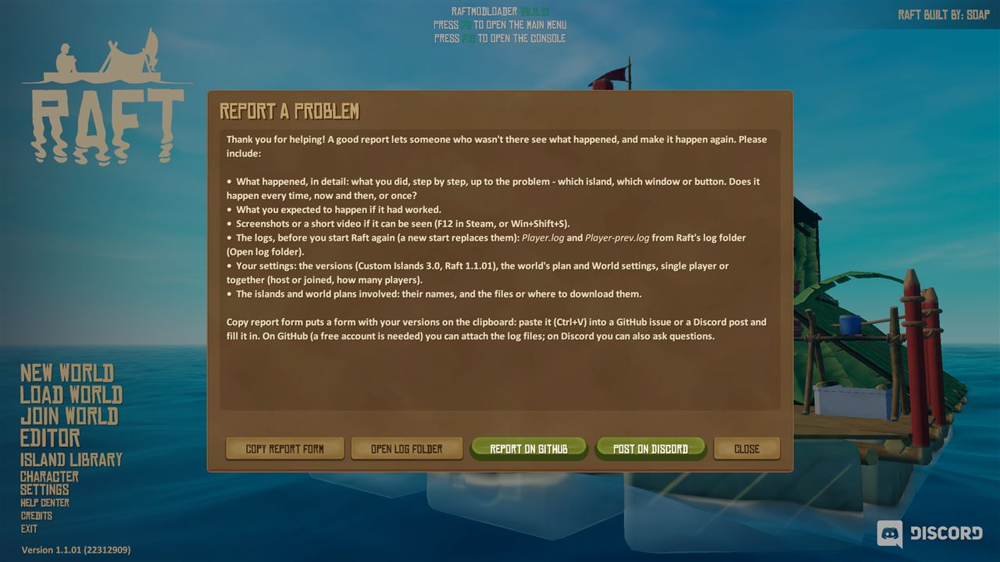
*Report a problem: what to include, and the buttons for the form, the logs, GitHub and Discord.*

**Where to send it** (either is fine):

- **GitHub:** open an issue on the mod's GitHub page,
  [github.com/SwedenJohansson/DynamicIslands/issues](https://github.com/SwedenJohansson/DynamicIslands/issues)
  (**New issue**). Give it a short title that says what went wrong ("A chest on my island is empty again after
  loading"), write the report, and attach the files (zip them if there are many).
- **Discord:** post it on the mod's Discord server, [discord.gg/U7DfKY9tN](https://discord.gg/U7DfKY9tN), with the
  same details and the files attached.

A template to copy into the issue or the post:

```
What happened:
Steps to make it happen:
  1.
  2.
  3.
What I expected:
How often: every time / now and then / once
Versions: Custom Islands 3.0, Raft 1.1.01, mod loader v2.8.10, other mods:
Single player or together: (host / joined, how many players)
World settings: (what WorldOptions, Monsters, BuildCost, Randomizer, WorldPlan, WorldIslands, SpawnPool print)
Islands and world plans used: (names, files or download links)
Attached: Player.log, Player-prev.log, screenshots, ...
```

---

*This guide describes Custom Islands 3.0, the Experimental Alpha Release. It is kept up to date with the mod: every
change to a feature updates this guide, the README and the PDF copy of this guide (`docs/Custom-Islands-Guide.pdf`)
together.*
